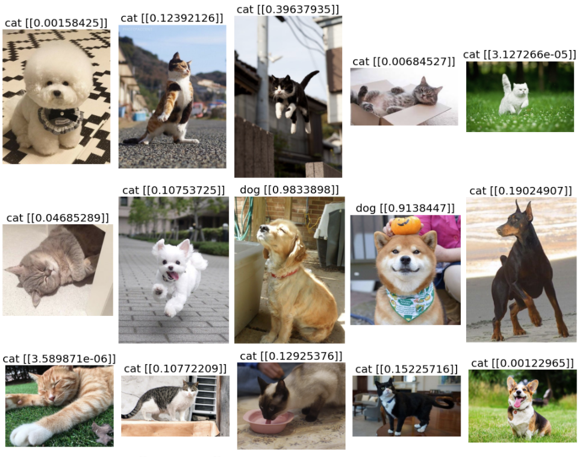

## Dogs vs. Cats 분류문제 TF2.x로 구현후 정확도 측정       
- 이미지 데이터이기 때문에 pixel 정보를 뽑아내고 labelling하는 작업을 해야 함
- CSV 만들어내는 작업은 개인 PC에서 해야 할 듯 보여요!
- 데이터 전처리가 끝나면 CNN을 이용하여 학습 모델 구축 및 학습진행
- Test data를 이용하여 Accuracy를 측정
- 실제 집에서 키우는 멍멍이나 고양이 사진을 이용해서 예측이 잘 이루어지는지 확인!


### 이미지 데이터 pixel 정보를 뽑아내고 labelling하는 작업 ==> CSV 파일 만들기

```python
import numpy as np
import pandas as pd
import os
import cv2
from sklearn import utils

# 파일 경로
train_dir = '../data/cat_dog/train'
test_dir = '../kaggle_data/cat_vs_dog/test1'

##########################################################################################

# img = 파일 이름
def labeling(img):
    class_name = img.split('.')[0]
    if class_name == 'cat': return 0
    elif class_name == 'dog': return 1

##########################################################################################
    
# 이미지 파일을 pixel data로 바꾸기
def create_train_data():
    
    # label data와 pixel data 담을 변수
    t_data = []
    x_data = []
    
    # os.listdir() ==> 인자로 준 폴더 경로 안에 있는 모든 파일들 이름 리스트
    for img in os.listdir(train_dir):
        # 위에서 만든 labeling()을 통해 이름이 cat이면 0 / dog면 1 반환
        label_data = labeling(img)
        
        # 이미지 파일 경로 설정
        path = os.path.join(train_dir, img)
        
        # 이미지 파일 nd.array로 불러오기 (cv2.imread())
        # 형태만 필요해서 흑백으로 불러오기 (cv2.IMREAD_GRAYSCALE)
        # 이미지 pixel size 조정하기
        img_data = cv2.resize(cv2.imread(path, cv2.IMREAD_GRAYSCALE), (70,70))
        
        # 리스트 변수에 담아주기
        t_data.append(label_data)
        x_data.append(img_data.ravel()) # ==> 이미지 shape이 (70,70) ==> 2차원 
        								# ==> 이게 그대로 들어가면 차원 하나 더 있어서 결국 3차원... 그래서 1차원으로 바꿔주기(ravel())
    
    # labeling Data ==> dataframe으로 만들기
    t_df = pd.DataFrame({
        'label': t_data
    })
    
    # 이미지 픽셀 data ==> dataframe으로 만들기
    x_df = pd.DataFrame(x_data)
    
    # 2개 dataframe 합치기
    df = pd.merge(t_df, x_df, left_index=True, right_index=True)
    
    # utils.shuffle() ==> pandas dataframe 행을 shuffle 한다.
    shuffled_df = utils.shuffle(df)
	
    # DataFrame을 csv 파일로 저장하기
    shuffled_df.to_csv('../kaggle_data/cat_vs_dog/shuffle_train.csv', index=False)

##########################################################################################
    
# Test Data (label 없는) csv 파일로 바꾸기

test_data = []
for img_num in range(len(os.listdir(test_dir))):
    path = '../kaggle_data/cat_vs_dog/test1/{}.jpg'.format(img_num+1)
    img_data = cv2.resize(cv2.imread(path, cv2.IMREAD_GRAYSCALE), (70,70))
    test_data.append(img_data.ravel())
    
test_df = pd.DataFrame(data)

test_df.to_csv('../kaggle_data/cat_vs_dog/test.csv', index=False)

##########################################################################################
```


### `Data 전처리`

```python
import numpy as np
import pandas as pd
import tensorflow as tf
import matplotlib.pyplot as plt

from sklearn.preprocessing import MinMaxScaler
from sklearn.model_selection import train_test_split

df = pd.read_csv('/content/drive/MyDrive/Colab Notebooks/kaggle_data/cat_and_dog/shuffle_train_70pixel.csv')
#print(df.shape) #==> (25000, 4901)

label_data = df['label'].values
img_data = df.drop('label', axis=1, inplace=False).values

plt.imshow(img_data[156:157].reshape(70,70), cmap='gray')
plt.show()

# Data Split
train_x_data, val_x_data , train_t_data, val_t_data = \
train_test_split(img_data, label_data, test_size=0.3, random_state=0)


# 정규화
scaler = MinMaxScaler()
scaler.fit(train_x_data)
norm_train_x_data = scaler.transform(train_x_data)
norm_val_x_data = scaler.transform(val_x_data)

# Data 전처리 끝
```


### `CNN Layer 구성`

```python
# Tensor Layer

from tensorflow.keras.models import Sequential
from tensorflow.keras.layers import Flatten, Dense, Conv2D, MaxPooling2D, Dropout
from tensorflow.keras.optimizers import Adam

model = Sequential()

# Conv 1st layer
model.add(Conv2D(filters=64,
                 kernel_size=(3,3),
                 activation='relu',
                 padding='same',
                 input_shape=(70,70,1)))

# Pooling Layer
model.add(MaxPooling2D(pool_size=(2,2)))

# Conv 2nd layer
model.add(Conv2D(filters=64,
                 kernel_size=(3,3),
                 activation='relu',
                 padding='same'))
model.add(Conv2D(filters=64,
                 kernel_size=(3,3),
                 activation='relu',
                 padding='same'))
# Pooling Layer
model.add(MaxPooling2D(pool_size=(2,2)))

# Conv 3rd layer
model.add(Conv2D(filters=128,
                 kernel_size=(3,3),
                 activation='relu',
                 padding='same'))
model.add(Conv2D(filters=64,
                 kernel_size=(3,3),
                 activation='relu',
                 padding='same'))

# Pooling Layer
model.add(MaxPooling2D(pool_size=(2,2)))

########################################

# FC Layer
# input
model.add(Flatten())

# Dropout
model.add(Dropout(rate=0.5))

# hidden
model.add(Dense(units=256,
                activation='relu'))

# output
model.add(Dense(units=1,
                activation='sigmoid'))

print(model.summary())
'''
Model: "sequential"
_________________________________________________________________
Layer (type)                 Output Shape              Param #   
=================================================================
conv2d (Conv2D)              (None, 70, 70, 64)        640       
_________________________________________________________________
max_pooling2d (MaxPooling2D) (None, 35, 35, 64)        0         
_________________________________________________________________
conv2d_1 (Conv2D)            (None, 35, 35, 64)        36928     
_________________________________________________________________
conv2d_2 (Conv2D)            (None, 35, 35, 64)        36928     
_________________________________________________________________
max_pooling2d_1 (MaxPooling2 (None, 17, 17, 64)        0         
_________________________________________________________________
conv2d_3 (Conv2D)            (None, 17, 17, 128)       73856     
_________________________________________________________________
conv2d_4 (Conv2D)            (None, 17, 17, 64)        73792     
_________________________________________________________________
max_pooling2d_2 (MaxPooling2 (None, 8, 8, 64)          0         
_________________________________________________________________
flatten (Flatten)            (None, 4096)              0         
_________________________________________________________________
dropout (Dropout)            (None, 4096)              0         
_________________________________________________________________
dense (Dense)                (None, 256)               1048832   
_________________________________________________________________
dense_1 (Dense)              (None, 1)                 257       
=================================================================
Total params: 1,271,233
Trainable params: 1,271,233
Non-trainable params: 0
_________________________________________________________________
None
'''
####################################################################
# compile 및 fit
model.compile(optimizer=Adam(learning_rate=1e-4),
              loss='binary_crossentropy',
              metrics=['accuracy'])

history = model.fit(norm_train_x_data.reshape(-1,70,70,1),
                    train_t_data,
                    batch_size=64,
                    epochs=100,
                    verbose=1,
                    validation_split=0.2)
'''
Epoch 100/100
219/219 [==============================] - 6s 29ms/step - loss: 0.0319 - accuracy: 0.9888 - val_loss: 0.4442 - val_accuracy: 0.8880
'''
####################################################################

# Test Data Accuracy 평가
print(model.evaluate(norm_val_x_data.reshape(-1,70,70,1), val_t_data))
'''
235/235 [==============================] - 2s 7ms/step - loss: 0.4630 - accuracy: 0.8793
[0.46301817893981934, 0.8793333172798157]
'''
```


### `학습 결과 Graph 그리기`

```python
train_loss = history.history['loss']
val_loss = history.history['val_loss']

train_acc = history.history['accuracy']
val_acc = history.history['val_accuracy']

plt.figure(figsize=(15,5))
plt.subplot(1,2,1)
plt.plot(train_loss, c='r', label='train_loss')
plt.plot(val_loss, c='b', label='val_loss')
plt.legend()

plt.subplot(1,2,2)
plt.plot(train_acc, c='r', label='train_acc')
plt.plot(val_acc, c='b', label='val_acc')
plt.legend()

plt.tight_layout()
plt.show()
```


### `실제 사진 예측`

```python
import os
import cv2
import matplotlib.pyplot as plt


predict_dir = '/content/drive/MyDrive/Colab Notebooks/kaggle_data/cat_and_dog/predict'
dir_list = os.listdir(predict_dir)

if len(dir_list) % 5 != 0 :
    rows = (len(dir_list) // 5) + 1
else:
    rows = len(dir_list) // 5 

for row in range(rows):
    plt.figure(figsize=(15,10))

    for i,img in enumerate(dir_list[row*5: (row+1)*5]):
        path = os.path.join(predict_dir,img)
        image=cv2.imread(path, cv2.IMREAD_GRAYSCALE)
        image.resize((70,70))
        norm_img_data = scaler.transform(image.ravel().reshape(1,-1))
        result = model.predict(norm_img_data.reshape(-1,70,70,1))

        origin_image = cv2.imread(path)
        origin_image = cv2.cvtColor(origin_image, cv2.COLOR_BGR2RGB)

        i = (i+1) % 5
        
        plt.subplot(1,5,i+1)
        if result <= 0.5 :
            plt.title('cat {}'.format(result), size=20) 
        else:
            plt.title('dog {}'.format(result), size=20)

        plt.axis('off')
        plt.imshow(origin_image)
        plt.tight_layout()

    plt.show()
```




