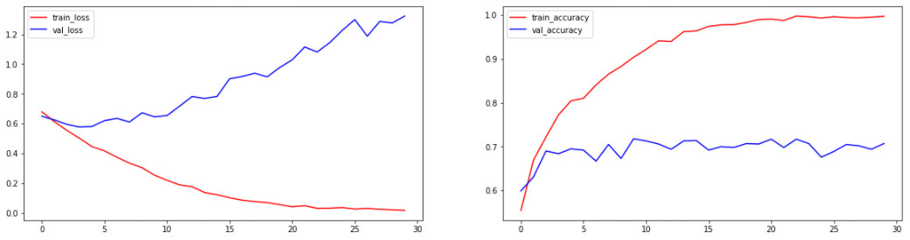

# 일부 데이터로 ImageDataGenerator 생성, 모델 구현 후 Accuracy 측정

- overfitting 발생


### `Image Generator 생성`

```python
from tensorflow.keras.preprocessing.image import ImageDataGenerator
import os
import matplotlib.pyplot as plt

base_dir = '/content/drive/MyDrive/Colab Notebooks/CAT_DOG/cat_dog_small'

# 각 용도별 경로
train_path = os.path.join(base_dir, 'train')
val_path = os.path.join(base_dir, 'validation')
test_path = os.path.join(base_dir, 'test')

# 각 용도별 generator
train_gen = ImageDataGenerator(rescale=1/255)
val_gen = ImageDataGenerator(rescale=1/255)
test_gen = ImageDataGenerator(rescale=1/255)

# 각 이미지 generator
train_img_gen = train_gen.flow_from_directory(train_path,
                                             target_size=(150,150),
                                             batch_size=20,
                                             classes=['cats', 'dogs'],
                                             class_mode='binary')
val_img_gen = val_gen.flow_from_directory(val_path,
                                             target_size=(150,150),
                                             batch_size=20,
                                             classes=['cats', 'dogs'],
                                             class_mode='binary')
test_img_gen = test_gen.flow_from_directory(test_path,
                                             target_size=(150,150),
                                             batch_size=20,
                                             classes=['cats', 'dogs'],
                                             class_mode='binary')
'''
Found 2000 images belonging to 2 classes.
Found 1000 images belonging to 2 classes.
Found 1000 images belonging to 2 classes.
'''
```


### `CNN Model 구성`

```python
# CNN Layer 구성

from tensorflow.keras.models import Sequential
from tensorflow.keras.layers import Flatten, Dense, Dropout, Conv2D, MaxPooling2D
from tensorflow.keras.optimizers import Adam

model = Sequential()

# conv layer 구성
model.add(Conv2D(filters=32,
                 kernel_size=(3,3),
                 padding='same',
                 activation='relu',
                 input_shape=(150,150,3)))
# maxpooling
model.add(MaxPooling2D(pool_size=(2,2)))

model.add(Conv2D(filters=64,
                 kernel_size=(3,3),
                 padding='same',
                 activation='relu'))
model.add(Conv2D(filters=64,
                 kernel_size=(3,3),
                 padding='same',
                 activation='relu'))
# maxpooling
model.add(MaxPooling2D(pool_size=(2,2)))

# DNN Layer
model.add(Flatten())

model.add(Dropout(rate=0.5))

model.add(Dense(64, activation='relu'))

model.add(Dense(1, activation='sigmoid'))

print(model.summary())
'''
Model: "sequential_1"
_________________________________________________________________
Layer (type)                 Output Shape              Param #   
=================================================================
conv2d_5 (Conv2D)            (None, 150, 150, 32)      896       
_________________________________________________________________
max_pooling2d_2 (MaxPooling2 (None, 75, 75, 32)        0         
_________________________________________________________________
conv2d_6 (Conv2D)            (None, 75, 75, 64)        18496     
_________________________________________________________________
conv2d_7 (Conv2D)            (None, 75, 75, 64)        36928     
_________________________________________________________________
max_pooling2d_3 (MaxPooling2 (None, 37, 37, 64)        0         
_________________________________________________________________
flatten_1 (Flatten)          (None, 87616)             0         
_________________________________________________________________
dropout_1 (Dropout)          (None, 87616)             0         
_________________________________________________________________
dense_2 (Dense)              (None, 64)                5607488   
_________________________________________________________________
dense_3 (Dense)              (None, 1)                 65        
=================================================================
Total params: 5,663,873
Trainable params: 5,663,873
Non-trainable params: 0
_________________________________________________________________
None
'''
```


#### `compile & fit`

```python
# compile
model.compile(optimizer=Adam(1e-4),
              loss='binary_crossentropy',
              metrics=['accuracy'])

# fit
history = model.fit(train_img_gen,
          steps_per_epoch=100,
          epochs=30,
          verbose=1,
          validation_data=val_img_gen,
          validation_steps=50)

'''
Epoch 30/30
100/100 [==============================] - 12s 119ms/step - loss: 0.0180 - accuracy: 0.9975 - val_loss: 1.3227 - val_accuracy: 0.7070
'''
```


#### `Graph`

```python
train_loss = history.history['loss']
val_loss = history.history['val_loss']

train_accuracy = history.history['accuracy']
val_accuracy = history.history['val_accuracy']

fig = plt.figure(figsize=(20,5))
loss_graph = fig.add_subplot(1,2,1)
acc_graph = fig.add_subplot(1,2,2)

loss_graph.plot(train_loss, c='r', label='train_loss')
loss_graph.plot(val_loss, c='b', label='val_loss')
loss_graph.legend()

acc_graph.plot(train_accuracy, c='r', label='train_accuracy')
acc_graph.plot(val_accuracy, c='b', label='val_accuracy')
acc_graph.legend()

plt.tight_layout()
plt.show()
```




#### `Accuracy`

```python
# accuracy 측정
test_loss, test_acc = model.evaluate(test_img_gen, verbose=2)
print('test data의 accuracy :', test_acc)
'''
50/50 - 354s - loss: 1.3987 - accuracy: 0.6980
test data의 accuracy : 0.6980000138282776
'''
```

