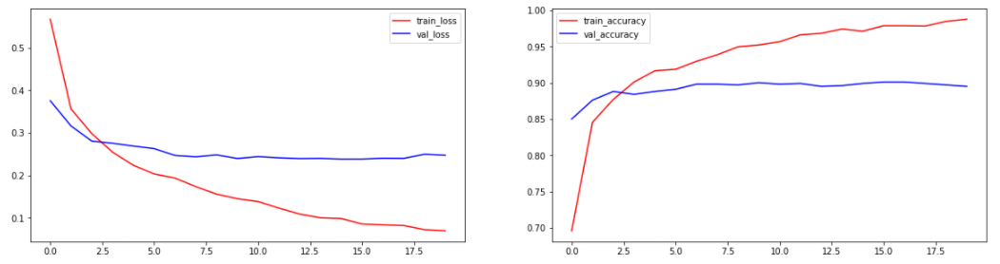
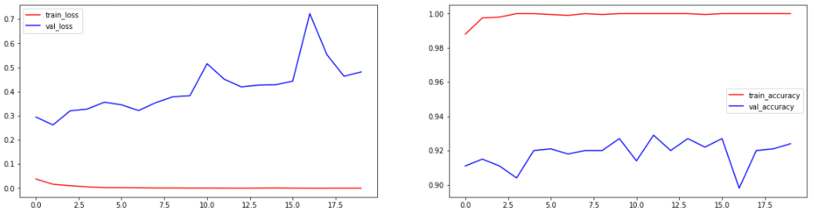

# 정확도를 높이기 위해 Pretrained Network을 활용

- Feature Extraction 기법을 이용하여 구현
- Fine Tuning을 이용하여 구현
- 두가지 방법에 대해 Accuracy비교


### `Feature Extraction`

```python
from tensorflow.keras.preprocessing.image import ImageDataGenerator
import os

base_dir = '/content/drive/MyDrive/Colab Notebooks/CAT_DOG/cat_dog_small'

# option
BATCH_SIZE = 20
IMG_SIZE = (150,150)

# 각 용도별 경로
train_path = os.path.join(base_dir, 'train')
val_path = os.path.join(base_dir, 'validation')
test_path = os.path.join(base_dir, 'test')

# 각 용도별 generator
train_gen = ImageDataGenerator(rescale=1/255)
val_gen = ImageDataGenerator(rescale=1/255)
test_gen = ImageDataGenerator(rescale=1/255)

# 각 이미지 generator
train_img_gen = train_gen.flow_from_directory(train_path,
                                             target_size=IMG_SIZE,
                                             batch_size=BATCH_SIZE,
                                             classes=['cats', 'dogs'],
                                             class_mode='binary')
val_img_gen = val_gen.flow_from_directory(val_path,
                                             target_size=IMG_SIZE,
                                             batch_size=BATCH_SIZE,
                                             classes=['cats', 'dogs'],
                                             class_mode='binary')
test_img_gen = test_gen.flow_from_directory(test_path,
                                             target_size=IMG_SIZE,
                                             batch_size=BATCH_SIZE,
                                             classes=['cats', 'dogs'],
                                             class_mode='binary')
'''
Found 2000 images belonging to 2 classes.
Found 1000 images belonging to 2 classes.
Found 1000 images belonging to 2 classes.
'''
```


#### `CNN Model 구성`

```python
# Pretrained Network model
# VGG16 사용
import numpy as np
from tensorflow.keras.applications import VGG16


# VGG16 model
vgg_model = VGG16(weights='imagenet',
                  include_top=False,
                  input_shape=(150,150,3))
print(vgg_model.summary())

# Feature Map 추출 함수
def extract_feature(generator, img_num):

    features = np.zeros((img_num,4,4,512))
    labels = np.zeros((img_num,))

    i = 0
    for x_data, t_data in generator :
        features[i*BATCH_SIZE:(i+1)*BATCH_SIZE] = vgg_model.predict(x_data)
        labels[i*BATCH_SIZE:(i+1)*BATCH_SIZE] = t_data

        i +=1

        if i*BATCH_SIZE >= img_num :
            break

    return features, labels
'''
Model: "vgg16"
_________________________________________________________________
Layer (type)                 Output Shape              Param #   
=================================================================
input_3 (InputLayer)         [(None, 150, 150, 3)]     0         
_________________________________________________________________
block1_conv1 (Conv2D)        (None, 150, 150, 64)      1792      
_________________________________________________________________
block1_conv2 (Conv2D)        (None, 150, 150, 64)      36928     
_________________________________________________________________
block1_pool (MaxPooling2D)   (None, 75, 75, 64)        0         
_________________________________________________________________
block2_conv1 (Conv2D)        (None, 75, 75, 128)       73856     
_________________________________________________________________
block2_conv2 (Conv2D)        (None, 75, 75, 128)       147584    
_________________________________________________________________
block2_pool (MaxPooling2D)   (None, 37, 37, 128)       0         
_________________________________________________________________
block3_conv1 (Conv2D)        (None, 37, 37, 256)       295168    
_________________________________________________________________
block3_conv2 (Conv2D)        (None, 37, 37, 256)       590080    
_________________________________________________________________
block3_conv3 (Conv2D)        (None, 37, 37, 256)       590080    
_________________________________________________________________
block3_pool (MaxPooling2D)   (None, 18, 18, 256)       0         
_________________________________________________________________
block4_conv1 (Conv2D)        (None, 18, 18, 512)       1180160   
_________________________________________________________________
block4_conv2 (Conv2D)        (None, 18, 18, 512)       2359808   
_________________________________________________________________
block4_conv3 (Conv2D)        (None, 18, 18, 512)       2359808   
_________________________________________________________________
block4_pool (MaxPooling2D)   (None, 9, 9, 512)         0         
_________________________________________________________________
block5_conv1 (Conv2D)        (None, 9, 9, 512)         2359808   
_________________________________________________________________
block5_conv2 (Conv2D)        (None, 9, 9, 512)         2359808   
_________________________________________________________________
block5_conv3 (Conv2D)        (None, 9, 9, 512)         2359808   
_________________________________________________________________
block5_pool (MaxPooling2D)   (None, 4, 4, 512)         0         
=================================================================
Total params: 14,714,688
Trainable params: 14,714,688
Non-trainable params: 0
_________________________________________________________________
None
'''

# feature map 추출
train_feature, train_label = extract_feature(train_img_gen, 2000)

val_feature, val_label = extract_feature(val_img_gen, 1000)

test_feature, test_label = extract_feature(test_img_gen, 1000)

# DNN 구성

from tensorflow.keras.models import Sequential
from tensorflow.keras.layers import Flatten, Dense, Dropout, Conv2D, MaxPooling2D
from tensorflow.keras.optimizers import Adam

# 위에서 만든 Feature map data DNN에 넣기

model = Sequential()
model.add(Flatten())
model.add(Dense(128, activation='relu'))
model.add(Dropout(0.5))
model.add(Dense(1, activation='sigmoid'))

model.compile(optimizer=Adam(1e-4),
              loss='binary_crossentropy',
              metrics=['accuracy'])

history = model.fit(train_feature,
                    train_label,
                    epochs=20,
                    batch_size=64,
                    verbose=1,
                    validation_data=(val_feature, val_label))

'''
Epoch 20/20
32/32 [==============================] - 0s 7ms/step - loss: 0.0750 - accuracy: 0.9858 - val_loss: 0.2473 - val_accuracy: 0.8950
'''
```


#### `Graph`

```python
import matplotlib.pyplot as plt

# 그래프 그리기
train_loss = history.history['loss']
val_loss = history.history['val_loss']

train_accuracy = history.history['accuracy']
val_accuracy = history.history['val_accuracy']

fig = plt.figure(figsize=(20,5))
loss_graph = fig.add_subplot(1,2,1)
acc_graph = fig.add_subplot(1,2,2)

loss_graph.plot(train_loss, c='r', label='train_loss')
loss_graph.plot(val_loss, c='b', label='val_loss')
loss_graph.legend()

acc_graph.plot(train_accuracy, c='r', label='train_accuracy')
acc_graph.plot(val_accuracy, c='b', label='val_accuracy')
acc_graph.legend()

plt.show()
```




#### `Accuracy`

```python
# accuracy 측정
test_loss, test_acc = model.evaluate(test_feature, test_label, verbose=1)
print('test data의 accuracy :', test_acc)
'''
32/32 [==============================] - 0s 3ms/step - loss: 0.2596 - accuracy: 0.8920
test data의 accuracy : 0.8920000195503235
'''
```


---


### `Fine tuning`

```python
from tensorflow.keras.optimizers import RMSprop

VGG_model = VGG16(weights='imagenet',
                  include_top=False,
                  input_shape=(150,150,3))

# 먼저 사용할 pretrained network model 가중치 update 비활성화
VGG_model.trainable = False

# VGG model 만든 것을 나의 DNN 모델에 편입

fine_model = Sequential()

fine_model.add(VGG_model)

fine_model.add(Flatten())

fine_model.add(Dense(128, activation='relu'))

fine_model.add(Dropout(0.5))

fine_model.add(Dense(1, activation='sigmoid'))

print(fine_model.summary())

'''
Model: "sequential_6"
_________________________________________________________________
Layer (type)                 Output Shape              Param #   
=================================================================
vgg16 (Functional)           (None, 4, 4, 512)         14714688  
_________________________________________________________________
flatten_4 (Flatten)          (None, 8192)              0         
_________________________________________________________________
dense_10 (Dense)             (None, 128)               1048704   
_________________________________________________________________
dropout_5 (Dropout)          (None, 128)               0         
_________________________________________________________________
dense_11 (Dense)             (None, 1)                 129       
=================================================================
Total params: 15,763,521
Trainable params: 1,048,833
Non-trainable params: 14,714,688
_________________________________________________________________
None
'''

fine_model.compile(optimizer=Adam(1e-4),
             loss='binary_crossentropy',
             metrics=['accuracy'])
history = fine_model.fit(train_img_gen,
                    steps_per_epoch=100,
                    epochs=20,
                    verbose=1,
                    validation_data=val_img_gen,
                    validation_steps=50)
'''
Epoch 20/20
100/100 [==============================] - 19s 189ms/step - loss: 0.0356 - accuracy: 0.9960 - val_loss: 0.2642 - val_accuracy: 0.9080
'''

# Fine tuning

VGG_model.trainable = True

for layer in VGG_model.layers :
    if layer.name in ['block5_conv1', 'block5_conv2', 'block5_conv3']:
        layer.trainable = True
    else:
        layer.trainable = False

fine_model.compile(optimizer=RMSprop(1e-5),
             loss='binary_crossentropy',
             metrics=['accuracy'])
history = fine_model.fit(train_img_gen,
                    steps_per_epoch=100,
                    epochs=20,
                    verbose=1,
                    validation_data=val_img_gen,
                    validation_steps=50)
'''
Epoch 20/20
100/100 [==============================] - 21s 211ms/step - loss: 9.5843e-05 - accuracy: 1.0000 - val_loss: 0.4817 - val_accuracy: 0.9240
'''
```


#### `Graph`

```python
# 그래프 그리기
train_loss = history.history['loss']
val_loss = history.history['val_loss']

train_accuracy = history.history['accuracy']
val_accuracy = history.history['val_accuracy']

fig = plt.figure(figsize=(20,5))
loss_graph = fig.add_subplot(1,2,1)
acc_graph = fig.add_subplot(1,2,2)

loss_graph.plot(train_loss, c='r', label='train_loss')
loss_graph.plot(val_loss, c='b', label='val_loss')
loss_graph.legend()

acc_graph.plot(train_accuracy, c='r', label='train_accuracy')
acc_graph.plot(val_accuracy, c='b', label='val_accuracy')
acc_graph.legend()

plt.show()
```




#### `Accuracy`

```python
# accuracy 측정
test_loss, test_acc = fine_model.evaluate(test_img_gen, verbose=1)
print('test data의 accuracy :', test_acc)
'''
50/50 [==============================] - 6s 125ms/step - loss: 0.4724 - accuracy: 0.9200
test data의 accuracy : 0.9200000166893005
'''
```

