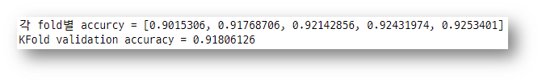
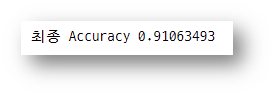
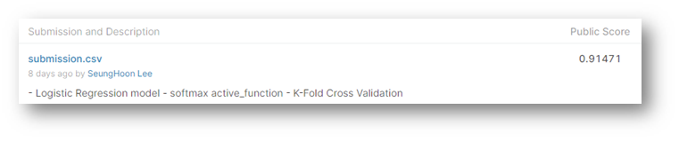

# Kaggle MNIST

> - Tensor 1.x 버전 사용
> - Multinomial Classification
> - K-Fold Cross Validation


#### `모듈 사용`

```python
import numpy as np
import pandas as pd
import tensorflow as tf
import matplotlib.pyplot as plt
import matplotlib.image as img
from sklearn.preprocessing import MinMaxScaler
from sklearn.model_selection import train_test_split
from sklearn.model_selection import KFold
```


#### `Data Preprocessing`

```python
# Raw Data Loading
df = pd.read_csv('../kaggle_data/digit/train.csv')

# data 전처리

# 결측치 처리
# 결측치는 없습니다.

# 이상치 처리
# 숫자를 이루고 있는 값이기에 이상치가 없을것으로 예상합니다
# 가령 가장 진한 농도의 색 값이 너무 높은 값이여서 그 값을 지우면... pixel이 깨집니다.
# 그러기에 이상치 처리도 안합니다.
```


#### `Data Split`

```python
# Data split (train data & validation data) 
# KFold Cross Validation을 사용할 예정이어서 따로 Data split 안합니다.

# 최종 평가를 위한 Test Data Split
train_x_data, test_x_data, train_t_data, test_t_data = \
train_test_split(df.iloc[:,1:], df['label'], test_size = 0.3, random_state=0)
```


#### `Data Preprocessing`

```python
# 정규화
# minmaxscaler로 pixel featur 값만 정규화 합니다.
scaler = MinMaxScaler()
scaler.fit(train_x_data)
norm_train_x_data = scaler.transform(train_x_data)
norm_test_x_data = scaler.transform(test_x_data)

# one-hot encoding
sess = tf.Session()
onehot_train_t_data = sess.run(tf.one_hot(train_t_data, depth=10))
onehot_test_t_data = sess.run(tf.one_hot(test_t_data, depth=10))
```


#### `Tensor Graph`

```python
# tensor graph 구성
X = tf.placeholder(shape=[None,784], dtype=tf.float32)
T = tf.placeholder(shape=[None,10], dtype=tf.float32)

W = tf.Variable(tf.random.normal([784,10]), name='weight')
b = tf.Variable(tf.random.normal([10]), name='weight')

# hypothesis
logit = tf.matmul(X,W)+b
H = tf.nn.softmax(logit)

# loss
loss = tf.reduce_mean(tf.nn.softmax_cross_entropy_with_logits_v2(logits=logit, labels=T))

# train
train = tf.train.GradientDescentOptimizer(learning_rate=0.01).minimize(loss)

# init
sess.run(tf.global_variables_initializer())
```


#### `batch & learning_function & Accuracy` 

```python
# data 입력 수 조정 한 학습 함수 (batch 처리)
num_of_epoch = 3000
batch_size = 100

def learn_train(sess, train_x, train_t):
    print('### 학습시작 ###')
    
    for step in range(num_of_epoch):
        
        data_batch = int(train_x.shape[0] / batch_size)
        
        for i in range(data_batch):
            batch_x = train_x[i*batch_size:(i+1)*batch_size]
            batch_t = train_t[i*batch_size:(i+1)*batch_size]
            
            _, loss_val = sess.run([train,loss], feed_dict={X:batch_x, T:batch_t})
            
        if step % 300 == 0:
            print('Loss : {}'.format(loss_val))
    
    print('### 학습종료 ###')
    
# 평가
predict_num = tf.argmax(H,1)
correct = tf.cast(tf.equal(predict_num, tf.argmax(T,1)),dtype=tf.float32)
accuracy = tf.reduce_mean(correct)
```


#### `K-Fold Cross Validation`

```python
cv = 5
result = []
kf = KFold(n_splits=cv, shuffle=True)

for train_idx, val_idx in kf.split(norm_train_x_data):
    training_x = norm_train_x_data[train_idx]
    training_t = onehot_train_t_data[train_idx]
    
    validation_x = norm_train_x_data[val_idx]
    validation_t = onehot_train_t_data[val_idx]
    
    # 학습
    learn_train(sess,training_x,training_t)
    
    # 비교 평가
    result.append(sess.run(accuracy, feed_dict={X:validation_x, T:validation_t}))
print('각 fold별 accurcy =', result)
print('KFold validation accuracy =', np.mean(result))
```



#### `Final Accuracy`

```python
# 최종 Accuracy
final_accuracy = sess.run(accuracy, feed_dict={X:norm_test_x_data, T:onehot_test_t_data})
print('최종 정확도', final_accuracy)
```




#### `Kaggle Submit`

```python
# Kaggle 제출용 파일 생성
submmit_df = pd.read_csv('../kaggle_data/digit/test.csv')
submmit_x_data = scaler.transform(submmit_df)
predict_result = tf.argmax(H,1)
label=sess.run(predict_result, feed_dict={X:submmit_x_data}).ravel()
print(label)
submission = pd.DataFrame({
    'ImageId': [x for x in range(1,submmit_df.shape[0]+1)],
    'Label': label
})
submission.to_csv('../kaggle_data/digit/submission.csv', index=False)
```


#### `Kaggle upload Score Result`



