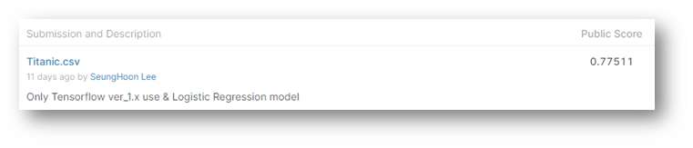

# Kaggle Titanic Logistic Regression

> - Tensor 1.x 버전 사용
> - Logistic Regression 구현


#### `모듈 사용`

```python
import numpy as np
import pandas as pd
import tensorflow as tf
```


#### `Data Preprocessing`

```python
# Raw Data Loading
df = pd.read_csv('../kaggle_data/titanic/train.csv')
test_df = pd.read_csv('../kaggle_data/titanic/test.csv')

# feature engineering
# 필요없는 column 제거
df.drop(['PassengerId', 'Name', 'Ticket', 'Fare', 'Cabin'], axis=1, inplace=True)
test_df.drop(['Name','Ticket', 'Fare', 'Cabin'], axis=1, inplace=True)

# 성별처리
gerder_mapping = {'male':0, 'female':1}
df['Sex'] = df['Sex'].map(gerder_mapping)
test_df['Sex'] = test_df['Sex'].map(gerder_mapping)

# 가족수 더해서 하나의 column으로 (SibSp + Parch )
df['family_cnt'] = df['SibSp'] + df['Parch']
df.drop(['SibSp', 'Parch'], axis=1, inplace=True)

test_df['family_cnt'] = test_df['SibSp'] + test_df['Parch']
test_df.drop(['SibSp', 'Parch'], axis=1, inplace=True)

# Data 결측치 처리

# Embarked 결측치 처리
df['Embarked'] = df['Embarked'].fillna('Q')

# 문자 값을 숫자값으로
embarked_mapping = {'S':0, 'C':1, 'Q':2}
df['Embarked'] = df['Embarked'].map(embarked_mapping)
test_df['Embarked'] = test_df['Embarked'].map(embarked_mapping)

# Age 결측치 처리
df['Age'] = df['Age'].fillna(df['Age'].mean())

# 데이터의 통일성을 위해 train data의 age_mean을 test data에 채워넣기로 결정
test_df['Age'] = test_df['Age'].fillna(df['Age'].mean())

# Age Binning 처리 (Numerical value --> Categorical value)
df.loc[df['Age']<8,'Age'] = 0
df.loc[(df['Age']>=8) & (df['Age']<20),'Age'] = 1
df.loc[(df['Age']>=20) & (df['Age']<65),'Age'] = 2
df.loc[df['Age']>=65,'Age'] = 3

test_df.loc[test_df['Age']<8,'Age'] = 0
test_df.loc[(test_df['Age']>=8) & (test_df['Age']<20),'Age'] = 1
test_df.loc[(test_df['Age']>=20) & (test_df['Age']<65),'Age'] = 2
test_df.loc[test_df['Age']>=65,'Age'] = 3

# 각 값들의 range가 비슷하기 때문에 정규화 처리 안함.
```


#### `Data Split`

```python
# Training Data Set 과 Validation Data Set 7:3 분리
train_data = df.iloc[:int(df.shape[0]*0.7)] 
val_data = df.iloc[int(df.shape[0]*0.7):] 

# Training Data Set
train_x_data = train_data.drop('Survived', axis=1, inplace=False).values
train_t_data = train_data['Survived'].values.reshape(-1,1)

# Validation Data Set
val_x_data = val_data.drop('Survived', axis=1, inplace=False).values
val_t_data = val_data['Survived'].values.reshape(-1,1)

# Test Data Set
test_x_data = test_df.drop('PassengerId', axis=1, inplace=False).values
```


#### `Tensor Graph`

```python
# Tensorflow 구현
# placeholder
X = tf.placeholder(shape=[None,5], dtype=tf.float32)
T = tf.placeholder(shape=[None,1], dtype=tf.float32)

# Weight & bias
W = tf.Variable(tf.random.normal([5,1]), name='weight')
b = tf.Variable(tf.random.normal([1]), name='bias')

# Hypothesis
logit = tf.matmul(X,W) + b
H = tf.sigmoid(logit)

# loss function
loss = tf.reduce_mean(tf.nn.sigmoid_cross_entropy_with_logits(logits=logit, labels=T))

# train
train = tf.train.GradientDescentOptimizer(learning_rate=1e-4).minimize(loss)

# session
sess= tf.Session()
sess.run(tf.global_variables_initializer())
```


#### `Fit & Accuracy` 

```python
# 학습
for step in range(300000):
    _, W_val, b_val, loss_val = sess.run([train,W,b,loss], feed_dict={X:train_x_data, T:train_t_data})
    
    if step % 30000 == 0:
        print('W: {}, b: {}, loss: {}'.format(W_val, b_val, loss_val))
        
# 정확도(Accuracy) 측정
predict = tf.cast(H > 0.5, dtype=tf.float32)
correct = tf.equal(predict, T)
accuracy = tf.reduce_mean(tf.cast(correct, dtype=tf.float32))

accuracy_val = sess.run(accuracy, feed_dict={X:val_x_data, T:val_t_data})
print(accuracy_val) # ==> 0.80898875
```


#### `Kaggle Submit`

```python
# Test Data로 결과 도출한 내용 csv파일로 만들어서 kaggle에 submit
test_x_data = test_df.drop('PassengerId', axis=1, inplace=False).values
predict_result = tf.cast(H > 0.5, dtype=tf.int32)
result = sess.run(predict_result, feed_dict={X:test_x_data})

submission = pd.DataFrame({
    'PassengerId' : test_df['PassengerId'],
    'Survived' : result.ravel()
})
submission.to_csv('./kaggle_data/titanic/Titanic.csv', index=False)
```


#### `Kaggle upload Score Result`



