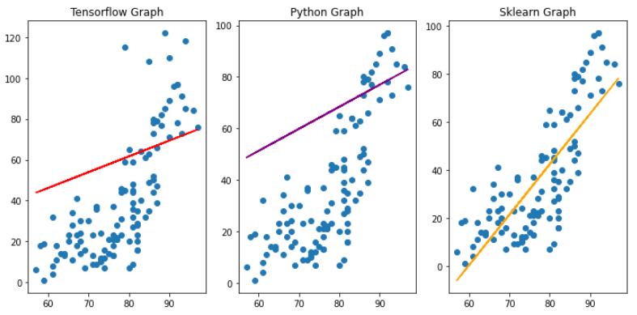

# Simple Linear Regression Model


## `Tensorflow version`

```python
# Tensorflow ver - 이상치 처리 : Tukey fence / 정규화 처리 : MinMax 직접 수식

import numpy as np
import pandas as pd
import tensorflow as tf
import matplotlib.pyplot as plt

#1. Data set
raw_data = pd.read_csv('./data/ozone.csv')
train_data = raw_data[['Ozone', 'Temp']] # ==> (153, 2)

#1-1 결측치 제거
train_data = train_data.dropna(how='any') # ==> (116, 2)

#2 이상치 판별 & 처리

#2-1 판별
fig = plt.figure()
fig_ozone = fig.add_subplot(1,2,1)
fig_temp = fig.add_subplot(1,2,2)

fig_ozone.boxplot(train_data['Ozone'])
fig_temp.boxplot(train_data['Temp'])

fig.tight_layout()
plt.show()
# ==> Ozone data에만 이상치가 존재

# Tukey fence 이상치 처리 ('Ozone'에만 적용)
iqr_val = np.percentile(train_data['Ozone'], 75) - np.percentile(train_data['Ozone'], 25) # ==> 45.25
upper_fence = np.percentile(train_data['Ozone'], 75) + (iqr_val*1.5)
lower_fence = np.percentile(train_data['Ozone'], 25) - (iqr_val*1.5)

outlier = (train_data['Ozone'] <= upper_fence) & (train_data['Ozone'] >= lower_fence)
tf_train_data = train_data.loc[outlier] # ==> (114, 2)

tf_x_data = tf_train_data['Temp']
tf_t_data = tf_train_data['Ozone']

# 정규화 (MinMax 직접 수식)
# Ozone 과 Temp의 data 범위가 다르다
# MinMax-Normalization : (X - MIN) / (MAX-MIN)

# Ozone 정규화
ozone_min = tf_train_data['Ozone'].min()
ozone_max = tf_train_data['Ozone'].max()
norm_t_data = (tf_train_data['Ozone'] - ozone_min)/(ozone_max - ozone_min)

# Temp 정규화
temp_min = tf_train_data['Temp'].min()
temp_max = tf_train_data['Temp'].max()
norm_x_data = (tf_train_data['Temp'] - temp_min)/(temp_max - temp_min)


# Data 전처리 끝
###################################################

# 독립변수 종속변수 값 설정
norm_tf_x_data = norm_x_data.values.reshape(-1,1)
norm_tf_t_data = norm_t_data.values.reshape(-1,1)

# Graph
X = tf.placeholder(shape=[None,1], dtype=tf.float32)
T = tf.placeholder(shape=[None,1], dtype=tf.float32)

W = tf.Variable(tf.random.normal([1,1]), name='weight')
b = tf.Variable(tf.random.normal([1]), name='bias')

# Hypothesis
H = tf.matmul(X,W) + b

# loss
loss = tf.reduce_mean(tf.square(T-H))

# train
train = tf.train.GradientDescentOptimizer(learning_rate=1e-4).minimize(loss)

# session & init
sess = tf.Session()
sess.run(tf.global_variables_initializer())

#학습
for step in range(500000):
    _, W_val_tf, b_val_tf, loss_val_tf = sess.run([train,W,b,loss], feed_dict={X:norm_tf_x_data, 
                                                                               T:norm_tf_t_data})
    
    if step % 50000 == 0:
        print('W: {}, b: {}, loss:{}'.format(W_val_tf, b_val_tf, loss_val_tf))
        
'''
W: [[-0.06642787]], b: [-0.97123367], loss:1.8354578018188477
W: [[0.59799546]], b: [0.01748249], loss:0.027930090203881264
W: [[0.66102016]], b: [-0.01677934], loss:0.026883091777563095
W: [[0.70156646]], b: [-0.03882493], loss:0.026449015364050865
W: [[0.7276112]], b: [-0.05299734], loss:0.02626909129321575
W: [[0.74448764]], b: [-0.06213355], loss:0.026193905621767044
W: [[0.7550791]], b: [-0.06792282], loss:0.026163224130868912
W: [[0.7619855]], b: [-0.07166134], loss:0.026150153949856758
W: [[0.7664083]], b: [-0.07410907], loss:0.026144612580537796
W: [[0.76938856]], b: [-0.07565801], loss:0.02614217810332775
'''

# Tensorflow 예측값 Temp = 82

norm_temp = (82 - temp_min)/(temp_max - temp_min)
input_temp = np.array([[norm_temp]]) # ==> [[0.625]]
predicted_ozone_result = sess.run(H, feed_dict={X:input_temp}) # ==> [[0.40393737]]
result =(predicted_ozone_result * (ozone_max - ozone_min)) + ozone_min 
print(result) # ==> [[49.908367]]
```


## `Python version`

```python
# Python ver - 이상치 처리 : Scipy Zscore / 정규화 처리 : MinMax Scaler

import numpy as np
import pandas as pd
from scipy import stats
from sklearn.preprocessing import MinMaxScaler

raw_data = pd.read_csv('./data/ozone.csv')
train_data = raw_data[['Ozone', 'Temp']]
train_data = train_data.dropna(how='any') # ==> (116, 2)

# 이상치 처리 ==> Ozone data만 적용
zscore_threshold = 1.8
outlier_mask = ~(np.abs(stats.zscore(train_data['Ozone'])) > zscore_threshold)
py_train_data = train_data.loc[outlier_mask] # ==> (109, 2)

py_x_data = py_train_data['Temp'].values.reshape(-1,1)
py_t_data = py_train_data['Ozone'].values.reshape(-1,1)

# 정규화
x_scaler = MinMaxScaler()
t_scaler = MinMaxScaler()

x_scaler.fit(py_x_data)
t_scaler.fit(py_t_data)

norm_py_x_data = x_scaler.transform(py_x_data)
norm_py_t_data = t_scaler.transform(py_t_data)

##############################################

# data 전처리 끝

# 수치미분 코드
def numerical_deriviation(f,x):
    delta_x = 1e-4
    deriviate_x = np.zeros_like(x)
    it = np.nditer(x, flags=['multi_index'])
    
    while not it.finished:
        idx = it.multi_index
        tmp = x[idx]
        
        x[idx] = tmp +delta_x
        fx_plus_delta = f(x)
        
        x[idx] = tmp -delta_x
        fx_minus_delta = f(x)
        
        deriviate_x[idx] = (fx_plus_delta - fx_minus_delta) / (2 * delta_x)
        
        x[idx] = tmp
        it.iternext()
    
    return deriviate_x

# weight & bias 변수 설정
W = np.random.rand(1,1)
b = np.random.rand(1)

# predict
def predict(x):
    y = np.dot(x,W) + b
    return y

# loss
def loss_func(input_obj):
    input_w = input_obj[0]
    input_b = input_obj[1]
    
    y = np.dot(norm_py_x_data, input_w) + input_b
    
    return np.mean(np.power((y-norm_py_t_data),2))

# learning_rate
learning_rate = 1e-4

# 학습
for step in range(300000):
    input_param = np.concatenate((W.ravel(), b), axis=0)
    result = numerical_deriviation(loss_func, input_param)
    
    W = W - (learning_rate*result[0]).reshape(1,1)
    b = b - (learning_rate*result[1])
    
    if step % 30000 == 0:
        print('W: {}, b: {}'.format(W, b))
        
'''
W: [[0.74538477]], b: [0.37050384]
W: [[0.65648001]], b: [0.04423344]
W: [[0.70716806]], b: [0.01708653]
W: [[0.74622022]], b: [-0.00368813]
W: [[0.77626283]], b: [-0.0196699]
W: [[0.79937444]], b: [-0.03196457]
W: [[0.81715405]], b: [-0.04142279]
W: [[0.8308318]], b: [-0.04869895]
W: [[0.84135401]], b: [-0.05429644]
W: [[0.84944869]], b: [-0.05860257]
'''

# 예측
predict_input = np.array([[82]])
scaled_input = x_scaler.transform(predict_input) # ==> [[0.625]]
predicted_result = predict(scaled_input)
real_result = t_scaler.inverse_transform(predicted_result)
print(real_result) # ==> [[46.39668755]]
```


## `Sklearn version`

```python
# sklearn ver & zscore 이상치 제거
import numpy as np
import pandas as pd
from scipy import stats
from sklearn import linear_model

raw_data = pd.read_csv('./data/ozone.csv')
train_data = raw_data[['Ozone', 'Temp']]
train_data = train_data.dropna(how='any') # ==> (116, 2)

# zscore 이상치 처리
zscore_threshold = 1.8

# 사분위표를 통해 temp에는 이상치가 없다는 것을 발견해서  zscore도 ozone data에만 적용
outlier_mask = ~(np.abs(stats.zscore(train_data['Ozone'])) > zscore_threshold)
sk_train_data = train_data.loc[outlier_mask] # ==> (109, 2)

sk_x_data = sk_train_data['Temp'].values.reshape(-1,1)
sk_t_data = sk_train_data['Ozone'].values.reshape(-1,1)

#sklearn은 정규화 할 필요 없어요
model = linear_model.LinearRegression()

# 학습(fit)
model.fit(sk_x_data,sk_t_data)

print('W : {}, b : {}'.format(model.coef_, model.intercept_))
# ==> W : [[2.10345729]], b : [-125.90136155]

predicted_result = model.predict([[82]]) # ==> [[46.5821362]]
```


## `Graph compare`

```python
import matplotlib.pyplot as plt

fig = plt.figure()
fig.set_size_inches(10,5)

tensor_fig = fig.add_subplot(1,3,1)
python_fig = fig.add_subplot(1,3,2)
sklearn_fig = fig.add_subplot(1,3,3)

tensor_fig.set_title('Tensorflow Graph')
python_fig.set_title('Python Graph')
sklearn_fig.set_title('Sklearn Graph')

tensor_fig.scatter(tf_x_data, tf_t_data) # ==> Tuckey fence로 이상치 제거한 data
python_fig.scatter(py_x_data, py_t_data) # ==> Zscore로 이상치 제거한 data
sklearn_fig.scatter(sk_x_data, sk_t_data) # ==> Zscore로 이상치 제거한 data

tensor_fig.plot(tf_x_data.values.reshape(-1,1), 
                tf_x_data.values.reshape(-1,1) * W_val_tf + b_val_tf, color='red')
python_fig.plot(py_x_data, py_x_data*W + b, color='purple')
sklearn_fig.plot(sk_x_data, sk_x_data*model.coef_ + model.intercept_, color='orange')

fig.tight_layout()
plt.show()
```



