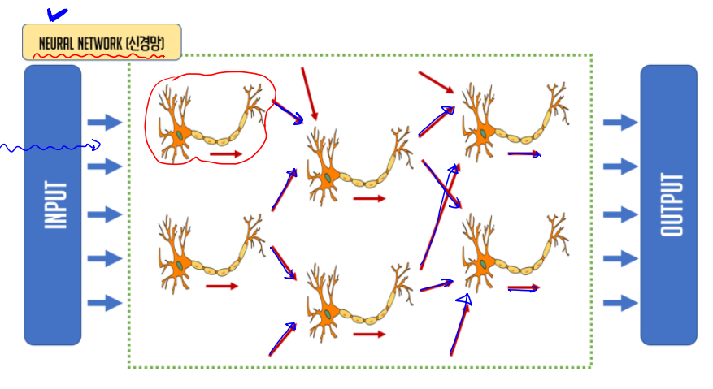

## `Neuron`

> - 이전 neuron으로부터 입력신호를 전달받아서 또 다른 신호를 발생시키는 일을 한다.
> - 입력값에 비례해서 출력값을 내보내는 형태가 아니다.
> - 입력값에 가중치(w)를 곱한 후 모두 더해서 특정 함수를 이용하여 thresholde를 넘는지 확인!
> - ==> 임계점을 넘으면 출력값 발생
> - `특정 함수` 란.. Activation Function (sigmoid, softmax etc.)
> - 하나의 Neuron이 하나의 logistic 이다.


## `Neural Network` 




## `Layer`

> - binary classification ==> single layer 안에 logistic regression이 1개 존재하는 형태
> - multinomial classification ==> single later 안에 logistic regression이 여러개 존재


## `Deep Network`

> - = `Deep Neural Network`(DNN) or `Deep Learning`
> - 한 개의 logistic regression을 나태내는 `node` 가 서로 연결되어 있는 신경망 구조를 바탕으로
> - Input Layer(입력층) + Hidden Layer(1개 이상의 은닉층) + Output Layer(출력층) 구조
> - 출력층의 오차를 기반으로 node의 가중치를 학습시키는 머신 러닝의 한 분야!
> - **`장점`** : 정확도가 가장 높다
> - **`단점`** : 학습에 들어가능 시간이 많이 들어간다.
> - hidden layer의 개수가 1~3개 정도까지 가장 효율적인 학습이 이뤄진다.
> - ==> n이 증가할 수록 accuracy의 증가폭은 급격하게 작아지는 반면, 학습시간은 급격하게 늘어난다.
> - **`Fully-connected Network`** : Layer 간 Node가 서로 완전히 연결돼 있는 상태! 즉, 앞뒤 layer간 node가 모두 연결돼 있어야 해!
> - ==> 이 구조 상태로 돼 있는 layer가 **`Dens`** !!!
> - `Data의 흐름` : **`Propagation`** (== **`feed forward`** )


## `Tensorflow 1.x 버전 XOR gate Deep-Learning 방식 구현`

> - input layer : 
> - hidden layer 1 : node 10개
> - hidden layer 2 : node 6개
> - output layer : node 1개 (0, 1 중 1개만 판별하면 되니깐 ==> binary classification)

```python
import tensorflow as tf
import numpy as np
from sklearn.metrics import classification_report

# Training_data set
x_data = np.array([[0,0],[0,1],[1,0],[1,1]], dtype=np.float32)
t_data = np.array([[0],[1],[1],[0]], dtype=np.float32)

# input layer
X = tf.placeholder(shape=[None,2], dtype=tf.float32)
T = tf.placeholder(shape=[None,1], dtype=tf.float32)
```


- `layer 개념`을 적용 시킨 tensorflow 1.x 버전 (기존 구현과 다른 부분!)

```python
# 2nd layer - Weight & bias 
W2 = tf.Variable(tf.random.normal([2,10])) # ==> 2 : 입력 data shape / 10 : 출력 data shape인데 다음 hidden layer의 node 개수가 10개!
b2 = tf.Variable(tf.random.normal([10]))
second_layer = tf.sigmoid(tf.matmul(X,W2) + b2)

# 3rd layer
W3 = tf.Variable(tf.random.normal([10,6]))
b3 = tf.Variable(tf.random.normal([6]))
third_layer = tf.sigmoid(tf.matmul(second_layer,W3) + b3)

# output layer
W4 = tf.Variable(tf.random.normal([6,1])) # output은 0,1 판별할 수 있는 logistic 1개 필요해
b4 = tf.Variable(tf.random.normal([1]))

logit = tf.matmul(third_layer, W4) + b4
H = tf.sigmoid(logit)
```


```python
# loss
loss = tf.reduce_mean(tf.nn.sigmoid_cross_entropy_with_logits(logits=logit, labels=T))

# train
train = tf.train.GradientDescentOptimizer(learning_rate=1e-2).minimize(loss)

sess = tf.Session()
sess.run(tf.global_variables_initializer())

for step in range(30000):
    _, loss_val = sess.run([train, loss], feed_dict={X:x_data, T:t_data})

    if step % 3000 == 0:
        print('loss :', loss_val)

'''
loss : 1.2027394
loss : 0.67142045
loss : 0.62325716
loss : 0.55270094
loss : 0.45972186
loss : 0.3371058
loss : 0.20441295
loss : 0.11731686
loss : 0.071440086
loss : 0.047387935
'''
        
accuracy = tf.cast(H >= 0.5, dtype=tf.float32)
result = sess.run(accuracy, feed_dict={X:x_data})
print(classification_report(t_data.ravel(), result.ravel()))
'''
              precision    recall  f1-score   support

         0.0       1.00      1.00      1.00         2
         1.0       1.00      1.00      1.00         2

    accuracy                           1.00         4
   macro avg       1.00      1.00      1.00         4
weighted avg       1.00      1.00      1.00         4
'''
```


## `Tensorflow 2.x 버전 XOR gate Deep-learning 구현`

```python
# Tensorflow 2.x 버전으로 Deep learning 구현

import numpy as np
import tensorflow as tf
from tensorflow.keras.models import Sequential
from tensorflow.keras.layers import Flatten, Dense
from tensorflow.keras.optimizers import SGD
from sklearn.metrics import classification_report

# Training_data set
x_data = np.array([[0,0],[0,1],[1,0],[1,1]], dtype=np.float32)
t_data = np.array([[0],[1],[1],[0]], dtype=np.float32)

# keras model
model = Sequential()

# layer 추가
model.add(Flatten(input_shape=(x_data.shape[1],)))
model.add(Dense(10, activation='relu')) # hidden layer 1
model.add(Dense(6, activation='relu'))  # hidden layer 2
model.add(Dense(1, activation='relu'))  # output layer

# complie
model.compile(optimizer=SGD(learning_rate=1e-2),
              loss='binary_crossentropy',
              metrics=['accuracy'])

# 학습
history = model.fit(x_data, t_data,
                    epochs=1000,
                    verbose=0)

# 예측값 구하기
predict_val = model.predict(x_data)

result = tf.cast(predict_val >= 0.5, dtype=tf.float32).numpy().ravel()
print(classification_report(t_data.ravel(), result))
```

