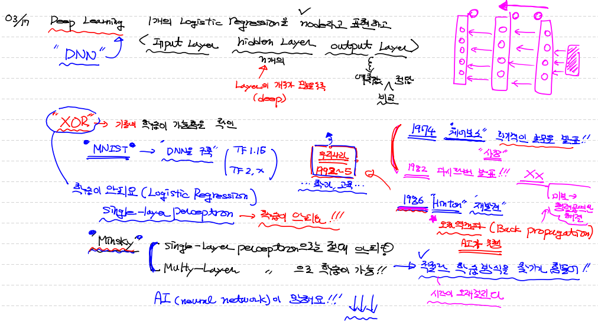
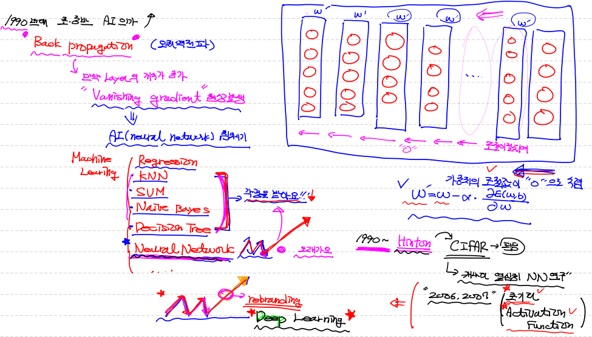
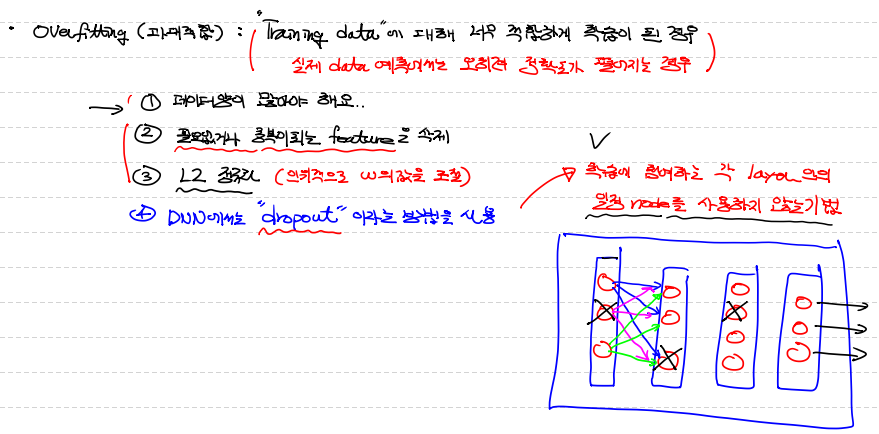

## MNIST DNN 구현

```python
# MNIST DNN 구현(tf 1.15)

import numpy as np
import pandas as pd
import tensorflow.compat.v1 as tf
import matplotlib.pyplot as plt
from sklearn.preprocessing import MinMaxScaler
from sklearn.model_selection import train_test_split
from sklearn.model_selection import KFold
tf.disable_v2_behavior()

# Raw Data Loading
df = pd.read_csv('/content/drive/MyDrive/Colab Notebooks/kaggle_data/digit/train.csv')

x_data = df.drop('label', axis=1, inplace=False).values # ==> (42000, 784)
t_data = df['label'].values

# 결측치 없고
# 이상치 없고

# 이미지 확인
img_data = x_data

plt.imshow(img_data[5000].reshape(28,28), cmap='Greys', interpolation='nearest')

# train, test data split
x_data_train, x_data_test, t_data_train, t_data_test =\
train_test_split(x_data, t_data, test_size=0.3, random_state=0)


# 정규화 pixel에 대해
scaler = MinMaxScaler()
scaler.fit(x_data_train)
norm_x_data_train = scaler.transform(x_data_train) # ==> (29400, 784)
norm_x_data_test = scaler.transform(x_data_test)


# one-hot encoding
sess = tf.Session()
onehot_t_data_train = sess.run(tf.one_hot(t_data_train, depth=10)) # ==> (29400, 10)
onehot_t_data_test = sess.run(tf.one_hot(t_data_test, depth=10))

# Tensor Graph  

# placeholder ==> DNN에서는 이 부분이 input layer
X = tf.placeholder(shape=[None,784], dtype=tf.float32)
T = tf.placeholder(shape=[None,10], dtype=tf.float32)

# 1st layer
W1 = tf.Variable(tf.random.normal([784,64])) # ==> node가 512개 있는거고, logistic regression이 512개
b1 = tf.Variable(tf.random.normal([64]))
layer1 = tf.sigmoid(tf.matmul(X,W1) + b1)

# 2nd layer
W2 = tf.Variable(tf.random.normal([64,32]))
b2 = tf.Variable(tf.random.normal([32]))
layer2 = tf.sigmoid(tf.matmul(layer1,W2) + b2)

# 3rd layer
W3 = tf.Variable(tf.random.normal([32,16]))
b3 = tf.Variable(tf.random.normal([16]))
layer3 = tf.sigmoid(tf.matmul(layer2,W3) + b3)

# output layer
W4 = tf.Variable(tf.random.normal([16,10]))
b4 = tf.Variable(tf.random.normal([10]))

logit =  tf.matmul(layer3,W4) + b4
H = tf.nn.softmax(logit)

# loss
loss = tf.reduce_mean(tf.nn.softmax_cross_entropy_with_logits_v2(logits=logit, labels=T))

# train
train = tf.train.GradientDescentOptimizer(learning_rate=1e-1).minimize(loss)

# session
sess.run(tf.global_variables_initializer())

# ephocs = 1000
for step in range(1000):
    _, loss_val = sess.run([train, loss], feed_dict={X:norm_x_data_train,
                                                     T:onehot_t_data_train})
    if step % 100 == 0 :
        print('loss :', loss_val)
        
'''
loss : 2.819408
loss : 2.0899374
loss : 1.8919386
loss : 1.7524557
loss : 1.6416565
loss : 1.543031
loss : 1.4519335
loss : 1.368689
loss : 1.2942104
loss : 1.2283626
'''
```

```python
# accuracy
predict = tf.argmax(H,1)
correct = tf.cast(tf.equal(predict, tf.argmax(T,1)), dtype=tf.float32)
accuracy = tf.reduce_mean(correct)
print('정확도 :',sess.run(accuracy, feed_dict={X:norm_x_data_test, T:onehot_t_data_test}))

# epoch 10000 / layer node 수 시작 : 256부터 시작할 때
# ==> 정확도 : 0.8854762

# epoch 1000 / layer node 수 시작 : 64부터 시작할 때
# ==> 정확도 : 0.60579365

# epoch 1000 / layer node 수 시작 : 32부터 시작할 때 / hidden layer 1개 줄임
# ==> 정확도 : 0.6274603

# epoch 2000 / layer node 수 시작 : 16부터 시작할 때 / hidden layer 1개 줄임
# ==> 정확도 : 0.5440476
```

---

### :question: 왜 학습이 잘 안되지? :question:

---


## Deep Learning

> - `Deep Neural Network(DNN)`
> - Deep Learning의 기본 **component** = `Logistic regression`
> - Input Layer / Hidden Layer / Output Layer  ==> hidden layer의 개수가 많을 수록 deep하다.


## AI 침체기 속 새로운 빛

> - Minsky 교수가 XOR gate 구현 하려면 `다중 layer`로 학습 시켜야 하는데
> - 적절한 학습 방식을 찾기가 힘들다. (시간도 너무 오래걸리고, 너무 복잡하다.)

<1974년 '웨어보스' 위 문제 해결하는 박사 학위 논문 발표> ==> no 관심

<1982년 '웨어보스' 다시 발표> ==> no 관심

<1986년 'Hinton'교수의 관심 표명>

그게 뭐냐?! 

#### `오차 역전파 (BackPropagation)`

> - 미분으로 w, b 구하는 게 아니라
> - 오차값을 행렬로 뒤에서부터 갱신!
> - 앞에서부터 다시 학습
> - 즉, 미분방정식을 행렬식으로 처리!




## 새로운 문제 - `Vanishing gradient`

> - Back propagation ==> 만약 Layer 개수가 증가한다면...
> - **`Vanishing gradient`** 현상 발생
> - ==> 가중치의 조절값이 `'0'으로 수렴` 즉, w와 b의 조절이 layer 수에 따라 잘 안되는 현상...
> - 이로 인해 Neural Network 폭락 ==> 다른 머신러닝 방법 연구 ==> 새로운 알고리즘들 등장(KNN, SVM, Decision Tree ...)


## 해결 -> `초기화, activation function`

> - 1990년대 Hint 교수가 CIFAR이라는 Canada 기초연구 펀딩 기구의 지원으로 NN 연구하면서 논문 발표(2006, 2007)
> - ==> 초기화 & activation function ==> 증명!
> - 초기 W의 값을 학습이 잘 되도록 올바른 방식으로 지정해야 한다.
> - sigmoid activation function의 한계를 해결할 다른 activation function 적용




### `W 초기값 설정`

> - 가중치 W 값을 그냥 random 값으로 사용하면 위에서 발생한 **`Vanishing gradient`** 문제를 해결할 수 없다.

> 1. **`Xavier Initialization`** : `입력의 개수`와 `출력의 개수`를 이용해서 weight의 초기값 설정
>    - W = np.random.randn(num_of_input, num_of_output) / np.sqrt(num_of_input)
>    - num_of_input : 입력 data의 개수
>    - num_of_output : 출력 data의 개수
> 2. **`He's Initialization`** : Xavier Initialization의 확장버전
>    - W = np.random.randn(num_of_input, num_of_output) / np.sqrt(num_of_input/2)
>    - 참고로 keras에서는 `He's Initialization`을 기본값으로 사용


### `Activation function - Relu`

> - sigmoid로 인한 `Vanishing gradient` 문제를 해결한 유용한 activation function
> - tf.nn.relu() 로 사용


## `변동 내용이 적용된 MNIST 구현`

#### `Data 전처리`

```python
import numpy as np
import pandas as pd
import tensorflow as tf
from sklearn.model_selection import train_test_split

# Raw Data Loading
df = pd.read_csv('/content/drive/MyDrive/Colab Notebooks/kaggle_data/digit/train.csv')

x_data = df.drop('label', axis=1, inplace=False).values # ==> (42000, 784)
t_data = df['label'].values

# train, test data split
x_data_train, x_data_test, t_data_train, t_data_test =\
train_test_split(x_data, t_data, test_size=0.3, random_state=0)

# 정규화 pixel에 대해
scaler = MinMaxScaler()
scaler.fit(x_data_train)
norm_x_data_train = scaler.transform(x_data_train) # ==> (29400, 784)
norm_x_data_test = scaler.transform(x_data_test)

# one-hot encoding
sess = tf.Session()
onehot_t_data_train = sess.run(tf.one_hot(t_data_train, depth=10)) # ==> (29400, 10)
onehot_t_data_test = sess.run(tf.one_hot(t_data_test, depth=10))
```


#### `Tensor Graph - 여기서 변동`

```python
# input layer는 그대로
X = tf.placeholder(shape=[None,784], dtype=tf.float32)
T = tf.placeholder(shape=[None,10], dtype=tf.float32)

#######################################################################################

# 1st layer

# Xavier Initialization 적용
# tf.Variable() ==> tf.get_variable() (변동)
W1 = tf.get_variable('W1', shape=[784,64],
                     initializer = tf.contrib.layers.xavier_initializer())

# He's Initialization 적용 코드
# xavier_initializer() ==> variance_scailing_initializer() (변동)
# W1 = tf.get_variable('W1', shape=[784,64],
#                      initializer=tf.contrib.layers.variance_scailing_initializer())

b1 = tf.Variable(tf.random.normal([64])) # b는 random 값 써도 상관 없다

# relu activation function 적용
# tf.sigmoid ==> tf.nn.relu (변동)
layer1 = tf.nn.relu(tf.matmul(X,W1) + b1)

#######################################################################################

# 2nd layer

W2 = tf.get_variable('W2', shape=[64,32],
                     initializer=tf.contrib.layers.xavier_initializer())

b2 = tf.Variable(tf.random.normal([32]))

layer2 = tf.nn.relu(tf.matmul(layer1,W2) + b2)

#######################################################################################

# 3rd layer
W3 = tf.get_variable('W3', shape=[32,16],
                     initializer=tf.contrib.layers.xavier_initializer())

b3 = tf.Variable(tf.random.normal([16]))

layer3 = tf.nn.relu(tf.matmul(layer2,W3) + b3)

#######################################################################################

# output layer
W4 = tf.get_variable('W4', shape=[16,10],
                     initializer=tf.contrib.layers.xavier_initializer())

b4 = tf.Variable(tf.random.normal([10]))

logit =  tf.matmul(layer3,W4) + b4
H = tf.nn.softmax(logit)
# 주의해야 할 점! ==> ouput은 multinomoal classfication에 맞게 softmax activation function이 그대로 사용!!

# 나머지는 동일

#######################################################################################

# loss
loss = tf.reduce_mean(tf.nn.softmax_cross_entropy_with_logits_v2(logits=logit, labels=T))

# train
train = tf.train.GradientDescentOptimizer(learning_rate=1e-1).minimize(loss)

# session
sess.run(tf.global_variables_initializer())

# ephocs = 1000
for step in range(1000):
    _, loss_val = sess.run([train, loss], feed_dict={X:norm_x_data_train,
                                                     T:onehot_t_data_train})
    if step % 100 == 0 :
        print('loss :', loss_val)
        
# accuracy
predict = tf.argmax(H,1)
correct = tf.cast(tf.equal(predict, tf.argmax(T,1)), dtype=tf.float32)
accuracy = tf.reduce_mean(correct)
print('정확도 :',sess.run(accuracy, feed_dict={X:norm_x_data_test, T:onehot_t_data_test}))
# W 초기값과 relu activation function 사용한 결과
# ==> 정확도 : 0.94150794
```


---


## Overfitting(과대적합)

> - Training Data에 대해 너무 적합하게 학습!
> - 이로 인해 실제 data 예측에서는 오히려 정확도가 떨어진다. (No 일반화)

#### `<해결방법>`

> :one: Data 양이 많으면 된다.
>
> :two: 필요 없거나 중복되는 feature를 적절히 제거 (feature engineering)
>
> :three: L2 정규화(regularization) ==> 인위적으로 W 조정하는 식을 조절
>
> :four: **`dropout`** : Layer 안에 모든 node 중에서 일정 node를 학습에 참여하지 않도록 제외하는 기법 (switch off)
>
> ​	==> node를 삭제하는 것이 아니라 행렬 연산 시 참여 안하도록 제한 하는 기법!




## `dropout 구현`

#### `Tensor Graph`

```python
# input layer
X = tf.placeholder(shape=[None,784], dtype=tf.float32)
T = tf.placeholder(shape=[None,10], dtype=tf.float32)

#######################################################################################

# 1st layer

W1 = tf.get_variable('W1', shape=[784,64],
                     initializer = tf.contrib.layers.xavier_initializer())
b1 = tf.Variable(tf.random.normal([64]))
_layer1 = tf.nn.relu(tf.matmul(X,W1) + b1)

# tf.nn.dropout() 으로 dropout 설정
layer1 = tf.nn.dropout(_layer1, rate=0.3) # 0.3 비중의 node를 참여하지 않도록!
                                         # node 연산량이 줄어든다.

#######################################################################################

# 2nd layer

W2 = tf.get_variable('W2', shape=[64,32],
                     initializer=tf.contrib.layers.xavier_initializer())

b2 = tf.Variable(tf.random.normal([32]))

_layer2 = tf.nn.relu(tf.matmul(layer1,W2) + b2)

# dropout 설정
layer2 = tf.nn.dropout(_layer2, rate=0.3)

#######################################################################################

# 3rd layer
W3 = tf.get_variable('W3', shape=[32,16],
                     initializer=tf.contrib.layers.xavier_initializer())

b3 = tf.Variable(tf.random.normal([16]))

_layer3 = tf.nn.relu(tf.matmul(layer2,W3) + b3)

# dropout 설정
layer3 = tf.nn.dropout(_layer3, rate=0.3)

#######################################################################################

# output layer
W4 = tf.get_variable('W4', shape=[16,10],
                     initializer=tf.contrib.layers.xavier_initializer())

b4 = tf.Variable(tf.random.normal([10]))

logit =  tf.matmul(layer3,W4) + b4
H = tf.nn.softmax(logit)
```


---


## Tensor 2.x MNIST 구현

```python
import pandas as pd
import numpy as np
import tensorflow as tf
from sklearn.model_selection import train_test_split
from sklearn.preprocessing import MinMaxScaler
from tensorflow.keras.models import Sequential
from tensorflow.keras.layers import Flatten, Dense, Dropout
from tensorflow.keras.optimizers import SGD, Adam  # Adam ==> 평균적으로 가장 좋은 효과 내는 (어떤 Data인지 상관 없이)

# Raw Data Loading
df = pd.read_csv('/content/drive/MyDrive/Colab Notebooks/kaggle_data/digit/train.csv')

x_data = df.drop('label', axis=1, inplace=False) # ==> (42000, 784)
t_data = df['label']

# train, test data split
x_data_train, x_data_test, t_data_train, t_data_test =\
train_test_split(x_data, t_data, test_size=0.3, random_state=0)

# 정규화 pixel에 대해
scaler = MinMaxScaler()
scaler.fit(x_data_train)
norm_x_data_train = scaler.transform(x_data_train) # ==> (29400, 784)
norm_x_data_test = scaler.transform(x_data_test)
```

##### `(Keras 구현)`

```python
# model
keras_model = Sequential()

# input layer
keras_model.add(Flatten(input_shape=(norm_x_data_train.shape[1],)))

# hidden layer 1
keras_model.add(Dense(256, activation='relu')) # ==> output node 개수 : 256개

# hidden layer 2
keras_model.add(Dense(128, activation='relu'))

# hidden layer 3
keras_model.add(Dense(64, activation='relu'))

# Dropout lay ==> 각 layer 사이에 또하나의 layer로 껴서 작동한다.
# keras_model.add(Dropout(0.2)) # 20% dropout 설정

# hidden layer 4
keras_model.add(Dense(32, activation='relu'))

# output layer
keras_model.add(Dense(10, activation='softmax'))

# compile
keras_model.compile(optimizer=Adam(learning_rate=1e-2),
                    loss='sparse_categorical_crossentropy',
                    metrics=['sparse_categorical_accuracy'])

# 학습
history = keras_model.fit(norm_x_data_train,
                          t_data_train,
                          epochs=1000,
                          verbose=1,
                          validation_split=0.3,
                          batch_size=512)

# 최종 accuracy
print(keras_model.evaluate(norm_x_data_test, t_data_test))
'''
394/394 [==============================] - 1s 2ms/step - loss: 0.6213 - sparse_categorical_accuracy: 0.9730
[0.6212750673294067, 0.9730158448219299]
'''
```

