## 이미지

> - 이미지 이루고 있는 가장 기본 단위 : **`Pixel`** (해상도) ==> 해상도 :arrow_up:  -> pixel 개수 :arrow_up:
> - 이미지는 우리가 일반적으로 사용하는 `데카르트 좌표계`와 다른 **`이미지 좌표계`** 를 사용한다.
> - ==> **`Matrix 좌표계 (행렬 좌표계)`**
> - 2차원 이미지(M × N)를 ndarray로 표현 ==> **`pixel [세로(M), 가로(N)]`**
> - :star: 세로쪽 아래로 내려갈수록 숫자가 증가한다.

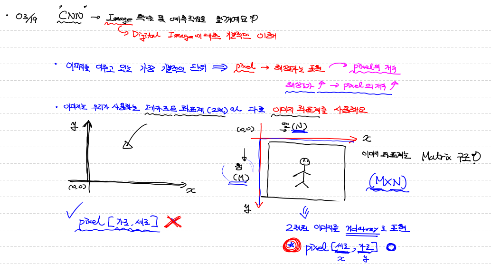

## 이미지 코드 구현

> - Pillow 모듈 사용!

```python
from PIL import Image  # pillow library
import numpy as np
import matplotlib.pyplot as plt

# Image Open ==> Image 객체로 생성

img = Image.open('..\image\justice.jpg')
print(type(img))
# <class 'PIL.JpegImagePlugin.JpegImageFile'>

plt.imshow(img)
plt.show()

# 픽셀 값
pixel = np.array(img)

print('x좌표:{}, y좌표:{}인 pixel의 값 : {}'.format(100,200,pixel[200,100]))
# x좌표:100, y좌표:200인 pixel의 값 : [120  83  54] == [R, G, B]
# pixel 값 줄 때 조심하자! pixel[200,100] == pixel[세로(y), 가로(x)]

print('이미지의 크기 : {}'.format(img.size))
# ==> 이미지의 크기 : (640, 426) == (가로, 세로)

print('이미지의 shape : {}'.format(pixel.shape))
# 이미지의 shape : (426, 640, 3) == (세로길이, 가로, 각 pixel당 rgb 3개 가지고 있다.)
```

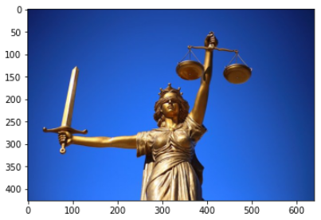


## 이미지에 대한 기본 처리

> - 이미지 객체를 이용
> - Pillow 모듈 사용!

```python
# 이미지 저장
img.save('../image/test_image.jpg')
```

```python
# 이미지 잘라내기(.crop(좌 상 우 하))
# 좌상 쪽에 한 점 찍고, 우하 쪽에 한 점 찍어서 2개의 점으로 사각형 만든 부분을 crop 한다.
crop_img = img.crop((30,100,150,330))
plt.imshow(crop_img)
plt.show()
```

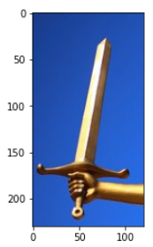

```python
# 이미지 크기 변경!
# 이미지 가로 길이 = img.size[0]
# 이미지 세로 길이 = img.size[1]
# resize 함수는 인자를 튜플 1개로 받는다.
resize_img = img.resize((int(img.size[0]/8), int(img.size[1]/8)))
plt.imshow(resize_img)
plt.show()
```

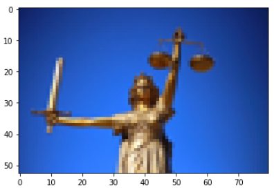

```python
# 이미지 회전
rotate_img = img.rotate(180)
plt.imshow(rotate_img)
plt.show()
```

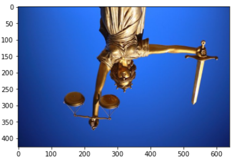


---


## Digital Image의 형태

- **`binary Image(이진 이미지)`**
  - 각 pixel의 값을 0(어두움) or 1(밝음)로 표현
    - 각 pixel은 1bit만 있으면 표현이 가능해서 size가 가장 작을 것 같다.
    - but! 실제로는 1개의 pixel은 8bit 사용한다!! (8bit 공간에서 1bit만 쓰고, 7bit는 그냥 놀고 있다.)
- **`gray-Image(흑백 이미지)`**
  - 각 pixel의 값을 0~255 값으로 표현
    - 1 pixel에 8bit를 사용하기 때문에 2^8 = 256개
  - **`2차원`**
- **`color Image(컬러 이미지)`**
  - 각 pixel에 3개의 channel이 포함 
  - 각 channel은 빛의 3원색 (R,G,B)
  - **`3차원`**
  - :heartpulse: Red : 0~255 (8bit) / :green_heart: Green : 0~255 (8bit) / :blue_heart: Blue : 0~255 (8bit)
  - `'24bit'` ==> `True Color`
  - `JPG` file :arrow_forward: 3 channel (RGB)
  - `PNG` file :arrow_forward: 4 channel (RGB + α) (α:투명도)

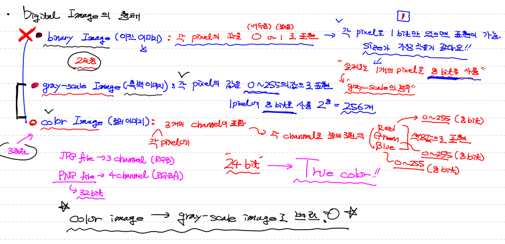

---


## gray-scale 차원 변동 및 비교

```python
# Gray-scale 차원 변동 비교 연습
# Color Image ==> Gray-Scale Image

import numpy as np
from PIL import Image
import matplotlib.pyplot as plt

color_img = Image.open('../image/fruits.jpg')
plt.imshow(color_img)
plt.show()

color_pixel = np.array(color_img) # 3차원의 ndarray
print('color_pixel의 shape : {}'.format(color_pixel.shape))
# color_pixel의 shape : (426, 640, 3)
```

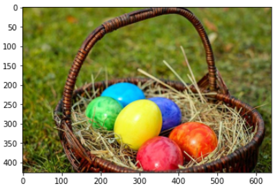


#### `컬러이미지 흑백으로 처리`

```python
# 흑백 이미지 3차원 데이터로 표현
# 각 pixel의 RGB값의 평균! 구해서 각각의 R G B 값으로 설정
gray_pixel = color_pixel.copy()

for y in range(gray_pixel.shape[0]):
    for x in range(gray_pixel.shape[1]):
        gray_pixel[y,x] = int(np.mean(gray_pixel[y,x])) # <<< 해당 pixel의 요소 3개짜리(RGB값) vector
        # 브로드캐스팅 되면서 각 rgb 값이 모두 평균값으로 대체된다.
        # [76 76 76] 모두 이 값으로 setting
        
plt.imshow(gray_pixel)
plt.show()

# 가중치로 바꾸는 방법
# L = 0.2999*R + 0.587*G + 0.114*B
```

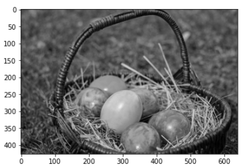


```python
# 2차원으로 흑백 이미지 표현해보기
# rgb 값 중에 1개만 가져와서 그냥 값으로 표현하기 (rgb 값이 vector 벗어나)
gray_2d_pixel = gray_pixel[:,:,0]
print(gray_2d_pixel.shape) # (426, 640) 2차원

plt.imshow(gray_2d_pixel) 
# plt.imshow()는 3차원 image를 받아서 보여주는거다!
# 그러다보니 cmap 지정 안해주면 아래처럼 이미지가 나온다.
plt.show()
```

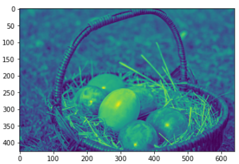


```python
plt.imshow(gray_2d_pixel, cmap='Greys') 
plt.show()
plt.imshow(gray_2d_pixel, cmap='gray_r') 
plt.show()

# 2개의 cmap 인자값 모두 아래와 같은 이미지를 보여준다.
```

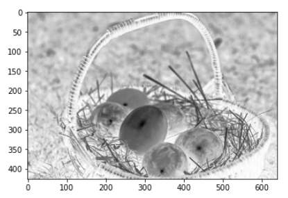

```python
plt.imshow(gray_2d_pixel, cmap='gray') 
plt.show()
# cmap='gray' 이 값을 주면 정상적인 흑백 이미지를 보여준다.
```

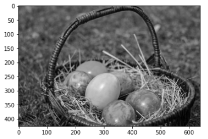


#### `흑백 이미지 저장`

```python
# 흑백 처리된 ndarray ==> 이 data를 이용 해서 이미지 파일 저장

# ndarray에서 이미지 객체 만들어주기
gray_2d_image = Image.fromarray(gray_2d_pixel)
gray_2d_image.save('../image/my_gray_image.jpg')
```

---


## CNN

> - `Convolutional Neural Network`
> - `Convnet(컨브넷)`, 합성곱 신경망
> - DNN : 일반적인 Deep Learning 구조


#### `FC Layer`

> - Fully Connected Layer
> - 일반적으로 DNN과 같은 의미로 혼용해서 사용하는데... 그게 아니다.
> - 이전 Layer와 이후 Layer와 와전히 연결돼 있는 Layer
> - 프로그램적으로 표현하면 ==> `Dense Layer`
> - **`FC Network`** : FC Layer로 이루어진 Network


#### `기존 DNN 방식의 이미지 학습의 한계`

> - **`CNN`** 은 이미지를 **`분류`** 하기 위해서 이미지의 **`pattern`** 을 이용하는 deep learning 방법론!
> - CNN 알고리즘을 통해 이미지 `pattern`을 추출!
> - FC Layer로만 구성된 DNN의 입력데이터(이미지1개)는 `1차원`으로 한정한다.(`Flatten()`)
> - CNN이 나오기 전에는 MNIST 방식처럼 2차원을 1차원으로 변경 / 3차원을 1차원으로 변경해서 FC Layer에 입력! ==> 이 방식은 `이미지의 형상(feaure)`는 고려하지 않은 방식이다! ==> 이미지의 `Raw Data`를 그대로 입력 Data로 넣는다는 의미!
> - 그래서 정말 `다양한 형태`의 다양한 모양의 이미지를 학습시켜야 하는 한계가 생긴다.

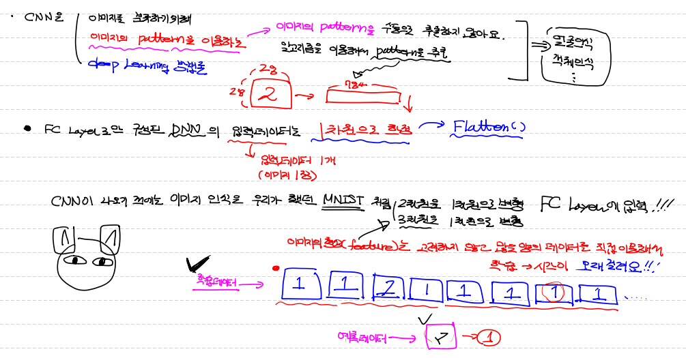

---

### 기존 DNN process

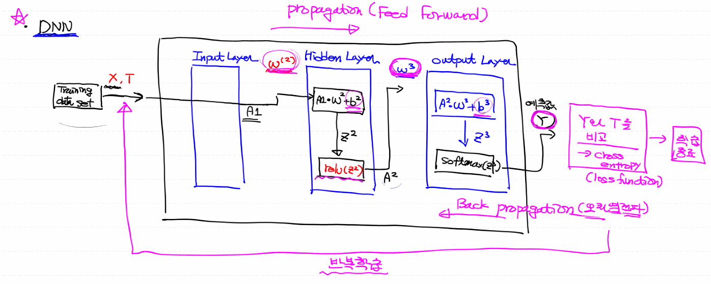


## CNN Process

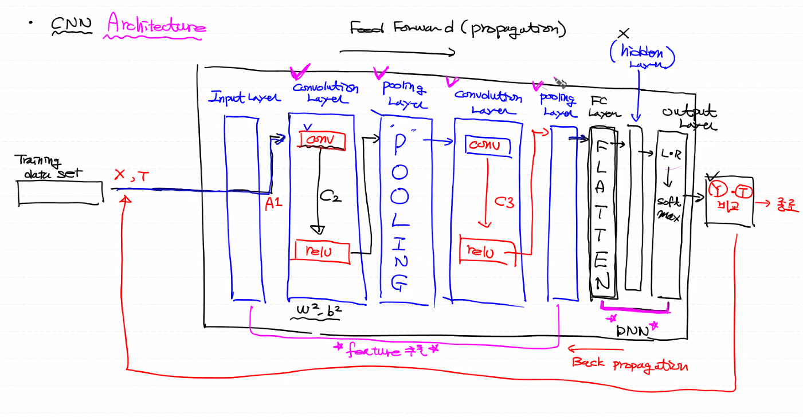