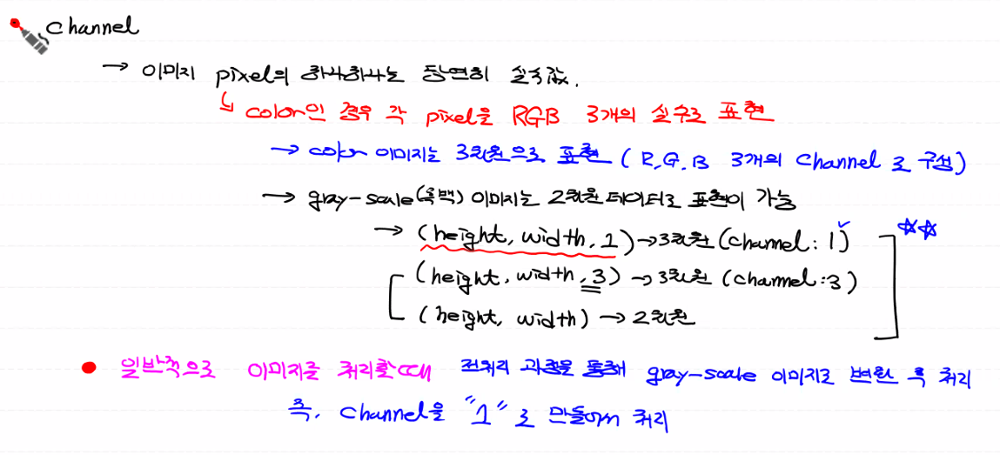

## CNN Process Review

> - **`convolution Layer`** : conv와 relu 작업이 이뤄지는 Layer
>   - `conv` : 이미지의 특징을 추출하는 역할 감당 (W, b를 이용해서)
>   - `relu` : 특정 값 이하에서 0을 반환하고, 값이 증가할수록 1을 넘어서 증가된 값을 반환 ==> BackPropagation으로 인한 Vanishing Gradient 문제 해결!
>   - 이미지 사이즈를 줄이는 데 기여한다.
> - `Poolling Layer` : optional Layer, 선택사항!


## Convolution(합성곱) 연산

> - 합성곱 연산은 두 함수 f,g가 존재할 때, 하나의 함수를 반전(reverse), 전이(shift)시킨 후 다른 함수와 곱한 후 이 결과를 `적분`
> - 이미지 data와 filter(kernal) matrix를 같은 위치에 있는 요소끼리 곱한 후 그 결과들의 합을 **`Convolution 연산` **


## Channel

> - 이미지 pixel의 값은 실수값!
> - color 이미지는 3차원으로 표현 (R, G, B 3개의 channel로 구성)
> - gray-scale(흑백) 이미지는 2차원 데이터 표현 가능 ==> (height, width)
> - 3차원 표현도 가능 ==> **`(height, width, 1)`** : channel값을 1로 준다.


#### `일반적으로 이미지 처리 시`

-  즉, 이미지의 색상이 필요없고 `형태(모양)`만 사용할 때!
- 전처리 과정을 통해 `gray-scale 이미지`로 변환 후 처리
- 즉, channel을 `1`로 만들어서 처리




## Filter & Stride

- CNN에서 **`Filter`** 는 이미지의 **`특징`** 을 찾아내기 위한 공용  Parameter
- 처음에는 Filter가 `랜덤값`으로.. `학습 반복` 하면서 Filter가 특징 제대로 뽑는 Filter로 **`upgrade`**
- ==> 즉, CNN에서 학습시켜서 우리가 얻고 싶은 것은 **`특징을 잘 뽑을 수 있는 Filter`** 를 추출하는 것! ==> 학습의 목적
- Filter를 **`Kernal`** 이라고도 함
- 일반적으로 `3×3, 4×4` 와 같은 정방향 형태로 정의
- 이 Filter 간 각각의 구성 요소들 ==> CNN에서 학습의 대상
- Filter는 하나만 사용하는 것이 아니라 **`여러개`** 사용 한다! ==> 이미지의 특징을 제대로 추출하기 위해서!
- 이런 Filter는 `크기가 큰(ex. (5×5))` Filter보다 `크기가 작은(ex. (3×3))` Filter 여러개를 사용하는 것이 더 좋다!
- ==> 일반적으로 **`(3×3)`** 크기의 Filter를 이용! (여러개 중첩해서 사용!)
- Filter를 이미지 위에서 **`지정된 간격(== Stride , scala 값으로 표현)`** 만큼 이동하면서 convolution 수행


## Stride 값이 2라면

- convolution 연산 결과의 개수가 작아진다.


## Feature Map

- `Filter`와 `stride`를 사용해서 1개의 `Featur Map`을 만들어낸다.
- 그리고 각각의 Filter에 `Feature map` 1개가 생성된다.
- 즉 convolution 작업을 통해 ==> 1개 Filter 당 1개의 Featur Map이 생성!


#### `3차원의 Feature Map`

> - 이미지 크기 (4 x 4)
> - 이미지의 channel : 3 (Color 라는 의미)
> - Filter : 이미지 channel 개수가 3개이기 때문에 Filter 또한 3 channel!
> - Stride : 1
> - 각 channel을 분리해서 convolution 연산 후 행렬을 더한 **`최종 1개의 Feature Map!`** 반환
> - Feature Map은 channel 수에 상관없이 Filter 당 1개 생겨 난다!
> - 다양한 Filter에 따라 `다양한 Feature Map` 이 나오고 Feature map의 개수가 **`channel 값`**
> - 즉, 다(多)channel의 Featur Map에 **`activation function(relu)`** 적용 후 ==> **`Activation Map`** 출력!
> - 이 **`Activation Map`** 이 다음 Layer에 넘어간다.
> - **`Activation Map`** : 원본 이미지의 `특징`을 가진 `이미지` Data


## Padding

- Feature Map의 크기가 입력 데이터보다 작아질 수 밖에 없다.
- Padding : 지속적으로 데이터 작아지는 걸 방지하는 방법
- Zero Padding : 0을 채워서 크기를 조정
- 입력 데이터 외곽에 `0`으로 채워서 처리
- 0으로 채우는 이유는 **`특징`** 에 영향을 주지 않기 때문에!
- Code 처리할 때 ==> 2가지 option : `VALID` == padding 처리 안하는 것! (입력보다 출력결과 크기가 작다) / `SAME` : 내부적으로 padding 처리 (입력 과 출력 결과 크기가 같아짐)


## Pooling

- `Stride`와 `Filter(Kernal)` size에 따라서 `Feature Map`의 Size가 결정

- 일반적으로(Padding 사용 하지 않으면) ==> Size가 줄어든다.
- 하지만! 만약 Filter를 여러개 사용하면, 결과 이미지 개수 자체가 증가한다. (== `Featur Map`의 `Channel`이 증가)
- ==> 실제 학습해야 하는 데이터 양은 상당히 많아지게 된다.
  - ==> Data 양을 줄이면서 특정 feature를 강조하기 위해 **`Pooling`** 사용

- 기법 3가지
  - **`MAX Pooling`** ==> CNN의 기본 Pooling 방법 (왜 기본이냐면, 특징을 잘 뽑아내면서, 데이터 사이즈도 잘 줄여서)
  - `Average Pooling`
  - `MIN Pooling`


### `MAX Pooling`

- Pooling 할 때, kernal size 설정할 수 있다. ==> `kernal size` : Pooling 할 filter size를 의미
- 설정한 kernal size 만큼 Pooling 하는데 MAX 값으로 pooling
- Data의 Size가 줄어든다. (특징값만 살린다.)


## Convolution 코딩 sample

#### `흑백 이미지 conv`

```python
import numpy as np
import tensorflow as tf

# 입력이미지 형태 (Sample)
# (이미지의 개수, height, width, channel) = 이미지는 3차원, 전체 Data는 4차원인 형태
# (1, 3, 3, 1)
# 위와 같은 shape을 가지는 ndarray 만들기
image = np.array([[[[1],[2],[3]],
                  [[4],[5],[6]],
                  [[7],[8],[9]]]], dtype=np.float32)
print(image.shape) # ==> (1, 3, 3, 1)


# filter(kernel)의 형태
# ==> (filter height, filter width, channel, filter의 개수) == (2,2,1,1)
# 이 filter가 weight와 같다 ( == CNN의 weight)
weight = np.array([[[[1]],
                    [[1]]],
                   [[[1]],
                    [[1]]]], dtype=np.float32)
print(weight.shape) # ==> (2, 2, 1, 1)


# stride : 1 (가로 1, 세로 1)
# Padding 처리 : VALID (padding 처리 안 한다는 의미)


# convolution 연산
conv2d = tf.nn.conv2d(image,
                      weight,
                      strides=[1,1,1,1], # ==> stride는 scala 값이지만, 위 data가 4차원으로 나오기 때문에!
                      padding='VALID')

sess = tf.Session()
result = sess.run(conv2d)
print('feature map : \n', result)
'''
feature map : 
 [[[[12.]
   [16.]]

  [[24.]
   [28.]]]]
'''

# convolution의 결과 (feature map)
# ==> (이미지의 개수, heghit, width, channel)
# ==> channel은 filter의 개수와 같다.
# 예상 shape == (1, 2, 2, 1)
print(result.shape) # ==> (1, 2, 2, 1)
```


#### `컬러 이미지 conv`

```python
import numpy as np
import tensorflow as tf

# 입력이미지 형태 (Sample)
# (이미지의 개수, height, width, channel) = 이미지는 3차원, 전체 Data는 4차원인 형태
# (1, 3, 3, 3)
# 위와 같은 shape을 가지는 ndarray 만들기
image = np.array([[[[1,2,3],[1,2,3],[1,2,3]],
                  [[1,2,3],[1,2,3],[1,2,3]],
                  [[1,2,3],[1,2,3],[1,2,3]]]], dtype=np.float32)
print(image.shape) # ==> (1, 3, 3, 3)


# filter(kernel)의 형태
# ==> (filter height, filter width, channel, filter의 개수) == (2,2,3,2)
# 이 filter가 weight와 같다 ( == CNN의 weight)
weight = np.array([[[[1,1],[1,1],[1,1]],
                   [[1,1],[1,1],[1,1]]],
                   [[[1,1],[1,1],[1,1]],
                    [[1,1],[1,1],[1,1]]]], dtype=np.float32)
print(weight.shape) # ==> (2, 2, 3, 2)


# stride : 1 (가로 1, 세로 1)
# Padding 처리 : VALID (padding 처리 안 한다는 의미)


#convolution 연산
conv2d = tf.nn.conv2d(image,
                      weight,
                      strides=[1,1,1,1], # ==> stride는 scala 값이지만, 위 data가 4차원으로 나오기 때문에!
                      padding='VALID')

sess = tf.Session()
result = sess.run(conv2d)
print('feature map : \n', result)
'''
feature map : 
 [[[[12.]
   [16.]]

  [[24.]
   [28.]]]]
'''
# convolution의 결과 (feature map)
# ==> (이미지의 개수, heghit, width, channel)
# ==> channel은 filter의 개수와 같다.
# 예상 shape == (1, 2, 2, 2)
print(result.shape) # ==> (1, 2, 2, 2)
```


#### `convolution 작업 이미지 vs 원본 이미지`

```python
import numpy as np
import tensorflow as tf
import matplotlib.pyplot as plt
import matplotlib.image as img # ==> PIL 대신 matplotlib 에 있는 image 모듈 사용

#############################################################

# 원본 이미지
ori_image = img.imread('../image/girl-teddy.jpg')
print(type(ori_image)) # ==> <class 'numpy.ndarray'>
print(ori_image.shape) # ==> (429, 640, 3)

# convolution을 위한 입력이미지 shape
# ==> (1, 429, 640, 3)
input_image = ori_image.reshape((1,) + ori_image.shape) # 차원 하나 늘리기
print(input_image.shape) # ==> (1, 429, 640, 3)

# 이미지 data 값을 실수형태로
input_image = input_image.astype(np.float32) 
print(input_image[0,0,0,:]) # ==> [17. 17. 17.] : 모두 같은 값(평균)으로 가지고 있네. ==> 1 channel로 바꾸자

# 3 channel ==> 1 channel 바꾸기
channel_1_input_image = input_image[:,:,:,0:1]
print(channel_1_input_image.shape) # ==> (1, 429, 640, 1)

#############################################################

# (3 x 3) Filter ==> (3, 3, 1, 1)
weight = np.array([[[[-1]], [[0]], [[1]]],
                   [[[-1]], [[0]], [[1]]],
                   [[[-1]], [[0]], [[1]]]])
print('적용할 filter의 shape :', weight.shape)
# 적용할 filter의 shape : (3, 3, 1, 1)

# stride : 1
# padding : 'VALID'

conv2d = tf.nn.conv2d(channel_1_input_image,
                      weight,
                      strides=[1,1,1,1],
                      padding='VALID')
sess = tf.Session()
result = sess.run(conv2d)

print('convolution 결과 shape :', result.shape)
# convolution 결과 shape : (1, 427, 638, 1)

#############################################################

# 이미지는 3차원 값이 필요해서
result_image = result[0,:,:,:]

figure = plt.figure()
fig_1 = figure.add_subplot(1,2,1)
fig_2 = figure.add_subplot(1,2,2)

fig_1.imshow(ori_image)
fig_2.imshow(result_image)

plt.tight_layout()
plt.show()
```


