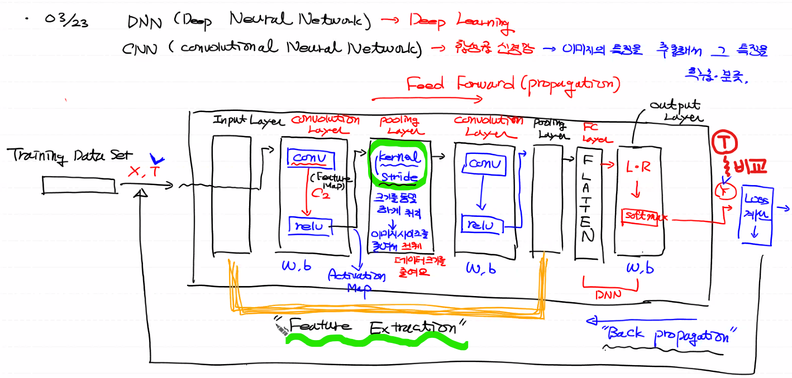
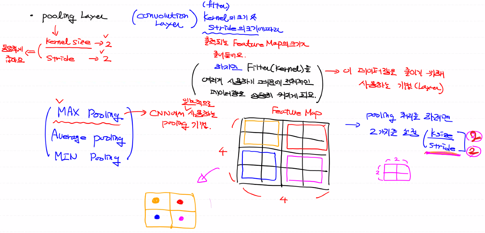
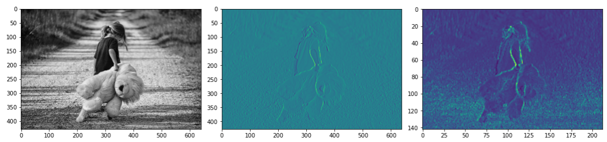
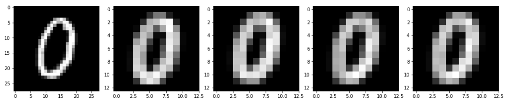
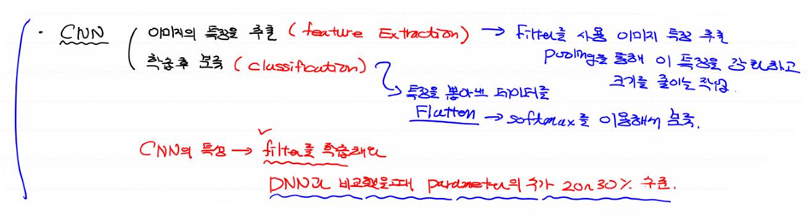

## 지난 시간 복습

#### :stop_sign: `Feature Map == Activation Map`

#### :writing_hand: `Pooling Layer` ==> `Kernal & Stride` 크기를 동일하게 처리




## Pooling Layer detail

- `kernal` size와 `stride` size를 동일하게 잡는다.
- Kernal & Stride의 크기에 따라 출력되는 Feature Map의 크기가 줄어든다.
- But :arrow_right: Filter(Kernal)를 여러개 사용하기 때문에 전체적인 데이터는 커질 수밖에 없다.
- :point_right: 이 데이터 량을 줄이기 위해 사용하는 기법이 **`Pooling`**


## CNN Pooling 기법

1. MAX Pooling
2. Average Pooling
3. MIN Pooling




## CNN Pooling 적용 코드 구현 (sample_img)

```python
import numpy as np
import tensorflow as tf
import matplotlib.image as img
import matplotlib.pyplot as plt

fig = plt.figure(figsize=(15,10))

fig_1 = fig.add_subplot(1,3,1)
fig_2 = fig.add_subplot(1,3,2)
fig_3 = fig.add_subplot(1,3,3)

image = img.imread('../image/girl-teddy.jpg')
print(image.shape) # ==> (429, 640, 3)

fig_1.imshow(image)

#############################################################

# 원본 이미지를 convolution 처리 (4차원 data 필요)
# (이미지 개수, height, width, channel)
input_img = image.reshape((1,) + image.shape)[:,:,:,0:1]
input_img = input_img.astype(np.float32)
print(input_img.shape) # ==> (1, 429, 640, 1)

# Filter (height, width, channel, filter개수)
# (3, 3, 1, 1)
weight = np.array([[[[-1]],[[0]],[[1]]],
                   [[[-1]],[[0]],[[1]]],
                   [[[-1]],[[0]],[[1]]]], dtype=np.float32)
print(weight.shape) # ==> (3, 3, 1, 1)

# stride = 1
# padding = VALID

sess = tf.Session()
conv2d = tf.nn.conv2d(input_img,
                      weight,
                      strides=[1,1,1,1],
                      padding='VALID')

conv2d_result = sess.run(conv2d)
print(conv2d_result.shape) # ==> (1, 427, 638, 1)

fig_2.imshow(conv2d_result[0,:,:,:])

#############################################################

# MAX Pooling
# ksize = 3
# stride = 3

max_pooling = tf.nn.max_pool(conv2d_result,
                             ksize=[1,3,3,1],
                             strides=[1,3,3,1],
                             padding='VALID')

pooling_result = sess.run(max_pooling)
print(pooling_result.shape) # ==> (1, 142, 212, 1)

fig_3.imshow(pooling_result[0,:,:,:])

plt.tight_layout()
plt.show()
```




## CNN Pooling Layer - 기본 MNIST 예제

```python
import numpy as np
import pandas as pd
import tensorflow as tf
import matplotlib.pyplot as plt
import matplotlib.image as img

fig = plt.figure(figsize=(15,10))
fig_list = [] # <<== 이 안에 각각의 subplot을 저장

for i in range(5):
    fig_list.append(fig.add_subplot(1,5,i+1))
    
# Raw Data
df = pd.read_csv('../kaggle_data/digit/train.csv')
img_data = df.drop('label', axis=1, inplace=False).values
print(img_data.shape) # ==> (42000, 784) 

# 샘플용 이미지 하나 선택
sample_img = img_data[5:6].reshape(28,28)
fig_list[0].imshow(sample_img, cmap='gray')

# Convolution
# 이미지 4차원 바꾸기
# 입력이미지 : (1, 28, 28, 1)
conv_img = sample_img.reshape((1,) + sample_img.shape + (1,))
conv_img = conv_img.astype(np.float32)
print(conv_img.shape) # ==> (1, 28, 28, 1)

# Filter(Kernal) 4개
# (height, width, channel, filter 개수)
# shape == (3,3,1,4)
weight = np.random.rand(3,3,1,4)
print(weight.shape) # ==> (3, 3, 1, 4)

# stride = 1
# padding = VALID

# conv
sess = tf.Session()
conv2d = tf.nn.conv2d(conv_img,
                      weight,
                      strides=[1,1,1,1],
                      padding='VALID')
conv_result = sess.run(conv2d)
print(conv_result.shape) # (1, 26, 26, 4)

# Feature Map ==> Activation Map 생성
# ReLU (Rectified Linear Unit)
relu_ = tf.nn.relu(conv_result)
relu_result = sess.run(relu_)


# Pooling (MAX Pooling)
# ksize : 2
# stride : 2
# padding :'VALID'


pooling = tf.nn.max_pool(relu_result,
                         ksize=[1,2,2,1],
                         strides=[1,2,2,1],
                         padding='VALID')
pooling_result = sess.run(pooling)
print(pooling_result.shape) # (1, 13, 13, 4)


# 내 방식으로 subplot에 pooling 처리된 이미지 집어넣기
for i in range(pooling_result.shape[3]):
    fig_list[i+1].imshow(pooling_result[0,:,:,i:i+1], cmap='gray')
    
# Teacher 방식
# axis 바꾸기 
print(pooling_result.shape) # (1, 13, 13, 4)
# ==> (4, 13, 13, 1) 이렇게 바꿀거에요

# np.swapaxes(바꿀 array, 바꿀 index, 바꿀 index)
i = np.swapaxes(pooling_result, 0, 3)
print(i.shape) # ==> (4, 13, 13, 1)

# 다차원에 대한 enumerate는 ==> (4, 13, 13, 1) 맨 앞에 있는 4를  index(0,1,2,3)로 받고, 뒤 3차원(13,13,1)을 data로 받는다.
for filter_idx, t_img in enumerate(i):
    fig_list[filter_idx + 1].imshow(t_img, cmap='gray')

plt.tight_layout()
plt.show()
```




## CNN 정리

- 이미지의 특징 추출 (Feature Extract) : Filter를 사용하여 이미지 특징 추출 & pooling을 통해 특징 강화, size 줄이기
- 학습 후 분류(classification) : 특징 뽑아낸 데이터를 Flatten ==> softmax를 이용해서 분류


#### `CNN의 특성`

> - 특징을 잘 뽑아내는 filter를 찾는 것이 목적이기 때문에
> - Filter가 학습의 대상
> - 같은 Layer를 가지는 DNN과 비교했을 때, 계산해야 하는 Parameter의 수가 20~30% 정도
> - ==> 즉, 계산해야 하는 수가 적기 때문에 똑같은 결과를 내는 것에 비해서 학습 처리 시간을 더 절약하는 측면에서 우수하다.



