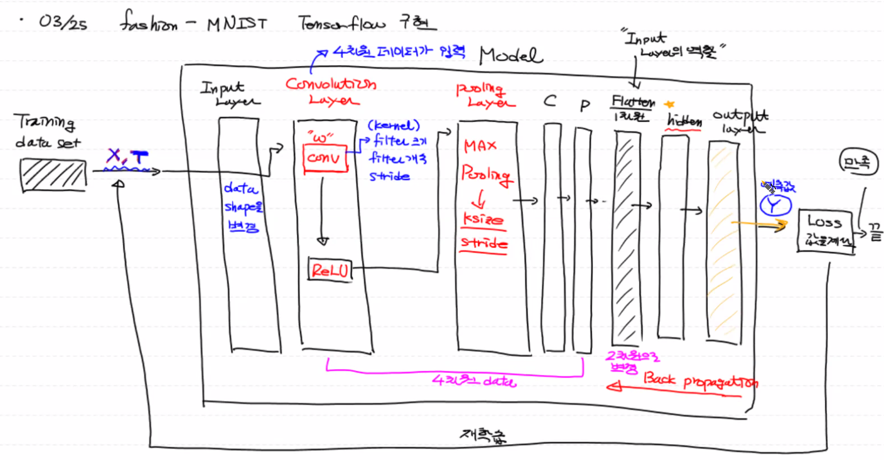
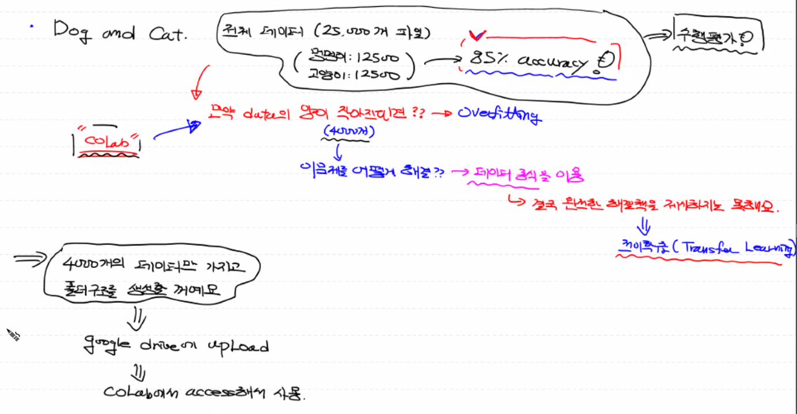
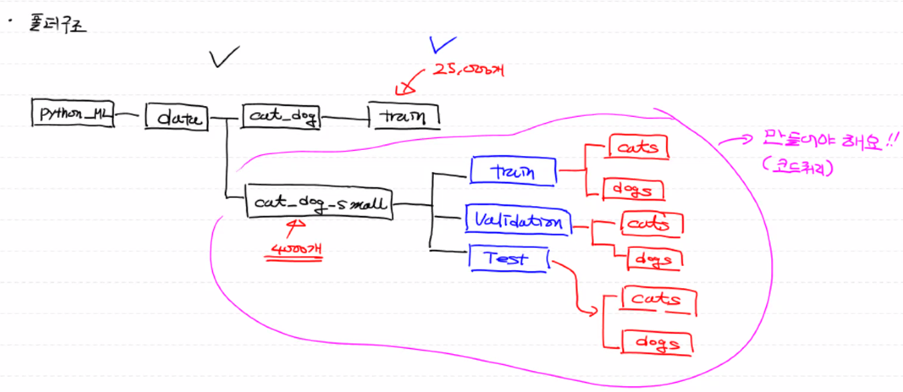
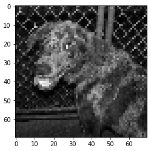

# Tensor ver. 1.x CNN 리뷰




## Fashion MNIST CNN TF2.x

```python
#TF 2.x CNN

import numpy as np
import pandas as pd
import tensorflow as tf
from sklearn.preprocessing import MinMaxScaler
from sklearn.metrics import classification_report
from sklearn.model_selection import train_test_split

from tensorflow.keras.models import Sequential
from tensorflow.keras.layers import Flatten, Dense, Conv2D, MaxPooling2D, Dropout
from tensorflow.keras.optimizers import Adam


# Train Data
train_data = pd.read_csv('/content/drive/MyDrive/Colab Notebooks/kaggle_data/fashion/fashion-mnist_train.csv')

# Test Data
test_data = pd.read_csv('/content/drive/MyDrive/Colab Notebooks/kaggle_data/fashion/fashion-mnist_test.csv')

# Data_split
x_data_train, x_data_val, t_data_train, t_data_val =\
train_test_split(train_data.drop('label', axis=1, inplace=False), train_data['label'], 
                 test_size=0.3, random_state=0)

# x_data
test_x_data = test_data.drop('label', axis=1, inplace=False).values

# 정규화
scaler = MinMaxScaler()
scaler.fit(x_data_train)
norm_train_x_data = scaler.transform(x_data_train)
norm_val_x_data = scaler.transform(x_data_val)
norm_test_x_data = scaler.transform(test_x_data)

# Data 전처리 끝

###########################################################################################

# TF 2.x 구현

model = Sequential()

# conv 전 Input layer는 Data의 shape만 바꿔서 pass 역할만 하기 때문에 따로 표현 안하고,
# conv layer에 함께 표현

# Conv2D (filter의 개수, filter의 크기, activation)
model.add(Conv2D(filters=32,
                 kernel_size=(3,3),
                 activation='relu',
                 input_shape=(28,28,1),
                 padding='same'))

# Pooling ()
model.add(MaxPooling2D(pool_size=(2,2)))

# 2번째 Conv2D
model.add(Conv2D(filters=64,
                 kernel_size=(3,3),
                 activation='relu',
                 padding='same'))

# Pooling ()
model.add(MaxPooling2D(pool_size=(2,2)))

# 3번째 Conv2D
model.add(Conv2D(filters=64,
                 kernel_size=(3,3),
                 activation='relu',
                 padding='same'))

# DNN Input
model.add(Flatten())

# hiden
model.add(Dense(units=256,
                activation='relu'))

# Dropout
model.add(Dropout(rate=0.5))

# Output
model.add(Dense(units=10,
                activation='softmax'))

# compile
model.compile(optimizer=Adam(learning_rate=1e-3),
              loss='sparse_categorical_crossentropy',
              metrics='sparse_categorical_accuracy')


# 내가 만든 model 어떻게 layer 쌓았는지 알아보기
print(model.summary())
'''
Model: "sequential"
_________________________________________________________________
Layer (type)                 Output Shape              Param #   
=================================================================
conv2d (Conv2D)              (None, 28, 28, 32)        320       
_________________________________________________________________
max_pooling2d (MaxPooling2D) (None, 14, 14, 32)        0         
_________________________________________________________________
conv2d_1 (Conv2D)            (None, 14, 14, 64)        18496     
_________________________________________________________________
max_pooling2d_1 (MaxPooling2 (None, 7, 7, 64)          0         
_________________________________________________________________
conv2d_2 (Conv2D)            (None, 7, 7, 64)          36928     
_________________________________________________________________
flatten (Flatten)            (None, 3136)              0         
_________________________________________________________________
dense (Dense)                (None, 256)               803072    
_________________________________________________________________
dropout (Dropout)            (None, 256)               0         
_________________________________________________________________
dense_1 (Dense)              (None, 10)                2570      
=================================================================
Total params: 861,386
Trainable params: 861,386
Non-trainable params: 0
_________________________________________________________________
None
'''

###########################################################################################

# model history 
history = model.fit(norm_train_x_data.reshape(-1,28,28,1),
                    t_data_train,
                    epochs=200,
                    verbose=1,
                    batch_size=100,
                    validation_split=0.3)

# 평가
model.evaluate(norm_val_x_data.reshape(-1,28,28,1),
               t_data_val)
'''
563/563 [==============================] - 1s 2ms/step - loss: 1.2205 - sparse_categorical_accuracy: 0.9061
[1.2204573154449463, 0.9061111211776733]
'''
```


## Transfer Learning




## 폴더 구조




## Cat and Dog CNN

#### `<이미지 Data 처리>`

```python
import numpy as np
import pandas as pd
import os
import cv2
from sklearn import utils

# 파일 경로
train_dir = '../data/cat_dog/train'
test_dir = '../kaggle_data/cat_vs_dog/test1'

##########################################################################################

# img = 파일 이름
def labeling(img):
    class_name = img.split('.')[0]
    if class_name == 'cat': return 0
    elif class_name == 'dog': return 1

##########################################################################################
    
# 이미지 파일을 pixel data로 바꾸기
def create_train_data():
    
    # label data와 pixel data 담을 변수
    t_data = []
    x_data = []
    
    # os.listdir() ==> 인자로 준 폴더 경로 안에 있는 모든 파일들 이름 리스트
    for img in os.listdir(train_dir):
        # 위에서 만든 labeling()을 통해 이름이 cat이면 0 / dog면 1 반환
        label_data = labeling(img)
        
        # 이미지 파일 경로 설정
        path = os.path.join(train_dir, img)
        
        # 이미지 파일 nd.array로 불러오기 (cv2.imread())
        # 형태만 필요해서 흑백으로 불러오기 (cv2.IMREAD_GRAYSCALE)
        # 이미지 pixel size 조정하기
        img_data = cv2.resize(cv2.imread(path, cv2.IMREAD_GRAYSCALE), (70,70))
        
        # 리스트 변수에 담아주기
        t_data.append(label_data)
        x_data.append(img_data.ravel()) # ==> 이미지 shape이 (70,70) ==> 2차원 
        								# ==> 이게 그대로 들어가면 차원 하나 더 있어서 결국 3차원... 그래서 1차원으로 바꿔주기(ravel())
    
    # labeling Data ==> dataframe으로 만들기
    t_df = pd.DataFrame({
        'label': t_data
    })
    
    # 이미지 픽셀 data ==> dataframe으로 만들기
    x_df = pd.DataFrame(x_data)
    
    # 2개 dataframe 합치기 (행 개수가 같아야 한다?)
    df = pd.merge(t_df, x_df, left_index=True, right_index=True)
    
    # utils.shuffle() ==> pandas dataframe 행을 shuffle 한다.
    shuffled_df = utils.shuffle(df)
	
    # DataFrame을 csv 파일로 저장하기
    shuffled_df.to_csv('../kaggle_data/cat_vs_dog/shuffle_train.csv', index=False)

##########################################################################################
    
# Test Data (label 없는) csv 파일로 바꾸기

test_data = []
for img_num in range(len(os.listdir(test_dir))):
    path = '../kaggle_data/cat_vs_dog/test1/{}.jpg'.format(img_num+1)
    img_data = cv2.resize(cv2.imread(path, cv2.IMREAD_GRAYSCALE), (70,70))
    test_data.append(img_data.ravel())
    
test_df = pd.DataFrame(data)

test_df.to_csv('../kaggle_data/cat_vs_dog/test.csv', index=False)

##########################################################################################
```


#### `Data 전처리`

```python
import numpy as np
import pandas as pd
import tensorflow as tf
import matplotlib.pyplot as plt

from sklearn.preprocessing import MinMaxScaler
from sklearn.model_selection import train_test_split

df = pd.read_csv('/content/drive/MyDrive/Colab Notebooks/kaggle_data/cat_and_dog/shuffle_train_70pixel.csv')
print(df.shape) #==> (25000, 4901)

label_data = df['label'].values
img_data = df.drop('label', axis=1, inplace=False).values

# 아무 그림 한 장 가져와서 보기
plt.imshow(img_data[6:7].reshape(70,70), cmap='gray')
plt.show()

# Data Split
train_x_data, val_x_data , train_t_data, val_t_data = \
train_test_split(img_data, label_data, test_size=0.3, random_state=0)

# 정규화
scaler = MinMaxScaler()
scaler.fit(train_x_data)
norm_train_x_data = scaler.transform(train_x_data)
norm_val_x_data = scaler.transform(val_x_data)

# Data 전처리 끝
```



#### `Tensor Keras CNN`

```python
from tensorflow.keras.models import Sequential
from tensorflow.keras.layers import Flatten, Dense, Conv2D, MaxPooling2D, Dropout
from tensorflow.keras.optimizers import Adam

# Tensor Layer

model = Sequential()

# Conv 1st layer
model.add(Conv2D(filters=64,
                 kernel_size=(3,3),
                 activation='relu',
                 padding='same',
                 input_shape=(70,70,1)))
# Pooling Layer
model.add(MaxPooling2D(pool_size=(2,2)))

# Conv 2nd layer
model.add(Conv2D(filters=64,
                 kernel_size=(3,3),
                 activation='relu',
                 padding='same'))
# Pooling Layer
model.add(MaxPooling2D(pool_size=(2,2)))

# Conv 3rd layer
model.add(Conv2D(filters=64,
                 kernel_size=(3,3),
                 activation='relu',
                 padding='same'))
# Pooling Layer
model.add(MaxPooling2D(pool_size=(2,2)))

########################################

# FC Layer
# input
model.add(Flatten())

# Dropout
model.add(Dropout(rate=0.5))

# hidden
model.add(Dense(units=128,
                activation='relu'))
# output
model.add(Dense(units=1,
                activation='sigmoid'))

print(model.summary())
'''
Model: "sequential_1"
_________________________________________________________________
Layer (type)                 Output Shape              Param #   
=================================================================
conv2d_3 (Conv2D)            (None, 70, 70, 64)        640       
_________________________________________________________________
max_pooling2d_3 (MaxPooling2 (None, 35, 35, 64)        0         
_________________________________________________________________
conv2d_4 (Conv2D)            (None, 35, 35, 64)        36928     
_________________________________________________________________
max_pooling2d_4 (MaxPooling2 (None, 17, 17, 64)        0         
_________________________________________________________________
conv2d_5 (Conv2D)            (None, 17, 17, 64)        36928     
_________________________________________________________________
max_pooling2d_5 (MaxPooling2 (None, 8, 8, 64)          0         
_________________________________________________________________
flatten_1 (Flatten)          (None, 4096)              0         
_________________________________________________________________
dropout_1 (Dropout)          (None, 4096)              0         
_________________________________________________________________
dense_2 (Dense)              (None, 128)               524416    
_________________________________________________________________
dense_3 (Dense)              (None, 1)                 129       
=================================================================
Total params: 599,041
Trainable params: 599,041
Non-trainable params: 0
_________________________________________________________________
None
'''
```

```python
# compile
model.compile(optimizer=Adam(learning_rate=1e-3),
              loss='binary_crossentropy',
              metrics='accuracy')

# fit
history = model.fit(norm_train_x_data.reshape(-1,70,70,1),
                    train_t_data,
                    batch_size=512,
                    epochs=100,
                    verbose=1,
                    validation_split=0.3)

# val_data 평가
print(model.evaluate(norm_val_x_data.reshape(-1,70,70,1), val_t_data))
'''
235/235 [==============================] - 1s 5ms/step - loss: 0.5396 - accuracy: 0.8567
[0.5396305322647095, 0.8566666841506958]
'''
```

```python
# Test 이미지 예측하기
test_df = pd.read_csv('/content/drive/MyDrive/Colab Notebooks/kaggle_data/cat_and_dog/test.csv')
# print(test_df.shape) # ==> (12500, 4900)

# 독립변수 정규화 필요 없이 raw data 그대로 넣어야 한다.
prediction = model.predict(test_df.values.reshape(-1,70,70,1))
print(prediction)
'''
[[1.]
 [1.]
 [1.]
 ...
 [1.]
 [1.]
 [0.]]
'''

# 제출용 csv 만들기
id = []
for i in range(len(prediction)):
    id.append(i+1)

test_label = pd.DataFrame({
    'id': id,
    'label': prediction.ravel().astype(np.int32)
})

test_label.to_csv('/content/drive/MyDrive/Colab Notebooks/kaggle_data/cat_and_dog/test_result.csv', index=False)
```

