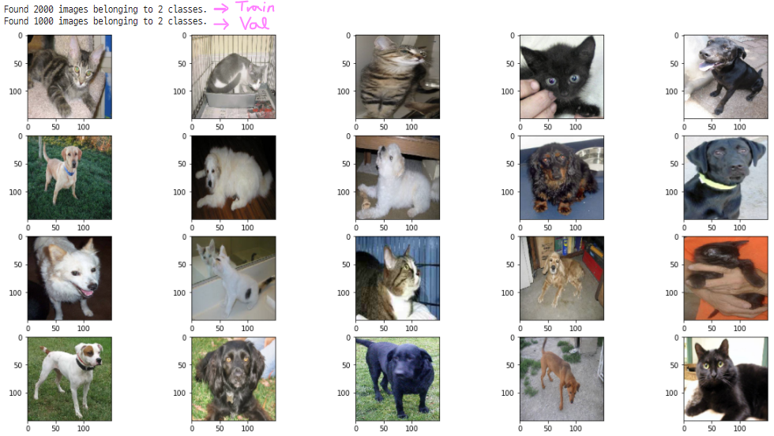
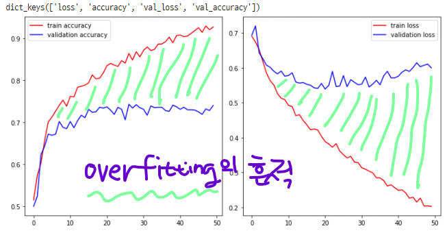
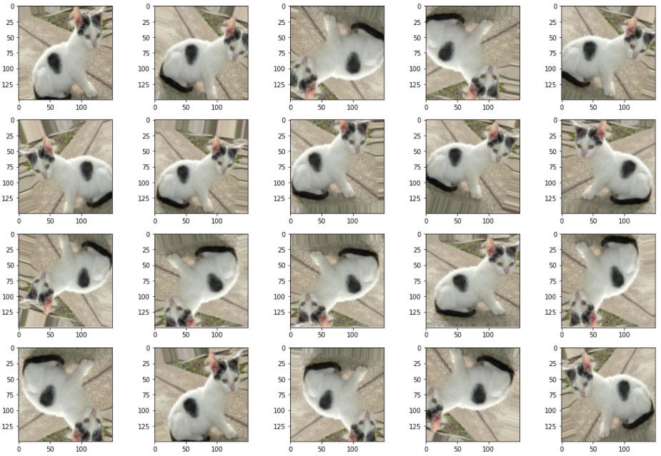
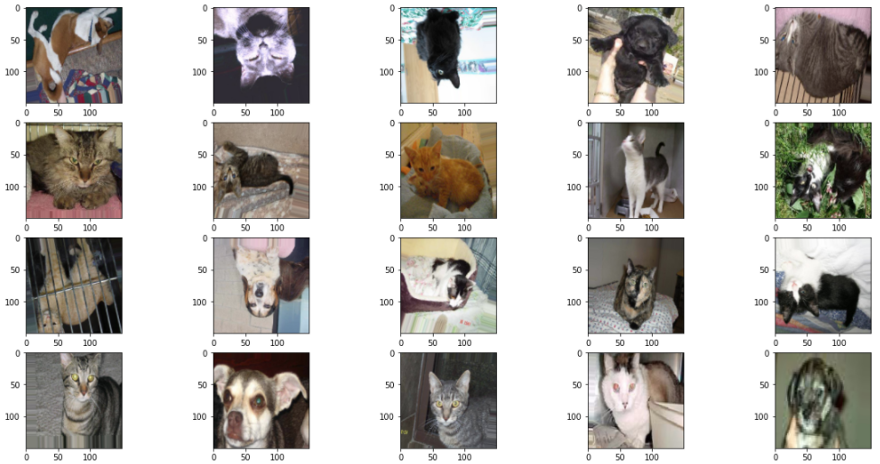
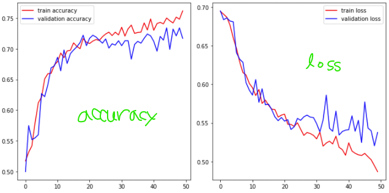

## 딥러닝 데이터 양 문제

> - Deep Learing은 `데이터`가 많아야 학습이 잘되고 accuracy 높게 나온다.
> - 현실은 적은 양의 데이터로 학습 및 예측해야 되는 경우가 대부분
> - 만약 데이터 정제가 잘 되어 있다면 (비교적 간단한 학습인 경우) 적은 양의 데이터로도 학습 가능 (1,000 ~ 10,000개)
> - 일반적으로 데이터 양이 작다 == `10만개 이하`


## ImageData Generator

- 문제 : **`I/O Latency`** (== 입출력 지연) ==> 한 파일을 Decoding해서 pixel data를 가지고 학습하고 그 다음 파일로 넘어가서... 하드 디스크에서 그때 그때마다 파일에서 data 가져와서 연산...
- 그러다 보니 너무 느리다


## TF Record

- tensorflow의 기본 자료구조
- 장점 : 빠르고 쉽게 이미지 data 전처리 가능하다
- 단점 : 코드가 어렵다


---


## Cat Dog CNN 구현 with Teacher

> - Google Colab 사용


### `<ImageGenerator>` 

```python
import os
from tensorflow.keras.preprocessing.image import ImageDataGenerator  # ==> 이미지 파일을 픽셀 data로 쉽게 가져올 수 있다.
import matplotlib.pyplot as plt

# 이미지 파일 경로
train_dir = '/content/drive/MyDrive/Colab Notebooks/CAT_DOG/cat_dog_small/train'
val_dir ='/content/drive/MyDrive/Colab Notebooks/CAT_DOG/cat_dog_small/validation'

# ImageDataGenerator 생성
# train data 생성용 ImageDataGenerator
# validation data 생성용 ImageDataGenerator
# 각각 만들기

# ImageDataGenerator 만들 때, 정규화 기능도 포함되게끔!
# ImageDataGenerator 객체를 만든 것
train_data_generator = ImageDataGenerator(rescale=1/255)
val_data_generator = ImageDataGenerator(rescale=1/255)


# 위에서 만든 ImageDataGenerator 객체를 활용하려 이미지 pixel data 가져오는 객체 생성
# .flow_from_dirctory() ==> directory 로부터 data 가져오기
# train 용 generator
train_generator= train_data_generator.flow_from_directory(
    
	train_dir,  # directory 경로 값 ==> `target_directory`
    
    classes=['cats', 'dogs'],
    # 기본적으로 classes 설정하지 않으면 directory 안에 있는 파일 이름 오름차순으로 자동 label 부여!
    # ['cats', 'dogs']==> cats라는 폴더 안에 있는 파일들의 label을 0으로 잡아라
    # ['cats', 'dogs']==> dogs라는 폴더 안에 있는 파일들의 label을 1로 잡아라
    
    target_size=(150,150),
    # ==> 이미지 resize
    # ==> 일반적으로 정사각형 형태 (resize 크기는 CNN 구조에 따라 달라짐)
    
    batch_size=20,
    # ==> 한 번에 20개 image 파일을 가져와서 pixel 데이터로 변환
    # ==> 그런데! label에 상관없이 추출한다.
    # ==> 즉 'train_dir' 이 경로 안에 'cats' , 'dogs' 파일이 2개 있는데, 순차적으로 cats부터 20개씩 사진 가져오는 게 아니라!
    # ==> 자동 shuffle 해서 무작위로 20개 data 가져온다.
    # 한 번 img data 가져오는 개수가 20개니깐 100번 가져오면 2000개 다 가져올 수 있음
    
    class_mode='binary'
    # ==> 이진분류 : class_mode='binary'
    # ==> 다중분류 : class_mode='categorical' (label data가 one-hot 처리 OK)
    # ==> 다중분류 : class_mode='sparse_categorical' (label data가 one-hot 처리 NO)
)

# validation용 generator
val_generator = val_data_generator.flow_from_directory(
    val_dir,
    classes=['cats', 'dogs'],
    target_size=(150,150),
    batch_size=20,
    class_mode='binary'
)
```


#### `generator를 이용한 이미지 data get & 주의사항`

```python
# generator 이용시 주의 사항! 
# ==> generator는 data를 끊임없이 생성한다. 
# ==> 무한 루프 돌 수 있으니깐 조심!

# generator 객체 안에는 독립변수(image feature)와 종속변수(label)가 들어가 있다.
'''
for x_data, t_data in train_generator:
    print(x_data.shape)  # (20,150,150,3)
    print(t_data.shape)  # (20,)
    break
'''

# 그림 이미지
fig = plt.figure(figsize=(20,10))
fig_array = []

for i in range(20):
    fig_array.append(fig.add_subplot(4,5,i+1))
    
# train_generator 로 가져온 이미지 표현하기
for x_data, t_data in train_generator:
    # x_data ==> (20,150,150,3)
    for idx, img_data in enumerate(x_data):
        # idx: 0~19
        # img_data : (150,150,3)
        fig_array[idx].imshow(img_data)
    break # ==> break 안해 주면 무한 루프!
    
plt.tight_layout
plt.show()
```



### `<CNN 구성 및 학습>`

```python
# CNN 구성하고 학습 시키는 단계
import numpy as np
import tensorflow as tf
from tensorflow.keras.models import Sequential
from tensorflow.keras.layers import Flatten, Dense, Dropout, Conv2D, MaxPooling2D
from tensorflow.keras.optimizers import Adam

model = Sequential()

model.add(Conv2D(filters=32,
                 kernel_size=(3,3),
                 activation='relu',
                 input_shape=(150,150,3)))
model.add(MaxPooling2D(pool_size=(2,2)))

model.add(Conv2D(filters=64,
                 kernel_size=(3,3),
                 activation='relu'))
model.add(MaxPooling2D(pool_size=(2,2)))

model.add(Conv2D(filters=128,
                 kernel_size=(3,3),
                 activation='relu'))
model.add(MaxPooling2D(pool_size=(2,2)))

model.add(Flatten())

model.add(Dropout(rate=0.5))

model.add(Dense(units=1,
                activation='sigmoid'))
print(model.summary())
'''
Model: "sequential_6"
_________________________________________________________________
Layer (type)                 Output Shape              Param #   
=================================================================
conv2d_18 (Conv2D)           (None, 148, 148, 32)      896       
_________________________________________________________________
max_pooling2d_18 (MaxPooling (None, 74, 74, 32)        0         
_________________________________________________________________
conv2d_19 (Conv2D)           (None, 72, 72, 64)        18496     
_________________________________________________________________
max_pooling2d_19 (MaxPooling (None, 36, 36, 64)        0         
_________________________________________________________________
conv2d_20 (Conv2D)           (None, 34, 34, 128)       73856     
_________________________________________________________________
max_pooling2d_20 (MaxPooling (None, 17, 17, 128)       0         
_________________________________________________________________
flatten_5 (Flatten)          (None, 36992)             0         
_________________________________________________________________
dropout_4 (Dropout)          (None, 36992)             0         
_________________________________________________________________
dense_7 (Dense)              (None, 1)                 36993     
=================================================================
Total params: 130,241
Trainable params: 130,241
Non-trainable params: 0
_________________________________________________________________
None
'''

model.compile(optimizer=Adam(learning_rate=1e-4),
              loss='binary_crossentropy',
              metrics=['accuracy'])

# 이번 fit에서 달라진 점.

# 1.
# 예전에는 train data에서 validation_split으로 data split 했는데
# 이번에는 val_data가 따로 있기 때문에 지정
# validation_data=val_generator
# validation_steps=50  ==> validation data 총 1000개 있는데, batch_size를 20 줬기 때문에 50 반복해야  총 1000개

# 2.
# train_generator 이 객체 안에 x_data와 t_data 다 들어있어서 두개 나누거나 그러지 않고 그냥 바로 사용
# 그래서 train_generator 이거 하나만 입력 돼 있는거임

#3. steps_per_epoch=100 : 1 epoch 안에서 몇번을 반복해서 학습할건지...
# ==> 이 설정 한 이유는 generator가 1회 20개 data만 가져와서 처리!
# ==> 우리가 가지고 있는 data는 총 2000개니깐 2000개 다 하려면 100회(2000개) 반복 필요!
# ==> 그래서 1epoch 당 100번 반복한다는 의미!
history = model.fit(train_generator,
                    steps_per_epoch=100,
                    epochs=50,
                    verbose=1,
                    validation_data=val_generator,
                    validation_steps=50
                    )
# 학습 후 맨 마지막 결과
'''
Epoch 50/50
100/100 [=======================] - 20s 199ms/step - loss: 0.4929 - accuracy: 0.7521 - val_loss: 0.5377 - val_accuracy: 0.7170
'''
```


#### `학습 종료 후 model 저장하는 방법`

```python
model.save('./cat_dog_small_cnn_tf2.4.h5')
# ==> 학습한 후 우리 모델의 weight를 저장한다는 의미
```


#### `hisotry 객체를 통해 overfitting 확인`

```python
print(history.history.keys())
# ==> dict_keys(['loss', 'accuracy', 'val_loss', 'val_accuracy'])

train_acc = history.history['accuracy']
val_acc = history.history['val_accuracy']

train_loss = history.history['loss']
val_loss = history.history['val_loss']

result_fig = plt.figure(figsize=(10,5))
fig_1 = result_fig.add_subplot(1,2,1)
fig_2 = result_fig.add_subplot(1,2,2)

fig_1.plot(train_acc, c='r', label='train accuracy')
fig_1.plot(val_acc, c='b', label='validation accuracy')

fig_2.plot(train_loss, c='r', label='train loss')
fig_2.plot(val_loss, c='b', label='validation loss')

fig_1.legend()
fig_2.legend()
plt.tight_layout()
plt.show()
```




## Data 증식 (Data `Augmentation`) 

> - Computer Vision ==> 이미지 다룰 때 일반적으로 사용하는 과대적합 감소방법!
> - 기존 Data에 약간의 변형을 줘서 데이터를 추가적으로 만들어내는 기법
> - **`ImageDataGenerator`** 가 Data 증식까지 처리 해준다.


### `Sample`

```python
# 1개의 이미지를 증식

from tensorflow.keras.preprocessing import  image
from tensorflow.keras.preprocessing.image import ImageDataGenerator
import matplotlib.pyplot as plt

# Augmentation 객체 생성
augumentation_gen = ImageDataGenerator(rotation_range=20, # 지정된 각도 범위 내에서 임의로 원본 이미지를 회전
                              		   width_shift_range=0.1,  # 좌,우
                                       height_shift_range=0.1, # 상,하
                                       zoom_range=0.1,  # ==> 확대(1+0.1) or 축소(1-0.1)
                                       horizontal_flip=True, # ==> 수평방향으로 이미지 반전
                                       vertical_flip=True) # ==> 수직방향으로 이미지 반전

# image 파일 불러오기
img = image.load_img('/content/drive/MyDrive/Colab Notebooks/CAT_DOG/cat_dog_small/train/cats/cat.3.jpg',
                     target_size=(150,150))

# image 객체를 nd.array로 변환
x = image.img_to_array(img)
print(x.shape) # ==> (150, 150, 3)

# image array reshape
x = x.reshape((1,) + x.shape)
print(x.shape) # ==> (1, 150, 150, 3)

fig = plt.figure(figsize=(20,15))
fig_arr = list()

for i in range(20):
    fig_arr.append(fig.add_subplot(4,5,i+1))

# 20회 증식해서 image 표현
idx=0
for batch in augumentation_gen.flow(x, batch_size=1): # batch_size : x에서 이미지 몇개씩 가져올건지
    fig_arr[idx].imshow(image.array_to_img(batch[0]))
    idx +=1
    if idx % 20 == 0 :
        break

fig.tight_layout()
plt.show()
```



---


## Data 증식으로 Cat and Dog CNN 구현

```python
import os
from tensorflow.keras.preprocessing.image import ImageDataGenerator
import matplotlib.pyplot as plt

train_dir = '/content/drive/MyDrive/Colab Notebooks/CAT_DOG/cat_dog_small/train'
val_dir ='/content/drive/MyDrive/Colab Notebooks/CAT_DOG/cat_dog_small/validation'

# 이미지 증식 객체 만들기! (정규화 포함)
train_data_generator = ImageDataGenerator(rescale=1/255,
                                          rotation_range=20, 
                                          width_shift_range=0.1,
                                          height_shift_range=0.1,
                                          zoom_range=0.1,
                                          horizontal_flip=True,
                                          vertical_flip=True)

# validation용 이미지는 증식하면 안된다
val_data_generator = ImageDataGenerator(rescale=1/255) # ==> 총 1000개 들어 있음

# `증식 객체` 이용해서 이미지 가져오기
train_generator = train_data_generator.flow_from_directory(
    train_dir,
    classes=['cats', 'dogs'],
    target_size=(150,150),
    batch_size=20,
    class_mode='binary'
)

val_generator = val_data_generator.flow_from_directory(
    val_dir,
    classes=['cats', 'dogs'],
    target_size=(150,150),
    batch_size=20,
    class_mode='binary'
)

# 그림 이미지
fig = plt.figure(figsize=(20,10))
fig_array = []

for i in range(20):
    fig_array.append(fig.add_subplot(4,5,i+1))
    

for data_batch, label_batch in train_generator:
    for idx, img_data in enumerate(data_batch):
        fig_array[idx].imshow(img_data)
    break

plt.tight_layout
plt.show()
```




#### `CNN Layer`

```python
# CNN 구성하고 학습 시키는 단계
import numpy as np
import tensorflow as tf
from tensorflow.keras.models import Sequential
from tensorflow.keras.layers import Flatten, Dense, Dropout, Conv2D, MaxPooling2D
from tensorflow.keras.optimizers import Adam

model = Sequential()

model.add(Conv2D(filters=32,
                 kernel_size=(3,3),
                 activation='relu',
                 input_shape=(150,150,3)))
model.add(MaxPooling2D(pool_size=(2,2)))

model.add(Conv2D(filters=64,
                 kernel_size=(3,3),
                 activation='relu'))
model.add(MaxPooling2D(pool_size=(2,2)))

model.add(Conv2D(filters=128,
                 kernel_size=(3,3),
                 activation='relu'))
model.add(MaxPooling2D(pool_size=(2,2)))

# model.add(Conv2D(filters=128,
#                  kernel_size=(3,3),
#                  activation='relu'))
# model.add(MaxPooling2D(pool_size=(2,2)))

model.add(Flatten())

# model.add(Dense(units=512,
#                 activation='relu'))

model.add(Dropout(rate=0.5))

model.add(Dense(units=1,
                activation='sigmoid'))
print(model.summary())

model.compile(optimizer=Adam(learning_rate=1e-3),
              loss='binary_crossentropy',
              metrics=['accuracy'])

history = model.fit(train_generator,
                    steps_per_epoch=50,
                    epochs=50,
                    verbose=1,
                    validation_data=val_generator,
                    validation_steps=25
                    )
```


#### `Data 증식 후 overfitting 확인`

```python
print(history.history.keys())
# ==> dict_keys(['loss', 'accuracy', 'val_loss', 'val_accuracy'])

train_acc = history.history['accuracy']
val_acc = history.history['val_accuracy']

train_loss = history.history['loss']
val_loss = history.history['val_loss']

result_fig = plt.figure(figsize=(10,5))
fig_1 = result_fig.add_subplot(1,2,1)
fig_2 = result_fig.add_subplot(1,2,2)

fig_1.plot(train_acc, c='r', label='train accuracy')
fig_1.plot(val_acc, c='b', label='validation accuracy')

fig_2.plot(train_loss, c='r', label='train loss')
fig_2.plot(val_loss, c='b', label='validation loss')

fig_1.legend()
fig_2.legend()
plt.tight_layout()
plt.show()
```

