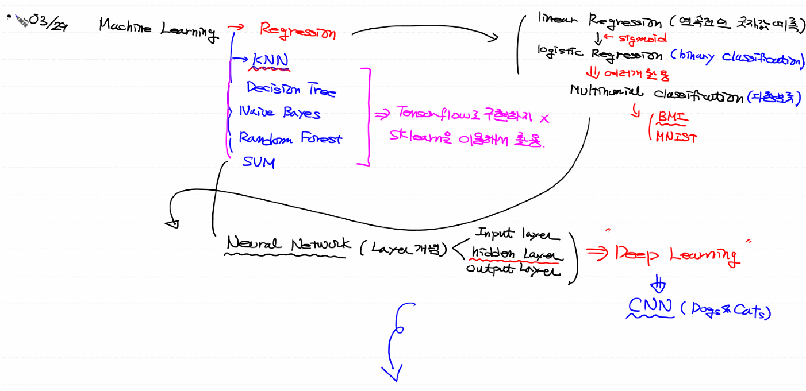
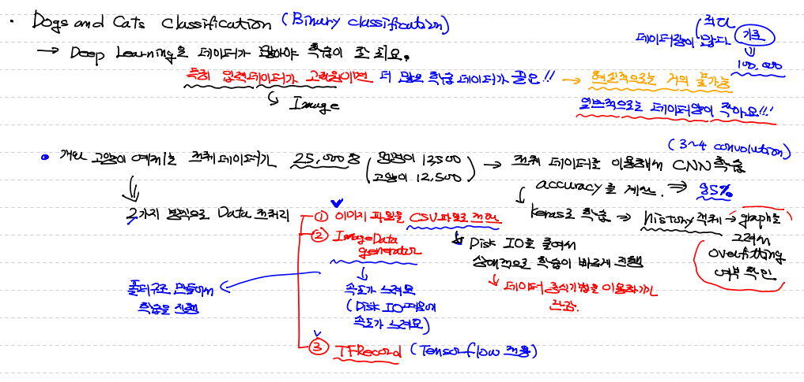
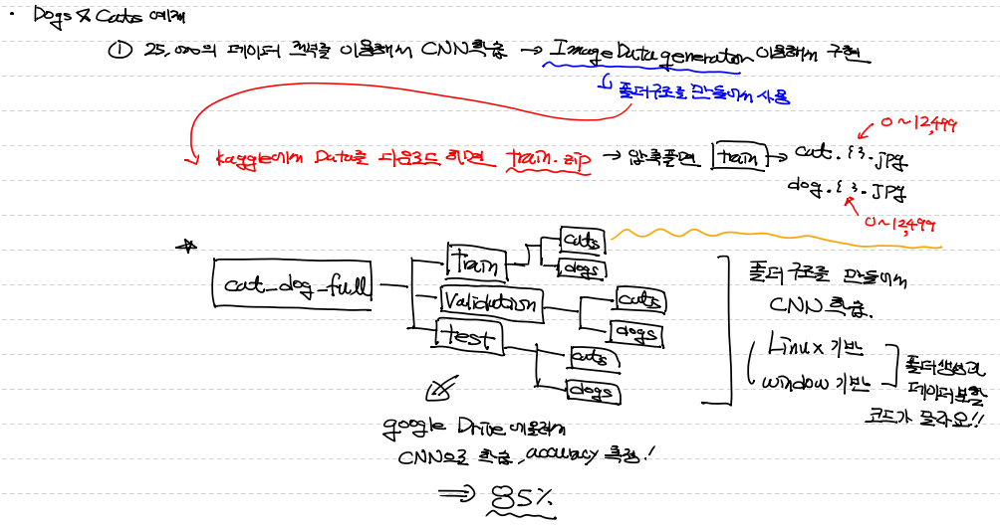
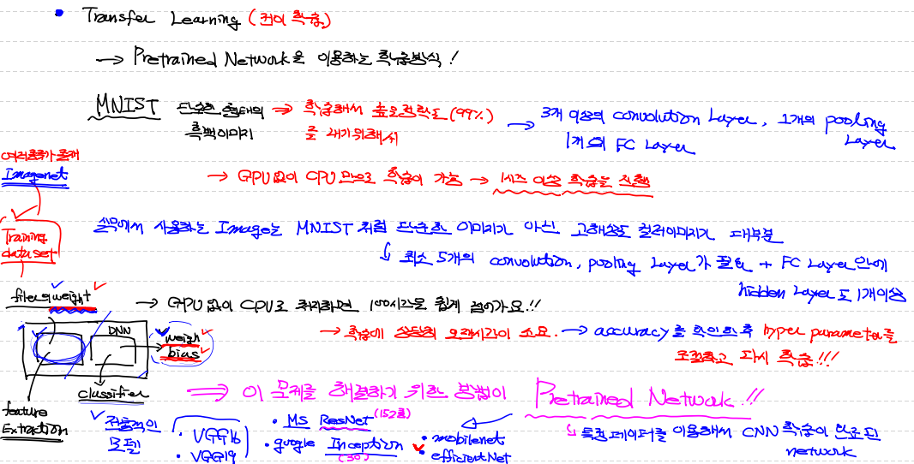

## 총 리뷰




## 다양한 이미지 데이터 처리 방법




## Cats and Dogs Full Data 분류 (ImageDataGenerator 사용할 수 있도록)



#### `파일 분류 code` 

```python
# Window 용

import os, shutil

original_dataset_dir = './data/cat_dog/train'

base_dir = 'data/cat_dog_full'
os.mkdir(base_dir)

train_dir = os.path.join(base_dir,'train').replace('\\','/')
os.mkdir(train_dir)
validation_dir = os.path.join(base_dir,'validation').replace('\\','/')
os.mkdir(validation_dir)
test_dir = os.path.join(base_dir,'test').replace('\\','/')
os.mkdir(test_dir)


train_cats_dir = os.path.join(train_dir,'cats').replace('\\','/')
os.mkdir(train_cats_dir)
train_dogs_dir = os.path.join(train_dir,'dogs').replace('\\','/')
os.mkdir(train_dogs_dir)

validation_cats_dir = os.path.join(validation_dir,'cats').replace('\\','/')
os.mkdir(validation_cats_dir)
validation_dogs_dir = os.path.join(validation_dir,'dogs').replace('\\','/')
os.mkdir(validation_dogs_dir)

test_cats_dir = os.path.join(test_dir,'cats').replace('\\','/')
os.mkdir(test_cats_dir)
test_dogs_dir = os.path.join(test_dir,'dogs').replace('\\','/')
os.mkdir(test_dogs_dir)

## file 복사 ##
## 고양이와 멍멍이가 각각 12,500개
## train : 7,000 
## validation : 3,000
## test : 2,500 

fnames = ['cat.{}.jpg'.format(i) for i in range(7000)]
for fname in fnames:
    src = os.path.join(original_dataset_dir,fname).replace('\\','/')
    dst = os.path.join(train_cats_dir, fname).replace('\\','/')
    shutil.copyfile(src,dst)

fnames = ['cat.{}.jpg'.format(i) for i in range(7000,10000)]
for fname in fnames:
    src = os.path.join(original_dataset_dir,fname).replace('\\','/')
    dst = os.path.join(validation_cats_dir, fname).replace('\\','/')
    shutil.copyfile(src,dst)

fnames = ['cat.{}.jpg'.format(i) for i in range(10000,12500)]
for fname in fnames:
    src = os.path.join(original_dataset_dir,fname).replace('\\','/')
    dst = os.path.join(test_cats_dir, fname).replace('\\','/')
    shutil.copyfile(src,dst)
    
fnames = ['dog.{}.jpg'.format(i) for i in range(7000)]
for fname in fnames:
    src = os.path.join(original_dataset_dir,fname).replace('\\','/')
    dst = os.path.join(train_dogs_dir, fname).replace('\\','/')
    shutil.copyfile(src,dst)

fnames = ['dog.{}.jpg'.format(i) for i in range(7000,10000)]
for fname in fnames:
    src = os.path.join(original_dataset_dir,fname).replace('\\','/')
    dst = os.path.join(validation_dogs_dir, fname).replace('\\','/')
    shutil.copyfile(src,dst)

fnames = ['dog.{}.jpg'.format(i) for i in range(10000,12500)]
for fname in fnames:
    src = os.path.join(original_dataset_dir,fname).replace('\\','/')
    dst = os.path.join(test_dogs_dir, fname).replace('\\','/')
    shutil.copyfile(src,dst)
```


## Transfer Learning (전이 학습)

- **`Pretrained Network`** 이용!
- 실무에서 사용하는 이미지는 `고차원의 이미지!` ==> CNN model 학습 시 최소 5개 이상 conv, pooling layer + FC Layer (hidden layer 1개 이상 포함)
- ==> 시간이 너무 오래 걸리는 문제... ==> 또한 오랜 시간 걸려서 첫 학습 후 다양한 hyper_parameter 조정으로 model 최적화 작업도 필요!
- ==> 사실상 이런 방식으로 최적화된 model을 구한다는 것은 `불가능`
- 그래서! **`Transfer Learning (전이 학습)`** 필요!
- 다양한 **`Pretrained Network`** 존재
  - VGG16
  - VGG19
  - ResNet (MS)
  - Inception (Google)
  - mmobilenet
  - EfficientNet
- 위와 같은 다양한 **`Pretrained Network`** 는 대표적으로 `Imagenet`이라는 training_data_set 활용해서 최적의 weight와 bias 구해놓음
- 우리는 이 중에서 DNN Layer의 weight와 bias를 사용하는 것이 아니라, conv layer에서 update 하는 최적의 `filter`를 사용할 예정!
- ==> 이런한 작업을 **`Feature Extraction`**




## `VGG16 사용`

```python
from tensorflow.keras.applications import VGG16

model_base = VGG16(weights='imagenet',
                   include_top=False,
                   input_shape=(150,150,3))
# weight ==> 지금 사용하려는 pretrained network에서 사용한 training data set을 명시
#		 ==> 다양한 data set으로 만들어서 data set 마다 특징이 있겠지? 
# include_top ==> VGG16에서 train한 classifier(분류기) 쓸지 안쓸지 (우리는 conv layer에서 filter만 필요해)
# input_shape ==> 내가 집어 넣으려는 image shape

model_base.summary()
'''
Model: "vgg16"
_________________________________________________________________
Layer (type)                 Output Shape              Param #   
=================================================================
input_4 (InputLayer)         [(None, 150, 150, 3)]     0         
_________________________________________________________________
block1_conv1 (Conv2D)        (None, 150, 150, 64)      1792      
_________________________________________________________________
block1_conv2 (Conv2D)        (None, 150, 150, 64)      36928     
_________________________________________________________________
block1_pool (MaxPooling2D)   (None, 75, 75, 64)        0         
_________________________________________________________________
block2_conv1 (Conv2D)        (None, 75, 75, 128)       73856     
_________________________________________________________________
block2_conv2 (Conv2D)        (None, 75, 75, 128)       147584    
_________________________________________________________________
block2_pool (MaxPooling2D)   (None, 37, 37, 128)       0         
_________________________________________________________________
block3_conv1 (Conv2D)        (None, 37, 37, 256)       295168    
_________________________________________________________________
block3_conv2 (Conv2D)        (None, 37, 37, 256)       590080    
_________________________________________________________________
block3_conv3 (Conv2D)        (None, 37, 37, 256)       590080    
_________________________________________________________________
block3_pool (MaxPooling2D)   (None, 18, 18, 256)       0         
_________________________________________________________________
block4_conv1 (Conv2D)        (None, 18, 18, 512)       1180160   
_________________________________________________________________
block4_conv2 (Conv2D)        (None, 18, 18, 512)       2359808   
_________________________________________________________________
block4_conv3 (Conv2D)        (None, 18, 18, 512)       2359808   
_________________________________________________________________
block4_pool (MaxPooling2D)   (None, 9, 9, 512)         0         
_________________________________________________________________
block5_conv1 (Conv2D)        (None, 9, 9, 512)         2359808   
_________________________________________________________________
block5_conv2 (Conv2D)        (None, 9, 9, 512)         2359808   
_________________________________________________________________
block5_conv3 (Conv2D)        (None, 9, 9, 512)         2359808   
_________________________________________________________________
block5_pool (MaxPooling2D)   (None, 4, 4, 512)         0         
=================================================================
Total params: 14,714,688
Trainable params: 14,714,688
Non-trainable params: 0
_________________________________________________________________
'''
```


#### `Feature Map 추출할 함수 만들기`

```python
# 개와 고양이 training data set에 대한 feature map을 추출

import os
import numpy as np
from tensorflow.keras.preprocessing.image import ImageDataGenerator

base_dir = '/content/drive/MyDrive/Colab Notebooks/CAT_DOG/cat_dog_small'
train_dir = os.path.join(base_dir, 'train')
val_dir = os.path.join(base_dir, 'validation')

# Image Generator 생성
datagen = ImageDataGenerator(rescale=1/255)

# generator로 이미지 파일 1번 추출 할 때, 개수
batch_size = 20

# Feature Map 추출 함수
def extract_feautre(file_dir, sample_count):
    
    # 이 함수의 결과 값 size를 미리 설정
    features = np.zeros(shape=(sample_count,4,4,512)) # ==> VGG16 통해서 맨 마지막에 나오는 shape (None, 4, 4, 512)
    labels = np.zeros(shape=(sample_count,))
    
    # generator 객체로 image data 불러오기
    generator = datagen.flow_from_directory(
    	file_dir,
        target_size=(150,150),
        batch_size=batch_size,
        class_mode='binary'
    )
    
    # generator 제어할 변수
    i = 0
    
    for x_data_batch, t_data_batch in generator:
        
        # generator로 가져오 이미지 pretrained network에 넣어서 activation map 값 가져오기
        feature_data = model_base.predict(x_data_batch) # ==> 예측 값이 t_data 결과가 아니라 activation(feature) map 값!!
        												# ==> (None, 4, 4, 512) 이런 shape가 나오겠지!
        
        # 우리가 결과로 가져올 이미지 데이터 설정해주기
        features[i*batch_size:(i+1)*batch_size] = x_data_batch # ==> (20, 4, 4, 512) ==> batch_size를 20 줬으니깐!
        labels[i*batch_size:(i+1)*batch_size] = t_data_batch
        
        i += 1
        
        # generator라는 특성 때문에 우리 파일 개수에 맞춰서 끊어줘야 해
        if i*batch_size >= sample_count :
            break
        
    return  features, labels
    
```


#### `Feature map data & label data 불러오기`

```python
# Feature map data & label data 추출
train_features, train_labels = extract_feautre(train_dir, 2000)
val_features, val_labels = extract_feautre(val_dir, 1000)
'''
Found 2000 images belonging to 2 classes.
Found 1000 images belonging to 2 classes.
'''

# 사용할 data flatten 수동 진행 (입력 data shape 맞추기)
train_features = np.reshape(train_features, (-1, 4*4*512))
val_features = np.reshape(val_features, (-1, 4*4*512))
```


#### `DNN (FC Layer) 구성 및 학습`

```python
from tensorflow.keras.models import Sequential
from tensorflow.keras.layers import Dense, Dropout
from tensorflow.keras.optimizers import Adam

model = Sequential()

# 위에서 따로 shape를 맞춰놨기 때문에 Flatten 필요 없음
# 따로 input_layer 만들지 않고 hidden layer에 포함
model.add(Dense(256, 
                activation='relu', 
                input_shape=(4*4*512,)))

# Dropout 추가
model.add(Dropout(0.5))

# output_layer
model.add(Dense(1, 
                activation='sigmoid'))

# compile
model.compile(optimizer=Adam(learning_rate=1e-4),
              loss='binary_crossentropy',
              metrics=['accuracy'])

# fit
history = model.fit(train_features,
                   val_features,
                   epochs=10,
                   batch_size=64,
                   validation_data=(val_features, val_labels))
'''
Epoch 1/10
32/32 [==============================] - 1s 11ms/step - loss: 0.6099 - accuracy: 0.6673 - val_loss: 0.3528 - val_accuracy: 0.8630
Epoch 2/10
32/32 [==============================] - 0s 6ms/step - loss: 0.3307 - accuracy: 0.8683 - val_loss: 0.2876 - val_accuracy: 0.8890
Epoch 3/10
32/32 [==============================] - 0s 6ms/step - loss: 0.2725 - accuracy: 0.9012 - val_loss: 0.2671 - val_accuracy: 0.9020
Epoch 4/10
32/32 [==============================] - 0s 6ms/step - loss: 0.2460 - accuracy: 0.9046 - val_loss: 0.2587 - val_accuracy: 0.9000
Epoch 5/10
32/32 [==============================] - 0s 6ms/step - loss: 0.2017 - accuracy: 0.9299 - val_loss: 0.2991 - val_accuracy: 0.8670
Epoch 6/10
32/32 [==============================] - 0s 6ms/step - loss: 0.1991 - accuracy: 0.9209 - val_loss: 0.2448 - val_accuracy: 0.8980
Epoch 7/10
32/32 [==============================] - 0s 6ms/step - loss: 0.1766 - accuracy: 0.9449 - val_loss: 0.2413 - val_accuracy: 0.9020
Epoch 8/10
32/32 [==============================] - 0s 6ms/step - loss: 0.1477 - accuracy: 0.9502 - val_loss: 0.2565 - val_accuracy: 0.8950
Epoch 9/10
32/32 [==============================] - 0s 6ms/step - loss: 0.1354 - accuracy: 0.9501 - val_loss: 0.2340 - val_accuracy: 0.9050
Epoch 10/10
32/32 [==============================] - 0s 6ms/step - loss: 0.1188 - accuracy: 0.9653 - val_loss: 0.2339 - val_accuracy: 0.9040
'''
```


---


## `EfficientNet 사용`

```python
from efficientnet.keras import EfficientNetB0, EfficientNetB2, EfficientNetB3, EfficientNetB4, EfficientNetB5, EfficientNetB6
from tensorflow.keras.models import Sequential
from tensorflow.keras.layers import Dense, Dropout
from tensorflow.keras.optimizers import Adam

# efficientnet model 생성
e_model = EfficientNetB0(weights='imagenet',
                         include_top=False,
                         input_shape=(150,150,3))
print(e_model.summary())
'''
Model: "efficientnet-b0"
__________________________________________________________________________________________________
Layer (type)                    Output Shape         Param #     Connected to                     
==================================================================================================
input_9 (InputLayer)            [(None, 150, 150, 3) 0                                            
__________________________________________________________________________________________________
stem_conv (Conv2D)              (None, 75, 75, 32)   864         input_9[0][0]                    
__________________________________________________________________________________________________
stem_bn (BatchNormalization)    (None, 75, 75, 32)   128         stem_conv[0][0]                  
__________________________________________________________________________________________________
stem_activation (Activation)    (None, 75, 75, 32)   0           stem_bn[0][0]                    
__________________________________________________________________________________________________
block1a_dwconv (DepthwiseConv2D (None, 75, 75, 32)   288         stem_activation[0][0]            
__________________________________________________________________________________________________
block1a_bn (BatchNormalization) (None, 75, 75, 32)   128         block1a_dwconv[0][0]             
__________________________________________________________________________________________________
block1a_activation (Activation) (None, 75, 75, 32)   0           block1a_bn[0][0]                 
__________________________________________________________________________________________________
block1a_se_squeeze (GlobalAvera (None, 32)           0           block1a_activation[0][0]         
__________________________________________________________________________________________________
block1a_se_reshape (Reshape)    (None, 1, 1, 32)     0           block1a_se_squeeze[0][0]         
__________________________________________________________________________________________________
block1a_se_reduce (Conv2D)      (None, 1, 1, 8)      264         block1a_se_reshape[0][0]         
__________________________________________________________________________________________________
block1a_se_expand (Conv2D)      (None, 1, 1, 32)     288         block1a_se_reduce[0][0]          
__________________________________________________________________________________________________
block1a_se_excite (Multiply)    (None, 75, 75, 32)   0           block1a_activation[0][0]         
                                                                 block1a_se_expand[0][0]          
__________________________________________________________________________________________________
block1a_project_conv (Conv2D)   (None, 75, 75, 16)   512         block1a_se_excite[0][0]          
__________________________________________________________________________________________________
block1a_project_bn (BatchNormal (None, 75, 75, 16)   64          block1a_project_conv[0][0]       
__________________________________________________________________________________________________
block2a_expand_conv (Conv2D)    (None, 75, 75, 96)   1536        block1a_project_bn[0][0]         
__________________________________________________________________________________________________
block2a_expand_bn (BatchNormali (None, 75, 75, 96)   384         block2a_expand_conv[0][0]        
__________________________________________________________________________________________________
block2a_expand_activation (Acti (None, 75, 75, 96)   0           block2a_expand_bn[0][0]          
__________________________________________________________________________________________________
block2a_dwconv (DepthwiseConv2D (None, 38, 38, 96)   864         block2a_expand_activation[0][0]  
__________________________________________________________________________________________________
block2a_bn (BatchNormalization) (None, 38, 38, 96)   384         block2a_dwconv[0][0]             
__________________________________________________________________________________________________
block2a_activation (Activation) (None, 38, 38, 96)   0           block2a_bn[0][0]                 
__________________________________________________________________________________________________
block2a_se_squeeze (GlobalAvera (None, 96)           0           block2a_activation[0][0]         
__________________________________________________________________________________________________
block2a_se_reshape (Reshape)    (None, 1, 1, 96)     0           block2a_se_squeeze[0][0]         
__________________________________________________________________________________________________
block2a_se_reduce (Conv2D)      (None, 1, 1, 4)      388         block2a_se_reshape[0][0]         
__________________________________________________________________________________________________
block2a_se_expand (Conv2D)      (None, 1, 1, 96)     480         block2a_se_reduce[0][0]          
__________________________________________________________________________________________________
block2a_se_excite (Multiply)    (None, 38, 38, 96)   0           block2a_activation[0][0]         
                                                                 block2a_se_expand[0][0]          
__________________________________________________________________________________________________
block2a_project_conv (Conv2D)   (None, 38, 38, 24)   2304        block2a_se_excite[0][0]          
__________________________________________________________________________________________________
block2a_project_bn (BatchNormal (None, 38, 38, 24)   96          block2a_project_conv[0][0]       
__________________________________________________________________________________________________
block2b_expand_conv (Conv2D)    (None, 38, 38, 144)  3456        block2a_project_bn[0][0]         
__________________________________________________________________________________________________
block2b_expand_bn (BatchNormali (None, 38, 38, 144)  576         block2b_expand_conv[0][0]        
__________________________________________________________________________________________________
block2b_expand_activation (Acti (None, 38, 38, 144)  0           block2b_expand_bn[0][0]          
__________________________________________________________________________________________________
block2b_dwconv (DepthwiseConv2D (None, 38, 38, 144)  1296        block2b_expand_activation[0][0]  
__________________________________________________________________________________________________
block2b_bn (BatchNormalization) (None, 38, 38, 144)  576         block2b_dwconv[0][0]             
__________________________________________________________________________________________________
block2b_activation (Activation) (None, 38, 38, 144)  0           block2b_bn[0][0]                 
__________________________________________________________________________________________________
block2b_se_squeeze (GlobalAvera (None, 144)          0           block2b_activation[0][0]         
__________________________________________________________________________________________________
block2b_se_reshape (Reshape)    (None, 1, 1, 144)    0           block2b_se_squeeze[0][0]         
__________________________________________________________________________________________________
block2b_se_reduce (Conv2D)      (None, 1, 1, 6)      870         block2b_se_reshape[0][0]         
__________________________________________________________________________________________________
block2b_se_expand (Conv2D)      (None, 1, 1, 144)    1008        block2b_se_reduce[0][0]          
__________________________________________________________________________________________________
block2b_se_excite (Multiply)    (None, 38, 38, 144)  0           block2b_activation[0][0]         
                                                                 block2b_se_expand[0][0]          
__________________________________________________________________________________________________
block2b_project_conv (Conv2D)   (None, 38, 38, 24)   3456        block2b_se_excite[0][0]          
__________________________________________________________________________________________________
block2b_project_bn (BatchNormal (None, 38, 38, 24)   96          block2b_project_conv[0][0]       
__________________________________________________________________________________________________
block2b_drop (FixedDropout)     (None, 38, 38, 24)   0           block2b_project_bn[0][0]         
__________________________________________________________________________________________________
block2b_add (Add)               (None, 38, 38, 24)   0           block2b_drop[0][0]               
                                                                 block2a_project_bn[0][0]         
__________________________________________________________________________________________________
block3a_expand_conv (Conv2D)    (None, 38, 38, 144)  3456        block2b_add[0][0]                
__________________________________________________________________________________________________
block3a_expand_bn (BatchNormali (None, 38, 38, 144)  576         block3a_expand_conv[0][0]        
__________________________________________________________________________________________________
block3a_expand_activation (Acti (None, 38, 38, 144)  0           block3a_expand_bn[0][0]          
__________________________________________________________________________________________________
block3a_dwconv (DepthwiseConv2D (None, 19, 19, 144)  3600        block3a_expand_activation[0][0]  
__________________________________________________________________________________________________
block3a_bn (BatchNormalization) (None, 19, 19, 144)  576         block3a_dwconv[0][0]             
__________________________________________________________________________________________________
block3a_activation (Activation) (None, 19, 19, 144)  0           block3a_bn[0][0]                 
__________________________________________________________________________________________________
block3a_se_squeeze (GlobalAvera (None, 144)          0           block3a_activation[0][0]         
__________________________________________________________________________________________________
block3a_se_reshape (Reshape)    (None, 1, 1, 144)    0           block3a_se_squeeze[0][0]         
__________________________________________________________________________________________________
block3a_se_reduce (Conv2D)      (None, 1, 1, 6)      870         block3a_se_reshape[0][0]         
__________________________________________________________________________________________________
block3a_se_expand (Conv2D)      (None, 1, 1, 144)    1008        block3a_se_reduce[0][0]          
__________________________________________________________________________________________________
block3a_se_excite (Multiply)    (None, 19, 19, 144)  0           block3a_activation[0][0]         
                                                                 block3a_se_expand[0][0]          
__________________________________________________________________________________________________
block3a_project_conv (Conv2D)   (None, 19, 19, 40)   5760        block3a_se_excite[0][0]          
__________________________________________________________________________________________________
block3a_project_bn (BatchNormal (None, 19, 19, 40)   160         block3a_project_conv[0][0]       
__________________________________________________________________________________________________
block3b_expand_conv (Conv2D)    (None, 19, 19, 240)  9600        block3a_project_bn[0][0]         
__________________________________________________________________________________________________
block3b_expand_bn (BatchNormali (None, 19, 19, 240)  960         block3b_expand_conv[0][0]        
__________________________________________________________________________________________________
block3b_expand_activation (Acti (None, 19, 19, 240)  0           block3b_expand_bn[0][0]          
__________________________________________________________________________________________________
block3b_dwconv (DepthwiseConv2D (None, 19, 19, 240)  6000        block3b_expand_activation[0][0]  
__________________________________________________________________________________________________
block3b_bn (BatchNormalization) (None, 19, 19, 240)  960         block3b_dwconv[0][0]             
__________________________________________________________________________________________________
block3b_activation (Activation) (None, 19, 19, 240)  0           block3b_bn[0][0]                 
__________________________________________________________________________________________________
block3b_se_squeeze (GlobalAvera (None, 240)          0           block3b_activation[0][0]         
__________________________________________________________________________________________________
block3b_se_reshape (Reshape)    (None, 1, 1, 240)    0           block3b_se_squeeze[0][0]         
__________________________________________________________________________________________________
block3b_se_reduce (Conv2D)      (None, 1, 1, 10)     2410        block3b_se_reshape[0][0]         
__________________________________________________________________________________________________
block3b_se_expand (Conv2D)      (None, 1, 1, 240)    2640        block3b_se_reduce[0][0]          
__________________________________________________________________________________________________
block3b_se_excite (Multiply)    (None, 19, 19, 240)  0           block3b_activation[0][0]         
                                                                 block3b_se_expand[0][0]          
__________________________________________________________________________________________________
block3b_project_conv (Conv2D)   (None, 19, 19, 40)   9600        block3b_se_excite[0][0]          
__________________________________________________________________________________________________
block3b_project_bn (BatchNormal (None, 19, 19, 40)   160         block3b_project_conv[0][0]       
__________________________________________________________________________________________________
block3b_drop (FixedDropout)     (None, 19, 19, 40)   0           block3b_project_bn[0][0]         
__________________________________________________________________________________________________
block3b_add (Add)               (None, 19, 19, 40)   0           block3b_drop[0][0]               
                                                                 block3a_project_bn[0][0]         
__________________________________________________________________________________________________
block4a_expand_conv (Conv2D)    (None, 19, 19, 240)  9600        block3b_add[0][0]                
__________________________________________________________________________________________________
block4a_expand_bn (BatchNormali (None, 19, 19, 240)  960         block4a_expand_conv[0][0]        
__________________________________________________________________________________________________
block4a_expand_activation (Acti (None, 19, 19, 240)  0           block4a_expand_bn[0][0]          
__________________________________________________________________________________________________
block4a_dwconv (DepthwiseConv2D (None, 10, 10, 240)  2160        block4a_expand_activation[0][0]  
__________________________________________________________________________________________________
block4a_bn (BatchNormalization) (None, 10, 10, 240)  960         block4a_dwconv[0][0]             
__________________________________________________________________________________________________
block4a_activation (Activation) (None, 10, 10, 240)  0           block4a_bn[0][0]                 
__________________________________________________________________________________________________
block4a_se_squeeze (GlobalAvera (None, 240)          0           block4a_activation[0][0]         
__________________________________________________________________________________________________
block4a_se_reshape (Reshape)    (None, 1, 1, 240)    0           block4a_se_squeeze[0][0]         
__________________________________________________________________________________________________
block4a_se_reduce (Conv2D)      (None, 1, 1, 10)     2410        block4a_se_reshape[0][0]         
__________________________________________________________________________________________________
block4a_se_expand (Conv2D)      (None, 1, 1, 240)    2640        block4a_se_reduce[0][0]          
__________________________________________________________________________________________________
block4a_se_excite (Multiply)    (None, 10, 10, 240)  0           block4a_activation[0][0]         
                                                                 block4a_se_expand[0][0]          
__________________________________________________________________________________________________
block4a_project_conv (Conv2D)   (None, 10, 10, 80)   19200       block4a_se_excite[0][0]          
__________________________________________________________________________________________________
block4a_project_bn (BatchNormal (None, 10, 10, 80)   320         block4a_project_conv[0][0]       
__________________________________________________________________________________________________
block4b_expand_conv (Conv2D)    (None, 10, 10, 480)  38400       block4a_project_bn[0][0]         
__________________________________________________________________________________________________
block4b_expand_bn (BatchNormali (None, 10, 10, 480)  1920        block4b_expand_conv[0][0]        
__________________________________________________________________________________________________
block4b_expand_activation (Acti (None, 10, 10, 480)  0           block4b_expand_bn[0][0]          
__________________________________________________________________________________________________
block4b_dwconv (DepthwiseConv2D (None, 10, 10, 480)  4320        block4b_expand_activation[0][0]  
__________________________________________________________________________________________________
block4b_bn (BatchNormalization) (None, 10, 10, 480)  1920        block4b_dwconv[0][0]             
__________________________________________________________________________________________________
block4b_activation (Activation) (None, 10, 10, 480)  0           block4b_bn[0][0]                 
__________________________________________________________________________________________________
block4b_se_squeeze (GlobalAvera (None, 480)          0           block4b_activation[0][0]         
__________________________________________________________________________________________________
block4b_se_reshape (Reshape)    (None, 1, 1, 480)    0           block4b_se_squeeze[0][0]         
__________________________________________________________________________________________________
block4b_se_reduce (Conv2D)      (None, 1, 1, 20)     9620        block4b_se_reshape[0][0]         
__________________________________________________________________________________________________
block4b_se_expand (Conv2D)      (None, 1, 1, 480)    10080       block4b_se_reduce[0][0]          
__________________________________________________________________________________________________
block4b_se_excite (Multiply)    (None, 10, 10, 480)  0           block4b_activation[0][0]         
                                                                 block4b_se_expand[0][0]          
__________________________________________________________________________________________________
block4b_project_conv (Conv2D)   (None, 10, 10, 80)   38400       block4b_se_excite[0][0]          
__________________________________________________________________________________________________
block4b_project_bn (BatchNormal (None, 10, 10, 80)   320         block4b_project_conv[0][0]       
__________________________________________________________________________________________________
block4b_drop (FixedDropout)     (None, 10, 10, 80)   0           block4b_project_bn[0][0]         
__________________________________________________________________________________________________
block4b_add (Add)               (None, 10, 10, 80)   0           block4b_drop[0][0]               
                                                                 block4a_project_bn[0][0]         
__________________________________________________________________________________________________
block4c_expand_conv (Conv2D)    (None, 10, 10, 480)  38400       block4b_add[0][0]                
__________________________________________________________________________________________________
block4c_expand_bn (BatchNormali (None, 10, 10, 480)  1920        block4c_expand_conv[0][0]        
__________________________________________________________________________________________________
block4c_expand_activation (Acti (None, 10, 10, 480)  0           block4c_expand_bn[0][0]          
__________________________________________________________________________________________________
block4c_dwconv (DepthwiseConv2D (None, 10, 10, 480)  4320        block4c_expand_activation[0][0]  
__________________________________________________________________________________________________
block4c_bn (BatchNormalization) (None, 10, 10, 480)  1920        block4c_dwconv[0][0]             
__________________________________________________________________________________________________
block4c_activation (Activation) (None, 10, 10, 480)  0           block4c_bn[0][0]                 
__________________________________________________________________________________________________
block4c_se_squeeze (GlobalAvera (None, 480)          0           block4c_activation[0][0]         
__________________________________________________________________________________________________
block4c_se_reshape (Reshape)    (None, 1, 1, 480)    0           block4c_se_squeeze[0][0]         
__________________________________________________________________________________________________
block4c_se_reduce (Conv2D)      (None, 1, 1, 20)     9620        block4c_se_reshape[0][0]         
__________________________________________________________________________________________________
block4c_se_expand (Conv2D)      (None, 1, 1, 480)    10080       block4c_se_reduce[0][0]          
__________________________________________________________________________________________________
block4c_se_excite (Multiply)    (None, 10, 10, 480)  0           block4c_activation[0][0]         
                                                                 block4c_se_expand[0][0]          
__________________________________________________________________________________________________
block4c_project_conv (Conv2D)   (None, 10, 10, 80)   38400       block4c_se_excite[0][0]          
__________________________________________________________________________________________________
block4c_project_bn (BatchNormal (None, 10, 10, 80)   320         block4c_project_conv[0][0]       
__________________________________________________________________________________________________
block4c_drop (FixedDropout)     (None, 10, 10, 80)   0           block4c_project_bn[0][0]         
__________________________________________________________________________________________________
block4c_add (Add)               (None, 10, 10, 80)   0           block4c_drop[0][0]               
                                                                 block4b_add[0][0]                
__________________________________________________________________________________________________
block5a_expand_conv (Conv2D)    (None, 10, 10, 480)  38400       block4c_add[0][0]                
__________________________________________________________________________________________________
block5a_expand_bn (BatchNormali (None, 10, 10, 480)  1920        block5a_expand_conv[0][0]        
__________________________________________________________________________________________________
block5a_expand_activation (Acti (None, 10, 10, 480)  0           block5a_expand_bn[0][0]          
__________________________________________________________________________________________________
block5a_dwconv (DepthwiseConv2D (None, 10, 10, 480)  12000       block5a_expand_activation[0][0]  
__________________________________________________________________________________________________
block5a_bn (BatchNormalization) (None, 10, 10, 480)  1920        block5a_dwconv[0][0]             
__________________________________________________________________________________________________
block5a_activation (Activation) (None, 10, 10, 480)  0           block5a_bn[0][0]                 
__________________________________________________________________________________________________
block5a_se_squeeze (GlobalAvera (None, 480)          0           block5a_activation[0][0]         
__________________________________________________________________________________________________
block5a_se_reshape (Reshape)    (None, 1, 1, 480)    0           block5a_se_squeeze[0][0]         
__________________________________________________________________________________________________
block5a_se_reduce (Conv2D)      (None, 1, 1, 20)     9620        block5a_se_reshape[0][0]         
__________________________________________________________________________________________________
block5a_se_expand (Conv2D)      (None, 1, 1, 480)    10080       block5a_se_reduce[0][0]          
__________________________________________________________________________________________________
block5a_se_excite (Multiply)    (None, 10, 10, 480)  0           block5a_activation[0][0]         
                                                                 block5a_se_expand[0][0]          
__________________________________________________________________________________________________
block5a_project_conv (Conv2D)   (None, 10, 10, 112)  53760       block5a_se_excite[0][0]          
__________________________________________________________________________________________________
block5a_project_bn (BatchNormal (None, 10, 10, 112)  448         block5a_project_conv[0][0]       
__________________________________________________________________________________________________
block5b_expand_conv (Conv2D)    (None, 10, 10, 672)  75264       block5a_project_bn[0][0]         
__________________________________________________________________________________________________
block5b_expand_bn (BatchNormali (None, 10, 10, 672)  2688        block5b_expand_conv[0][0]        
__________________________________________________________________________________________________
block5b_expand_activation (Acti (None, 10, 10, 672)  0           block5b_expand_bn[0][0]          
__________________________________________________________________________________________________
block5b_dwconv (DepthwiseConv2D (None, 10, 10, 672)  16800       block5b_expand_activation[0][0]  
__________________________________________________________________________________________________
block5b_bn (BatchNormalization) (None, 10, 10, 672)  2688        block5b_dwconv[0][0]             
__________________________________________________________________________________________________
block5b_activation (Activation) (None, 10, 10, 672)  0           block5b_bn[0][0]                 
__________________________________________________________________________________________________
block5b_se_squeeze (GlobalAvera (None, 672)          0           block5b_activation[0][0]         
__________________________________________________________________________________________________
block5b_se_reshape (Reshape)    (None, 1, 1, 672)    0           block5b_se_squeeze[0][0]         
__________________________________________________________________________________________________
block5b_se_reduce (Conv2D)      (None, 1, 1, 28)     18844       block5b_se_reshape[0][0]         
__________________________________________________________________________________________________
block5b_se_expand (Conv2D)      (None, 1, 1, 672)    19488       block5b_se_reduce[0][0]          
__________________________________________________________________________________________________
block5b_se_excite (Multiply)    (None, 10, 10, 672)  0           block5b_activation[0][0]         
                                                                 block5b_se_expand[0][0]          
__________________________________________________________________________________________________
block5b_project_conv (Conv2D)   (None, 10, 10, 112)  75264       block5b_se_excite[0][0]          
__________________________________________________________________________________________________
block5b_project_bn (BatchNormal (None, 10, 10, 112)  448         block5b_project_conv[0][0]       
__________________________________________________________________________________________________
block5b_drop (FixedDropout)     (None, 10, 10, 112)  0           block5b_project_bn[0][0]         
__________________________________________________________________________________________________
block5b_add (Add)               (None, 10, 10, 112)  0           block5b_drop[0][0]               
                                                                 block5a_project_bn[0][0]         
__________________________________________________________________________________________________
block5c_expand_conv (Conv2D)    (None, 10, 10, 672)  75264       block5b_add[0][0]                
__________________________________________________________________________________________________
block5c_expand_bn (BatchNormali (None, 10, 10, 672)  2688        block5c_expand_conv[0][0]        
__________________________________________________________________________________________________
block5c_expand_activation (Acti (None, 10, 10, 672)  0           block5c_expand_bn[0][0]          
__________________________________________________________________________________________________
block5c_dwconv (DepthwiseConv2D (None, 10, 10, 672)  16800       block5c_expand_activation[0][0]  
__________________________________________________________________________________________________
block5c_bn (BatchNormalization) (None, 10, 10, 672)  2688        block5c_dwconv[0][0]             
__________________________________________________________________________________________________
block5c_activation (Activation) (None, 10, 10, 672)  0           block5c_bn[0][0]                 
__________________________________________________________________________________________________
block5c_se_squeeze (GlobalAvera (None, 672)          0           block5c_activation[0][0]         
__________________________________________________________________________________________________
block5c_se_reshape (Reshape)    (None, 1, 1, 672)    0           block5c_se_squeeze[0][0]         
__________________________________________________________________________________________________
block5c_se_reduce (Conv2D)      (None, 1, 1, 28)     18844       block5c_se_reshape[0][0]         
__________________________________________________________________________________________________
block5c_se_expand (Conv2D)      (None, 1, 1, 672)    19488       block5c_se_reduce[0][0]          
__________________________________________________________________________________________________
block5c_se_excite (Multiply)    (None, 10, 10, 672)  0           block5c_activation[0][0]         
                                                                 block5c_se_expand[0][0]          
__________________________________________________________________________________________________
block5c_project_conv (Conv2D)   (None, 10, 10, 112)  75264       block5c_se_excite[0][0]          
__________________________________________________________________________________________________
block5c_project_bn (BatchNormal (None, 10, 10, 112)  448         block5c_project_conv[0][0]       
__________________________________________________________________________________________________
block5c_drop (FixedDropout)     (None, 10, 10, 112)  0           block5c_project_bn[0][0]         
__________________________________________________________________________________________________
block5c_add (Add)               (None, 10, 10, 112)  0           block5c_drop[0][0]               
                                                                 block5b_add[0][0]                
__________________________________________________________________________________________________
block6a_expand_conv (Conv2D)    (None, 10, 10, 672)  75264       block5c_add[0][0]                
__________________________________________________________________________________________________
block6a_expand_bn (BatchNormali (None, 10, 10, 672)  2688        block6a_expand_conv[0][0]        
__________________________________________________________________________________________________
block6a_expand_activation (Acti (None, 10, 10, 672)  0           block6a_expand_bn[0][0]          
__________________________________________________________________________________________________
block6a_dwconv (DepthwiseConv2D (None, 5, 5, 672)    16800       block6a_expand_activation[0][0]  
__________________________________________________________________________________________________
block6a_bn (BatchNormalization) (None, 5, 5, 672)    2688        block6a_dwconv[0][0]             
__________________________________________________________________________________________________
block6a_activation (Activation) (None, 5, 5, 672)    0           block6a_bn[0][0]                 
__________________________________________________________________________________________________
block6a_se_squeeze (GlobalAvera (None, 672)          0           block6a_activation[0][0]         
__________________________________________________________________________________________________
block6a_se_reshape (Reshape)    (None, 1, 1, 672)    0           block6a_se_squeeze[0][0]         
__________________________________________________________________________________________________
block6a_se_reduce (Conv2D)      (None, 1, 1, 28)     18844       block6a_se_reshape[0][0]         
__________________________________________________________________________________________________
block6a_se_expand (Conv2D)      (None, 1, 1, 672)    19488       block6a_se_reduce[0][0]          
__________________________________________________________________________________________________
block6a_se_excite (Multiply)    (None, 5, 5, 672)    0           block6a_activation[0][0]         
                                                                 block6a_se_expand[0][0]          
__________________________________________________________________________________________________
block6a_project_conv (Conv2D)   (None, 5, 5, 192)    129024      block6a_se_excite[0][0]          
__________________________________________________________________________________________________
block6a_project_bn (BatchNormal (None, 5, 5, 192)    768         block6a_project_conv[0][0]       
__________________________________________________________________________________________________
block6b_expand_conv (Conv2D)    (None, 5, 5, 1152)   221184      block6a_project_bn[0][0]         
__________________________________________________________________________________________________
block6b_expand_bn (BatchNormali (None, 5, 5, 1152)   4608        block6b_expand_conv[0][0]        
__________________________________________________________________________________________________
block6b_expand_activation (Acti (None, 5, 5, 1152)   0           block6b_expand_bn[0][0]          
__________________________________________________________________________________________________
block6b_dwconv (DepthwiseConv2D (None, 5, 5, 1152)   28800       block6b_expand_activation[0][0]  
__________________________________________________________________________________________________
block6b_bn (BatchNormalization) (None, 5, 5, 1152)   4608        block6b_dwconv[0][0]             
__________________________________________________________________________________________________
block6b_activation (Activation) (None, 5, 5, 1152)   0           block6b_bn[0][0]                 
__________________________________________________________________________________________________
block6b_se_squeeze (GlobalAvera (None, 1152)         0           block6b_activation[0][0]         
__________________________________________________________________________________________________
block6b_se_reshape (Reshape)    (None, 1, 1, 1152)   0           block6b_se_squeeze[0][0]         
__________________________________________________________________________________________________
block6b_se_reduce (Conv2D)      (None, 1, 1, 48)     55344       block6b_se_reshape[0][0]         
__________________________________________________________________________________________________
block6b_se_expand (Conv2D)      (None, 1, 1, 1152)   56448       block6b_se_reduce[0][0]          
__________________________________________________________________________________________________
block6b_se_excite (Multiply)    (None, 5, 5, 1152)   0           block6b_activation[0][0]         
                                                                 block6b_se_expand[0][0]          
__________________________________________________________________________________________________
block6b_project_conv (Conv2D)   (None, 5, 5, 192)    221184      block6b_se_excite[0][0]          
__________________________________________________________________________________________________
block6b_project_bn (BatchNormal (None, 5, 5, 192)    768         block6b_project_conv[0][0]       
__________________________________________________________________________________________________
block6b_drop (FixedDropout)     (None, 5, 5, 192)    0           block6b_project_bn[0][0]         
__________________________________________________________________________________________________
block6b_add (Add)               (None, 5, 5, 192)    0           block6b_drop[0][0]               
                                                                 block6a_project_bn[0][0]         
__________________________________________________________________________________________________
block6c_expand_conv (Conv2D)    (None, 5, 5, 1152)   221184      block6b_add[0][0]                
__________________________________________________________________________________________________
block6c_expand_bn (BatchNormali (None, 5, 5, 1152)   4608        block6c_expand_conv[0][0]        
__________________________________________________________________________________________________
block6c_expand_activation (Acti (None, 5, 5, 1152)   0           block6c_expand_bn[0][0]          
__________________________________________________________________________________________________
block6c_dwconv (DepthwiseConv2D (None, 5, 5, 1152)   28800       block6c_expand_activation[0][0]  
__________________________________________________________________________________________________
block6c_bn (BatchNormalization) (None, 5, 5, 1152)   4608        block6c_dwconv[0][0]             
__________________________________________________________________________________________________
block6c_activation (Activation) (None, 5, 5, 1152)   0           block6c_bn[0][0]                 
__________________________________________________________________________________________________
block6c_se_squeeze (GlobalAvera (None, 1152)         0           block6c_activation[0][0]         
__________________________________________________________________________________________________
block6c_se_reshape (Reshape)    (None, 1, 1, 1152)   0           block6c_se_squeeze[0][0]         
__________________________________________________________________________________________________
block6c_se_reduce (Conv2D)      (None, 1, 1, 48)     55344       block6c_se_reshape[0][0]         
__________________________________________________________________________________________________
block6c_se_expand (Conv2D)      (None, 1, 1, 1152)   56448       block6c_se_reduce[0][0]          
__________________________________________________________________________________________________
block6c_se_excite (Multiply)    (None, 5, 5, 1152)   0           block6c_activation[0][0]         
                                                                 block6c_se_expand[0][0]          
__________________________________________________________________________________________________
block6c_project_conv (Conv2D)   (None, 5, 5, 192)    221184      block6c_se_excite[0][0]          
__________________________________________________________________________________________________
block6c_project_bn (BatchNormal (None, 5, 5, 192)    768         block6c_project_conv[0][0]       
__________________________________________________________________________________________________
block6c_drop (FixedDropout)     (None, 5, 5, 192)    0           block6c_project_bn[0][0]         
__________________________________________________________________________________________________
block6c_add (Add)               (None, 5, 5, 192)    0           block6c_drop[0][0]               
                                                                 block6b_add[0][0]                
__________________________________________________________________________________________________
block6d_expand_conv (Conv2D)    (None, 5, 5, 1152)   221184      block6c_add[0][0]                
__________________________________________________________________________________________________
block6d_expand_bn (BatchNormali (None, 5, 5, 1152)   4608        block6d_expand_conv[0][0]        
__________________________________________________________________________________________________
block6d_expand_activation (Acti (None, 5, 5, 1152)   0           block6d_expand_bn[0][0]          
__________________________________________________________________________________________________
block6d_dwconv (DepthwiseConv2D (None, 5, 5, 1152)   28800       block6d_expand_activation[0][0]  
__________________________________________________________________________________________________
block6d_bn (BatchNormalization) (None, 5, 5, 1152)   4608        block6d_dwconv[0][0]             
__________________________________________________________________________________________________
block6d_activation (Activation) (None, 5, 5, 1152)   0           block6d_bn[0][0]                 
__________________________________________________________________________________________________
block6d_se_squeeze (GlobalAvera (None, 1152)         0           block6d_activation[0][0]         
__________________________________________________________________________________________________
block6d_se_reshape (Reshape)    (None, 1, 1, 1152)   0           block6d_se_squeeze[0][0]         
__________________________________________________________________________________________________
block6d_se_reduce (Conv2D)      (None, 1, 1, 48)     55344       block6d_se_reshape[0][0]         
__________________________________________________________________________________________________
block6d_se_expand (Conv2D)      (None, 1, 1, 1152)   56448       block6d_se_reduce[0][0]          
__________________________________________________________________________________________________
block6d_se_excite (Multiply)    (None, 5, 5, 1152)   0           block6d_activation[0][0]         
                                                                 block6d_se_expand[0][0]          
__________________________________________________________________________________________________
block6d_project_conv (Conv2D)   (None, 5, 5, 192)    221184      block6d_se_excite[0][0]          
__________________________________________________________________________________________________
block6d_project_bn (BatchNormal (None, 5, 5, 192)    768         block6d_project_conv[0][0]       
__________________________________________________________________________________________________
block6d_drop (FixedDropout)     (None, 5, 5, 192)    0           block6d_project_bn[0][0]         
__________________________________________________________________________________________________
block6d_add (Add)               (None, 5, 5, 192)    0           block6d_drop[0][0]               
                                                                 block6c_add[0][0]                
__________________________________________________________________________________________________
block7a_expand_conv (Conv2D)    (None, 5, 5, 1152)   221184      block6d_add[0][0]                
__________________________________________________________________________________________________
block7a_expand_bn (BatchNormali (None, 5, 5, 1152)   4608        block7a_expand_conv[0][0]        
__________________________________________________________________________________________________
block7a_expand_activation (Acti (None, 5, 5, 1152)   0           block7a_expand_bn[0][0]          
__________________________________________________________________________________________________
block7a_dwconv (DepthwiseConv2D (None, 5, 5, 1152)   10368       block7a_expand_activation[0][0]  
__________________________________________________________________________________________________
block7a_bn (BatchNormalization) (None, 5, 5, 1152)   4608        block7a_dwconv[0][0]             
__________________________________________________________________________________________________
block7a_activation (Activation) (None, 5, 5, 1152)   0           block7a_bn[0][0]                 
__________________________________________________________________________________________________
block7a_se_squeeze (GlobalAvera (None, 1152)         0           block7a_activation[0][0]         
__________________________________________________________________________________________________
block7a_se_reshape (Reshape)    (None, 1, 1, 1152)   0           block7a_se_squeeze[0][0]         
__________________________________________________________________________________________________
block7a_se_reduce (Conv2D)      (None, 1, 1, 48)     55344       block7a_se_reshape[0][0]         
__________________________________________________________________________________________________
block7a_se_expand (Conv2D)      (None, 1, 1, 1152)   56448       block7a_se_reduce[0][0]          
__________________________________________________________________________________________________
block7a_se_excite (Multiply)    (None, 5, 5, 1152)   0           block7a_activation[0][0]         
                                                                 block7a_se_expand[0][0]          
__________________________________________________________________________________________________
block7a_project_conv (Conv2D)   (None, 5, 5, 320)    368640      block7a_se_excite[0][0]          
__________________________________________________________________________________________________
block7a_project_bn (BatchNormal (None, 5, 5, 320)    1280        block7a_project_conv[0][0]       
__________________________________________________________________________________________________
top_conv (Conv2D)               (None, 5, 5, 1280)   409600      block7a_project_bn[0][0]         
__________________________________________________________________________________________________
top_bn (BatchNormalization)     (None, 5, 5, 1280)   5120        top_conv[0][0]                   
__________________________________________________________________________________________________
top_activation (Activation)     (None, 5, 5, 1280)   0           top_bn[0][0]                     
==================================================================================================
Total params: 4,049,564
Trainable params: 4,007,548
Non-trainable params: 42,016
__________________________________________________________________________________________________
None
'''
```


### `EfficientNet용 Activation map data 추출 함수`

```python
def efficientnet_feature(file_dir, imgcout):
    features = np.zeros(shape=(imgcout,5, 5, 1280))
    labels = np.zeros(shape=(imgcout,))

    generator = datagen.flow_from_directory(
        file_dir,
        target_size=(150,150),
        batch_size= batch_size,
        class_mode='binary'
        )
    i = 0
    for x_data_batch, t_data_batch in generator :
        feature_batch = e_model.predict(x_data_batch) 
        # ==> 위에서 include_top=False 값 주면서 Activation map 결과가 마지막으로 도출된다.(None, 5, 5, 1280)
        features[i*batch_size:(i+1)*batch_size] = feature_batch
        labels[i*batch_size:(i+1)*batch_size] = t_data_batch
        i += 1

        if i*batch_size >= imgcout:
            break

    return features, labels
```


### `Data 추출 및 가공`

```python
train_img, train_label =  efficientnet_feature(train_dir, 2000)
val_img, val_label =  efficientnet_feature(val_dir, 1000)

# reshape
train_img = np.reshape(train_img,(-1, 5*5*1280))
val_img = np.reshape(val_img, (-1, 5*5*1280))

# DNN Layer 구성
model = Sequential()

# input_layer도 같이 들어가 있음
model.add(Dense(256, activation='relu', input_shape=(5*5*1280,)))

model.add(Dropout(0.5))
model.add(Dense(1,
                activation='sigmoid'))

model.compile(optimizer=Adam(learning_rate=1e-4),
              loss='binary_crossentropy',
              metrics=['accuracy'])

# 학습
history = model.fit(train_img,
                    train_label,
                    epochs=10,
                    batch_size=64,
                    validation_data=(val_img, val_label))

'''
Epoch 1/10
32/32 [==============================] - 1s 19ms/step - loss: 0.3548 - accuracy: 0.8425 - val_loss: 0.1155 - val_accuracy: 0.9680
Epoch 2/10
32/32 [==============================] - 0s 13ms/step - loss: 0.0337 - accuracy: 0.9882 - val_loss: 0.1151 - val_accuracy: 0.9680
Epoch 3/10
32/32 [==============================] - 0s 13ms/step - loss: 0.0158 - accuracy: 0.9957 - val_loss: 0.1164 - val_accuracy: 0.9680
Epoch 4/10
32/32 [==============================] - 0s 14ms/step - loss: 0.0073 - accuracy: 0.9972 - val_loss: 0.1178 - val_accuracy: 0.9700
Epoch 5/10
32/32 [==============================] - 0s 13ms/step - loss: 0.0052 - accuracy: 0.9988 - val_loss: 0.1219 - val_accuracy: 0.9690
Epoch 6/10
32/32 [==============================] - 0s 13ms/step - loss: 0.0036 - accuracy: 0.9996 - val_loss: 0.1179 - val_accuracy: 0.9690
Epoch 7/10
32/32 [==============================] - 0s 13ms/step - loss: 0.0023 - accuracy: 1.0000 - val_loss: 0.1210 - val_accuracy: 0.9690
Epoch 8/10
32/32 [==============================] - 0s 13ms/step - loss: 0.0016 - accuracy: 1.0000 - val_loss: 0.1232 - val_accuracy: 0.9720
Epoch 9/10
32/32 [==============================] - 0s 13ms/step - loss: 0.0015 - accuracy: 1.0000 - val_loss: 0.1260 - val_accuracy: 0.9730
Epoch 10/10
32/32 [==============================] - 0s 13ms/step - loss: 7.2762e-04 - accuracy: 1.0000 - val_loss: 0.1297 - val_accuracy: 0.9720
'''
```

