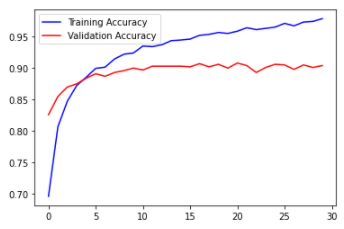
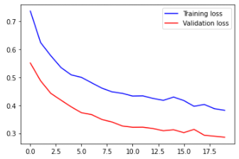

## 지난 시간 review 및 new

- **`전이학습 (Transfer Learning)`**
  - `특성추출 (Feature Extraction)` : Pretrained Network를 이용해서 우리 이미지에 대한 Feature Map 추출 ==> FC Layer에 입력으로 넣어서 학습
    - ==> 추출한 결과(Feature Map)를 nd array로 저장하고 이 데이터를 FC Later에 입력하여 사용
    - ==> 상대적으로 학습 속도가 빠르다.
  - `Fine tuning` : Pretrained Network를 우리 model에 포함해서 계속 반복해서 학습 (Dens층 위에 쌓아서 학습한다는 의미)


## Pretrained Network 활용

```python
import os
from tensorflow.keras.applications import VGG16
import numpy as np
from tensorflow.keras.preprocessing.image import ImageDataGenerator

# 파일 경로 설정
base_dir = '/content/drive/MyDrive/Colab Notebooks/CAT_DOG/cat_dog_small'

train_dir = os.path.join(base_dir, 'train')
val_dir = os.path.join(base_dir, 'validation')

# generator 설정
datagen = ImageDataGenerator(rescale=1/255)

batch_size = 20

# 우리가 사용할 Pretrained Network model
VGG_model = VGG16(weights='imagenet',
                  include_top=False,
                  input_shape=(150,150,3))
print(VGG_model.summary())
'''
Model: "vgg16"
_________________________________________________________________
Layer (type)                 Output Shape              Param #   
=================================================================
input_2 (InputLayer)         [(None, 150, 150, 3)]     0         
_________________________________________________________________
block1_conv1 (Conv2D)        (None, 150, 150, 64)      1792      
_________________________________________________________________
block1_conv2 (Conv2D)        (None, 150, 150, 64)      36928     
_________________________________________________________________
block1_pool (MaxPooling2D)   (None, 75, 75, 64)        0         
_________________________________________________________________
block2_conv1 (Conv2D)        (None, 75, 75, 128)       73856     
_________________________________________________________________
block2_conv2 (Conv2D)        (None, 75, 75, 128)       147584    
_________________________________________________________________
block2_pool (MaxPooling2D)   (None, 37, 37, 128)       0         
_________________________________________________________________
block3_conv1 (Conv2D)        (None, 37, 37, 256)       295168    
_________________________________________________________________
block3_conv2 (Conv2D)        (None, 37, 37, 256)       590080    
_________________________________________________________________
block3_conv3 (Conv2D)        (None, 37, 37, 256)       590080    
_________________________________________________________________
block3_pool (MaxPooling2D)   (None, 18, 18, 256)       0         
_________________________________________________________________
block4_conv1 (Conv2D)        (None, 18, 18, 512)       1180160   
_________________________________________________________________
block4_conv2 (Conv2D)        (None, 18, 18, 512)       2359808   
_________________________________________________________________
block4_conv3 (Conv2D)        (None, 18, 18, 512)       2359808   
_________________________________________________________________
block4_pool (MaxPooling2D)   (None, 9, 9, 512)         0         
_________________________________________________________________
block5_conv1 (Conv2D)        (None, 9, 9, 512)         2359808   
_________________________________________________________________
block5_conv2 (Conv2D)        (None, 9, 9, 512)         2359808   
_________________________________________________________________
block5_conv3 (Conv2D)        (None, 9, 9, 512)         2359808   
_________________________________________________________________
block5_pool (MaxPooling2D)   (None, 4, 4, 512)         0         
=================================================================
Total params: 14,714,688
Trainable params: 14,714,688
Non-trainable params: 0
_________________________________________________________________
None
'''
```


#### `Feature Map 추출할 함수`

```python
def extract_feature(model, file_name, sample_count):
    
    features = np.zeros(shape=(sample_count, 4, 4, 512))
    labels = np.zeros((sample_count,))

    generator=datagen.flow_from_directory(directory=file_name,
                                        target_size=(150,150),
                                        batch_size=batch_size,
                                        class_mode='binary')
    i = 0
    for batch_x, batch_t in generator :
        feature_batch = model.predict(batch_x)

        features[i*batch_size:(i+1)*batch_size] = feature_batch
        labels[i*batch_size:(i+1)*batch_size] = batch_t

        i +=1

        if i*batch_size >= sample_count :
            break

    return features, labels
```


#### `DNN model 만들기`

```python
# 파일 개수 변수 만들기
train_img_num = len(os.listdir(os.path.join(train_dir, 'cats'))) + len(os.listdir(os.path.join(train_dir, 'dogs')))
val_img_num = len(os.listdir(os.path.join(val_dir, 'cats'))) + len(os.listdir(os.path.join(val_dir, 'dogs')))

# feature map data 추출하기
train_feature, train_label = extract_feature(VGG_model, train_dir, train_img_num)
val_feature, val_label = extract_feature(VGG_model, val_dir, val_img_num)

# Layer 생성을 위한 모듈 import
from tensorflow.keras.models import Sequential
from tensorflow.keras.layers import Flatten, Dense, Dropout
from tensorflow.keras.optimizers import Adam, RMSprop

# model 만들기
model = Sequential()

# shape 바꾸기
# flatten 안쓰고 바꾸는 방법
'''
train_feature = np.reshape(train_feature, (-1,4*4*512))
val_feature = np.reshape(val_feature, (-1,4*4*512))
'''

# 나는 flatten 쓸거에요
model.add(Flatten())

model.add(Dense(256, activation='relu')) # 나는 flatten 안써서 input_shape 따로 지정 X

model.add(Dropout(0.5))

model.add(Dense(1, 'sigmoid'))

model.compile(optimizer=RMSprop(2e-5),
              loss='binary_crossentropy',
              metrics=['accuracy'])

history = model.fit(train_feature,
                    train_label,
                    epochs=30,
                    batch_size=20,
                    validation_data=(val_feature, val_label))

'''
Epoch 30/30
100/100 [==============================] - 0s 4ms/step - loss: 0.0761 - accuracy: 0.9798 - val_loss: 0.2446 - val_accuracy: 0.9040
'''
```


#### `학습 결과 그래프 그리기`

```python
import matplotlib.pyplot as plt

train_acc = history.history['accuracy']
val_acc =history.history['val_accuracy']
 
train_loss = history.history['loss']
val_loss = history.history['val_loss']

# Accuracy Graph
plt.plot(train_acc, c='b', label='Training Accuracy')
plt.plot(val_acc, c='r', label='Validation Accuracy')

# loss Graph
# plt.plot(train_loss, c='b', label='Training loss')
# plt.plot(val_loss, c='r', label='Validation loss')

plt.legend()
plt.show()

# loss 그래프도 많이 차이남
```




## Data Augument(증식) 적용 후 우리가 만들 model과 Pretrained Network 결합

```python
# 조금더 나은 결과를 얻으려면...
# 데이터가 많아지면 좋아질 것 같아요
# 증식을 포함해보자
# 또한 Pretrained Network과 우리의 classifier를 합쳐서 모델을 만들어보쟈

import os
import numpy as np
from tensorflow.keras.preprocessing.image import ImageDataGenerator
from tensorflow.keras.models import Sequential
from tensorflow.keras.layers import Flatten, Dense, Dropout
from tensorflow.keras.optimizers import RMSprop
import matplotlib.pyplot as plt
from tensorflow.keras.applications import VGG16


base_dir = '/content/drive/MyDrive/Colab Notebooks/CAT_DOG/cat_dog_small'

train_dir = os.path.join(base_dir, 'train')
val_dir = os.path.join(base_dir, 'validation')

# 증식 적용 generator
train_datagen = ImageDataGenerator(rescale=1/255,
                                   rotation_range=20,
                                   width_shift_range=0.1,
                                   height_shift_range=0.1,
                                   zoom_range=0.2,
                                   horizontal_flip=True,
                                   vertical_flip=True)
val_datagen = ImageDataGenerator(rescale=1/255)

# train, val 용 data 가져오기 
train_data = train_datagen.flow_from_directory(
    directory= train_dir,
    target_size= (150,150),
    batch_size= 20,
    class_mode='binary'
)

val_data = val_datagen.flow_from_directory(
    directory= val_dir,
    target_size= (150,150),
    batch_size= 20,
    class_mode='binary'
)

# Pretrained Network 준비
VGG_model = VGG16(weights='imagenet',
                  include_top=False,
                  input_shape=(150,150,3))

# 우리가 사용할 pretrained network에서 가져온 conv filter는 update 안하도록 설정!
# ==> 이미 최적화 돼 있기 때문에!
VGG_model.trainable = False

# 먼저 우리의 model 만들고
model = Sequential()

# Pretrained Network를 우리 model에 붙인다.
model.add(VGG_model)

model.add(Flatten(input_shape=(4*4*512,)))

model.add(Dense(256,
                activation='relu'))

model.add(Dropout(0.6))

model.add(Dense(1,
                activation='sigmoid'))

# 학습하는 parameter가 많이 줄었다.
model.summary()
'''
Total params: 16,812,353
Trainable params: 2,097,665
Non-trainable params: 14,714,688
'''

model.compile(optimizer=RMSprop(2e-5),
              loss='binary_crossentropy',
              metrics=['accuracy'])

history = model.fit(train_data,
                    epochs=20,
                    steps_per_epoch=100,
                    validation_data = val_data,
                    validation_steps=50)
'''
Epoch 20/20
100/100 [==============================] - 21s 214ms/step - loss: 0.3704 - accuracy: 0.8289 - val_loss: 0.2856 - val_accuracy: 0.8660
'''
# 더 안 좋아 졌음

train_acc = history.history['accuracy']
val_acc =history.history['val_accuracy']
 
train_loss = history.history['loss']
val_loss = history.history['val_loss']

# plt.plot(train_acc, c='b', label='Training Accuracy')
# plt.plot(val_acc, c='r', label='Validation Accuracy')

plt.plot(train_loss, c='b', label='Training loss')
plt.plot(val_loss, c='r', label='Validation loss')

plt.legend()
plt.show()
```




## Fine Tuning

- Pretrained Network를 이용하는 또 다른 방법
- Pretrained Network의 parameter를 모두 학습에 동결시키지 않고
- 몇개의 conv layer를 해제해서 학습에 적용될 수 있도록(update 되도록)
- 상위 layer (== FC Layer와 가까이 있는 layer) 몇개만 (약 2~3개)


### Fine Tuning의 절차

1. Pretrained Network를 우리가 만들 model에 추가한다.

2. Pretrained Network(==Base Network) parameter 전체를 동결한다.

3. 새로 추가한 FC Layer 학습
4. Base Network의 일부분 layer를 동결에서 해제
5. 동결을 해제한 layer와 FC layer를 다시 학습

```python
## Fine tuning

import os
import numpy as np
from tensorflow.keras.preprocessing.image import ImageDataGenerator
from tensorflow.keras.models import Sequential
from tensorflow.keras.layers import Flatten, Dense, Dropout
from tensorflow.keras.optimizers import RMSprop
import matplotlib.pyplot as plt
from tensorflow.keras.applications import VGG16


base_dir = '/content/drive/MyDrive/Colab Notebooks/CAT_DOG/cat_dog_small'

train_dir = os.path.join(base_dir, 'train')
val_dir = os.path.join(base_dir, 'validation')

train_datagen = ImageDataGenerator(rescale=1/255,
                                   rotation_range=20,
                                   width_shift_range=0.1,
                                   height_shift_range=0.1,
                                   zoom_range=0.2,
                                   horizontal_flip=True,
                                   vertical_flip=True)
val_datagen = ImageDataGenerator(rescale=1/255)

train_data = train_datagen.flow_from_directory(
    directory= train_dir,
    target_size= (150,150),
    batch_size= 20,
    class_mode='binary'
)

val_data = val_datagen.flow_from_directory(
    directory= val_dir,
    target_size= (150,150),
    batch_size= 20,
    class_mode='binary'
)

VGG_model = VGG16(weights='imagenet',
                  include_top=False,
                  input_shape=(150,150,3))

# 똑같이 우선 모두 동결시키고
VGG_model.trainable = False

# Pretrained Network에 우리 model을 붙이다.
model = Sequential()

model.add(VGG_model)

model.add(Flatten(input_shape=(4*4*512,)))

model.add(Dense(256,
                activation='relu'))

model.add(Dropout(0.6))

model.add(Dense(1,
                activation='sigmoid'))

model.compile(optimizer=RMSprop(2e-5),
              loss='binary_crossentropy',
              metrics=['accuracy'])

history = model.fit(train_data,
                    epochs=30,
                    steps_per_epoch=100,
                    validation_data = val_data,
                    validation_steps=50)

## 여기서부터 Fine tuning
# 즉, Pretrained Network에서 몇개의 상위 layer 동결 풀거야

# 먼저 전체 layer 모두 동결 풀고
VGG_model.trainable = True

# 특정 layer만 동결풀고 나머지는 다시 동결
for layer in VGG_model.layers :
    if layer.name in ['block5_conv1', 'block5_conv2', 'block5_conv3']:
        layer.trainable=True
    else:
        layer.trainable=False

# 학습 다시 해야 해서
# compile 다시 설정 ==> 일반적으로 learing_rate 더 작게 설정한다.
# 재학습

model.compile(optimizer=RMSprop(1e-5),
              loss='binary_crossentropy',
              metrics=['accuracy'])

history = model.fit(train_data,
                    epochs=30,
                    steps_per_epoch=100,
                    validation_data = val_data,
                    validation_steps=50)

'''
Epoch 30/30
100/100 [==============================] - 22s 217ms/step - loss: 0.0996 - accuracy: 0.9626 - val_loss: 0.2254 - val_accuracy: 0.9190
'''
# 조금 더 향상
```

