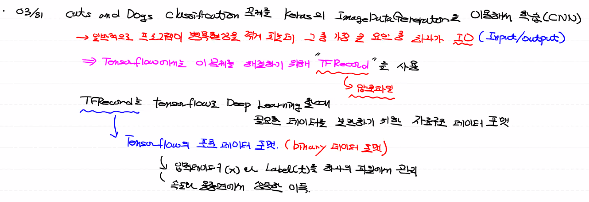

## I/O Latency

- `ImageDataGenerator`는 Data Input / output 의 작업이 계속 이뤄지기 때문에 속도가 매우 느리다.
- 이로 인해 프로그램 병목 현상 발생
- 이러한 문제를 해결하기 위해서 Tensorflow는 **`TF Record`** 라는 기능을 제공


## TF Recorder

- 모든 data를 하나의 압축파일을 만든다.
- `Tensorflow`로 Deep Learning 학습 할때, 필요한 `데이터를 보관`하기 위한 **`자료구조`** (Data format) 이다
- `Tensorflow` 의 기본, 표준 Data Format! 
- TF Recorder는 **`binary(이진)`** Data Format이다!
  - 인코딩 디코딩이 필요없어서 컴퓨터가 사용하기에는 정말 빠르고 편하다
  - 입력 데이터(x)와 label(t)를 하나의 파일에서 관리한다. ==> 속도와 용량면에서 상당한 이점



#### `모듈 import`

```python
import os
import numpy as np
import pandas as pd
from sklearn.model_selection import train_test_split
import tensorflow as tf
from tqdm.notebook import tqdm  # ==> 프로그램 진행 상태 bar 보여주는 모듈
from PIL import Image
import io  # ==> input, output 관련 모듈
```


#### `Tensorflow에서 제공하는 Type별 Feature 생성 코드`

```python
# 내가 사용할 data를 binary data로 바꿔주는 함수
# 이미지는 bytes feature로 변환할 예정

def _bytes_feature(value):
    # string / byte 타입 (문자열)을 받아서 byte list(feature객체)를 리턴.
    if isinstance(value, type(tf.constant(0))):
        value = value.numpy() # BytesList won't unpack a string from an EagerTensor.
    return tf.train.Feature(bytes_list=tf.train.BytesList(value=[value]))

def _float_feature(value):
    # float / double 타입을 받아서 float list를 리턴
    return tf.train.Feature(float_list=tf.train.FloatList(value=[value]))

def _floatarray_feature(array):
    """Returns a float_list from a float / double."""
    return tf.train.Feature(float_list=tf.train.FloatList(value=array))

def _int64_feature(value):
    # bool / enum / int / uint 타입을 받아서 int64 list를 리턴
    return tf.train.Feature(int64_list=tf.train.Int64List(value=[value]))


def _validate_text(text):
    """If text is not str or unicode, then try to convert it to str."""
    if isinstance(text, str):
        return text
    elif isinstance(text, 'unicode'):
        return text.encode('utf8', 'ignore')
    else:
        return str(text)
```


#### `TF Recoder 사용할 DateFrame 만들기`

```python
# DataFrame을 하나 생성 (이걸 이용해야 쉽게 만들 수 있다.)
# DataFrame column 2개 ==> `filename`(경로포함한 title) , `label`(t_data)

# 전체 파일 가지고 있는 폴더 경로
src = '/content/drive/MyDrive/Colab Notebooks/CAT_DOG/cat_dog_tfrecord/'

# column이 'filename'인 df 생성
# 값은 각 파일 title (os.listdir()로 추출)
df = pd.DataFrame(os.listdir(src),
                  columns=['filename'])

# 'label' 칼럼 추가
# ==> 각 title에서 cat, dog를 기준으로 0,1로 바꾸기

# .str ==> 각각의 값을 문자열로 바꾸기 (기존 data값들은 객체로 돼 있음)
# contains() ==> () 안에 들어있는 data가 값 안에 있니? ==> bool type으로 변환
df['filename'].str.contains('cat')
'''
0        True
1        True
2        True
3        True
4        True
        ...  
3995    False
3996    False
3997    False
3998    False
3999    False
Name: filename, Length: 4000, dtype: bool
'''

# cat = 0, dog = 1 로 바꾸기 위해서 '~' 사용
# 'label' 칼럼 추가
df['label'] = ~df['filename'].str.contains('cat')

# df ==>
'''
          filename  label
0     cat.1999.jpg  False
1       cat.53.jpg  False
2       cat.45.jpg  False
3       cat.52.jpg  False
4       cat.49.jpg  False
...            ...    ...
3995  dog.2344.jpg   True
3996  dog.2341.jpg   True
3997  dog.2334.jpg   True
3998  dog.2339.jpg   True
3999  dog.2335.jpg   True

[4000 rows x 2 columns]
'''

# label data int값으로 변환
# DataFrame 의 데이터 타입 바꾸기 (bool ==> int)
# .astype({'컬럼명':'dtype'})

df = df.astype({'label':'int'})
'''
          filename  label
0     cat.1999.jpg      0
1       cat.53.jpg      0
2       cat.45.jpg      0
3       cat.52.jpg      0
4       cat.49.jpg      0
...            ...    ...
3995  dog.2344.jpg      1
3996  dog.2341.jpg      1
3997  dog.2334.jpg      1
3998  dog.2339.jpg      1
3999  dog.2335.jpg      1

[4000 rows x 2 columns]
'''

# filename 값들을 file 경로로 바꾸기
# .map() ==> 각 값들에 함수 적용하게 해주는 함수
# lambad x ==> x : 각 값들
df['filename'] = df['filename'].map(lambda x: src + x)
'''
                                               filename  label
0     /content/drive/MyDrive/Colab Notebooks/CAT_DOG...      0
1     /content/drive/MyDrive/Colab Notebooks/CAT_DOG...      0
2     /content/drive/MyDrive/Colab Notebooks/CAT_DOG...      0
3     /content/drive/MyDrive/Colab Notebooks/CAT_DOG...      0
4     /content/drive/MyDrive/Colab Notebooks/CAT_DOG...      0
...                                                 ...    ...
3995  /content/drive/MyDrive/Colab Notebooks/CAT_DOG...      1
3996  /content/drive/MyDrive/Colab Notebooks/CAT_DOG...      1
3997  /content/drive/MyDrive/Colab Notebooks/CAT_DOG...      1
3998  /content/drive/MyDrive/Colab Notebooks/CAT_DOG...      1
3999  /content/drive/MyDrive/Colab Notebooks/CAT_DOG...      1

[4000 rows x 2 columns]
'''
```


#### `TF Recorde 생성 함수`

```python
##### TFRecord 생성 함수 #####

# 첫번째 인자 = id_list : 이미지 파일명을 가지고 있는 list
# 두번째 인자 = label_list : 이미지 파일의 label 값 list
# 세번재 인자 = tfrecord_name : 만들어질 tfrecord 파일 이름 (train, val용도 따로 만들 계획이어서)
def to_tfrecods(id_list, label_list, tfrecord_name):
    
    print('converting start!')
    
    ## 압축할지 안할지는 선택사항 (속도 와 용량 사이에서 선택)
    ## 압축하면 tfrecord 사용할 때 압출풀고 사용하느라 조금 속도가 느려짐
    # compression_type= 압축형태
    options = tf.io.TFRecordOptions(compression_type='GZIP')
    
    # TFRecordWriter ==> tfrecord 만들어주는 메서드
    # 인자로 `path` ==> 이 이름으로 만들거에요 (이름 + 확장자)
    # options ==> GZIP 압축파일 형태로 만들거라는 것을 명시
    with tf.io.TFRecordWriter(path=os.path.join(tfrecord_name + '.tfrecords'),
                              options=options) as writer :
        
        # zip() ==> 같은 위치에 있는 것끼리 tuple로 묶어서 return.
        # tqdm ==> 전채 작업 중 몇 % 진행되고 있는 지 상태 bar 보여줌
        # tqdm 인자 ==> total : 총 몇개? / position : 어디서부터 시작? / leave : 뒤에 진행상태 계속 남기면서 누적 % 보여줄거야?
        for id_, label_ in tqdm(zip(id_list,label_list), 
                                total=len(id_list),
                                position=0,
                                leave=True):
            image_path = id_ # ==> 이미지 경로

            # tf가 제공해주는 read_file 메서드
            # 넣어준 경로 파일을 읽어서 binary 데이터 추출
            _binary_image = tf.io.read_file(image_path)

            # Features 객체 (여러개의 feature가 모인!)
            # Features 객체 만들건데 딕셔너리 형태로 속성 값을 주고
            # 각각의 feature
            my_features = tf.train.Features(feature={
                'image_raw' : _bytes_feature(_binary_image),
                'label' : _int64_feature(label_),
                'id' : _bytes_feature(id_.encode()) 
            })

            # example 객체 만들기
            # 이진 문자열로 바꿔주기 위해서 example 객체 사용
            string_set = tf.train.Example(features=my_features)

            # example 객체를 이진(binary)문자열로 변환한 후 tfrecode 파일로 만들기(쓰기)
            writer.write(string_set.SerializeToString())
            
```


#### `train_data & val_data split`

```python
# train_test_split() ==> 이용
# DataFrame도 이용 가능하다!

train_id, val_id, train_label, val_label = \
train_test_split(df['filename'],
                 df['label'],
                 test_size=0.2,
                 random_state=0)
```


#### `TF Record 만들기`

```python
to_tfrecods(train_id, train_label, 'cat_dog_train')
to_tfrecods(val_id, val_label, 'cat_dog_valid')
```


#### `TF Record 사용 방법`

```python
import os
import numpy as np
import tensorflow as tf
import matplotlib.pyplot as plt

# train, validation TFRecord 파일 경로
train_tfrecord_path = './cat_dog_train.tfrecords'
val_tfrecord_path = './cat_dog_valid.tfrecords'

##################################################################################

# TFRecord 파일을 불러와서 모델 학습 및 추론에 사용하기 위해서는 
# tf.data.Dataset 모듈과 유사한 기능을 가지는 tf.data.TFRecordDataset 모듈을 이용
# tf.data.Dataset 모듈은 여러 방식으로 데이터를 불러올 수 있는데  
# 기본적으로는 generator로 부터 데이터를 불러온다. TFRecordDataset도 마찬가지임.
# 아래의 parameter는 TFRecordDataset를 사용할 때의 parameter

# 다양한 option parameter
BUFFER_SIZE = 256     # 데이터 shuffle을 위한 buffer size ==> shuffle을 하려면 buffer가 필요하다는 데 무슨 말일까?
BATCH_SIZE = 64       # 배치 사이즈. 한번에 가져오는 이미지 데이터 개수 
NUM_CLASS = 2         # class의 개수. binary인 경우는 필요없으며 categorical인 경우 설정
IMAGE_SIZE = 150

# 궁극적으로 우리가 만들 TFRecord에서 사용할 data는 처음 features 만들었을 때, 넣었던 dict type으로 바꿔서 사용 될 수 있다.
# 그래서 TFRecord에서 바꿀 data 자료 구조 틀을 미리 만들어 놓는다.
# TFRecord를 읽어서 데이터를 복원하기 위한 자료구조.
image_feature_description = {
    'image_raw': tf.io.FixedLenFeature([], tf.string),
    'label': tf.io.FixedLenFeature([], tf.int64),
    'id': tf.io.FixedLenFeature([], tf.string),
}

# 읽어들인 TFRecord를 다음의 형태(dict)로 변환하는 함수
# <ParallelMapDataset shapes: {id: (), image_raw: (), label: ()}, 
#                     types: {id: tf.string, image_raw: tf.string, label: tf.int64}>
def _parse_image_function(example_proto):
    return tf.io.parse_single_example(example_proto, 
                                      image_feature_description)

# 위에서 얻은 ParallelMapDataset를 다음의 형태(shape)로 변환하는 함수
# <ParallelMapDataset shapes: ((None, None, 3), ()), types: (tf.float32, tf.int64)>
def map_func(target_record):
    img = target_record['image_raw']
    label = target_record['label']
    img = tf.image.decode_jpeg(img, channels=3)
    img = tf.dtypes.cast(img, tf.float32)
    return img, label

# 전처리(resize & augmentation) 함수
# 이미지 데이터 normalization
# 이 처리를 하는 대신 tf.keras.applications.mobilenet.preprocess_input() 함수를 이용하는것이 좋음
# 우리예제는 TFRecord 생성 시 원본 size로 저장했기 때문에 image resize를 해야함.
def image_resize_func(image, label):
    # result_image = image / 255
    result_image = tf.image.resize(image, (IMAGE_SIZE,IMAGE_SIZE))   
    return result_image, label

# 각각의 pretrained network마다 
# tensorflow.keras.applications.mobilenet.preprocess_input(image) 작업을 수행해야 함.
# 이부분에 대해서는 조금 더 알아봐야 함.
# 만약 multinomial classification이기 때문에 one_hot처리도 필요함.
def post_process_func(image, label):

#     result_image = tf.keras.applications.mobilenet_v2.preprocess_input(image)
    result_image = tf.keras.applications.mobilenet.preprocess_input(image)    
#    onehot_label = tf.one_hot(label, depth=1049)    # binary인 경우 one_hot 사용안함.    
#     return result_image, onehot_label
    return result_image, label

#####################################################################################

# TFRecordDataset 객체 생성
dataset = tf.data.TFRecordDataset(train_tfrecord_path, 
                                  compression_type='GZIP')

# TFRecordDataset 각 feature들을 example 객체로 파싱??
dataset = dataset.map(_parse_image_function, 
                      num_parallel_calls=tf.data.experimental.AUTOTUNE)

# 파싱한 example 객체 안 data shape을 이미지 처리에 맞게 변경?
dataset = dataset.map(map_func, 
                      num_parallel_calls=tf.data.experimental.AUTOTUNE)

# 왜 cache 처리 한걸까?
dataset = dataset.cache()

# dataset shuffle 처리
# BUFFER_SIZE 개수만큼 가져와서 셔플 한다. 
dataset = dataset.shuffle(BUFFER_SIZE)

# 전처리(resize & auigmentation)
dataset = dataset.map(image_resize_func, 
                      num_parallel_calls=tf.data.experimental.AUTOTUNE)

# BatchDataset으로 변환
# <BatchDataset shapes: ((None, None, None, 3), (None,)), types: (tf.float32, tf.int64)>
# BatchDataset으로 변환하기 전에 image의 resize(전처리)가 일어나야 한다. 그렇지 않으면 
# shape이 달라 batch처리가 되지 않는다는 오류 발생.
dataset = dataset.batch(BATCH_SIZE)

# pretrained network의 preprocess_input() 호출
# one_hot encoding 처리
dataset = dataset.map(post_process_func, 
                      num_parallel_calls=tf.data.experimental.AUTOTUNE)

# prefetch처리
# prefetch는 전처리와 학습과정의 모델 실행을 오버랩.
# 모델이 s스텝 학습을 실행하는 동안 입력 파이프라인은 s+1스텝의 데이터를 읽어서 수행속도를 높임.
# <PrefetchDataset shapes: ((None, None, None, 3), (None,)), types: (tf.float32, tf.int64)>
dataset = dataset.prefetch(buffer_size=tf.data.experimental.AUTOTUNE)

# 아래의 코드는 데이터 확인을 위한 이미지 출력 코드.
# 1개의 batch만 얻어와서 그 중 첫번째 이미지만 출력
# 현재 batch size가 64이기 때문에 64개의 이미지를 가져온다.
# binary classification은 np.argmax()와 같은 처리가 필요없지만
# multinomial classification은 np.argmax()로 label 출력

for batch_x, batch_y in dataset:
    print(batch_x.shape, batch_y.shape)

    plt.figure()
    plt.imshow(batch_x[0].numpy())
    plt.title('label : {}'.format(np.argmax(batch_y[0])))
    plt.show()

    break
```


