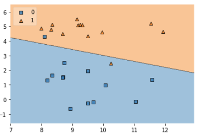

## SVM (Support Vector Machine)

- Regression (연속적인 숫자값 도출해주는 작업)

- Classification (분류)

- 모두 가능!

- 성능이 Deep Learing에 비해 살짝 떨어진다.

- But! 그 성능 차이가 그렇게 크지 않고

- 구현 복잡도가 간단하고, 가볍고, 쉽게 사용할 수 있다.

  ---

  > - **`Decision Boundaried(결정경계)`** 라는 개념을 이용해서 분류를 위한 기준선을 만들어서 ML 작업
  > - 즉, 분류를 위한 기준선 만들어서 진행
  > - `Decision Boundaried(결정경계)` 이 기준선은 linear, logistic regression과 비슷하다고 생각할 수 있는데 맞다
  > - 하지만, SVM은 이 기준선을 구하는 방식이 다르다! (linear, logistic : Data의 평균 사용)
  > - **`SVM`** ==> 데이터를 `선형`으로 분리하는 `최적의 결정경계`를 찾는 알고리즘 
  > - `선형` : 직선만 의미하는 것은 아니다! (곡선도 선형으로 표현할 수 있다.)

  


## SVM 구하는 방법

- 결정경계를 구할 때, 전체 Data를 다 보지 않는다.
- 몇개의 주요한 data만 선정해서 최적의 **`Decision Boundaried(결정경계)`** 를 찾는다.
- 여기서 주요한 data == **`Support Vector`** 라고 부른다.
- `Support Vector` 는 **`수학 vector 연산`** 을 통해 찾는다. 
- 한 쪽 영역에서 구한 `Support Vector` 2 개를 잇는 가상의 직선 구하고
- 반대 영역에서 구한 하나의 `Support Vector` 를 중심으로 평행한 직선을 구하고
- 이 직선들에서 **`Margin`** 값이 가장 큰 ==> 즉, 양 직선의 중간 위치에 직선을 그리고 이게 ==> `Decision Boundaried(결정경계)`

- **`SVM 장점`** : 모든 data 볼 필요 없이 **`Support Vector`** 만 구하면 되기 때문에 **`속도가 빠르다.`**
- **`SVM 주의사항`** : **`이상치`** 처리에 주의해야 한다!
  - 이상치가 **`Support Vector`** 될 가능성이 많고 그렇게 `Decision Boundaried(결정경계)` 구하면 **`Margin`** 값이 작아질 수 밖에 없다.
  - ==> **`Overfitting(과대적합)`** 발생할 확률이 높다 (우리 training data에 딱 들어 맞는, 모든 data를 다 적용하려는...)
  - ==> **`Overfitting(과대적합)`** 에서 구한 Margin == **`Hard Margin`**
- **`Soft Margin`** : **`Hard Margin`** 과 반대되는 개념 == **`Support Vector`** 와 `Decision Boundaried(결정경계)` 거리가 멀다
  - ==> `Underfitting(과소적합)` 발생


## Data 완전 극단치 존재 하는 경우

- 선형으로 데이터 분리하기 어렵다
- 이 문제 해결하기 위해 데이터 오류를 허용하는 전략 ==> **`Regularization`** : 극단치를 무시한다
- sklearn에서 구현할 때 이 **`Regularization`** 을 결정하는 **`hyper-parameter`** 값이 있다. 
  - ==> **`C(cost)`** : 얼마나 많은 데이터 포인트가 `다른 범주`에 놓이는 것을 허용할지 결정
  - ==> 기본값이 1이고 이 값이 커질 수록 다른 범주에 놓이는 데이터 포인트를 적게 허용한다.
  - ==> C값이 높아질 수록 **`Overfitting(과대적합)`** // C값이 낮아질 수록 **`Underfitting(과소적합)`**


## Data를 선형으로 분리할 수 없을 때!

- SVM ==> **`kernel`** 이라는 hyper-parameter를 지정할 수 있다
  - `linear` : 앞에서 다룬 data regression
  - `poly` : 2차원을 3차원으로 사상 (파란점을 위로 보내고, 빨간점을 아래로 보내서 중간에 공간을 만들어서 평면을 둔다.)
  - **`rbf (Radial bias function, 방사기저함수)`** :  kernel의 `기본값` / data 자체를 상위 차원의 data로 `사상`시키는 역할
    - 일반적으로 **`rbf`** kernel을 **`가우시안 kernel`** 이라 하고
- kernel에서 linear 외 [`poly`와 `rbf`] 라면 **`gamma`** 라는 hyper-parameter를 또 지정해줘야 한다 
- **`gamma`** : `Decision Boundaries`를 얼마나 유연하게 그릴건지에 대한 정도
  - **`gamma`** 값이 낮으면 `Decision Boundaries` 가 거의 직선에 가깝게 나온다.
  - **`gamma`** 값이 높으면 `Decision Boundaries` 가 구불구불하게 나온다. (== 세밀하게 조정한다.) ==> `Overfitting(과대적합)` 관련


## SVM 코드 구현

#### `mglearn sample Data set`

```python
import numpy as np
from sklearn.svm import SVC
import mglearn
import matplotlib.pyplot as plt
import warnings
from mlxtend.plotting import plot_decision_regions  
# ==> decision boundary 그래프로 표현할 때 사용

warnings.filterwarnings(action='ignore')

# Training Data Set
x_data, t_data = mglearn.datasets.make_forge()
# ==> x_data :(26,2) / t_data : (26,) ==> binary classification

# t_data가 0인 경우 red 점으로 표현
# t_data가 1인 경우 blue 점으로 표현

# red점에 대한 좌표값 (t=0)
x_data_red = x_data[t_data==0] # boolean mask 활용
x_data_blue = x_data[t_data==1]

plt.scatter(x_data_red[:,0], x_data_red[:,1], c='r')
plt.scatter(x_data_blue[:,0], x_data_blue[:,1], c='b')

plt.show()
```


```python
#SVC model
model = SVC(kernel='linear',
            C=1)
# kernel='linear' ==> 사용하는 data가 2차원으로 간단히 표현 가능! / gamma는 사용X
# C ==> 다른 범주에 놓이는 data point 어느정도 허용? (기본값:1)
# C 값이 커질수록 overfitting / 작아질수록 underfitting

# model 학습
model.fit(x_data, t_data)

# support vector data를 뭐로 찾았는지 확인
print(model.support_vectors_)
'''
[[ 8.1062269   4.28695977]
 [ 8.7337095   2.49162431]
 [11.563957    1.3389402 ]
 [ 8.67494727  4.47573059]
 [10.24028948  2.45544401]
 [ 7.99815287  4.8525051 ]]
'''

# Decision Boundary 그려보자
plot_decision_regions(X=x_data, 
                      y=t_data,
                      clf=model, # ==> 이 그래프 그릴 때 사용할 model
                      legend=2) # ==> legend : 범주(class) 개수
plt.show()
```




#### `BMI 예제 My Version`

> - BMI 원본 data에서 각 label 별로 30개씩만 샘플로 추출
> - SVC를 이용해서 학습시키고 decision boundaries를 그리기

```python
import pandas as pd
import numpy as np
import matplotlib.pyplot as plt
from sklearn.svm import SVC
import warnings
from mlxtend.plotting import plot_decision_regions 

warnings.filterwarnings(action='ignore')

df = pd.read_csv('../data/bmi.csv', skiprows=3)

num_of_data = 30

thin_x_data = df[df['label']==0][:num_of_data].drop('label', axis=1, inplace=False).values
thin_t_data = df[df['label']==0][:num_of_data]['label'].values

normal_x_data = df[df['label']==1][:num_of_data].drop('label', axis=1, inplace=False).values
normal_t_data = df[df['label']==1][:num_of_data]['label'].values

fat_x_data = df[df['label']==2][:num_of_data].drop('label', axis=1, inplace=False).values
fat_t_data = df[df['label']==2][:num_of_data]['label'].values

plt.scatter(thin_x_data[:,0], thin_x_data[:,1], c='b')
plt.scatter(normal_x_data[:,0], normal_x_data[:,1], c='green')
plt.scatter(fat_x_data[:,0], fat_x_data[:,1], c='r')

plt.show()
```


```python
# data 합치기
x_data = np.vstack([thin_x_data,normal_x_data,fat_x_data])
t_data = np.hstack([thin_t_data,normal_t_data,fat_t_data])

# model
sample_model = SVC(kernel='linear')
sample_model.fit(x_data, t_data)

# decision boundary
plot_decision_regions(X=x_data,
                     y=t_data,
                     clf=sample_model,
                     legend=3)
plt.show()
```


```python
# accuracy
full_x_data = df.drop('label', axis=1, inplace=False).values
full_t_data = df['label'].values

train_data_accuracy = sample_model.score(x_data,t_data)
full_data_accuracy = sample_model.score(full_x_data,full_t_data)

print(train_data_accuracy) # ==> 0.9888888888888889
print(full_data_accuracy)  # ==> 0.9815
```


#### `BMI 예제 Teacher Version`

> - 전체 Data 학습

```python
import pandas as pd
import numpy as np
import matplotlib.pyplot as plt
from sklearn.svm import SVC
import warnings
from mlxtend.plotting import plot_decision_regions 
from sklearn.model_selection import train_test_split
from sklearn.metrics import classification_report

warnings.filterwarnings(action='ignore')

df = pd.read_csv('../data/bmi.csv', skiprows=3)

x_data = df.drop('label', axis=1, inplace=False).values 
t_data = df['label'].values

train_x_data, test_x_data, train_t_data, test_t_data = \
train_test_split(x_data, t_data, test_size=0.2, random_state=0)

model = SVC(kernel='linear')
model.fit(train_x_data, train_t_data)

print(classification_report(test_t_data, model.predict(test_x_data)))
'''
              precision    recall  f1-score   support

           0       0.99      0.99      0.99      1276
           1       0.97      0.97      0.97      1158
           2       0.99      0.99      0.99      1566

    accuracy                           0.98      4000
   macro avg       0.98      0.98      0.98      4000
weighted avg       0.98      0.98      0.98      4000
'''
```


## SVM Hyper-parameter 조절

- Hyper-parameter 조절해서 최적화 하는 작업은 쉽지 않다.
- 수동으로 변경해서 실행하는 것도 한계


#### `자동화`

> - sklearn ==> **`Grid Search CV`** : `Hyper-parameter` 의 값을 몇 개 정해준다. ==> 내부적으로 반복해서 평가 (Cross Validation)
> - sklearn ==> **`Randomize Search CV`** : `Hyper-parameter` 의 범위를 정해줘서 그 범위 안에서 random하게 뽑아서 CV


#### `Grid Search CV`

```python
import pandas as pd
import numpy as np
import matplotlib.pyplot as plt
from sklearn.svm import SVC
import warnings
from mlxtend.plotting import plot_decision_regions 
from sklearn.model_selection import train_test_split
from sklearn.metrics import classification_report
from sklearn.model_selection import GridSearchCV

warnings.filterwarnings(action='ignore')

df = pd.read_csv('../data/bmi.csv', skiprows=3)

x_data = df.drop('label', axis=1, inplace=False).values 
t_data = df['label'].values

train_x_data, test_x_data, train_t_data, test_t_data = \
train_test_split(x_data, t_data, test_size=0.2, random_state=0)

# hyper-parameter 설정
# GridSearchCV ==> parameter 미리 설정하는데 형태를 [{}] ==> 이런 형태로 준다.
param_grid = [
    {'kernel': ['linear'],
     'C': [10, 30, 100, 300, 1000, 3000, 10000, 30000]},
    {'kernel': ['rbf'],
     'C': [1, 3, 10, 30, 100, 300, 1000, 3000],
     'gamma': [0.01, 0.03, 0.1, 0.3, 1.0, 3.0]} # ==> kernel이 rbf이기 때문에 gamma 값 부여
]

# svc model
model = SVC()

# GridSearchCV 적용
grid_search = GridSearchCV(model,
                           param_grid,
                           cv=5, # ==> 몇 번 반복해서 평가할건지 
                           scoring='accuracy'  # ==> metric 유형
                           verbose=2)

# 학습
# grid_search 객체 안에 svc model이 들어 있기에 바로 사용
grid_search.fit(train_x_data, train_t_data)

# 학습이 끝나면 최적의 parameter와  그에 맞는 최적의 accuracy를 호출 할 수 있다.
print('최고의 hyper-parameter :', grid_search.best_params_)
print(('최고의 hyper-parameter 일때 accuracy :', grid_search.best_score_))
```


#### `RandomizeSearchCV`

```python
# 위 data 이어서
# module 추가

from scipy.stats import expon, reciprosal
from sklearn.model_selection import RandomizeSearchCV

# RandomizeSearchCV 는 parameter 설정을 범위로 주고, dictionary 형태로 준다.
param_grid = {
    'kernel': ['linear', 'rbf'],
    'C': reciprosal(20,200000),  # ==> 연속적인 랜덤변수 (확률밀도함수, log와 관련)
    'gamma': expon(scale=1.0)    # ==> 지수 분포
}

model = SVC()

grid_search = RandomizeSearchCV(model,
                           param_grid,
                           cv=5,
                           n_iter=50, # ==> random 몇번 뽑을 것인지
                           scoring='accuracy',
                           verbose=2)

grid_search.fit(train_x_data, train_t_data)

print('RandomizeSearchCV 사용 시 최고의 hyper-parameter :', grid_search.best_params_)
print(('RandomizeSearchCV 사용 시 최고의 hyper-parameter 일때 accuracy :', grid_search.best_score_))
```

