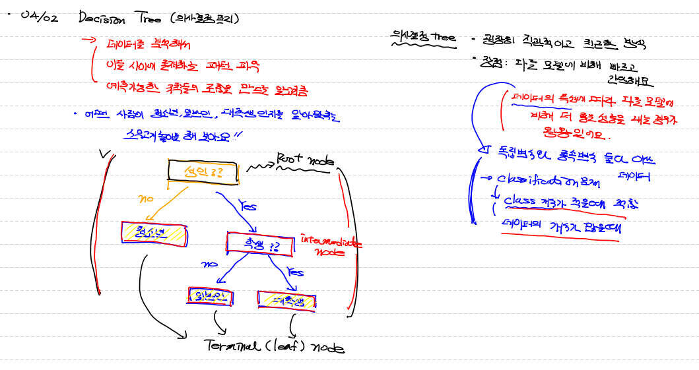
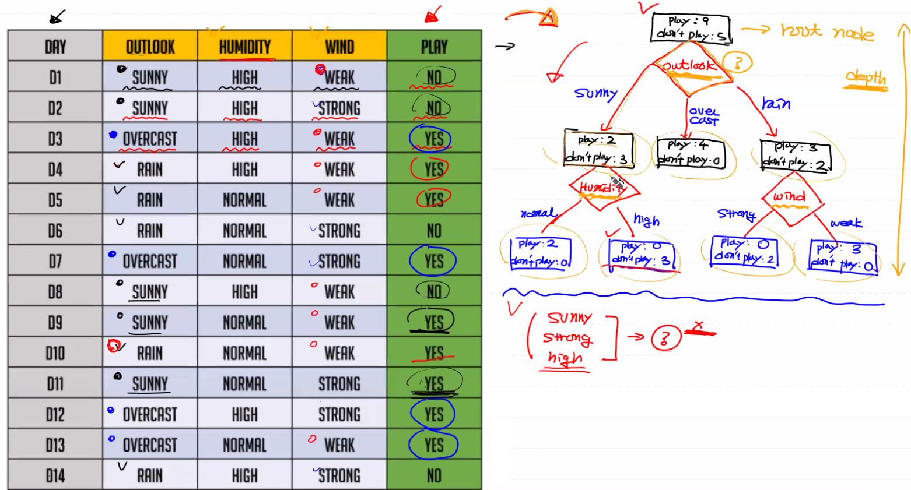
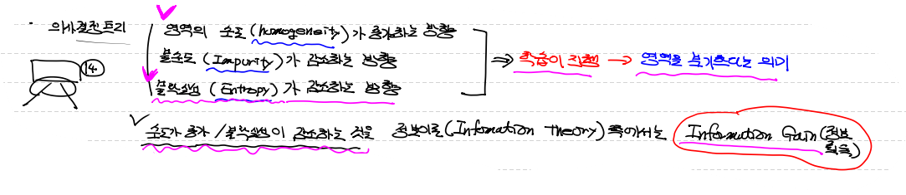
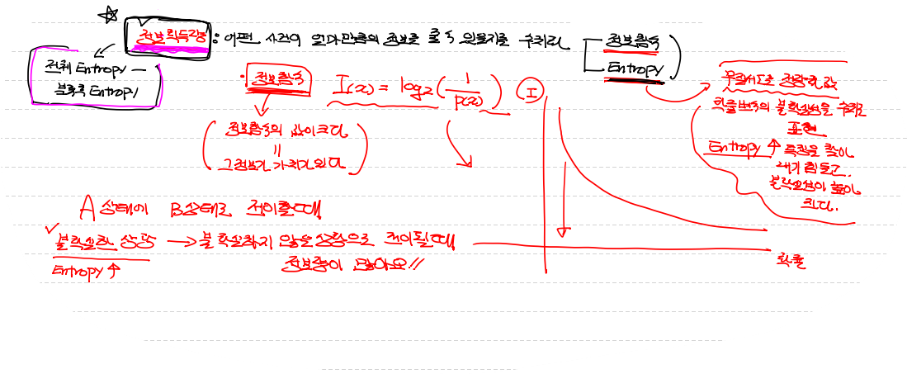
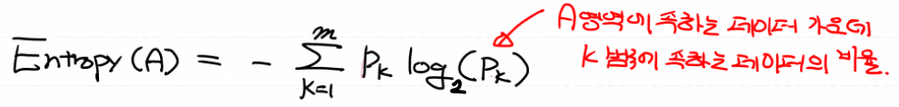
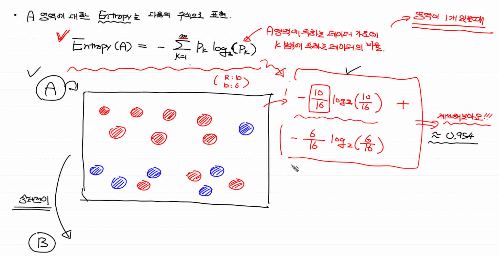
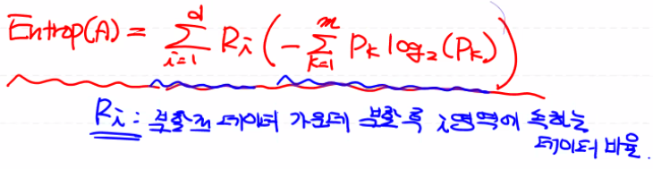
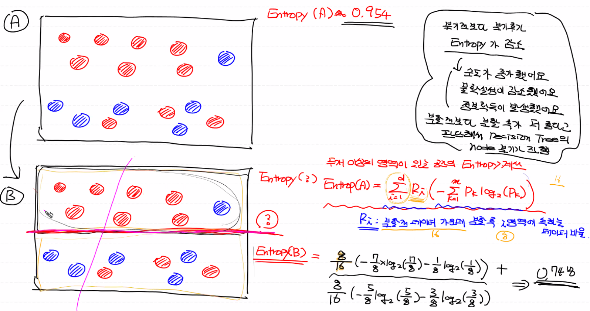
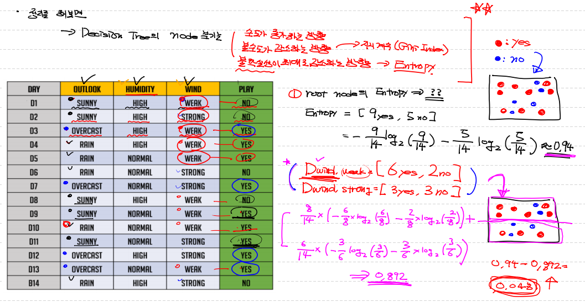
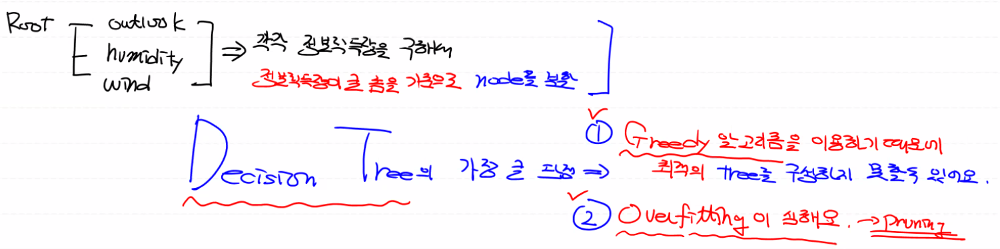

## Decision Tree (의사결정 트리)

- 데이터를 분석해서 이들 사이에 존재하는 **`패턴`** 파악 ==> 예측 가능한 **`규칙들의 조합`** 을 만드는 알고리즘
- 맨 처음 분기하는 node : **`Root node`**
- 중간에서 분기하는 node : **`Intermediate node`**
- 마지막 더이상 분기(질문)하지 않는 node : **`Terminal (or Leaf) node`**

- **`장점`** : 굉장히 직관적, 친근함 / 다른 model에 비해 가볍고, 빠르고, 간단함

  ​		==> 가장 큰 장점 : 데이터 특성에 따라 다른 모델에 비해 더 좋은 성능을 내는 경우가 왕왕 있어요

  ​		==> 독립변수와 종속변수 둘다 **`이산(연속적 X, 실수값 X) 데이터`** 일때

  ​		==> classification 할때 주로 사용되는데 **`class 수가 적을 때`** 유용하다.

  ​		==> 데이터의 개수가 **`많을 때`**

  

  **`<주의 사항>`**

- 데이터 값이 이산형이 아니라 **`연속적인 값`**이면 의사결정 트리 성능이 안 좋다.

- 데이터 개수가 **`적으면`** 의사결정 트리 성능이 많이 떨어진다.

- **`class 개수가 많아도`** 의사결정 트리 성능이 안 좋아서 사용하면 안 된다.




## Decision Tree (의사결정 트리) 만드는 방법




## 어떤 `기준`으로 node를 구성해야 `최적`의 Decision Tree를 만들 수 있는지

- 영역의 **`순도(homogeneity)`** 가 증가 하는 방향
- 영역의 **`불순도(Impurity)`** 가 감소하는 방향
- **`불확실성(entropy)`** 가 감소하는 방향
- 위에서 언급한 방향으로 학습한다. ==> 즉,  영역을 **`분기`** 한다


> - **`순도`**가 증가하고 **`불확실성`**이 감소하는 것을 **`정보이론(Information Theory)`** 쪽에서는 **`정보 획득(Information Gain)`** 이라 한다
> -  이 **`정보 획득 량`** 이 많아지는 쪽으로 분기한다.




---


## 정보 획득량 (Information Gain)

:arrow_forward: 어떤 사건이 얼마만큼의 정보를 줄 수 있을지를 수치화 한 것


:bulb: **`정보함수`** : 확률의 역함수의 log ==> 정보함수의 값이 크다는 것은 그 정보가 그 만큼 가치가 있다.

​				:arrow_right_hook: 어떤 정보가 가치가 있다는 의미는 **`희소한 정보`** 를 의미한다. (매일 똑같이 일어나는 정보 x)

​					즉, **`확률이 작을 수록`** 가치가 크고, 중요하다. 

​					ex) 태양이 동쪽에서 뜬다 (정보로서 가치 없다. 매번 똑같이 일어나는 일...)

:bulb: **`entropy`** : 무질서도를 정량화 한 값

​				즉, 확률변수의 불확실성을 수치로 표현한 것! ==> entropy가 높다는 것은 ==> **`특징`**을 찾아내기 힘들고, **`불확실성`**이 높다.


- **`A(불확실한 상황 == entropy가 높은 == 무질서가 높다)`** 라는 상태에서 **`B(불확실하지 x == entropy 낮은 == 무질서가 낮은 == 안정된)`** 라는 상태로 전이될 때! 
- ==> **`정보획득량`**이 많다. 


:star: **`정보획득량`** : **`분류 전 전체 entropy에서 - 분류 후 entropy`**

- 이 **정보획득량이 커지게끔** 하는 기준으로 **`분기`** 해가야 한다.




---


## Entropy

- 무질서 정도를 숫자로 정량화한 개념
- entropy는 한 영역에 대해 다음 수치식으로 표현



##### **`Pk`** 란? ==> `A 영역`에 속하는 데이터 가운데 `k범주`에 속하는 데이터 비율


**`<A 상태의 entropy 계산>`**

```python
import numpy as np

# 한 영역 안에 범주가 2개 (즉, k=2) 

result = -(10/16*np.log2(10/16) + 6/16*np.log2(6/16))

# ==> 0.9544340029249649
```




---


## Entropy 전이

- 영역을 2개로 나눔 ==> 영역 2개 이상인 entropy 공식은 조금 달라진다.



:star2: **`Ri`** : **`분할 전 데이터`** 가운데 **`분할 후 i 영역`**에 속하는 데이터 비율




**`<전이한 B 영역 entropy 구하기>`**

```python
import numpy as np

result = 8/16 * (-(7/8*np.log2(7/8) + 1/8*np.log2(1/8)))  + 8/16 * (-(5/8*np.log2(5/8) + 3/8*np.log2(3/8)))

# ==> 0.7489992230622806
```


- ==> 분기전보다 분기후 entropy가 감소
- ==> 순도가 증가 
- ==> 불확실성이 감소
- ==> 정보획득량이 증가
- ==> 그럼 이 전이한 분할된 상태로 decision tree 분기 진행


---


## 실제 Data entropy 구하기



```python
import numpy as np

# root node entropy
root_node = -(9/14*np.log2(9/14) + 5/14*np.log2(5/14))
# ==> 0.940

# wind 범주로 분류한 후 entropy
result = 8/14 * (-(6/8*np.log2(6/8) + 2/8*np.log2(2/8)))  + 6/14 * (-(3/6*np.log2(3/6) + 3/6*np.log2(3/6)))
# ==> 0.8921589282623617

# wind 범주로 전이했을 때 정보 획득량
# ==> 0.940 - 0.8921589282623617 == 0.048
```

👉 **`각각(outlook, humidity, wind) 정보 획득량`** 을 구해서 정보획득량 중 큰 것을 기준으로 node 분할


## Decision Tree 단점

1. 지금 현재 상태에서 최적의 값만 구하다 보니, 미래 나타낼 경우를 못본다.
   - **`Greedy 알고리즘(당장의 이득만을 구한다)`** 을 이용한다. ==> 실제 최적의 tree 구성이 어려울 수 있다.

2. **`Overfitting`**이 심하다
   - 현재 Data에 너무 딱 맞게 구하다 보니. (현재 상황에서 최적의 값을 구하려 하니깐/)

