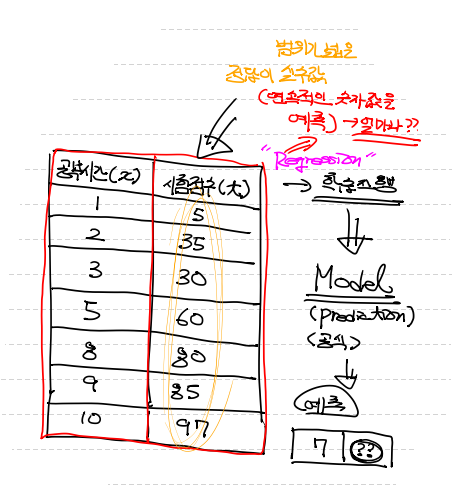
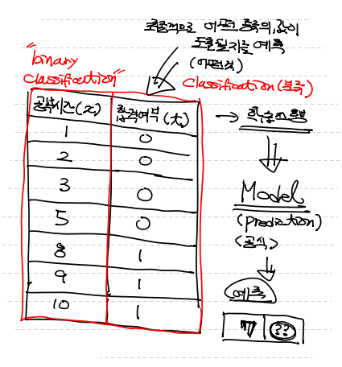
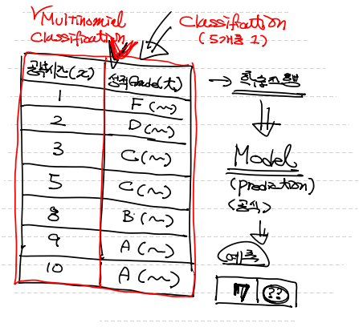

## AI 개념

- AI(Altificial intelligence)란 >>> 인간이 가진 특유의 `학습능력`, `추론능력`을 컴퓨터로 구현

- 머신러닝이란 >>> Data `학습` 후 `미지의 data`에 대한 `prediction(예측)`
  	: `AI`를 구현하기 위한 `하나의 방법` ==> 데이터의 `특성`과 `패턴`을 학습 ==> 미지의 데이터에 대한 `추정치`를 계산하는 프로그래밍 기법

## 다양한 Machine Learning 기법들

- Regression (통계, 회귀이론을 본떠 구현)
- SVM (Support Vector Machine)
- Decision Tree
- Random Forest
- Naive Bayes(수학 확률 기반)
- KNN
- Neural Network (신경망, 사람 사고 방식 = 딥러닝)
- Clustering(K-means, DBscan)
- Reinforcement Learning (강화학습)

## 딥러닝

> 머신러닝 기법 중 `Neural Network`를 의미 (CNN, RNN, LSTM, GAN)

## Data mining

> - 데이터의 상관관계를 파악한다
> - 새로운 feature(속성, 특징)를 알아낼 때 사용한다.

## ML 배경

> 1960's Explicit program으로 해결할 수 없는 문제를 해결하기 위해 등장했다!

- `Explicit program` 이란? 
  ==> Rule based programming
  ==> 프로그램이 이미 약속된 규칙 아래서 진행된다.
  ==> Rule이 너무 많아서 즉, 경우의 수(조건)이 너무 많아서 프로그램이 감당할 수 없는 경우가 많다.

  예) 바둑

## 머신러닝 Type (Data에 따라 즉, 학습방법에 따라 달라진다.)

- 지도합습(Supervised Learning) : Training Data Set(학습데이터셋) >>> 입력값(==x) , 결과값(lable == t)

- 비지도 학습(Unsupervised Learning) : lable이 없음,  데이터를 유사한 데이터끼리 clustering 즉, 군집화 한다.

- 준지도 학습(Semi-Supervised Learning) : 어떤 data에는 lable이 있고, 어떤 data에서는 없는... 섞여 있음 

  ==> 비지도 학습 먼저 진행해서 cluster 후 지도학습!

- 강화학습(Reinforcement Learning)

## 지도 학습

> lable(결과값)이 존재한다.

1. `Regression`(공부시간에 따른 시험점수 예측)

   

   

2. `Binary Classfication`(공부시간에 따른 시험 합격여부 예측)

   

3. `Multinomiel Classfication`(공부시간에 따른 성적grade 예측)

   