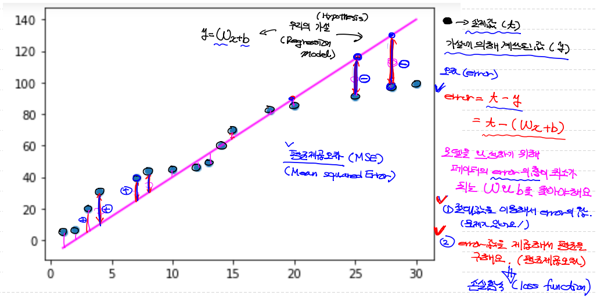
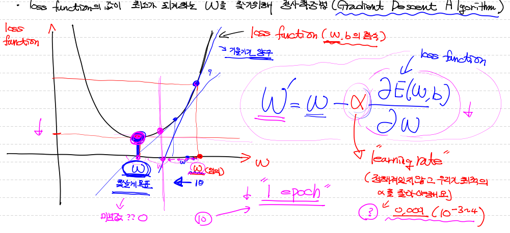
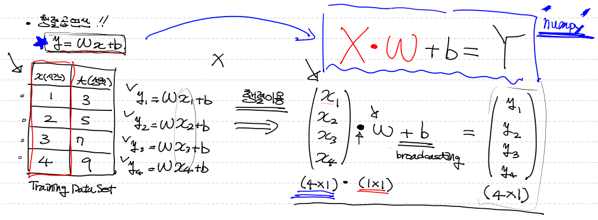
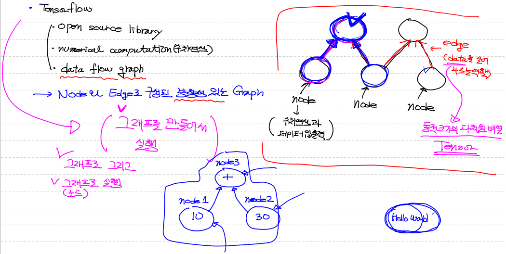

## 학습(Learning)

- `Classical linear regression model` : y = β0 + ∑βi xi (i=1 부터 p까지)
- 이 수학적인 식을 프로그램으로 바꾸면 ==> y = Wx + b (사용할 hypothesis(가정)모델)
  `W`:학습 가중치 , `b`:bias
- 초기 W와 b의 값은 랜덤 값
- 결국 `학습`이란 ==> 데이터를 가장 잘 표현하는 `W` 와 `b`를 찾아가는 과정


## 평균제곱오차(MSE)

> 실제값과 차이(오차)가 최소인 가설을 세우는 게 목적 == W와 b를 찾는 것!
>
> 즉, `평균제곱오차`(=`손실함수`)가 최소인 값을 구성하는 W와 b를 찾는 것!

- 실제값(t) / 가설에 의해 계산된 값(y)
- 오차(error) = t - y
              = t - (Wx + b)
- 가장 실제와 근접한 model(가설)을 완성하기 위해 error의 합이 최소가 되는 W, b의값을 찾아야 함!
- 각 error의 부호 때문에 특정 처리 없이 제대로 된 값을 구할 수 없어
- 절대값을 생각할 수 있지만, W 구하는 데 어려움이 발생해
- 결국 각 error 값을 제곱해서 평균을 구할거야 (== `평균제곱오차`)
- 이게 곧 ==> `손실함수(loss function)`에 이용될거야 `Classical linear regression model` 인 경우에 한해서!




## 손실 함수(loss function)

> cost function(비용 함수)
>
> 최소제곱법과 MSE는 다르다.
>
> 식 : `loss funcion = 1/n * ∑[tｉ - (Wxｉ + b)]² (i=1부터 n까지)`

- Training Data Set의 정답(t)와 입력 x에 대한 계산값(y = 모델의 예측값)의 차이를 모두 더해 수식으로 나타낸 식
- `최소제곱법`을 이용해서 loss function을 완성시키고 
  우리가 만든(MSE로 만든) loss function의 값이 최소가 되게하는 W와 b를 `학습 과정`을 통해 찾을 것이다. 
- `최소제곱법`이란 MSE로 만든 loss function을 최소가 되게끔 정의(define)해주는 method


## Gradient Descent Algorithm (경사하강법)

> loss function의 값이 최소인 w와 b를 찾기 위한 알고리즘
>
> learning rate == α (hyper-parameter) 부여
>
> 1 epoch : 1회 학습과정 진행

- 처음 w와 b의 값은 랜덤값을 부여한 후
- 최소가 아니면, 최소값을 찾을 수 있도록 w를 update 시키는 algorithm
- 식 : `W＇= W - α * ∂E(w,b)/∂w`    ==> E(w,b) : loss function  / α : 약 1e-3 ~ 1e-4 정도의 값을 부여
- weight에서 미분값(기울기)을 빼주는 이유는 w 값이 최소로 가기 위해서 판변할 수 잇는 기준 값이 w에 대한 미분값(기울기)이기 때문에!




## 행렬곱 연산

> 파이썬 코드로 위 loss function을 각 데이터 셋의 값으로 계산할 때 행렬곱 사용하면 수월하다.

y₁ = Wx₁ + b

y₂ = Wx₂ + b

y₃ = Wx₃ + b

y₄ = Wx₄ + b

- 위와 같은 다양한 데이터의 연산을 행렬곱을 통해!

- Y = XㆍW + b  (numpy 2차원 matrix로 구현)




## Tensorflow

> - Open Source Library
> - Numeric computation (수치 연산이 기본)
> - Data flow graph 구현 하는 것이 목적

==> Node와 Edge로 구성된 방향성 있는 Graph를 만든다.

`node`: 수치`연산` & data `입출력` 담당

`Edge`: Data를 실어나르는 역할 ==> 여기서 Data 란 : 동적 크기의 `다차원 배열`을 의미 ==> `Tensor`




```python
# Tensorflow 이용
# Google이 만든 Deep Learning Libray
# Tensorflow는 1.x버전과 2.x버전으로 나눠진다.
# 2019년 10월 Tensorflow 2.x번전 정식 release
# 1.x 버전은 low level의 코딩이 필요하다!
# 2.x 버전은 상위 API(Keras)가 기본으로 포함. ==> 구현이 쉬워짐.

# 사용하기 위해 라이브러리 설치! ==> Anaconda prompt ==> conda install tensorflow=1.15

import tensorflow as tf

# 내가 설치한 텐서플로 버전 확인 방법
print(tf.__version__)

# node 생성. (그냥 데이터 == 상수값)
node1 = tf.constant('Hello world')

# 출력
print(node1)
# ==> Tensor("Const:0", shape=(), dtype=string) : node 안에 들어가 있는 것을 알려준다.
# ==> Tensor가 있는데 그 Tensor는 data를 의미하고 그 data는 상수고, shape이 없고, type은 문자

# 그래프 실행하려면 1.x버전에서는 session이 필요하다.
# session은 tensorflow 그래프 안의 특정 노드를 실행시킬 수 있어요!
sess = tf.Session()

print(sess.run(node1))
# ==> b'Hello world'  (python 안에서 byte-string 형태로 처리 되서...)

print(sess.run(node1).decode())
# ==> Hello world

# tensorflow는 수치 연산이 주 목적이기 때문에 위처럼 문자 들어갈 일 없다!
```


```python
import tensorflow as tf

node1 = tf.constant(10, dtype=tf.float32)
node2 = tf.constant(30, dtype=tf.float32)

node3 = node1 + node2

# session은 tensorflow 그래프를 실행시키기 위해서 필요한데
# 1.x버전에서만 사용된다. 2.x버전에서는 삭제 됐음.
sess = tf.Session()

print(sess.run(node3))

# 여러개 node 실행시키고 싶을때 [] 활용
print(sess.run([node3, node1]))
# ==> [40.0, 10.0]
```

