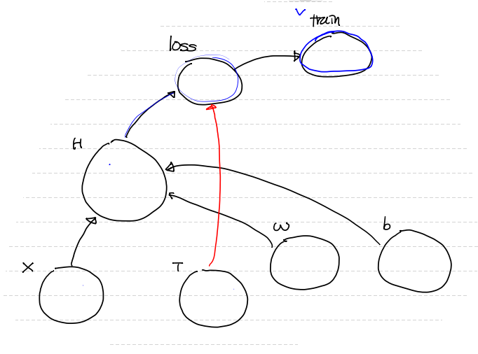

[Tensorflow_placeholder](https://github.com/lee-seunghoon/TIL/blob/master/AI_ML/%EB%A8%B8%EC%8B%A0%EB%9F%AC%EB%8B%9D(0224)%234.md#tensorflow_placeholder)

[Tensorflow --> Simple Linear Regression 구현](https://github.com/lee-seunghoon/TIL/blob/master/AI_ML/%EB%A8%B8%EC%8B%A0%EB%9F%AC%EB%8B%9D(0224)%234.md#tensorflow----simple-linear-regression-%EA%B5%AC%ED%98%84)

[Python --> Simple Linear Regression 구현](https://github.com/lee-seunghoon/TIL/blob/master/AI_ML/%EB%A8%B8%EC%8B%A0%EB%9F%AC%EB%8B%9D(0224)%234.md#python----simple-linear-regression-%EA%B5%AC%ED%98%84)

[sklearn --> Simple Linear Regression 구현](https://github.com/lee-seunghoon/TIL/blob/master/AI_ML/%EB%A8%B8%EC%8B%A0%EB%9F%AC%EB%8B%9D(0224)%234.md#sklearn----simple-linear-regression-%EA%B5%AC%ED%98%84)

---

## Tensorflow_placeholder

> 입력값을 주고 싶을 때 사용

```python
# Data Flow Graph에 입력값을 주려면 어떻게 해야 하나요?
# 입력값을 인자(parameter)로 주고 싶을때
# placeholder 사용!

import tensorflow as tf
import numpy as np

node1 = tf.placeholder(dtype=tf.float32)
node2 = tf.placeholder(dtype=tf.float32)

node3 = node1 + node2

sess = tf.Session()

result = sess.run(node3, feed_dict={node1 : 10,
                                    node2 : 20})
print(result)
```


---


## Tensorflow --> Simple Linear Regression 구현 

#0 라이브러리 등록

```python
import tensorflow as tf
import numpy as np
import pandas as pd
```


#1. `training data set` 구현

```python
# 행렬곱 때문에 2차원 matrix 형태로!
x_data = (np.array([1,2,3,4,5])).reshape(5,1) 
t_data = (np.array([3,5,7,9,11])).reshape(5,1)  # <<< lable
```


#2. `predict data` 구현

```python
# 입력값 형태로 X값을 가질 node , T값을 가질 node 생성

X = tf.placeholder(shape=[None,1], dtype=tf.float32)
T = tf.placeholder(shape=[None,1], dtype=tf.float32)

# placeholder에서 data 받을 때 2차원 이상이면 반드시 차원을 명시해줘야 한다!
# shape=[] 부여 >>> [None,1] >>> 열은 1열 고정! / 행(record)은 들어오는대로 맞춰서 쓸게 (==None)
# 행에 None을 주는 이유는 나중에 predict 할 때, 이 X placeholder를 사용할 거야 
# 근데 그때는 [1,1] 1개의 recorde만 필요해!
# X, T node는 상황에 따라 그 값이 달라질 수 있어서 유연하게 record shape를 만들 수 있도록!
```


#3. `Weight` & `bias` 변수  설정

```python
# tf.Variable : 값이 변하는 data를 가진 node를 만들어줌
# w의 초기값은 랜덤하게... >>> tensorflow가 제공해주는 정규분포 안의 난수 추출

W = tf.Variable(tf.random.normal([1,1]), name='weight') # >>> [1,1] : w를 matrix 형식으로 1개 구한다는 의미
b = tf.Variable(tf.random.normal([1], name='bias'))
```


#4. `Hypothesis` & `predict model`

```python
# ( y = Wx + b) ==> Y = X dot W + b (행렬곱을 사용, 2차원 matrix 필요)
H = tf.matmul(X,W) + b  # X와 W 순서로 행렬곱 : tf.matmul()
```


#5. W,b를 구하기 위해 평균제곱오차를 이용한 최소제곱법을 통해 `loss function` 정의

```python
# H : 예측값 / T : 실제값 / tf.square() : 제곱 / tf.reduce_mean() : 평균 구하는 메쏘드
loss = tf.reduce_mean(tf.square(H - T))
```


#6. train : 학습용 노드 (gradient descent algorithm 수행할 수 있는 객체)

```python
#  .minimize(loss) ==> loss function을 미분한다.
# 그러므로 결국 ==> train이라는 node는 경사하강법 알고리즘을 이용하여 w,b 갱신을 1번 작업해준다.
# optimizer는 손실 함수를 최소화하기 위해 조금씩 variable들을 변경한다.
# minimize란 조금씩 변하는 variable들을 최소화 하는 작업을 의미

train = tf.train.GradientDescentOptimizer(learning_rate=1e-3).minimize(loss)
```


#7. session 활성화

```python
sess = tf.Session()

# Variable은 바로 tensor로 부여하지 않고, 그냥 class 객체... 
# 그래서 node 안 tensor로 지정해주는 초기화 작업 반드시 필요 
sess.run(tf.global_variables_initializer())  # 2.x 넘어오면서 초기화 작업 없어짐
```


#8. 반복학습 진행

```python
# 1 epoch : training data set 전체 이용하여 1번 학습
# for문을 활용하여 30000번 학습

for step in range(30000):
    _, W_val, b_val, loss_val = sess.run([train, W, b, loss], 
                                         feed_dict={X : x_data, T : t_data})
    # 위처럼 train node는 내부적으로 w와 b를 갱신해주는 작업!
    # 그래서 그 결과값은 필요 없어 ==> _ 로 변수명 : 안 쓴다는 의미
    # w와 b와 loss 값을 같이 봐줄거야
    
    # 30000번 반복하면서 3000 배수 일때만 출력
    if step % 3000 == 0 :
        print('W: {}, b: {}, loss: {}'.format(W_val,b_val,loss_val))
```


#9. 학습 종료 후 최적의 w,b가 계산 ==> model 완성

```python
# prediction(예측)
# 예측하고 싶은 값을 2차원 matrix 형태로 줘야 행렬곱 계산 가능
result = sess.run(H, feed_dict={X:[[9]]})
print('예측값은:',result)
```





---


## Python --> Simple Linear Regression 구현 

#0 setting

```python
import numpy as np
```


#1. training data set

```python
x_data = np.array([1,2,3,4,5]).reshape(5,1)
t_data = np.array([3,5,7,9,11]).reshape(5,1)
```


#2. W, b 변수 설정

```python
W = np.random.rand(1,1)
b = np.random.rand(1)
```


#3. predict model 설정

```python
#   => 이건 학습이 다 끝나고, w, b 구한 후 ==> 예측할 때 쓸거야
#   => x는 2차원 matrix 형태!
def predict(x):
    y = np.dot(x,W)+b
    return y
```


#4. loss function (E(W,b))

```python
def loss_func(input_obj):
    # 최소제곱법을 이용 ==> 평균제곱오차
    # input_object 안에는 W와 b가 들어가 있다.
    # input_object ==> 리스트 형태로! [W, b]
    # loss function은 W와 b에 대한 함수인데 인자를 input_obj(1개) 준 이유는 
    # 이 loss_func을 우리가 만든 수치미분 함수를 활용 할 때, 인자 설정 때문에!
    
    input_W = input_obj[0]
    input_b = input_obj[1]
    
    # numpy의 행렬곱 처리는 np.dot()
    y = np.dot(x_data, input_W) + input_b # <<< 가설(hypothesis)
    
    # np.power(x,2) == x**2 == 즉, 넘파이 array 값들을 제곱승 하는 함수
    # return 값이 결국 최소제곱법을 이용한 평균제곱오차를 구현한 식 == loss function
    return np.mean(np.power((t_data - y),2))
```


#5. loss_func을 편미분 해줄 함수 필요

```python
# 이 함수는 다변수 함수의 각 변수에 대해 편미분 할 수 있도록 설정한 함수

def numerical_derivative(f,x):
    
    # f : 미분하려고 하는 다변수 함수
    # x : 모든 값을 포함하는 numpy array  / ex) f'(1.0 , 2.0)  ==> (8.0, 15.0)
    
    delta_x = 1e-4  # >>> 극한으로 가는 값
    derivative_x = np.zeros_like(x)  # x처럼 만들어서 0로 채워주세요 / x= shape / >>> (0, 0)  
    it = np.nditer(x, flags=['multi_index']) # 독립변수 x가 2행 2열인 matrix형태로 들어올 수 있다.

    while not it.finished:
        #현재의 인덱스를 추출해야 한다.
        idx = it.multi_index # ==> 튜플 형태로 주어진다.
        tmp = x[idx]    # 현재 index의 값을 잠시 보존
                        # delta_x를 이용한 값으로 ndarray를 수정한 후 편미분 계산
                        # 함수값을 계산한 후 원상복구를 해 줘야 다음 독립변수에 대한
                        # 편미분을 정상적으로 수행할 수 있다!
        # 편미분 시작
        x[idx] = tmp + delta_x
        fx_plus_delta = f(x) # x에 대해서 ==> f([1.00001, 2.0])  ==> f(x + delta_x)
                             # y에 대해서 ==> f([1.0, 2.00001])  ==> f(y + delta_x)   
        x[idx] = tmp - delta_x
        fx_minus_delta = f(x) # x에 대해서 ==> f([0.99999, 2.0])  ==> f(x - delta_x)
                              # y에 대해서 ==> f([1.0, 1.99999])  ==> f(y - delta_x)
        derivative_x[idx] = (fx_plus_delta - fx_minus_delta) / (2*delta_x)
        
        # x == (1.0, 2.0) 값 원상복귀
        x[idx] = tmp
        it.iternext()
        
    return derivative_x
```


#6. learning-rate 설정

```python
learning_rate = 1e-4
```


#7. 학습 진행 (W와 b를 갱신 <<< loss func을 최소화하도록)

```python
for step in range(300000):
    # np.concatenate() : 연결하는 것
    # .ravel() : 무조건 1차원으로 
    input_param = np.concatenate((W.ravel(), b.ravel()), axis=0) # >>> [W b]
    derivative_result = learning_rate * numerical_derivative(loss_func, input_param)
    W = W - derivative_result[:1].reshape(1,1)
    b = b - derivative_result[1:]
    
    if step % 30000 == 0:
        print('W:',W, 'b:',b)

'''
W: [[0.80798451]] b: [0.64996968]
W: [[2.00185289]] b: [0.9933105]
W: [[2.00067196]] b: [0.99757402]
W: [[2.00024369]] b: [0.99912021]
W: [[2.00008837]] b: [0.99968094]
W: [[2.00003205]] b: [0.99988429]
W: [[2.00001162]] b: [0.99995804]
W: [[2.00000422]] b: [0.99998478]
W: [[2.00000153]] b: [0.99999448]
W: [[2.00000055]] b: [0.999998]
'''
```


#8. 값 예측

```python
print(predict([[6]]))
# ==> [[13.00000268]]
```


## sklearn --> Simple Linear Regression 구현 

```python
# sklearn 이용 구현 (sklearn 먼저 prompt에서 설치해야 해)

import numpy as np
from sklearn import linear_model

#1. training data set
x_data = np.array([1,2,3,4,5]).reshape(5,1)
t_data = np.array([3,5,7,9,11]).reshape(5,1)

#2. linear regression model 만들기
#   ==> y = Wx + b ==> model form을 만들어줌
model = linear_model.LinearRegression()

#3. 학습 진행
#  >>> model.fit(입력값, 레이블값)
model.fit(x_data,t_data)

#4. Weight와 bias 확인해보자
print('W:',model.coef_, 'b:', model.intercept_)

#5. predict
print(model.predict([[9]]))
```

