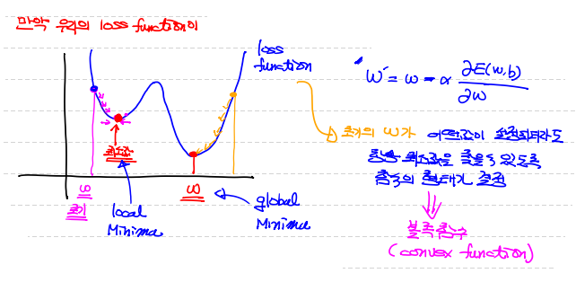
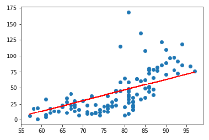
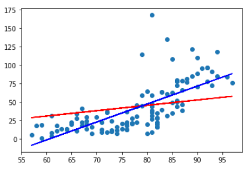
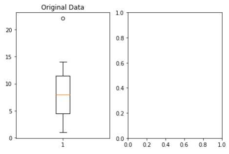
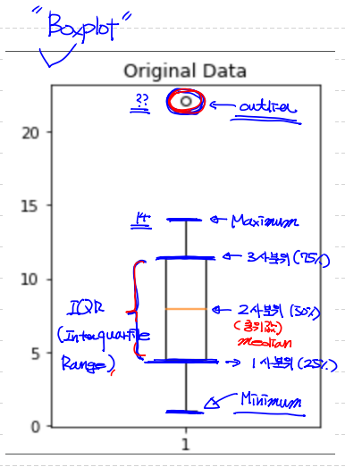
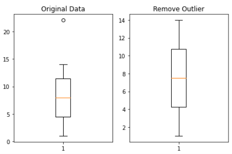
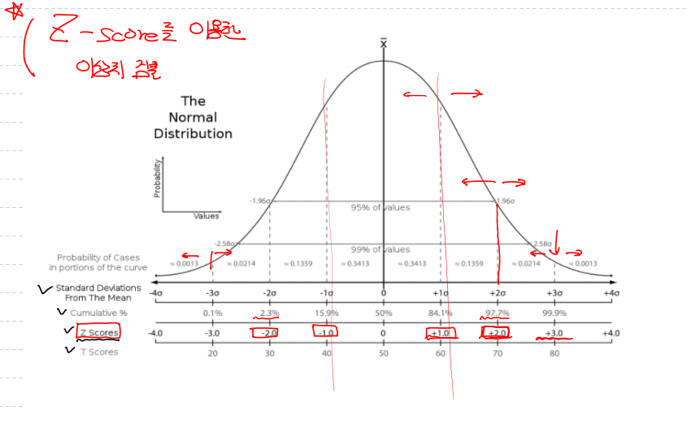
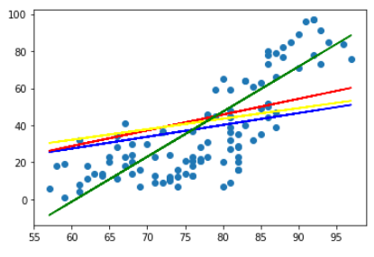

## Condex function

> 초기의 W가 어떤값이 설정되더라도 항상 최소값을 좇을 수 있는 함수의 형태
>
> 볼록 함수



---


## 데이터 전처리 (Data preprocessing) 

> 머신러닝에서 학습이 잘 되기 위해서는 `양질의 데이터`가 필요하다.
>
> 처리 대상
>
> 	1. 이상치
> 	2. 정규화


- 이상치 : 속성(feature)안에 들어 있는 값이 일반적인 값에 비해 편차가 큰 값
  - 지대점 : `독립변수`에 있는 이상치
  - outlier : `종속변수`(lable)에 있는 이상치
  - 이상치 검출 방법
    - Variance : 정규분포 이용해서 이상치 검출
    - Likelihood : 베이즈 정리 이용 (확률 방식) 
    - Nearest-Neighbor : 모든 데이터 상의 거리
    - Density : 카이제곱 분포 이용
  - 우리가 사용할 방법
    - Tukey Fense : 4분위 이용
    - Z-score : 정규분포와 표준편차 이용


- 정규화 :데이터 속성(feature)의 scale이 차이 나는 경우 처리 작업

  > 각 속성들이 단위, 중요도에 따라 가지고 있는 의미가 다르다.
  >
  > 그래서 동일 scale로 만들어주는 작업 필요

---


## Ozone data 실습 - `Tensorflow`

> Ozone data를 이용해서 Simple Linear Regression 구현
>
> 결측치만 제거


#1. training data set

```python
import numpy as np
import tensorflow as tf
import pandas as pd

df = pd.read_csv('./ozone.csv')
training_data = df[['Ozone','Temp']]
# display(training_data.shape) # ==> (153, 2)

'''
문제!! ==> 결측치가 존재한다.
해결!! ==> 1. 그냥 Na 삭제   
          2. Na 평균값으로 채우기 or 최대 or 최소 
          3. ML을 통해 유추한 값으로 nan 채우기
내가 사용하려는 데이터 양이 충분히 많을 때는 삭제하는 게 제일 좋다.
'''

# 삭제 진행
# 결측치만 찾아서 지우는 함수 == dropna(how=)
training_data = training_data.dropna(how='any')
# display(training_data.shape) # ==> 삭제 후 (116, 2)

x_data = training_data['Temp'].values.reshape(-1,1)
t_data = training_data['Ozone'].values.reshape(-1,1)
```


#2. Tensorflow Graph 그리기

```python
X = tf.placeholder(shape=[None,1], dtype=tf.float32)
T = tf.placeholder(shape=[None,1], dtype=tf.float32)

W = tf.Variable(tf.random.normal([1,1]), name='weight')
b = tf.Variable(tf.random.normal([1]), name='bias')
```


#3. Hypothesis & predict model

```python
H = tf.matmul(X,W)+b
```


#4. loss function

```python
loss = tf.reduce_mean(tf.square(H-T))
```


#5. Grediant Descent Algorithm optimizer ==> train

```python
train = tf.train.GradientDescentOptimizer(learning_rate=1e-4).minimize(loss)
```


#6. session과 초기화 작업!

```python
sess = tf.Session()
sess.run(tf.global_variables_initializer())
```


#7. 반복 학습

```python
for step in range(300000):
    _, loss_val, W_val, b_val = sess.run([train, loss, W, b], feed_dict={X:x_data, T:t_data})
    
    if step % 30000 == 0 :
        print('W:',W_val, 'b:',b_val, 'loss:',loss_val)
```


#8. 예측

```python
prediction = sess.run(H, feed_dict={X:[[85]]})
print(prediction)
# 값 : [[49.242783]]
```


#9. 그래프 모양 

```python
import matplotlib.pyplot as plt

plt.scatter(x_data, t_data)
plt.plot(x_data, x_data*W_val + b_val, color='red')
plt.show()
```



---


## Ozone data 실습 - `sklearn`

> Ozone data를 이용해서 Simple Linear Regression 구현
>
> 결측치만 제거


#1. Data set

```python
import numpy as np
import pandas as pd
from sklearn import linear_model
import matplotlib.pyplot as plt

df = pd.read_csv('./ozone.csv')
training_data = df[['Ozone','Temp']] 

trainin_data = training_data.dropna(how='any')

x_data = trainin_data['Temp'].values.reshape(-1,1)
t_data = trainin_data['Ozone'].values.reshape(-1,1)
```


#2. model 생성

```python
model = linear_model.LinearRegression() # ==> 선형회귀 모델 생성
```


#3. 학습(fit)

```python
model.fit(x_data, t_data)
```


#4. W와 b 값 확인

```python
print('W:', model.coef_, 'b:', model.intercept_)
# ==> W: [[2.4287033]] b: [-146.99549097]
```


#5. predict

```python
prediction = model.predict([[85]])
print(prediction)
# ==> [[59.44428994]]
```


#6. 그래프 확인

```python
plt.scatter(x_data, t_data)
plt.plot(x_data, (model.coef_ * x_data) + model.intercept_, color='blue')
plt.plot(x_data, (W_val * x_data) + b_val, color='red')
plt.show()
```



---


## 이상치 처리 방법 `①Tukey Fense`

> Boxplot 활용하여 4분위 그래프 확인하고, percentile 로 이상치 제거
>
> 이상치란 == 1사분위 - (IQR * 1.5) 미만 / 3사분위 + (IQR * 1.5) 초과
>
> IQR(Inter-quartile range) : 사분위수 범위  == 3사분위 - 1사분위


##### #1. 그래프 그릴 도화지 생성 (figure)

```python
import numpy as np
import matplotlib.pyplot as plt

data = np.array([1,2,3,4,5,6,7,8,9,10,11,12,13,14,22.1])

# figure 생성
fig = plt.figure()
```


#2. 도화지에 부분(sub) 그래프(plot) 추가

```python
# ==> 도화지에 부분(sub) 그래프(plot) 추가
fig_1 = fig.add_subplot(1,2,1) # ==> 1행 2열 1번째(1줄에 2개의 그래프 만들건데 그 중 첫번째 그래프)
fig_2 = fig.add_subplot(1,2,2)
```


#3. 첫번째 도화지에 4분위 그래프 그리기

```python
fig_1.set_title('Original Data')
fig_1.boxplot(data) # ==> 넣어준 data 값을 가지고 자동으로 4분위 그래프 그려줌
```




### `boxplot` 사분위수 그래프 설명

> 아웃라이어 빼고 minimum / 1사분위(25%) / 2사분위(중위값 50%) / 3사분위(75%) / maximum 을 그래프 show




#4. 이상치 값 구하기

```python
'''
이상치 구하기 위한 기준 ==> IQR

IQR(Inter-quartile Range) : 1사분위 ~ 3사분위 범위
IQR value : 3사분위 값 - 1사분위 값

Tukey fence 방식으로 이상치 구하기
1사분위 값 - (IQR value * 1.5) ==> 이 값보다 작은 값 (미만)
3사분위 값 + (IQR value * 1.5) ==> 이 값보다 큰 값 (초과)
'''

#번외 2사분위(중위값) 구하기
np.median(data)

# 1사분위
np.percentile(data, 25)

# 3사분위
np.percentile(data, 75)

# IQR
iqr_val = np.percentile(data, 75) - np.percentile(data, 25)

# 이상치 값 조건
upper_fense = np.percentile(data, 75) + (iqr_val * 1.5)
lower_fense = np.percentile(data, 25) - (iqr_val * 1.5)

# boolean mask
fense_mask = (data > upper_fense) | (data < lower_fense)
print(fense_mask)
# [False False False False False False False False False False False False False False True]

#이상치 값
outlier = data[fense_mask]
print(outlier) # ==> [22.1]
```


#5. Data에서 이상치 제거

```python
# 조건 반대로 주면 boolean mask 가 이상치 외 정상값에 True 부여
re_fense_mask = (data <= upper_fense) & (data >= lower_fense)

# 이상치 제거한 데이터
result = data[re_fense_mask]

fig.tight_layout()
fig.show()
```




## 이상치 처리 방법 `② Z-score`

> 정규분포와 표준편차 이용하여 이상치 검출

> scipy 모듈 이용!


#1. 이상치 임계치 설정

```python
import numpy as np
from scipy import stats

zscore_threshold = 1.8
# 2.0이 optimal value
```




#2. data 모든 값 zscore 변경

```python
data = np.array([1,2,3,4,5,6,7,8,9,10,11,12,13,14,22.1])

zscore_val = stats.zscore(data)
# ==> stats.zscore() : 각각의 값들을 zscore 값으로 변동
print(zscore_val)
'''
[-1.40160702 -1.21405925 -1.02651147 -0.8389637  -0.65141593 -0.46386816
 -0.27632038 -0.08877261  0.09877516  0.28632293  0.4738707   0.66141848
  0.84896625  1.03651402  2.55565098]
'''
```


#3. boolean mask 만들기

```python
# 음수 없애기 위해 절대값 부여
# np.abs()
zscore_val = np.abs(stats.zscore(data))

# 이상치 boolean mask 만들기
zscore_mask = zscore_val > zscore_threshold

# 앞에서 만든 zscore_threshold 보다 크면 이상치
print(zscore_mask)
# [False False False False False False False False False False False False False False True]

# 이상치 값 정의
outlier = data[zscore_mask]
# ==> [22.1]
```


#4. 기존 data에서 이상치값 제거

```python
# np.isin() 활용

print(np.isin(data, outlier))
'''
array([False, False, False, False, False, False, False, False, False,
       False, False, False, False, False, True])
'''

print(np.isin(data, outlier, invert=True)) # invert=True ==> 뒤집기
'''
array([True, True, True, True, True, True, True, True, True,
       True, True, True, True, True, False])
'''

# np.isin(data, outlier, invert=True) ==> 이게 boolean mask가 되면서
data = data[np.isin(data, outlier, invert=True)]
print(data) # ==> 이상치 제거
# [ 1.  2.  3.  4.  5.  6.  7.  8.  9. 10. 11. 12. 13. 14.]
```

---


## 적용 - Tukey Fense

```python
import numpy as np
import pandas as pd
import tensorflow as tf

#1. data_set
data = pd.read_csv('./ozone.csv')
train_data = data[['Ozone', 'Temp']]
train_data = train_data.dropna(how='any')

#1-1 Tukey fense 이상치 제거
iqr_val = np.percentile(train_data['Ozone'], 75) - np.percentile(train_data['Ozone'], 25)
upper_fense = np.percentile(train_data['Ozone'], 75) + (iqr_val*1.5)
lower_fense = np.percentile(train_data['Ozone'], 25) - (iqr_val*1.5)

fense_mask = (train_data['Ozone'].values <= upper_fense) & (train_data['Ozone'].values >= lower_fense)

new_ozone_data = train_data['Ozone'][fense_mask].values.reshape(-1,1)
new_temp_data = train_data['Temp'][fense_mask].values.reshape(-1,1)

#2 node 변수 설정
X = tf.placeholder(shape=[None,1], dtype=tf.float32, name='temp')
T = tf.placeholder(shape=[None,1], dtype=tf.float32, name='ozone')

W = tf.Variable(tf.random.normal([1,1]))
b = tf.Variable(tf.random.normal([1]))

#3. Hypothesis
H = tf.matmul(X,W) + b

#4. loss function
loss = tf.reduce_mean(tf.square(T - H))

#5. 학습 train
train = tf.train.GradientDescentOptimizer(learning_rate=1e-5).minimize(loss)

#5. session & 초기화
sess = tf.Session()
sess.run(tf.global_variables_initializer())

#6. 학습 진행
for step in range(50000):
    _, W_val_f, b_val_f, loss_val_f = sess.run([train, W, b, loss], feed_dict={X:new_temp_data, T:new_ozone_data})
    
    if step % 5000 == 0 :
        print('W:',W_val_f, 'b:',b_val_f, 'loss:',loss_val_f)

prediction = sess.run(H, feed_dict={X:[[85]]})
print(prediction)

'''
W: [[0.6380633]] b: [0.10049229] loss: 753.40247
W: [[0.54519]] b: [-0.10983906] loss: 679.66943
W: [[0.5478349]] b: [-0.3186545] loss: 678.79724
W: [[0.55047584]] b: [-0.5271601] loss: 677.92755
W: [[0.5531129]] b: [-0.7353599] loss: 677.0605
W: [[0.55574614]] b: [-0.94325376] loss: 676.1959
W: [[0.5583744]] b: [-1.1507593] loss: 675.3343
W: [[0.5610017]] b: [-1.3581835] loss: 674.47424
W: [[0.5636215]] b: [-1.5650218] loss: 673.6179
W: [[0.566241]] b: [-1.7718359] loss: 672.7629
[[46.37445]]
'''
```


## 적용 - Zscore

```python
# Data 전처리 후 sklearn과 비교
# 2. Z-score 방법

import numpy as np
import pandas as pd
import tensorflow as tf
from scipy import stats
import matplotlib.pyplot as plt

#1. Data_set
data = pd.read_csv('./ozone.csv')
training_data = data[['Ozone', 'Temp']]


#2. 입력값, lable값 node 구성
X = tf.placeholder(shape=[None,1], dtype=tf.float32, name='temp')
T = tf.placeholder(shape=[None,1], dtype=tf.float32, name='ozone')

#3. 근데 data 안에 결측치들 좀 없애주고 data 지정해주자
training_data = training_data.dropna(how='any')

#3-1 우리 데이터 중에서 이상치가 있는 것 같다... Z-score 방식으로 제거해보자.
# 먼저 zscore_threshold 값을 주자
zscore_threshold = 1.8

# 이상치 검출하고 싶은 data 값을 모두 zscore로 바꾸자
ozone_data = stats.zscore(training_data['Ozone'])

# Z-score 방식으로 검출한 이상치
outliar = ozone_data[np.abs(ozone_data > zscore_threshold)]

# 기존 data에서 이상치만 제거하는 boolean mask 생성
outliar_rm_mask = np.isin(ozone_data, outliar, invert=True)

# 오존 data에서 이 boolean mask로 data 이상치 빼자
ozone_outliar_rm_data = training_data['Ozone'][outliar_rm_mask]
temp_outliar_rm_data = training_data['Temp'][outliar_rm_mask]

x_data = temp_outliar_rm_data.values.reshape(-1,1)
t_data = ozone_outliar_rm_data.values.reshape(-1,1)
befor_x_data = training_data['Temp'].values.reshape(-1,1)
befor_t_data = training_data['Ozone'].values.reshape(-1,1)

#4. W 와 b 변수들 필요해~ (계속 변하는 값들이니깐 Variable 줘야지)
W = tf.Variable(tf.random.normal([1,1]))
b = tf.Variable(tf.random.normal([1]))

#5. predict model
H = tf.matmul(X,W) + b

#6. loss function
loss = tf.reduce_mean(tf.square(H - T))

#7. 학습 train node 생성
train = tf.train.GradientDescentOptimizer(learning_rate=1e-4).minimize(loss)

#8. session & initializer
sess = tf.Session()
sess.run(tf.global_variables_initializer())

#9. 학습 시작
# 이상치 Z-score로 제거한 data
for step in range(30000):
    _, W_val, b_val, loss_val = sess.run([train, W, b, loss], feed_dict={X:x_data, T:t_data})
    
    if step % 3000 == 0 :
        print('W:',W_val, 'b:',b_val, 'loss:',loss_val)
prediction = sess.run(H, feed_dict={X:[[85]]})
print(prediction)

print()
#기존 data 사용
for step in range(30000):
    _, W_val_b, b_val_b, loss_val_b = sess.run([train, W, b, loss], feed_dict={X:befor_x_data, T:befor_t_data})
    
    if step % 3000 == 0 :
        print('W:',W_val_b, 'b:',b_val_b, 'loss:',loss_val_b)
prediction = sess.run(H, feed_dict={X:[[85]]})
print(prediction)


'''
W: [[0.439419]] b: [0.02379459] loss: 964.4087
W: [[0.51327616]] b: [-1.076308] loss: 487.93335
W: [[0.52717775]] b: [-2.1675487] loss: 483.96338
W: [[0.54095787]] b: [-3.2492523] loss: 480.06244
W: [[0.5546176]] b: [-4.321503] loss: 476.22937
W: [[0.5681578]] b: [-5.3843737] loss: 472.46307
W: [[0.5815796]] b: [-6.437954] loss: 468.7623
W: [[0.59488404]] b: [-7.482316] loss: 465.126
W: [[0.6080726]] b: [-8.51758] loss: 461.55292
W: [[0.6211451]] b: [-9.543742] loss: 458.04218
[[43.33783]]

W: [[0.7176989]] b: [-10.559953] loss: 850.91595
W: [[0.7169738]] b: [-11.741509] loss: 817.8703
W: [[0.7317963]] b: [-12.91273] loss: 813.2973
W: [[0.74648887]] b: [-14.073671] loss: 808.8036
W: [[0.76105607]] b: [-15.224715] loss: 804.38684
W: [[0.77549946]] b: [-16.365976] loss: 800.04553
W: [[0.78981066]] b: [-17.496788] loss: 795.78125
W: [[0.8040012]] b: [-18.618069] loss: 791.5894
W: [[0.818073]] b: [-19.729958] loss: 787.4688
W: [[0.8320167]] b: [-20.83174] loss: 783.421
[[49.97238]]
'''
```


## 그래프 집합

```python
plt.scatter(x_data.ravel(),t_data.ravel()) # ==> zscore에서 이상치 제거된 데이터 산점도

# tensorflow
plt.plot(x_data, (W_val * x_data) + b_val, color='b') # ==> zscore에서 이상치 제거된 prediction 직선
plt.plot(befor_x_data, (W_val_b * befor_x_data) + b_val_b, color='r') # ==> 이상치 제거 안 된 기존 prediction 직선
plt.plot(new_temp_data, (W_val_f * new_temp_data) + b_val_f, color='yellow') # ==> tukey fense로 이상치 제거된 prediction 직선

#sklearn
plt.plot(x_data, (model.coef_ * x_data) + model.intercept_, color='green') # zscore로 이상치 제거된 prediction 직선 

plt.show()
```



