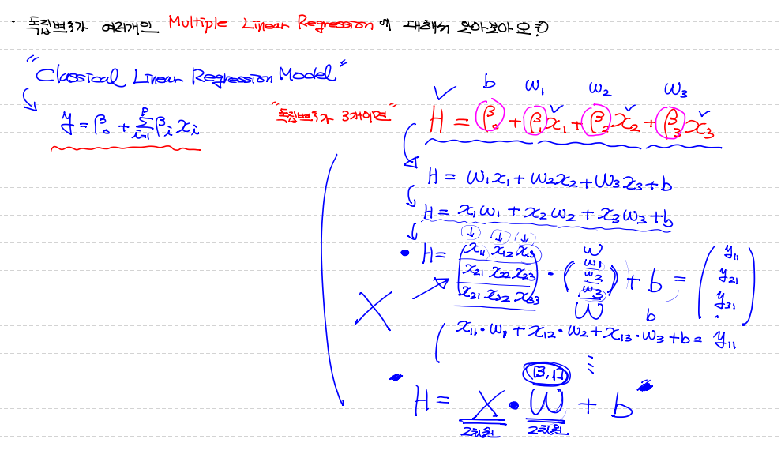

## Normalization (정규화)

> 비율을 이용해서 data의 scale을 조정한다. (0~1 scale로)
>

- 프로그램은 숫자로 data를 판단하기 때문에 범위가 큰 속성(feature)의 data에 가중치를 더 크게 준다.
- 즉, 정규화란 ==> 모든 속성의 data를 동일한 scale로 조정하는 작업


### 정규화 방법

- **`Min Max Normaliztion`**
- **`Z score Normalization (= standardization)`**

---


## Min Max Normalization

> data 정규화의 가장 일반적인 방법

> 모든 feature의 값을 최소값0 ~ 최대값1 로 변환!

- 식 : Xscaled = x - xmin / xmax - xmin
- 한계, 단점 ==> `이상치`에 민감함 ==> 이상치 처리가 반드시 필요


## Z score Normalization (= standardization)

> 식 : Xscaled = (xi - μi) / σi 
>
> ==> μ : 평균 , σ : 표준편차

장점 : Min Max에 비해 이상치에 덜 민감함!

단점 : 동일한 scale을 적용할 수 없다.


## Multiple linear Regression

> 기존 simple linear Regression에서 사용했던 Ozone data 그대로 사용


#0. 라이브러리 등록

```python
import numpy as np
import pandas as pd
import tensorflow as tf
from scipy import stats # ==> zscore 이상치 제거시 사용
from sklearn.preprocessing import MinMaxScaler, StandardScaler
# ==> Min Max Normalization 정규화 작업 시 사용
from sklearn import linear_model
```


#1. training data set

```python
# Raw Data loading
df = pd.read_csv('./ozone.csv')

# 학습에 필요한 데이터 추출
training_data = df[['Temp', 'Wind', 'Solar.R', 'Ozone']]

# 결측치 처리
training_data = training_data.dropna(how='any')
```


#2. 2개 이상 독립변수 이상치 처리!

```python
# 이상치 처리 (Z-score)
zscore_threshold = 1.8

# 모든 독립변수 data 이상치 처리를 위해 for문 사용!
# training_data.columns ==> 칼럼명을 list로 return ==> Index(['Temp', 'Wind', 'Solar.R', 'Ozone'], dtype='object')
for column in training_data.columns:
    outlier = ~(np.abs(stats.zscore(training_data[column]))>zscore_threshold)
    training_data = training_data.loc[outlier]
```


#3. 정규화 

```python
# Min Max Normalization 정규화 작업

# step1. 독립변수용, 종속변수용 MinMaxScaler 객체 생성
scaler_x = MinMaxScaler()
scaler_y = MinMaxScaler()

# step2. 각 객체에 scale 할 data 자료를 넣어준다.
scaler_x.fit(training_data[['Temp', 'Wind', 'Solar.R']].values) #==> column 값이 2개 이상이여서 value값 2차원 matrix로 나온다!
scaler_t.fit(training_data['Ozone'].values.reshape(-1,1))

# step3. 넣어줬던 data를 scale 적용 값으로 변화시켜준다.
training_data_x = scaler_x.transform(training_data[['Temp', 'Wind', 'Solar.R']].values)
training_data_t = scaler_t.transform(training_data['Ozone'].values.reshape(-1,1))
```


#4. Tensorflow graph 그리기

```python
# 주의 해야 할 점! ==> 독립변수 개수가 늘었다. 
#				 ==> 독립변수 feature 개수만큼 column 개수 동일하게 설정해줘야해!

#placeholder
X = tf.placeholder(shape=[None,3], dtype = tf.float32)
T = tf.placeholder(shape=[None,1], dtype = tf.float32)

# Weight & bias
W = tf.Variable(tf.random.normal([3,1]), name='weight')
b = tf.Variable(tf.random.normal([1]), name='bias')
```




#5. H, Loss, train node 구성 및 session 처리

```python
# Hypothesis
H = tf.matmul(X, W) +b

# loss func
loss = tf.reduce_mean(tf.square(H-T))

# train
train = tf.train.GradientDescentOptimizer(learning_rate=1e-4).minimize(loss)

# session & 초기화
sess = tf.Session()
sess.run(tf.global_variables_initializer())
```


#6. 학습

```python
for step in range(300000):
    _, W_val_, b_val_, loss_val_ = sess.run([train, W, b, loss], feed_dict={X:training_data_x, T:training_data_t})
   
    if step % 30000 == 0:
        print('W: {}, b: {}, loss: {}'.format(W_val_, b_val_, loss_val_))

'''
W: [[-0.51495576]
 [-0.72998077]
 [-0.00325278]], b: [-0.10185225], loss: 1.2817879915237427
W: [[ 0.04303833]
 [-0.5117772 ]
 [ 0.2741661 ]], b: [0.436832], loss: 0.048259951174259186
W: [[ 0.20418063]
 [-0.5373453 ]
 [ 0.23196772]], b: [0.38656956], loss: 0.03780609369277954
W: [[ 0.3169245 ]
 [-0.5369712 ]
 [ 0.20450184]], b: [0.34121242], loss: 0.032575126737356186
W: [[ 0.39818707]
 [-0.52384967]
 [ 0.18716404]], b: [0.30072755], loss: 0.02964688464999199
W: [[ 0.45846808]
 [-0.5051706 ]
 [ 0.176687  ]], b: [0.26494], loss: 0.02784629724919796
W: [[ 0.50445694]
 [-0.48539168]
 [ 0.17088628]], b: [0.23362677], loss: 0.02666599303483963
W: [[ 0.54022396]
 [-0.46596637]
 [ 0.16810428]], b: [0.20629181], loss: 0.02585749886929989
W: [[ 0.56869555]
 [-0.44801864]
 [ 0.16722731]], b: [0.1825318], loss: 0.025288665667176247
W: [[ 0.5917122 ]
 [-0.4319454 ]
 [ 0.16761315]], b: [0.1619703], loss: 0.02488287165760994
'''
```


#7. 예측

```python
# 독립변수 3개 값 2차원 매트릭스로 (1,3) 형태로 주기
predict_data = np.array([80, 10, 150]).reshape(1,3)

# 중요한 게 우리 학습한 data는 raw data에서 정규화된 data로 진행한거야 그래서!
# predict할 data도 정규화된 data로 줘야 해!
# scaler_x.fit 은 이미 raw_data로 돼 있어서 따로 할 필요 없고,
# 변동만 시켜주기
scaled_predict_data = scaler_x.transform(predict_data)

# 예측모델 run!
scaled_result = sess.run(H, feed_dict={X:scaled_predict_data}) 

# 값이 정규화된 값이겠지? 이걸 다시 원상복구!!
real_result = scaler_t.inverse_transform(scaled_result)
print(real_result) # ==> [[38.794586]]
```


#8. sklearn 비교

```python
# model 생성
model = linear_model.LinearRegression()

# model 학습 (fit)
# 주의 해야 할 점은! sklearn은 내부적으로 정규화알아서 진행해준다!
# 그래서 결측치, 이상치 작업이 완료된 data를 넘겨준다.

model.fit(training_data[['Temp', 'Wind', 'Solar.R']].values,
          training_data['Ozone'].values.reshape(-1,1))

print('W: {}, b: {}'.format(model.coef_, model.intercept_))
# ==> W: [[ 1.9400749  -2.7453281   0.05651878]], b: [-97.42698439]

# 예측(prediction)
sklearn_prediction = model.predict([[80, 10, 150]])
print(sklearn_prediction) # ==> [[38.8035437]]
```

