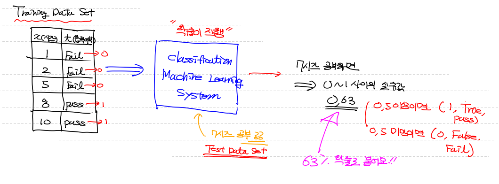
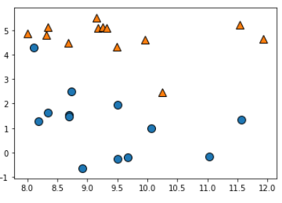
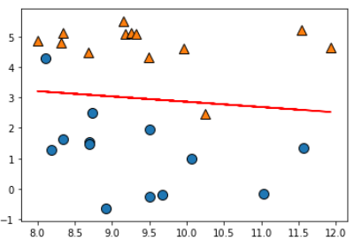
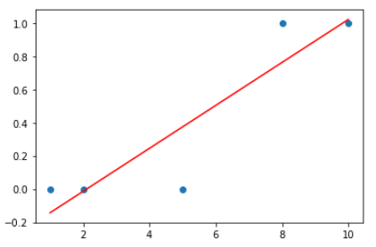
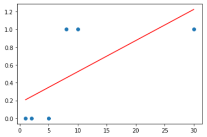
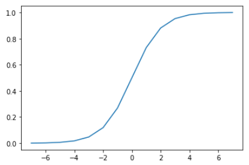
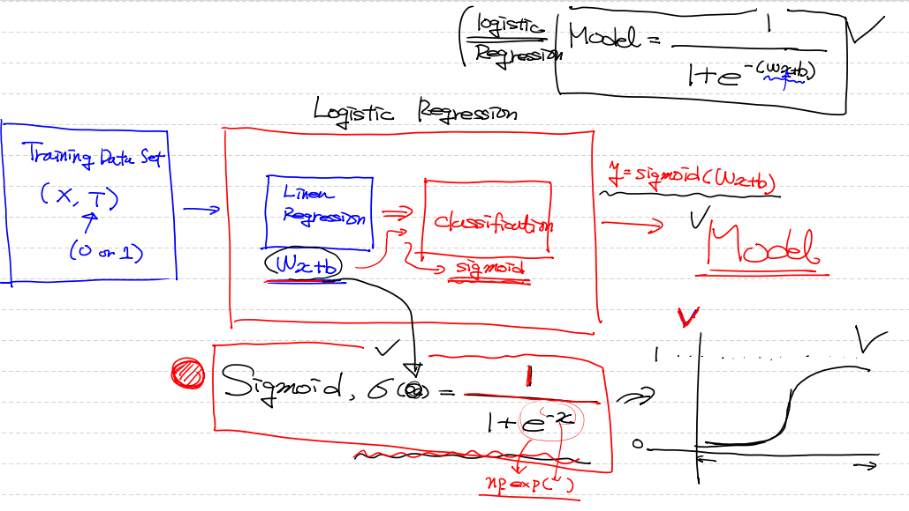
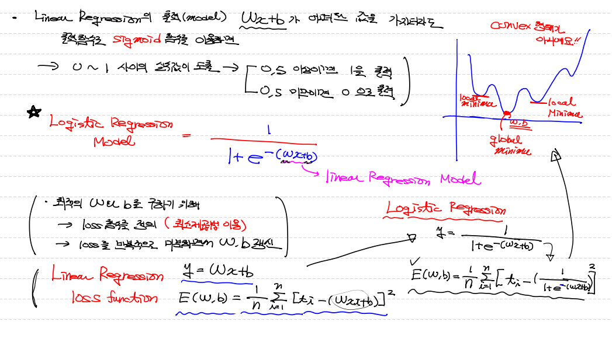
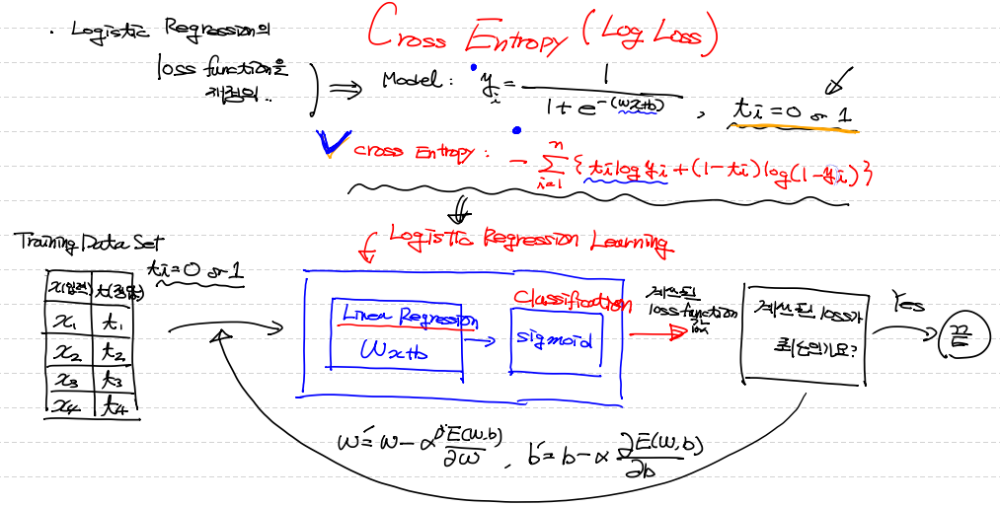

## Classification

> training data set의 특징과 분포를 이용하여 학습 한 후
>
> 미지의 data에 대해 결과가 어떤 종류의 값으로 **`분류`**될 수 있는지 예측하는 작업
>
> - binary classification
> - Multinomial classification

> ex) Email-spam 판별 / 주가 오를지 떠러질지 /  MRL 사진으로 악성 종양 판별 / 신용카드 사용시 도난 여부


---


## Logistic Regression

> - linear regression과 가장 큰 차이 ==> **`predict 모델 기준`**으로 영역을 구분하여 판별하는 것!
> - Classification 알고리즘 중 정확도가 상당히 높은 알고리즘
> - 그래서 `Deep Learning 기본 요소(component)`로 사용!
> - Logistic Regression은 traing data set을 받아서 linear regression을 먼저 만든 후 classification 진행



#### <linear regression으로 classfication 구현>

(training data set)

```python
import numpy as np
from sklearn import linear_model
import mglearn # ==> Data set을 가져오기 위한 Utility module
import warnings # ==> warning을 출력하지 않도록 처리하기 위한 import
import matplotlib.pyplot as plt

# warning을 끄기 위해서
warnings.filterwarnings(action='ignore')

# Training Data Set
# mglearn이 가지고 있는 dataset을 가져오기
x,y = mglearn.datasets.make_forge() # ==> 결과가 튜플로 나온다

# print(x)  # ==> 좌표를 들고 있어요! (x축좌표, y축좌표)
# print(y)  # ==> 값을 어떤 형태로 찍을지
```


(graph 그리기)

```python
# 그래프 그리기 ==> mglearn.discrete_scatter(x축의 값, y 축값, 점의 형태) 
# x[행,열] ==> x[:,0] 행은 전체 행 다 가져오고, column은 0번째 column을 가져와라
mglearn.discrete_scatter(x[:,0], x[:,1], y)
```



(Linear Regression으로 학습)

```python
# Linear Regression으로 학습
# 가장 잘 표현하는 직선 그린다.
model = linear_model.LinearRegression()
model.fit(x[:,0].reshape(-1,1),x[:,1].reshape(-1,1))

# Linear regression으로 구한 Weight 와 bias를 출력
print(model.coef_, model.intercept_) # ==> [[-0.17382295]] [4.5982984]]
```


(Linear Regression 직선과 합쳐서 그래프 그리기)

```python
plt.plot(x[:,0], model.coef_.ravel() * x[:,0] + model.intercept_)
plt.show()
```




---


## Linear Regression으로 classification을 할 수 없을까?

> 꼭, Logistic Regression으로만 해야 하나?

> 안되는 이유!
>
> - linear regression은 기본적으로 `직선`
> - data 범위에 따라 결과가 0 과 1 사이를 넘어서 나올 수 있다.
> - 즉, training data set 에 따라 정확하지 않은 model이 나올 수 있다.

> 이 문제를 해결하기 위해서 **`logistic regression`** 이 필요하다.
>
> - 즉, 직선이 아니라 `S자 모양`의 곡선


(새로운 data를 통해 예제)

```python
import numpy as np 
from sklearn import linear_model
import matplotlib.pyplot as plt

# Training Data Set
x_data = np.array([1,2,5,8,10]) # ==> 공부 시간
t_data = np.array([0,0,0,1,1]) # ==> 합격여부 (0: fail / 1: pass)

model = linear_model.LinearRegression()
model.fit(x_data.reshape(-1,1), t_data.reshape(-1,1))
print('기울기 :', model.coef_, '절편 :',  model.intercept_)
# ==> 기울기 : [[0.1292517]] 절편 : [-0.27210884]

plt.scatter(x_data, t_data)
plt.plot(x_data, x_data * model.coef_.ravel() + model.intercept_, color='red')
plt.show()

print(model.predict([[7]])) # ==> [[0.63265306]] 
                            # ==> 0.5보다 크기 때문에 pass(1)로 간주 할 수 있다.
    
# 그러면 시험에 통과하려면 적어도 몇시간 공부해야 하나요?
# (x_data * model.coef_.ravel() + model.intercept_) > 0.5  ==> 우리가 원하는 것은 x_data
print((0.5 - model.intercept_)/model.coef_.ravel()) # ==> [5.97368421]
# 즉, 6시간 이상을 돼야!
```



(다 똑같은데 data set range만 달라짐)

```python
import numpy as np 
from sklearn import linear_model
import matplotlib.pyplot as plt

# Training Data Set ★★★★★ 이 부분이 달라짐
x_data = np.array([1,2,5,8,10,30]) # ==> 공부 시간
t_data = np.array([0,0,0,1,1,1]) # ==> 합격여부 (0: fail / 1: pass)

model = linear_model.LinearRegression()
model.fit(x_data.reshape(-1,1), t_data.reshape(-1,1))
print('기울기 :', model.coef_, '절편 :',  model.intercept_)
# ==> 기울기 : [[0.03500583]] 절편 : [0.17327888]

plt.scatter(x_data, t_data)
plt.plot(x_data, x_data * model.coef_.ravel() + model.intercept_, color='red')
plt.show()

print(model.predict([[7]])) # ==> [[0.41831972]]
							# ==> 위와 다르다... 0.5보다 작아서 불합격
    
# 이 data에서는 시험에 합격하려면 몇시간 이상 공부해야 하나?    
print((0.5 - model.intercept_)/model.coef_.ravel()) # ==> [9.33333333]
# 즉, 9시간 이상...
```




## Sigmoid 함수

> 위와 같은 문제를 해결하기 위해 Sigmoid 함수 사용
>
> **`Sigmoid 함수`** : 0 과 1 사이의 실수 값으로 s자 곡선 모양 그래프 출력
>
> 
>
> `Linear Regression model` : y = Wx+b ==> 어떠한 값을 가지더라도, 출력함수로 sigmoid 함수 이용하면 0~1 사이 실수값 도출
>
> 이것을 **`logistic Regression`** 이라 한다.




## Logistic Regression

> `Logistic Regression Model` = 1 / (1 + e^-(Wx+b)) == Sigmoid, σ(Wx+b)
>
> - 우리의 목적은 최적의 W와 b를 구하기 위해 loss 함수를 정의하고 미분해서 W와 b를 구하는 것!
> - Linear Regression 
>   - model : y = Wx + b
>   - loss_function : Σ [ti - (Wxi + b)]² / n
> - Logistic Regression
>   - model : y = 1 / (1 + e^-(Wx+b))
>   - loss_function : Σ {ti - [1 / (1 + e^-(Wx+b)]}² / n

**그런데!!!!**

> 저 Logistic Regression의 loss_function을 graph로 그려봤을 때!
>
> convex 함수 모양이 아니다 (그래서 많은 local minimum이 존재한다.)
>
> - **`convex 함수란`** : 어떤 입력값을 주어도, `Gradient_Descent_Algorithm`에 의해 `Global minimun` 값을 찾을 수 있는 함수다




## Cross Entropy (Log Loss)

> - Logistic Regression의 loss function이 convex function이 아니기 때문에 바꿔줘야 한다.
> - 그 바꾼 함수를 **`Cross Entropy(or Log Loss)`** 라 한다.
> - 즉, Logistic Regression의 loss function을 convex function으로 **`재정의`**

> model : y = 1 / (1 + e^-(Wx+b))
>
> t(lable) : 0 or 1
>
> Cross entropy : - Σ {tｉ×logｙｉ + (1 - tｉ)×log(1 - ｙｉ)} (i= 1 ~ n)

> 전체 process flow
>
> - **`Training Data Set >>> Linear Regression model >>> sigmoid 적용 >>> Logistic Regression model >>> Cross Entropy >>> Loss func 미분`** >>> 반복




# 구현(coding)

### `Python version`

```python
# 공부시간에 따른 시험 합격여부에 데한 데이터로 학습 후 prediction
# 독립변수는 공부시간 1개만 사용

import numpy as np
import tensorflow as tf
from sklearn import linear_model

def numerical_deriviate(f,x):
    delta_x = 1e-4
    deriviate_x = np.zeros_like(x)
    it = np.nditer(x, flags=['multi_index'])
    
    while not it.finished:
        idx = it.multi_index
        tmp = x[idx]
        
        x[idx] = tmp +delta_x
        fx_plus_delta = f(x)
        
        x[idx] = tmp -delta_x
        fx_minus_delta = f(x)
        
        deriviate_x[idx] = (fx_plus_delta - fx_minus_delta) / (2 * delta_x)
        
        x[idx] = tmp
        it.iternext()
    
    return deriviate_x
```


(training data set)

```python
x_data = np.arange(2,21,2).reshape(-1,1) # 공부시간(독립변수)
t_data = np.array([0,0,0,0,0,0,1,1,1,1]).reshape(-1,1) # 합격여부(14시간 부터 1)

# Weight & bias 변수  설정
W = np.random.rand(1,1)
b = np.random.rand(1)
```


(loss function)

```python
def loss_function(input_obj):
    input_w = input_obj[0].reshape(1,1)
    input_b = input_obj[1]
    
    # Linear regression의 hypothesis
    linear_h = np.dot(x_data, input_w) + input_b
    
    # Logistic regression의 hypothesis
    y = 1 / (1 + np.exp(-1 * linear_h))
    
    # log 값이 무한대로 발산할 수 있어서 아주 작은 값 한개 추가
    delta = 1e-7
    
    # Cross Entropy (Sigmoid)
    return -np.sum(t_data * np.log(y + delta) + (1 - t_data) * np.log(1 - y + delta))
```


(수치 미분 학습)

```python
learning_rate = 1e-4

for step in range(300000):
    input_param = np.concatenate((W.ravel(),b.ravel()), axis=0)
    derivative_result = learning_rate * numerical_deriviate(loss_function, input_param)
    
    W = W - derivative_result[0].reshape(1,1)
    b = b - derivative_result[1]
    
    if step % 30000 == 0 :
        input_param = np.concatenate((W.ravel(), b.ravel()), axis=0)
        print(W.ravel(), b, loss_func(input_param))
        
'''
[0.16067869] [0.58943996] 11.54742786442057
[0.25873569] [-3.03738846] 2.972686370011623
[0.37436678] [-4.58609755] 2.1502014380971697
[0.451608] [-5.61764479] 1.790659106299914
[0.5113091] [-6.41293645] 1.5778093447038801
[0.56078027] [-7.0705363] 1.4325150997666787
[0.60346999] [-7.63696105] 1.3248014440738447
[0.64129478] [-8.13805906] 1.2405370271401808
[0.67543719] [-8.58977243] 1.1720810242985704
[0.70668204] [-9.0026741] 1.1148928645975935
'''
```


(Logistic Regression 적용 예측)

```python
def logistic_predict(x):
    z = np.dot(x, W) + b
    y = 1 / (1 + np.exp(-1,z))
    
    if y < 0.5 :
        result = 0
    else:
        result = 1
    return result, y

study_hour = np.array([[13]])
print(logistic_predict(study_hour)) # ==> (1, array([[0.54447305]])) : 합격, 54.4%
```


---


### `sklearn version`

```python
# 같은 내용을 sklearn 이용해서 구현
model = linear_model.LogisticRegression()

# logistic model에서 tdata는 1차원 vector 형태로 들어가야 한다. 그렇게 설정 돼 있다.
model.fit(x_data, t_data.ravel())

study_hour = np.array([[13]])
print(model.predict(study_hour)) # ==> [0]

# 확률값도 알아보자
result_probablity = model.predict_proba(study_hour)
print(result_probablity) # ==> [[0.50009391 0.49990609]] ==> 0.49990609
```


---


### `Tensorflow version`

(import)

```python
import numpy as np
import tensorflow as tf
```


(Training Data Set)

```python
x_data = np.arange(2,21,2).reshape(-1,1) # 공부시간(독립변수)
t_data = np.array([0,0,0,0,0,0,1,1,1,1]).reshape(-1,1) # 합격여부(14시간 부터 1)
```


(Tensor Graph)

```python
X = tf.placeholder(dtype=tf.float32)
T = tf.placeholder(dtype=tf.float32)

W = tf.Variable(tf.random.normal([1,1]), name='weight')
b = tf.Variable(tf.random.normal([1]), name='bias')
```


(Hypothesis)

```python
logit = tf.matmul(X, W) + b

# sigmoid method 사용
H = tf.sigmoid(logit)
```


(loss function)

```python
# tf.nn.sigmoid_cross_entropy_with_logits(logits=sigmoid 적용시켜서 cross entropy 적용할 값 , labels=결과값)
loss = tf.reduce_mean(tf.nn.sigmoid_cross_entropy_with_logits(logits=logit, labels=T))
```


(train & 학습)

```python
# loss function(Cross Entropy)
loss = tf.reduce_mean(tf.nn.sigmoid_cross_entropy_with_logits(logits=logit, labels=T))

# train
train = tf.train.GradientDescentOptimizer(learning_rate=1e-4).minimize(loss)

# session & init
sess = tf.Session()
sess.run(tf.global_variables_initializer())

# 학습
for step in range(300000):
    _, W_val, b_val, loss_val = sess.run([train, W, b, loss], feed_dict={X:x_data, T:t_data})
    
    if step % 30000 == 0 :
        print('W : {}, b : {}, loss : {}'.format(W_val, b_val, loss_val))

'''
W : [[-2.1231456]], b : [-0.43690252], loss : 14.617721557617188
W : [[0.0893756]], b : [-0.75503075], loss : 0.5398838520050049
W : [[0.12093459]], b : [-1.1831807], loss : 0.47834181785583496
W : [[0.1485535]], b : [-1.5563031], loss : 0.43161019682884216
W : [[0.17299789]], b : [-1.8856273], loss : 0.3952145278453827
W : [[0.19485955]], b : [-2.1797264], loss : 0.3661837577819824
W : [[0.2146459]], b : [-2.445568], loss : 0.3424883782863617
W : [[0.23268728]], b : [-2.68785], loss : 0.32280105352401733
W : [[0.2492645]], b : [-2.9103162], loss : 0.30618253350257874
W : [[0.2646413]], b : [-3.116584], loss : 0.2919151782989502
'''
```


(prediction)

```python
study_hour = np.array([[13]])
result = sess.run(H, feed_dict={X:study_hour}) 
print(result) # ==> [[0.5788085]] ==> 약 58% 확률로 합격! 
```

