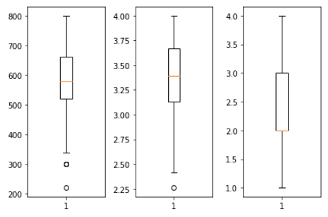
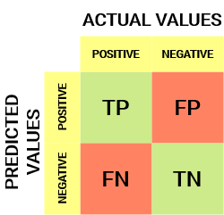
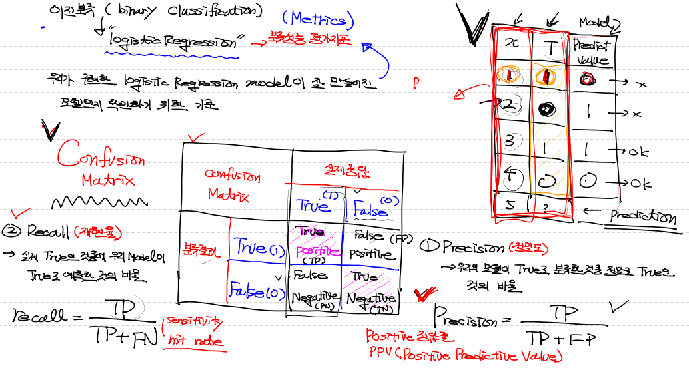
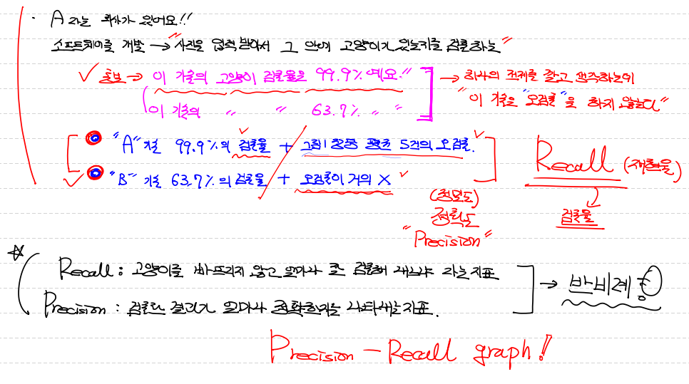

## Multi Variance Logistic Regression

- **`Data 전처리 (preprocessing)`**

  **<결측치 확인>**

  ```python
  import numpy as np
  import pandas as pd
  
  df = pd.read_csv('./admission.csv')
  
  # 결측치 있나 확인
  print(df.isnull().sum())
  '''
  admit    0
  gre      0
  gpa      0
  rank     0
  dtype: int64
  '''
  # 결측치가 하나도 없기 때문에 결측치 처리 필요 없음
  ```

  <이상치 확인>

  ```python
  import matplotlib.pyplot as plt
  
  # 종속변수 admit에 대해 확인할 필요는 없어. 결측치도 없고, 모두 0 or 1로 구성된 t_data!
  
  # 독립변수 이상치 있는지 확인해보자 Graph로
  
  # 도화지 먼저 만들고
  fig = plt.figure()
  fig_gre = fig.add_subpot(1,3,1)
  fig_gpa = fig.add_subpot(1,3,1)
  fig_rank = fig.add_subpot(1,3,1)
  
  # 4분위수로 이상치 있는지 보자 (boxplot)
  fig_gre.boxplot(df['gre'])  # ==> 이상치 존재
  fig_gpa.boxplot(df['gpa'])  # ==> 이상치 존재
  fig_rank.boxplot(df['rank']) # ==> 이상치 없음
  
  fig.tight_layout()
  plt.show()
  ```

  

  <이상치 제거> - Z-score 방식 활용

  ```python
  from scipy import stats
  
  zscore_threshold = 2.0
  
  # teacher 방식
  for column in df.columns:
      outlier = df[column][(np.abs(stats.zscore(df[column])) > zscore_threshold)]
      df = df.loc[~df[column].isin(outlier)]
      
  # 내 방식
  for column in df.columns:
      outlier = ~(np.abs(stats.zscore(df[column]))>zscore_threshold)
      df = df[outlier]
  
  # 왜 굳이 loc로 찾는걸까?
  
  # Data
  # .drop(조건, axis 기준, 원본 건드릴지 말지(inplace)) # ==> 특정 조건의 행 or 열을 제거
  x_data = df.drop('admit', axis=1, inplace=False).values # ==> 원본 안건드리고 복사본 저장
  t_data = df['admit'].values.reshape(-1,1)
  ```

  <정규화>

  ```python
  from sklearn.preprocessing import MinMaxScaler
  
  # logistic regression 에서는 t_data가 0 or 1 이기 때문에 t_data에 대한 정규화는 필요 업다.
  
  scaler_x = MinMaxScaler()
  scaler_x.fit(x_data)
  # 정규화된 독립변수
  norm_x_data = scaler_x.transform(x_data)
  ```

  

- **`Python 구현`**

  ```python
  # 위에서 전처리한 data 그대로 사용
  
  # 수치미분 코드
  def numerical_deriviate(f,x):
      delta_x = 1e-4
      deriviate_x = np.zeros_like(x)
      it = np.nditer(x, flags=['multi_index'])
      
      while not it.finished:
          idx = it.multi_index
          tmp = x[idx]
          
          x[idx] = tmp +delta_x
          fx_plus_delta = f(x)
          
          x[idx] = tmp -delta_x
          fx_minus_delta = f(x)
          
          deriviate_x[idx] = (fx_plus_delta - fx_minus_delta) / (2 * delta_x)
          
          x[idx] = tmp
          it.iternext()
      
      return deriviate_x
  
  # 변수 W, b 정의
  W = np.random.rand(3,1) # 3 : 행렬곱을 위해 입력데이터 x의 열의 수
  						# 1 : 예측값이 t_data와 연산이 되야 되요. t_data의 column 수와 동일.
      					# 즉, W는 항상 X와 행렬곱 할건데 지금 data에서 X의 feature은 3개니깐 (-1,3) 이 형태고 행렬곱 하려면
          				# 앞(X)의 열과 뒤(W)의 행이 같아야 하잖아!!
  b = np.random.rand(1)
  
  # python에서는 logistic regression의 hypothesis가 필요 없다. 왜냐면, 결과값을 0,1로 예측할거라서
  
  # 바로 sigmoid가 적용된 loss function 구하면 돼. (==> 이걸 통해서 우린 확률을 얻을거야)
  def loss_func(input_obj):
      # 행이 여러개이기 때문에 슬라이싱!
      input_W = input_obj[:-1].reshape(-1,1)
      input_b = input_obj[-1:]
      
      # 정규화된 x data 사용!
      # np.dot과 행렬끼리 직접 곱하는 것은 어떤 차이가 있을까?
      z = np.dot(norm_x_data,input_W) + input_b
      y = 1 / (1 + np.exp(-1 * z))
      
      # log 값이 무한으로 발산하는 것을 막기 위해 미센한 값 필요
      delta = 1e-7
      
      # cross entropy(log loss) 처리
      # t_data.shape ==> (382,1)
      # y.shape ==> (382,1)
      # 같은 shape끼리 곱하면 동일한 shape로 각 값이 곱해진 결과가 나온다.
      return -np.sum(t_data * np.log(y + delta) + (1-t_data) * np.log(1 - y + delta))
  
  learning_rate = 1e-4
  
  # 학습
  for step in range(300000):
      input_param = np.concatenate((W.ravel(),b.ravel()), axis=0)
      # 여기서 loss_func 은 그냥 값이 떨어진다.
      # numerical_deriviate(loss_func,input_param) 이 결과는 ==> [w1 w2 w3 b] ==> 이런 1차원 배열이 나온다.
      predicted_result = learning_rate * numerical_deriviate(loss_func,input_param)
      
      # W, b 갱신
      W = W - predicted_result[:-1].reshape(-1,1)
      b = b - predicted_result[-1:]
      
      if step % 30000 == 0:
          input_param = np.concatenate((W.ravel(), b.ravel()), axis=0)
          print('W : {}, b : {}, loss : {}'.format(W.ravel(), b, loss_func(input_param)))
  '''
  W : [0.64003123 0.7216982  0.85739408], b : [0.4274665], loss : 490.17835257198305
  W : [ 1.0752206   1.12941605 -1.61510081], b : [-1.25308476], loss : 221.2156000750602
  W : [ 1.07526592  1.12942595 -1.61508268], b : [-1.25312616], loss : 221.21560006866997
  W : [ 1.07526592  1.12942595 -1.61508268], b : [-1.25312617], loss : 221.21560006866997
  W : [ 1.07526592  1.12942595 -1.61508268], b : [-1.25312617], loss : 221.21560006866997
  W : [ 1.07526592  1.12942595 -1.61508268], b : [-1.25312617], loss : 221.21560006866997
  W : [ 1.07526592  1.12942595 -1.61508268], b : [-1.25312617], loss : 221.21560006866997
  W : [ 1.07526592  1.12942595 -1.61508268], b : [-1.25312617], loss : 221.21560006866997
  W : [ 1.07526592  1.12942595 -1.61508268], b : [-1.25312617], loss : 221.21560006866997
  W : [ 1.07526592  1.12942595 -1.61508268], b : [-1.25312617], loss : 221.21560006866997
  '''
  
  # 예측
  def logistic_predict(x):
      z = np.dot(x,W) + b
      y = 1 / (1 + np.exp(-1 * z))
      
      if y < 0.5 :
          result = 0
      else:
          result = 1
      return result, y
  
  my_score = np.array([[600, 3.8, 1]])
  scaled_my_score = scaler_x.transform(my_score.reshape(-1,3))
  result = logistic_predict(scaled_my_score)
  print(result)
  # ==> (1, array([[0.57333869]]))
  ```

  

- **`Tensorflow 구현`**

  ```python
  X = tf.placeholder(shape=[None,3], dtype=tf.float32)
  T = tf.placeholder(shape=[None,1], dtype=tf.float32)
  
  W = tf.Variable(tf.random.normal([3,1]), name='weight')
  b = tf.Variable(tf.random.normal([1]), name='bias')
  
  # Hypothesis, predict model
  logit = tf.matmul(X,W) + b
  H = tf.sigmoid(logit) # ==> sigmoid 적용
  
  # loss func
  loss = tf.reduce_mean(tf.nn.sigmoid_cross_entropy_with_logits(logits=logit, labels=T))
  
  # train
  train = tf.train.GradientDescentOptimizer(learning_rate=1e-4).minimize(loss)
  
  # session & 초기화
  sess = tf.Session()
  sess.run(tf.global_variables_initializer())
  
  # 학습
  for step in range(300000):
      
      _, W_val, b_val, loss_val = sess.run([train,W,b,loss], 
                                           feed_dict={X:norm_x_data,
                                                      T:t_data})
      if step % 30000 == 0:
          print('W : {}, b: {}, loss : {}'.format(W_val.ravel(),b_val,loss_val))
  '''
  W : [ 1.1283288   0.78427017 -1.3150222 ], b: [-0.7326825], loss : 0.6045867204666138
  W : [ 1.034085   0.6950651 -1.4092227], b: [-0.9101733], loss : 0.5831069350242615
  W : [ 1.0094736   0.67955744 -1.4449797 ], b: [-0.9671855], loss : 0.5811242461204529
  W : [ 1.0050278  0.6850874 -1.4635117], b: [-0.98918176], loss : 0.5808131694793701
  W : [ 1.0066217   0.69679165 -1.4763736 ], b: [-1.0004832], loss : 0.5806670784950256
  W : [ 1.010198   0.7093086 -1.4871024], b: [-1.007816], loss : 0.5805506110191345
  W : [ 1.0137743  0.7218256 -1.4978312], b: [-1.0149685], loss : 0.5804407596588135
  W : [ 1.0173506  0.7343426 -1.5055386], b: [-1.0221211], loss : 0.5803451538085938
  W : [ 1.0209268   0.74685955 -1.5126911 ], b: [-1.0285033], loss : 0.5802562832832336
  W : [ 1.0245031  0.7593765 -1.5198437], b: [-1.0348338], loss : 0.5801710486412048
  '''        
  
  #예측
  my_score = np.array([[600, 3.8, 1]])
  scaled_tf_input = scaler_x.transform(my_score)
  predicted_result = sess.run(H, feed_dict={X:scaled_tf_input})
  print(predicted_result)
  # ==> [[0.54414016]]
  ```

  

- **`sklearn 구현`**

  ```python
  model = linear_model.LogisticRegression()
  
# sklearn은 정규화 되지 않은 data 사용. but 결측치, 이상치는 제거한 data 사용
  model.fit(x_data, t_data.ravel())
  
  my_score = np.array([[600, 3.8, 1]])
  predict_result = model.predict(my_score)
  probability = model.predict_proba(my_score)
  
  print(predict_result, probability)
  # ==> [1] [[0.43740782 0.56259218]] // 56% 확률로 pass(1)
  ```
  
  


---


## Metrics (분류 성능 평가 지표)

> 이진분류(binary classification) - logistic regression 평가 방법
>
> 우리가 구현한 logistic regression model이 잘 만들어진 model인지 확인하기 위한 `기준` 필요
>
> **`기준`** : `Confusion matrix`
>
> - Precision(정밀도)
> - Recall(재현율)
> - Accuracy(정확도)




## Precision(정밀도)

> - 우리의 model이 true로 분류한 것 중 정말로 true 인 것의 비율
> - Precision 식 = `TP / TP + FP`
> - ≒ `Positive 정답률` / `PPV(Positive Predictive Value)`


## Recall(재현율)

> - 실제값이 true 인것 중에서 우리 model이 true로 예측한 것의 비율
> - Recall 식 = `TP / TP + FN`
> - ≒ `Sensitivity` / `hit rate`





## 비유 - 고양이 판별 검출률 vs 오검출

> <A회사 소프트웨어 개발>
>
> - 소프트웨어 기술 99.9% 검출률 + 그림 1장당 평균 5건의 오검출 (== 즉, 고양이 사진은 고양이라고 잘 판단하지만, 다른 사진을 고양이라고 판단 하는 경우가 평균 5건 정도... 오검출이 높아)  ==> **`Recall`**
> - 소프트웨어 기술 63.7% 검출률 + 오검출 거의 X ==> **`Precision`**
> - **`Recall`** : 고양이를 빠뜨리지 않고 얼마나 잘 검출해 내느냐! (검출률 중시)
> - **`Precision`** : 검출 결과가 얼마나 정확한 지 나타내는 지표! (정확도 중시)
> - **`Recall`** & **`Precision`** : 반비례 관계
>   - 정확도(precision) ↑ ==> 검출률(recall) ↓
>   - 검출률(recall) ↑ ==> 정확도(precision)↓
> - **`Precision Recall Graph`** : 2가지 요소를 적절하게 평균적으로 설정





## Accuracy(정확도)

> - true 값을 true로 예측하는지, false를 false로 예측하는지 2가지 모두 판별
> - Accuracy(정확도) = **`TP + TN / TP + FN + FP + TN`**
> - 단점 : domain의 bias를 반드시 고려해야 한다.

