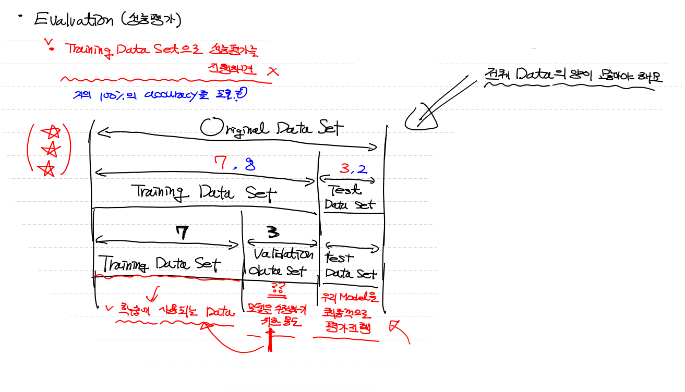

## `Accuracy(정확도)`

> **`bias`** 에 취약하고 민감하다
>
> ex) 우리 model이 희귀병을 CT사진으로 검출하는 데 제대로된 검출 model 안 만들어도,
>     희귀병 자체가 너무 적다 보니 무조건 희귀병 아닌걸로 판단하라 하면 정확도가 99.9%
>     희귀병 자체가 0.1%도 안되기 때문에 희귀병을 검출 못해도 정확도가 매우 높게 나타난다.

## `조화평균(Precision & Recall)`

> 해결하려는 문제에 따라 둘 중 어느 것을 사용할 지 결정해야 한다. ==> 일반적으로 둘은 `반비례` 관계
>
> - 이러한 특성 때문에 둘의 평균을 사용하는데 ==> **`조화평균`**
> - **`조화평균`** : 2 × (Precision × Recall) / (Precision + Recall)

## `Fall-out`

> 식 : FP / TN + FP 
>
> 의미 : `실제 false를 false로 예측`하고, `실제 false를 true로 예측`한 것 중에서 `실제 false를 true로 예측`한 비율
> 	   즉, 실제 값을 false인데 우리 model이 true라고 잘못 예측한 비율

### - `ROC curve` : Recall & Fall-out ==> 그래프로 표현

---

# <추가적으로 알아두어야 할 사항>

## `Learning Rate`

> W 와 b를 갱신할 때 사용되는 customizing 상수 (1e-4)

- ### `OverShooting`

  - if Learning Rate를 필요 이상으로 크게 설정하면
  - Learning Rate가 너무 커서 발산. 즉, `Overshooting` 발생한다. 

- ### `LocalMinimum`

  - if Learning Rate를 필요 이상으로 작게 설정하면
  - 너무 작게 설정해서 학습 반복이 끝나도 우리가 원하는 w를 찾을 수 없다.

## `Overfitting(과대적합)`

> - 일반적으로 과적합이라 하면 ==> 과대적합을 의미함
> - Data를 이용해서 학습이 끝난 후 우리 model의 상태를 지칭하는 용어를 의미
> - Overfitting이 발생하는 이유
>   - 우리 model이 training data set에 너무 집착해서 train data set에 딱 들어맞는 형태로 모델을 만들었기 때문에
>   - 이로 인해 우리 model의 accuracy(정확도)는 많이 떨어진다.
> - Overfitting 관련요소
>   - **`epoch`** 수 ==> 너무 많을 때 overfitting 발생
>   - **`data`** 양 ==> 많은 data 양이 필요 / data가 적으면 `증식`
>   - **`feature의 수`** ==> `중복`되거나 종속변수에 `영향 미치지 않는` feature는 제거하는 게 좋다.

## `Underfitting(과소적합)`

> - 충분한 학습을 하지 않아서 model 자체가 미완성
> - 학습량(epoch)을 늘려주면 해결할 수 있다.

## `Evaluation`

> - 성능평가 진행하는 process
> - 단순히 `Training Data Set`으로 성능평가 진행하면 안된다. 
> - `Training Data Set`은 단순히 학습용 model을 만들기 위한 data set이다. 
> - 이 data로 만든 model에 이 data를 집어 넣는다면 ==> 거의 100% accuracy 도출 

> **`전제`**: Evaluation을 위해서 전체 Data의 양이 월등히 많아야 한다.

#### `<Training Data Set>`

> - Original data가 주어지면
> - Training용 : Test용 = 7 : 3 or 8 : 2 비율로 data를 분류한다.

#### `<Validation Data Set>`

> - 이미 분류한 Training Data Set에서 다시 한 번 **`7:3`** 비율로 나눠서
> - **`Validation data set`**을 정의한다.
>
> - **`Validation data set`**은 model을 **`수정`**하기 위한 용도
> - 즉, 학습 중간에 model이 잘 만들어지고 있는지 확인하는 용도
> - **`Test Data Set`**은 최종 판별 data다 ==> Test Data는 우리의 model을 수정할 수 없다.
>   그저, 마지막 model의 prediction을 검출해주는 용도

## `Validation_Data_Set`

> - 학습량(epoch)을 무작정 많이 늘리면 **`overfitting`**
> - 그렇다고 일정량 주지 않으면 **`underfitting`**
> - 적정한 기준이 필요하다.

> **`step1.`** epoch당 model을 갱신하면서 **`Training Data Set`**으로 먼저 평가한다.
>
> - epoch이 증가할수록 **`Training Data Set`**의 정확도는 점점 증가하다가
> - 어느 한계 지점 이상 넘어가면 결국 **`Overfitting`** 발생
> - ==> **`Training Data Set`**으로 만든 model이기 때문에 epoch이 증가할수록 완전해진다. 
>
> **`step2.`** epoch당 model을 갱신하면서 **`Validation Data Set`**으로 평가한다.
>
> - epoch이 증가할수록 **`Validation Data Set`**의 정확도 또한 점점 증가하다가
> - 어느 한계 지점 이상 넘어가면 `정확도`가 떨어진다.
> - ==> 사용하는 model은 **`Validation Data Set`**의 개입 없이 만들어졌기 때문에

