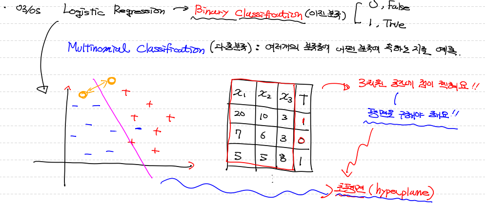
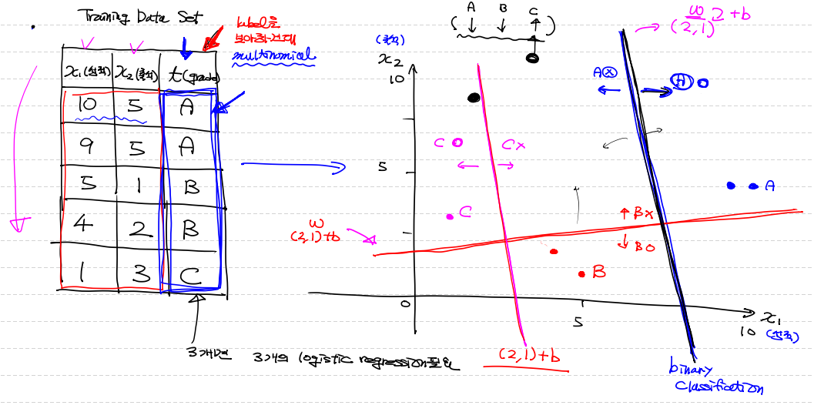
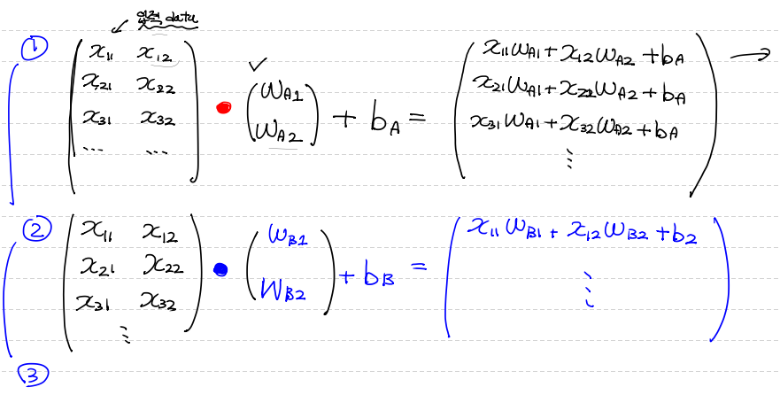
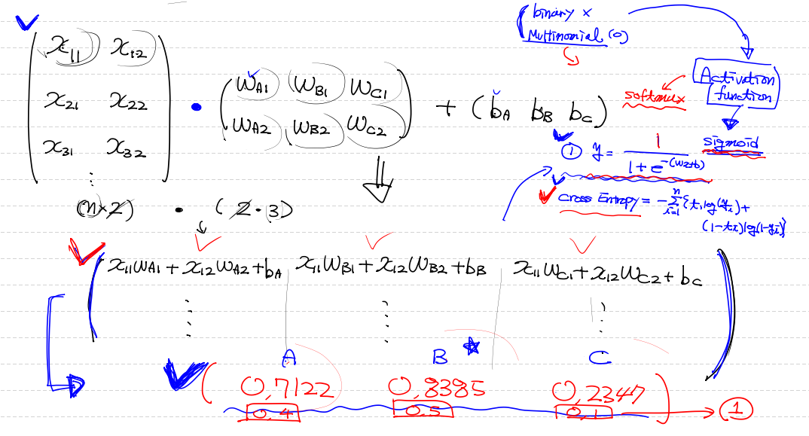
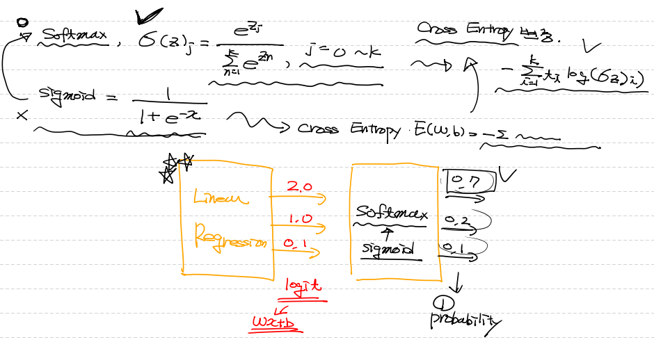
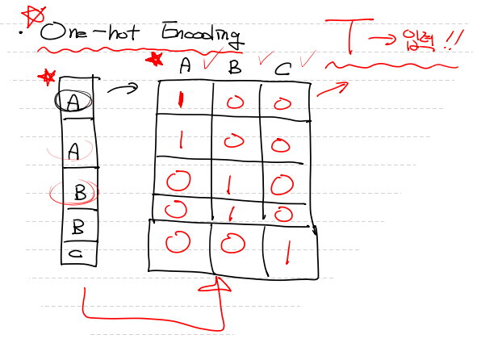
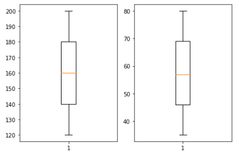

## `Validation Data 분할`

##### `<titanic 예제 작업 중>`

```python
# df 데이터 전처리 다 완료 후
# .iloc[행,열] ==> 행열을 숫자로 입력해서 df 인덱싱 or 슬라이싱
# train_data 전체 data에서 70%
train_data = df.iloc[:int(df.shape[0]*0.7)] # ==> 모든 열을 가져올거라서 행만 슬라이싱
											# ==> df.shape ==> (20000,3) 
											# ==> 0.7을 곱해준거라서 실수값 떨어져... int 바꿔줘야 해
val_data = df.iloc[int(df.shape[0]*0.7):]	# 70% 사용한 data 외 30%

#train_data에서 x_data와 t_data 구분
train_x_data = train_data.drop('Survived', axis=1, inplace=False).values
train_t_data = train_data['Survived'].values.reshape(-1,1)

#val_data x_data와 t_data 구분 ==> 평가용
val_x_data = val_data.drop('Survived', axis=1, inplace=False).values
val_t_data = val_data['Survived'].values.reshape(-1,1)
```


##### `<titanic 예제 학습 후 validation 비교>`

```python
# 예측값
predict = tf.cast(H > 0.5, dtype=tf.float32) # tf.cast()를 통해 True, False bool dtype을 float dtype으로 변동
											 # ==> 예측값 : [1 0 0 0 1 0 1 0]
    
correct = tf.equal(predict, T) # 예측값(predict)과 실제값(T) 비교 ==> 여기서 T : val_t_data 넣어줄거야!
# ==> dtype boolean 값으로 나올 것이다. ==> [True, False, True ...]

# 0과 1로 구성된 숫자들의 평균을 구해주면 확률 구할 수 있다.
accuracy = tf.reduce_mean(tf.cast(correct, dtype=tf.float32))

# accuracy node를 실행시킨다.
result = sess.run(accuracy, feed_dict={X:val_x_data,
                                       T:val_t_data})
print(result) # ==> 0.7977528 ==> 79%의 정확도
```


---


## `Multinomial Classification(다중분류)` 

> #### 여러개의 분류 중 어떤 분류에 속하는 지 예측!
>
> #### 독립변수(X)가 2개 이상 발생하면 3차원 공간에 점이 찍힌다. ==> 평면을 구해야 한다.
>
> #### `초평면(hyperplane)` : 이러한 평면값을 초 평면이라 한다.




## 표, 그래프, 행렬식 표현

> lable(t) 종류의 개수에 따라 logistic regression 개수가 결정된다.
>
> `Multinomial Classification`은 각 lable의 `binary classification`으로 구한 `Logistic regression` 으로 구분한다.








## `Softmax`

> #### - Binary Classification ==> `activation function`으로 `sigmoid`사용
>
> #### - Multinomial Classification ==> `activation function`으로 `softmax`사용
>
> #### 다중분류에서 다른 activation function을 사용하다보니 Hypothesis와 loss 또한 달라진다. 
>
> #### `softmax` 하면서 결과 값이 `전체 합이 1`인 확률값으로 떨어진다.




## `One-hot encoding`

> - lable값을 수치 계산할 수 있도록 바꿔줘야 한다!




## `Multinomial Classification(다중분류) 코드 구현` 

#### `<BMI 예제>`

```python
import numpy as np
import pandas as pd
import tensorflow as tf
from scipy import stats
from sklearn.preprocessing import MinMaxScaler
import matplotlib.pyplot as plt
```


##### `<Raw Data Loading>`

```python
# csv 파일 안 자료 형태가 맨 위 3줄이 주석 설명이 있어서 3줄을 건너띄기 위해 ==> skiprows=3
df = pd.read_csv('./data/bmi.csv',skiprows=3)
```


##### `<결측치 확인>`

```python
df.isnull().sum() ==> 결측치 없음 확인
```


##### `<이상치 확인>`

```python
fig = plt.figure()
height_fig = fig.add_subplot(1,2,1)
weight_fig = fig.add_subplot(1,2,2)
height_fig.boxplot(df['height'])
weight_fig.boxplot(df['weight'])

fig.tight_layout()
plt.show()
# ==> 이상치가 없다!!!
```



##### `<초기 training data set>`

```python
x_data = df[['height','weight']].values
t_data = df['label'].values # ==> 나중에 one-hot encoding 처리
```


##### `<정규화>`

```python
scaler_x = MinMaxScaler()
scaler_x.fit(x_data)
norm_x_data = scaler_x.transform(x_data)
'''
[[0.85       0.8       ]
 [0.5125     0.73333333]
 [0.725      0.37777778]
 ...
 [0.375      0.28888889]
 [0.8625     0.75555556]
 [0.275      0.13333333]]
'''
```


##### `<One-hot encoding>`

```python
# tf.nn.one_hot() ==> 사용!
# 이건 tf node를 활용하는거라서 session이 필요해
# ==> 이미 만들어진 one_hot node를 run 해야 그 결과 값인 ndaraay 가질 수 있다.
sess=tf.Session()

# tf.one_hot(바꿀 data, depth= lable 분류 범위가 몇 개인지 알아야해)
norm_t_data = sess.run(tf.nn.one_hot(t_data, depth=3)) # ==> (n,3)
print(norm_t_data)
'''
[[0. 1. 0.]
 [0. 0. 1.]
 [1. 0. 0.]
 ...
 [0. 1. 0.]
 [0. 1. 0.]
 [0. 1. 0.]]
'''
```


##### `<Tensor 구성>`

```python
X = tf.placeholder(shape=[None, 2], dtype=tf.float32)
T = tf.placeholder(shape=[None, 3], dtype=tf.float32)

# Weight & bias
W = tf.Variable(tf.random.normal([2,3]), name='weight')
b = tf.Variable(tf.random.normal([3]), name='bias')

# Hypothesis
logit = tf.matmul(X,W) + b
H = tf.nn.softmax(logit) # ==> sigmoid는 neural network에 없었는데 softmax는 nn 안에 있네
```


##### `<softmax로 loss 구성>`

```python
# softmax_cross_entropy_with_logits_v2 ==> v2 잊지 말자
loss = tf.reduce_mean(tf.nn.softmax_cross_entropy_with_logits_v2(logits=logit, labels=T))
```


##### `<train & 학습>`

```python
# train
train = tf.train.GradientDescentOptimizer(learning_rate = 1e-4).minimize(loss)

# init
sess.run(tf.global_variables_initializer())

# 학습
for step in range(500000):
    _, W_val, b_val, loss_val = sess.run([train, W,b,loss], feed_dict={X:norm_x_data,
                                                                       T:norm_t_data})
    if step % 50000 == 0:
        print('W :{}, b: {}, loss: {}'.format(W_val, b_val, loss_val))
        
'''
W :[[-0.95187664  1.7914972  -0.73637086]
 [-0.6169554   1.5501331  -0.6064607 ]], b: [0.14159082 1.7819564  0.1661689 ], loss: 2.853422164916992
W :[[-0.10548066  0.8931269  -0.6844001 ]
 [-0.52411014  0.66344553  0.18737894]], b: [0.9329616  0.09350133 1.0632492 ], loss: 1.0064729452133179
W :[[ 0.30517966  0.79731697 -0.99896944]
 [-0.7582531   0.5792054   0.50590515]], b: [ 0.9829588  -0.03481164  1.1415488 ], loss: 0.9079359173774719
W :[[ 0.62197566  0.7810722  -1.2995381 ]
 [-0.9997182   0.5713497   0.7551661 ]], b: [ 0.9475494  -0.02300202  1.1644909 ], loss: 0.8451257944107056
W :[[ 0.8987705   0.77287316 -1.5681076 ]
 [-1.2169434   0.57118976  0.97269887]], b: [0.9048783 0.003193  1.1822466], loss: 0.7958375811576843
W :[[ 1.1474191   0.7669127  -1.8097234 ]
 [-1.4119996   0.57118976  1.1675977 ]], b: [0.863084   0.03147478 1.1949176 ], loss: 0.7559860944747925
W :[[ 1.374109    0.76095223 -2.0295296 ]
 [-1.5892103   0.57118976  1.3452101 ]], b: [0.82136077 0.05957586 1.2068385 ], loss: 0.7229124903678894
W :[[ 1.5829334   0.75499177 -2.230991  ]
 [-1.7511224   0.57118976  1.507783  ]], b: [0.78228676 0.08760525 1.2187594 ], loss: 0.694985568523407
W :[[ 1.777605    0.7490313  -2.4179707 ]
 [-1.9006572   0.57118976  1.658683  ]], b: [0.7448609  0.11556004 1.2299992 ], loss: 0.6709015369415283
W :[[ 1.9592158   0.74307084 -2.5926204 ]
 [-2.039435    0.5685317   1.7995706 ]], b: [0.7090981  0.14316387 1.2383544 ], loss: 0.6498962640762329
'''        

```


##### `<prediction>`

```python
height = 187
weight = 78
my_state = [[height, weight]]
result = sess.run(H, feed_dict={X:scaler_x.transform(my_state)})
print(result) 
# ==> [[0.19734508 0.5078333  0.29482165]] normal 정상이라는 의미
```

