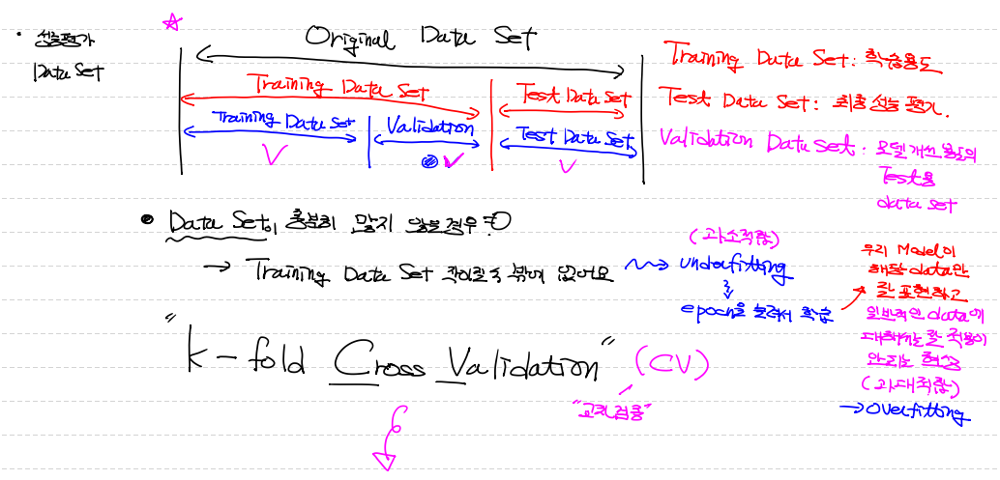
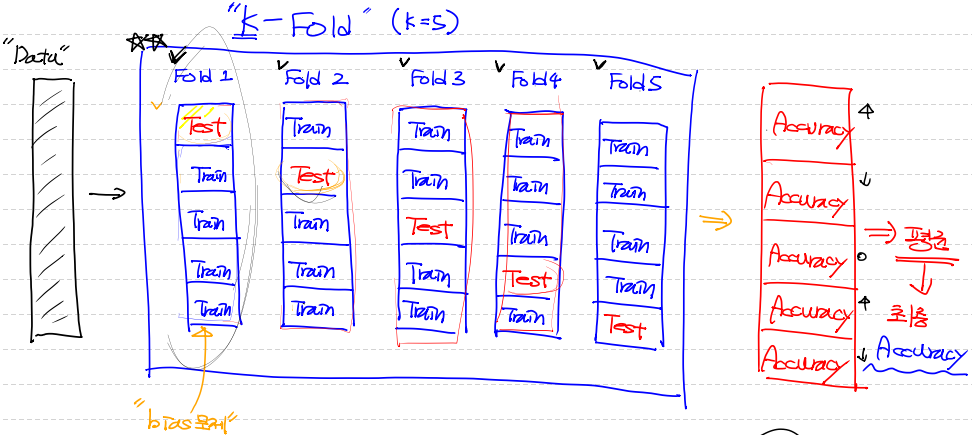

## `머신러닝 잘 되기 위한 전제조건`

1. #### 많은 양의 양질의 `Data` 필요

   - ##### `Data Preprocessing`

     - **`결측치`** 처리
     - **`이상치`** 처리
     - **`정규화`** 처리 (Normalization)
       1. **`Min-Max Scaling`**
          ==> 이상치에 민감함
          ==> 0~1 사이에 실수(float) 형태로 scaling
       2. **`Standardization(표준화, Zscore)`**
          ==> 동일한 척도로 scaling 할 수 없다.
          ==> But! 상대적으로 이상치에 영향을 덜 받는다.


2. #### `model`을 만든다.

   - python 구현

   - sklearn (확인용)

   - tensorflow 

   - pytorch  등등

     

3. #### `Evaluation(성능평가)`

   - Metric (평가기준)

     ① Precision

     ② recall

     ③ accuracy

     ④ F1

     ⑤ Fall-out


## 성능평가 Data set 처리




## K-Fold Cross Validation (CV)

> - original Data를 k등분해서 1/k만 test data로 설정
> - k번 반복하여 평가 진행
>   ==> k번 반복하는 이유는 `bias` 문제를 해결하기 위해서
> - k개 구한 accuracy의 평균값을 우리 model의 최종 Accuracy 값으로 선정




## BMI 예제 Tensorflow 구현

```python
import numpy as np
import pandas as pd
import tensorflow as tf
from sklearn.preprocessing import MinMaxScaler
import matplotlib.pyplot as plt
from sklearn.model_selection import train_test_split # ==> train data와 test data를 쉽게 분리!
from sklearn.model_selection import KFold # ==> KFold cross validation 쉽게 구현
```


- Data 이상치 처리까지

```python
# test data는 우리 model의 최종 accuracy를 측정하기 위해 사용
# train data set은 K-Fold Cross Validation 이용하여 내부 평가 진행

df = pd.read_csv('../data/bmi.csv', skiprows=3)

# 상관분석
# 종속변수(레이블)에 영향을 미치지 않는 feature(속성, 필드)를 제외하기 위해
# -1 ~ 1 사이 실수값이 나와요! pandas를 이용해서 상관분석 함수 쉽게 진행하는 방법 있다.
# 필요없는 feature를 제거

# 결측치 처리
# 만약 결측치가 있으면 다른 값으로 대체할 필요가 있어요 ==> KNN으로 처리!
# df.isnull().sum()

# 이상치 처리
# tuckey fence나 z-score 방식으로 이상치 찾고 처리
# 우리 data는 없다.
```


- Data Split & 정규화

```python
# Data Split (Train Data와 Test Data로 나눌꺼에요)
# train_test_split(독립변수, 종속변수, test_data_size, random_state)
# train_test_split 은 data 분리할 때
# random하게 data를 뽑아서 test_size에 입력한 비율에 따라 나눠주는데!
# random이다 보니 다시 실행할 때마다 달라져... 그래서 고정시키기 위해 ==> random_state 값 지정 (random seed 처럼!)
x_data_train, x_data_test, t_data_train, t_data_test = \
train_test_split(df[['height', 'weight']], df['label'], test_size=0.3, random_state=0)

# 정규화(Normalization)
scaler = MinMaxScaler()
scaler.fit(x_data_train) # <<== 전체 data를 학습 안시키고, split 한 후 training data에 대해서 학습
x_data_train_norm = scaler.transform(x_data_train)
x_data_test_norm = scaler.transform(x_data_test)

#혼동을 줄이기 위해서 변수 삭제
del x_data_train
del x_data_test
```


- t_data one_hot encoding

```python
sess = tf.Session()
t_data_train_onehot = sess.run(tf.one_hot(t_data_train, depth=3)) # ==> (14000, 3)
t_data_test_onehot = sess.run(tf.one_hot(t_data_test, depth=3))  # ==> (6000, 3)

# 혼동을 줄이기 위해 변수 삭제
del t_data_train
del t_data_test
```


- tensor graph 구성

```python
 placeholder
X = tf.placeholder(shape=[None, 2], dtype=tf.float32)
T = tf.placeholder(shape=[None, 3], dtype=tf.float32)

# Weight & bias
W = tf.Variable(tf.random.normal([2,3]), name='weight')
b = tf.Variable(tf.random.normal([3]), name='bias')

# Hypothesis
logit = tf.matmul(X,W) + b
H = tf.nn.softmax(logit)

# loss
loss = tf.reduce_mean(tf.nn.softmax_cross_entropy_with_logits_v2(logits=logit, labels=T))

# train
train = tf.train.GradientDescentOptimizer(learning_rate=0.1).minimize(loss)
```


- 학습 data 수 분할 처리

```python
# 우리의 학습 data가 용량이 너무 커서 메모리 용량을 수용범위 넘어설 경우!
# 예전과 같이 for 반복으로 실행할 때, X의 placeholder에 한 번에 다 넣을 수가 없다.
# (runtime error 발생하면서 (out of memory 현상) 프로그램이 뻗는다. )
# 그래서 나눠서 들어갈 수 있도록 프로그램 처리 해준다.

num_of_epoch = 1000 # ==> 1000번 train 할 것이다!
# 입력 data 한 번에 읽을 memory size 설정 변수
batch_size = 100 # (row의 수 즉, 총 14000개의 row가 있다면, 100개씩 data를 입력하겠다는 의미)

# 학습용 함수
def run_train(sess, train_x, train_t):
    print('### 학습시작 ###')
    
    for step in range(num_of_epoch):
        total_batch = int(train_x.shape[0] / batch_size) # ==> 1 epoch 에 100개씩 data 끊어서 140번 학습한다는 의미
        
        for i in range(total_batch):
            batch_x = train_x[i*batch_size : (i+1)*batch_size]
            batch_t = train_t[i*batch_size : (i+1)*batch_size]
            
            _, loss_val = sess.run([train, loss], feed_dict={X: batch_x, T: batch_t})
        
        if step % 100 == 0 :
            print('Loss: {}'.format(loss_val))
            
    print('### 학습종료 ###')
```


- Accuracy 측정 (정확도)

```python
# H는 -1행 3열 의 2차원 matrix array로 출력된다.
# 값은 on hot encoding으로 인해 하나의 행의 값을 더하면 1이 나온다.
# 그래서 각 행별로 최대값의 index를 추출하면 처음 tdata와 동일한 형태를 가질 수 있다.

predict= tf.argmax(H,1)
correct = tf.equal(predict, tf.argmax(T,1)) # ==> T도 one_hot encoding 돼 있는 상태여서
accuracy = tf.reduce_mean(tf.cast(correct, dtype=tf.float32))

#위에서 만든 학습 진행 함수 실행
run_train(sess, x_data_train_norm, t_data_train_onehot)

# Training Data Set을 이용하여 성능평가
print('### Training Data Set을 이용하여 성능평가 - 좋지 않아요 ###')
result = sess.run(accuracy, feed_dict={X:x_data_train_norm, T:t_data_train_onehot})

print('accuracy: {}'.format(result))

'''
### 학습시작 ###
Loss: 0.8782743811607361
Loss: 0.20562462508678436
Loss: 0.1624492108821869
Loss: 0.14280423521995544
Loss: 0.13101932406425476
Loss: 0.12295521050691605
Loss: 0.11698892712593079
Loss: 0.11234044283628464
Loss: 0.10858229547739029
Loss: 0.10545852035284042
### 학습종료 ###
### Training Data Set을 이용하여 성능평가 - 좋지 않아요 ###
accuracy: 0.9827142953872681
'''
# ==> accuracy가 당연히 높이 나온다. 왜냐면 traing data set으로 model 만들고, model을 만든 traing data set으로 평가하니깐 당연히 좋을 수 밖에
```

