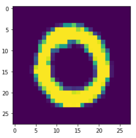
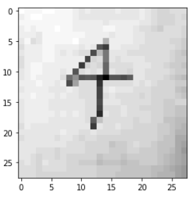

## `K-Fold Cross Validation`

```python
from sklearn.model_selection import KFold

cv = 5      # ==> Fold의 수 
result = [] # ==> 각 Fold당 학습과 성능평가가 진행 ==> 이때, 계산된 성능평가 값 저장 
kf = KFold(n_splits=cv, shuffle=True)

# 정규화된 train data 값 넣어줌
# kf라는 객체는 cv 개수만큼 fold 구성해주고, data shuffle까지 해서 train용 과 validation용 구분해준다.
# 분류한 후 그 값의 index를 (train, validation) 튜플 형태로 return해준다.
# cv =5 이기에 5 fold 를 구성하고, 각 fold를 구성할 때, validation data 중복 안되게 구성해준다.
for training_idx, validation_idx in kf.split(x_data_train_norm):
    
    # 훈련시킬 새로운 training data를 index값을 활용해 설정해준다.
    training_x = x_data_train_norm[training_idx]
    training_t = t_data_train_onehot[training_idx]
    
    # validation할 data도 index값을 활용하는데 주의할 점은! 초기에 설정한 x_data_train_norm으로 설정해줘야 한다.
    val_x = x_data_train_norm[validation_idx]
    val_t = t_data_train_onehot[validation_idx]
    
    # 학습 함수 실행 (100개씩 batch된 상태로 학습 진행한다.)
    run_train(sess, training_x, training_t)
    
    # Validation 비교 (앞에서 만들 accuracy node를 실행시킨다)
    result.append(sess.run(accuracy, feed_dict={X:val_x, T:val_t}))
    
print('측정한 각각의 결과값 : {}'.format(result))
print('최종 K-Fold 교차검증을 사용한 Accuracy : {}'.format(np.mean(result)))
'''
측정한 각각의 결과값 : [0.98071426, 0.98142856, 0.9817857, 0.9835714, 0.98071426]
최종 K-Fold 교차검증을 사용한 Accuracy : 0.9816428422927856
'''
```


## MNIST 손글씨 이미지 model 구현

`출처` : https://www.kaggle.com/c/digit-recognizer 


```python
import numpy as np
import pandas as pd
import tensorflow as tf
import matplotlib.pyplot as plt
import matplotlib.image as img
from sklearn.preprocessing import MinMaxScaler
from sklearn.model_selection import train_test_split
from sklearn.model_selection import KFold
```


### `Data 전처리`

```python
# data 불러오기
df = pd.read_csv('../kaggle_data/digit/train.csv') # ==> (42000, 785)
```


##### `mnist csv data 이미지 구현`

```python
# 28pxel로 돼 있는 이미지 값들이여서 reshape를 (28,28) 설정
test_img = df[1:2].drop('label', axis=1).values.reshape(28,28)

```



```python
# 다양하게 이미지 구현 가능
# cv2 활용!

import cv2

# 흑백으로 이미지 출력
image = cv2.imread('./kaggle_data/digit/four.jpg', cv2.IMREAD_GRAYSCALE)
plt.imshow(image, cmap='gray')
print(image) # ==> 픽셀 값이 2차원 matrix 값으로 넘어옴.
```



```python
# 결측치 처리
# 결측치는 없습니다.

# 이상치 처리
# 숫자를 이루고 있는 값이기에 이상치가 없을것으로 예상합니다
# 가령 가장 진한 농도의 색 값이 너무 높은 값이여서 그 값을 지우면... pixel이 깨집니다.
# 모든 값은 0~ 255 사이에 존재합니다.
# 그러기에 이상치 처리도 안합니다.

# K-Fold Cross Validation을 사용할 예정이기에 data를 따로 split 하지 않을 것입니다. test data도 따로 존재합니다.

# 정규화
# minmaxscaler로 pixel featur 값만 정규화 합니다.
scaler = MinMaxScaler()
scaler.fit(train_x_data) # ==> fit은 train data로 진행합니다.
norm_train_x_data = scaler.transform(train_x_data)

# label data의 one-hot encoding
# t data는 one_hot encoding이 필요합니다.
sess = tf.Session()
onehot_train_t_data = sess.run(tf.one_hot(train_t_data, depth=10))
```


#### `Tensor Graph 구성`

```python
# shape 구성이 중요합니다.
# X 값은 이미지의 pixel 하나하나가 feature입니다. 
# (28,28)size 이미지는 28×28=784pixel을 가지고 있습니다.
# T 값은 0~9까지 숫자를 가지고 있습니다. one_hot encoding으로 column 수가 범주(category) 수와 같습니다.
X = tf.placeholder(shape=[None,784], dtype=tf.float32)
T = tf.placeholder(shape=[None,10], dtype=tf.float32)

# W는 각 featur당 weight이기 때문에 784개의 row가 필요하고, T data의 범주값 만큼 co
W = tf.Variable(tf.random.normal([784,10]), name='weight')
b = tf.Variable(tf.random.normal([10]), name='weight')

# hypothesis
logit = tf.matmul(X,W)+b
H = tf.nn.softmax(logit)

# loss
loss = tf.reduce_mean(tf.nn.softmax_cross_entropy_with_logits_v2(logits=logit, labels=T))

# train
train = tf.train.GradientDescentOptimizer(learning_rate=0.01).minimize(loss)

# init
sess.run(tf.global_variables_initializer())
```


#### `입력 Data 수 조정 하면서 학습`

```python
# data 입력 수 조정 한 학습 함수
num_of_epoch = 2000
batch_size = 100

def learn_train(sess, train_x, train_t):
    print('### 학습시작 ###')
    
    for step in range(num_of_epoch):
        data_batch = int(train_x.shape[0] / batch_size)
        
        for i in range(data_batch):
            batch_x = train_x[i*batch_size:(i+1)*batch_size]
            batch_t = train_t[i*batch_size:(i+1)*batch_size]
            
            _, loss_val = sess.run([train,loss], feed_dict={X:batch_x, T:batch_t})
            
        if step % 100 == 0:
            print('Loss : {}'.format(loss_val))
    
    print('### 학습종료 ###')
```


#### `평가 로직 Tensor 구성`

```python
predict_num = tf.argmax(H,1)
correct = tf.cast(tf.equal(predict_num, tf.argmax(T,1)),dtype=tf.float32)
accuracy = tf.reduce_mean(correct)
```


#### `K-Fold Cross Validation`

```python
cv = 5
result = []
kf = KFold(n_splits=cv, shuffle=True)

for train_idx, val_idx in kf.split(norm_train_x_data):
    training_x = norm_train_x_data[train_idx]
    training_t = onehot_train_t_data[train_idx]
    
    validation_x = norm_train_x_data[val_idx]
    validation_t = onehot_train_t_data[val_idx]
    
    # 학습
    learn_train(sess,training_x,training_t)
    
    # 비교 평가
    result.append(sess.run(accuracy, feed_dict={X:validation_x, T:validation_t}))
    
print('각 fold별 accurcy =', result)
print('우리의 validation accuracy =', np.mean(result))
'''
각 fold별 accurcy = [0.9096429, 0.9179762, 0.92, 0.9260714, 0.9297619]
우리의 validation accuracy = 0.92069054
'''
```

