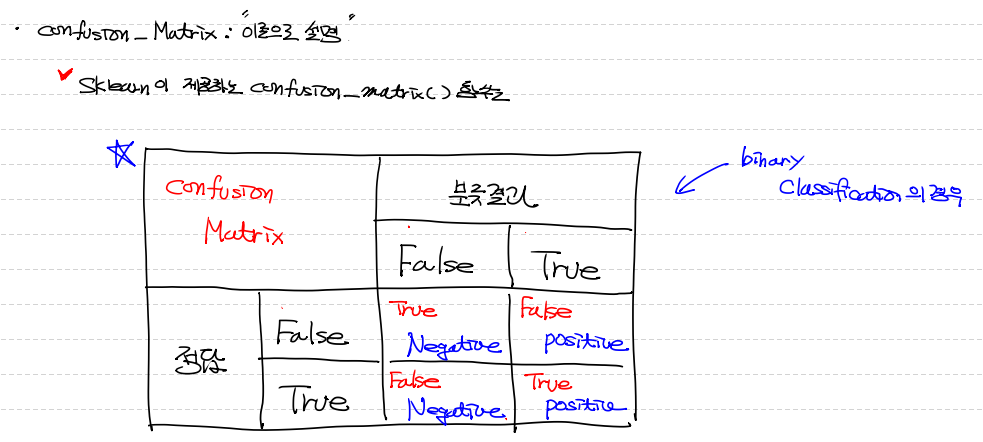
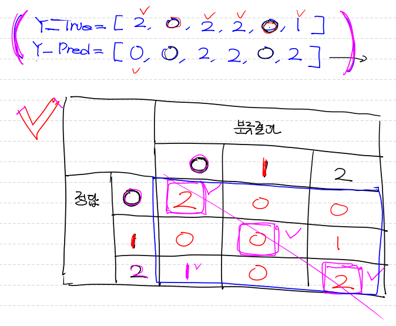
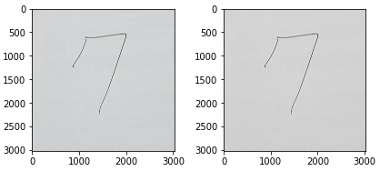
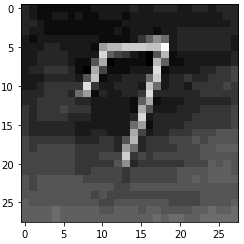

## Google Colab 사용

- Cloud 기반의 Jupyter Notebook
- 협업 시 유용하게 사용
- 무료 버전 : session 시간이 최대 12시간 (학습 돌릴 수 있는 시간을 의미)
- 유료 버전 : session 시간이 최대 24시간
- 브라우저(browser)만 있으면 바로 사용 가능
- GPU 무료 사용 가능 (학습속도 빠르다...)
- 각종 라이브러리 대부분 기본 설치 돼 있음

- 한 가지 문제는 Tensorflow이 최신 버전으로 설치 돼 있다.

  - 해결방법 1 : 삭제 한 후 다시 Tensor 1.15 버전 설치 한다.

    ```python
    # <Google Colab>
    # Colab notebook 환경에서 prompt 이용 방법 ==> '!'로 시작
    
    # tensor 삭제
    !pip uninstall tensorflow
    
    !pip install tensorflow==1.15
    ```

  - 해결방법 2 : compat 방식으로, 2.x 버전을 disable 한다.

    ```python
    # 1.x 버전을 활성화 하고, 2.x 버전은 disable
    import tensorflow.compat.v1 as tf
    
    tf.disable_v2_behavior()
    ```

    

## Digit Recognizer 예제 평가 data 주의점

- 마지막 test data로 **`최종 예측`** 할때, train 과 validation에서와 같이 **`batch split`** 해줘야 한다!
- 똑같이 test data도 한번에 너무 많은 data를 입력하면 **`out of memory`** 문제가 발생한다.


## classification_report

> - Precision, Recall, F1, Accuracy를 한번에 쉽게 구할 수 있다.

```python
# classification_report 사용!
from sklearn.metrics import classification_report

# target_name 즉, 우리들의 label 값을 명시해준다.
target_names = ['num 0', 'num 1', 'num 2', 'num 3', 'num 4', 'num 5', 'num 6', 'num 7', 'num 8', 'num 9']

# classification_report를 출력한다.
# 첫 번째 인자로 기존 '정답'(label)값이 들어가야 한다. ( ==> one_hot encoding이 안된 형태로 들어가야 한다.)
# 두 번재 인자로 우리가 만든 model에 따라 predict 한 label값이 들어가야 한다.

print(classification_report(t_data_test, 
                            sess.run(tf.argmax(H,1), feed_dict={X:norm_x_data_test}), 
                            target_names=target_names))
'''
				precision   recall   f1-score   support

       num 0       0.95      0.94      0.95      1242
       num 1       0.94      0.97      0.96      1429
       num 2       0.90      0.89      0.89      1276
       num 3       0.89      0.88      0.89      1298
       num 4       0.91      0.90      0.91      1236
       num 5       0.86      0.87      0.87      1119
       num 6       0.92      0.95      0.93      1243
       num 7       0.94      0.91      0.92      1334
       num 8       0.88      0.86      0.87      1204
       num 9       0.87      0.89      0.88      1219

    accuracy                           0.91     12600
   macro avg       0.91      0.91      0.91     12600
weighted avg       0.91      0.91      0.91     12600
'''
# 위 표에서 support == 각 숫자(num 0, num 1 ...)가 몇개 있었는지
```


## confusion_matrix

> - sklearn이 제공하는 confusion_matrix 함수가 출력하는 모양이 기존 이론 모양과 조금 다르다.




#### 예제

> - 실제 정답 : Y_True
> - predict 정답 : Y_Pred
> - confusion_matrix(정답값, 예측값)

```python
from sklearn.metrics import confusion_matrix

y_true = [2,0,2,2,0,1]
y_predict = [0,0,2,2,0,2]

print(confusion_matrix(y_true, y_predict))
'''
[[2 0 0]
 [0 0 1]
 [1 0 2]]
'''
```




#### 우리의 model에 적용

```python
from sklearn.metrics import confusion_matrix

print(confusion_matrix(t_data_test,
                      sess.run(tf.argmax(H,1), feed_dict={X:norm_x_data_test})))

'''
[[1171    0   13    6    2   15   27    1    6    1]
 [   0 1381    9    8    1    4    5    1   15    5]
 [  10   21 1133   32   14   11   16   12   18    9]
 [   5    9   28 1146    3   53    4   11   24   15]
 [   3   13   10    3 1118    5   19    5   11   49]
 [  10    6    7   33    8  978   22    3   38   14]
 [   8    2   13    0   20   17 1178    0    4    1]
 [   4    6   18    8   18    7    0 1215   12   46]
 [   6   20   21   33   13   41    9    4 1034   23]
 [  11    4    4   12   33   11    0   44   15 1085]]
'''
```


## `이미지 Data 다루는 라이브러리`

- Pillow
- openCV


### `CV`

```python
# 물론 미리 pip or conda 등 install opencv 하고 써야 한다.

import cv2

# 기본 color 이미지 가져오기 parameter : (data path, color 설정)
my_img = cv2.imread('/content/drive/MyDrive/Colab Notebooks/kaggle_data/digit/7 (2).jpg', cv2.IMREAD_COLOR)
print(my_img.shape) # ==> (3024, 3024, 3) == (세로, 가로, color) ==> color가 3인 이유는 각 픽셀당 rgb 값 부여

# 흑백 이미지로 가져오기
my_img = cv2.imread('/content/drive/MyDrive/Colab Notebooks/kaggle_data/digit/7 (2).jpg', cv2.IMREAD_GRAYSCALE)

# png 파일은 알파값이 더 주어져서 마지막 color 값이 4이다.

# color 이미지 ==> 흑백 이미지로 전환
img_grey = cv2.cvtColor(my_img, cv2.COLOR_BGR2GRAY)
print(img_grey.shape) # ==> (3024, 3024)

# 이미지 파일 만들면서 저장
# cv2.imwrite(data path, 저장할 이미지 객체)
cv2.imwrite('/content/drive/MyDrive/Colab Notebooks/kaggle_data/digit/7_grey.jpg', img_grey)

# 흑백 이미지 다시 불러오기
gray_img = cv2.imread('/content/drive/MyDrive/Colab Notebooks/kaggle_data/digit/7_grey.jpg')

# 이미지 plot 구성 및 출력

original = plt.subplot(1,2,1)
gray = plt.subplot(1,2,2)

original.imshow(my_img)
gray.imshow(gray_img)

plt.tight_layout()
plt.show()
```



```python
# cv2를 활용한 색반전 ==> cv2.bitwise_not(이미지객체)
reverse_img = cv2.bitwise_not(이미지객체)
```


### `PIL`

> - Pillow Library
> - 이미지 파일을 객체로 불러온다.

```python
from PIL import Image

# 그냥 이미지 객체임. 이 이미지를 조절하기 용이함.
img = Image.open('/content/drive/MyDrive/Colab Notebooks/kaggle_data/digit/7_grey.jpg')

# Size 조절
pixel = np.array(img) # ==> 이미지 객체를 np.array로 바꾸면 픽셀 size와 shape 알 수 있다.
print(pixel.size) # ==> 9144576
print(pixel.shape)# ==> (3024, 3024)

resize_img = img.resize((28,28))
plt.imshow(resize_img, cmap='Greys')
plt.show()
```



