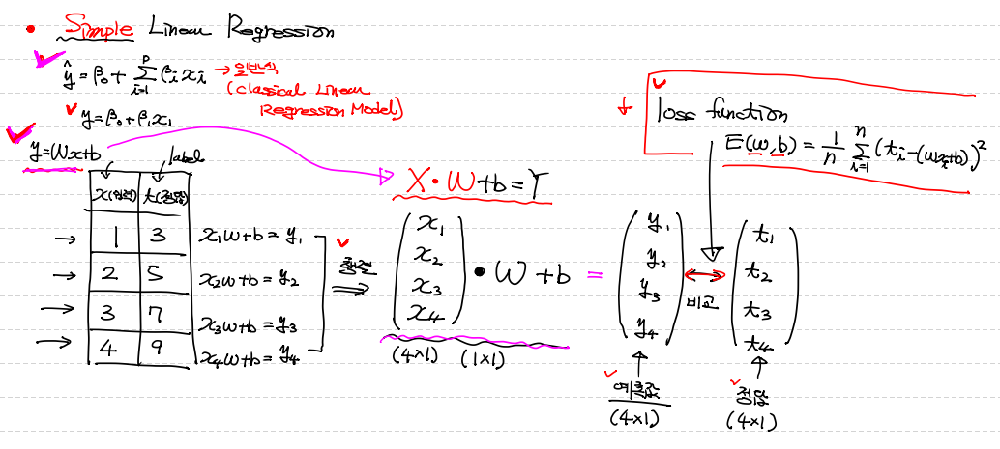
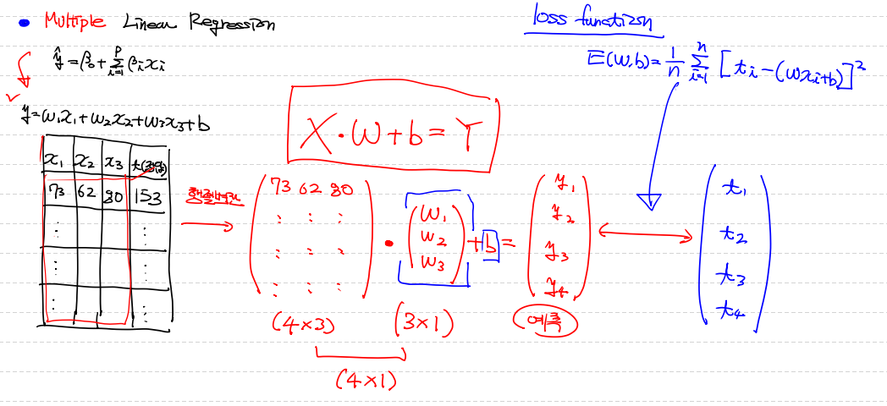
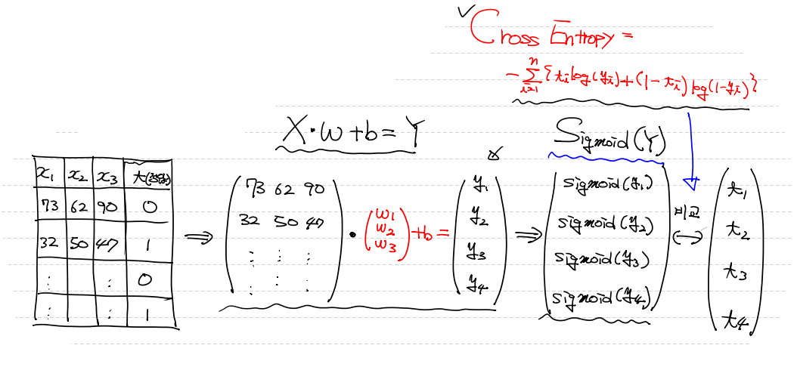
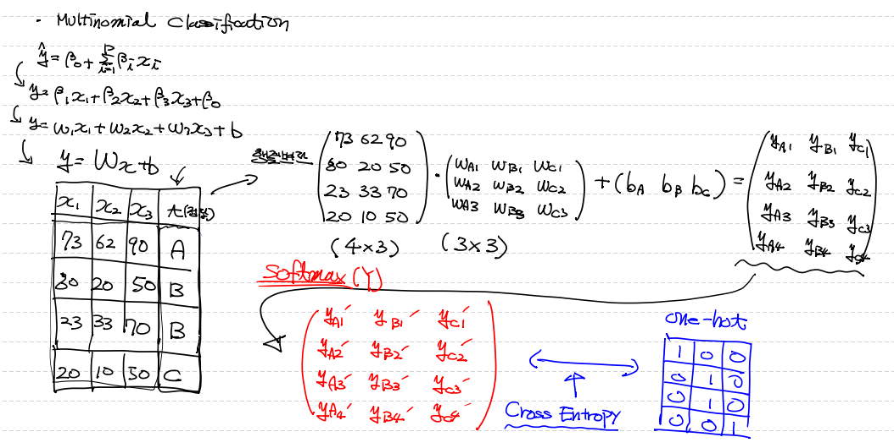
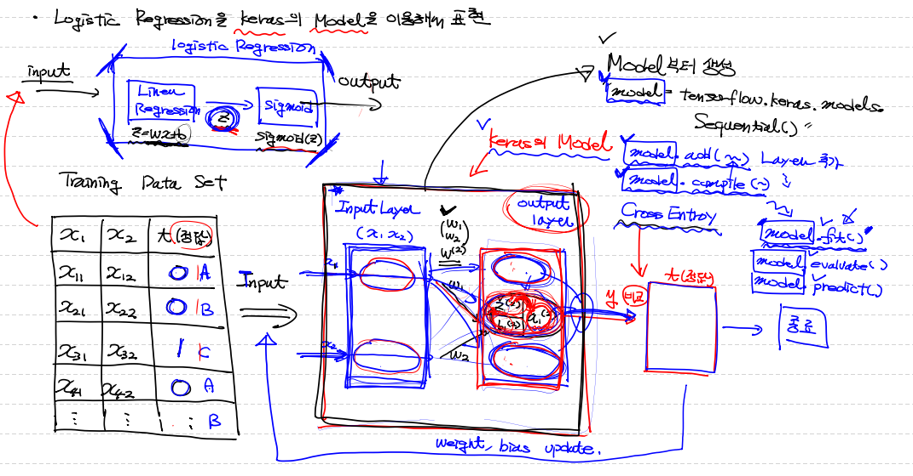
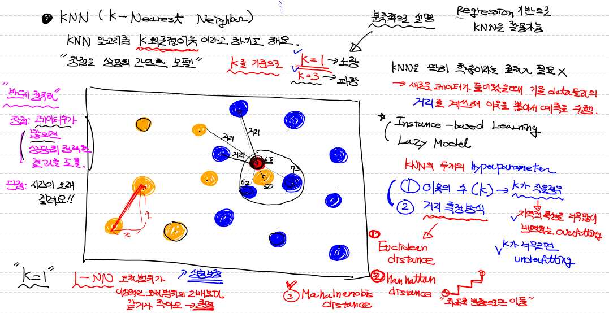

## Tensorflow ver.2.x

- `Tensorflow 1.x version` : low level API ==> 학습 code를 세밀하고, 자세하게 다 구현해야 함
- `Tensorflow 2.x version` : hight level API ==> 복잡하고, 자잘한 과정들 모드 라이브러리 안에 내부적으로 처리하게끔 돼 있다.
                             쉬운 구현을 위해 high level API인 `Keras` 도입
- Tensorflow는 `google`이 만든 `DeepLearning`용 Library
  - pytorch : facebook
  - keras : '프랑소와 숄레'
  - MXNet : 카네기 멜로 대학 (?)
- `특징`
  - session 삭제
  - 초기화 코드 삭제
  - placeholder 삭제
  - Eager Execution (즉시 실행) ==> 코드 직관성 높아짐
  - keras가 high-level API로 공식 지원


## Tensorflow ver.2.x 실제 구현

```python
import tensorflow as tf

print(tf.__version__) # ==> 2.4.1

a = 50
b = 70

# 실제 값을 tensor node로 변경
# .convert_to_tensor() 메서드 사용
# ==> 더 이상 placeholder 사용하지 않아도 된다.
def my_sum(x,y):
    t1 = tf.convert_to_tensor(x) # ==> 값을 줘서 tensor로 바로 바꾼다.
    t2 = tf.convert_to_tensor(y)

    return t1 + t2


result = my_sum(a,b)

# ver.1.x 에서는 node 출력하려면 sess.run() 사용
# ver.2.x 에서는 .numpy() 메서드로 바로 실행
print(result.numpy())
```


## Machine Learning의 흥망성쇠

> - 1998년 제프리 힌트 ==> Back Propagation(오차 역전파) 알고리즘으로 인해 다시 각광
> - 2010년부터 본격적으로 Deep Learning 발전 시작
>   : 대학 연구결과 ==> 기업 중심으로 Deep Learning Library 만들기 시작
> - 2010년 ==> `벤지오`의 `Theano` (참고로 `Theano` 란 인물은 역사에 기록된 최초의 여성 수학자 & 피타고라스의 아내)
>   벤지오는 2017년도 개발 중지
> - 2013년 ==> 버클리 대학 중국 유학생(가양청) ==> `caffe` Deep Learning 라이브러리 개발
> - 2014년 ==> 로난 ==> `Touch3`
> - 2015년 ==> 카네기 멜로 대학 : `MXNet` / Google : `Tensorflow` / 프랑소와 숄레 : `Keras`
> - 2016년 ==> MS : `CNTK`
> - 2019년 ==> `Tensorflow ver.2.x`


## `Simple` Linear Regression 복습




## `Multiple` Linear Regression




## `Binary` Classification - Logistic Regression (sigmoid)




## `Multinomial` Classification - Logistic Regression (softmax)




## `Keras` model을 이용해서 Logistic Regression 구현

**`<그림으로 먼저 구현>`**



**`<코드 구현>`**

```python
from tensorflow.keras.models import Sequential  # 대부분 Sequential model을 사용한다

from tensorflow.keras.layers import Flatten, Dense  # Flatten : 다차원의 입력 data를 1차원으로 바꿔주는 역할
													# Dense : 이전 layer와 이 후 layer를 연결한다고 하는데 내용 보충 더 필요
# Optimizer 하기 위한 모듈 필요하다.
from tensorflow.keras.optimizers import SGD, Adam	# SGD : Stockast GradientDescent
													# Adam : 범용적으로 성능 좋은 optimizer 알고리즘

# keras model box 만들기
model = Sequential()  # w와 b는 이 안에 내부적으로 이미 setting 돼 있어서 따로 만들 필요없다.

# layer 넣기
model.add(Flatten(input_shape=(1,))) # input layer로 사용
                                     # input_shape=(1,) : 어떤 차원의 data가 오든 1차원으로 만들겠다는 의미
    
model.add(Dense(2, activation='sigmoid')) # output_layer 생성
                                          # logistic node 2개 (== label의 종류 개수와 동일)
                                          # activation 함수를 sigmoid로 사용
        								  # 즉, binary classfication 다룬다는 의미지
# optimaizer & loss 설정
model.compile(optimizers=SGD(learning_rate=1e-3),
              loss='mse') # loss='mse' : 평균제곱오차를 이용한 최소제곱법이 적용된 loss를 부여

# 학습 (parameter 값으로 학습 반복 횟수(epochs), input_data size 설정(batch_size), validation용 data 분할(validation_split) 모두 가능)
model.fit(x_data_train, t_data_train, epochs=10, batch_size=200, validation_split=0.2)

# 평가
model.evaluate(x_data_test, t_data_test)

# 예측
model.predict(x_data_predict)

###########################################################

# Keras 이용할 때 간편한 점
# 학습한 결과, 내용, 과정 저장!
model.save('./myModel.h5') # model을 저장해놓는다. == 매번 켤때마다 학습 시킬 필요 없다.

# 저장한 model 불러오기
model = tf.keras.models.load_model('./myModel.h5')
```


## 결측치 처리

> - 결측치가 전체 데이터에서 비중이 얼마나 되는가?
> - 결측치가 독립변수인지 종속변수인지 확인


#### `결측치 처리 방법`

#### 	1. Deletion(결측치 제거)

​		1) **`Listwise`** 방식 : NaN 존재하면 `행 자체`를 삭제
​							`문제` : 의미있는 다른 column에 존재하는 data도 삭제 

​		2) **`Pairwise`** 방식 : NaN 값만 제외. 즉, 의미있는 data 삭제 되는 것을 막기 위한 방법 
​							`But! 문제` : 오히려 data 꼬일 가능성 더 많다.

#### 	2. Imputation(결측치 보간)

​		1) **`평균화 기법`** : data의 평균(mean), 중앙값(median), 최빈값(mode)
​						 `장점` : 쉽고 빠르다.
​						 `단점` : 통계분석에 영향을 많이 미친다.

​		2) **`예측 기법`** : 결측치들이 완전히 무작위적으로 관찰(=독립변수)되지 않았다! (=종속변수) 
​					   즉, 해당 NaN이 `종속변수`에 있을 때만 사용


## `KNN` (K-Nearest Neighbor)

> - `K 최근접 이웃` 알고리즘이라고 부르기도 한다. (called by. `Instance-based Learning` or `Lazy Model`)
> - 상당히 간단한 Model
> - **`KNN`** : 예측할 data의 가장 가까운 이웃을 k개 포함하여 동심원를 그린 후 그 안에 들어있는 값을 활용해서 예측값 구한다.
>   ==> 즉, 새로운 data에서 기존 data와 거리를 계산 한 후 이웃을 뽑아 원을그려 한 그룹으로 묶고, 예측을 수행!
> - 대부분 `KNN`은 `Classification learning` 할때만 사용한다고 생각하는데 
>   ==> `Linear Regression`에서도 사용 가능하다! (최근접 있는 값들의 `평균`을 return 한다.)
> - **`KNN의 hyperparameter`**
>   - 1. 이웃의 수(== `K`)
>        - `K가 작을 경우` : Overfitting (지역적인 특성이 너무 많이 반영된다.)
>        - `K가 클 경우` : Underfitting (전체 평균을 구하는 느낌으로, 학습 안한 것과 비슷해진다.)
>     2. 거리 측정 방식
>        - `Euclidean distance` : 두 data 간의 최단 직선거리
>        - `Manhattan distance` : 좌표축 방향으로만 이동
>        - `Mahalnanobis distance`
> - `KNN`을 사용할 때는 `독립변수`를 반드시 **`정규화`** 해줘야 한다.
> - **`KNN의 장점`** : 데이터가 많으면 상당히 정확한 결과를 도출한다.
> - **`KNN의 단점`** : 데이터가 많아서 모든 이웃간의 거리를 계산할 때, 시간이 오래걸린다.
> - **`K=1 일때`** = 1-NN : 오차범위가 이상적인 오차범위의 2배보다 같거나 작다 ==> `성능을 보장`할 수 있다.




## `KNN`을 이용한 코드 구현

```python
# sklearn을 이용해서 BMI 예제로 Logistic Regression 이용 결과(accuracy)와
# KNN 이용 결과(accuracy) 비교
# google colab 사용

# 우선 sklean Logistic Regression을 이용한 learning 예측
import tensorflow as tf
import numpy as np
import pandas as pd
from sklearn.preprocessing import MinMaxScaler 
from sklearn.model_selection import train_test_split
from sklearn.linear_model import LogisticRegression

# raw data load
df = pd.read_csv('/content/drive/MyDrive/Colab Notebooks/data/bmi.csv', skiprows=3)

# Data 분할
x_data_train, x_data_test, t_data_train, t_data_test = \
train_test_split(df[['height', 'weight']], df['label'], test_size=0.3, random_state=0)

# Normalization
scaler = MinMaxScaler()
scaler.fit(x_data_train)

norm_x_data_train = scaler.transform(x_data_train)
norm_x_data_test = scaler.transform(x_data_test)

# Logistic Regression
model = LogisticRegression()
model.fit(norm_x_data_train, t_data_train) # sklearn 사용 할 때 t_data one_hot encoding 안 해줘도 된다. x_data도 마찬가지
										   # 여기서 사용한 이유는 아래 KNN 사용할 때 필요해서 같은 data로 비교하기 위해!
# 평가
print(model.score(norm_x_data_test, t_data_test)) 
# sklearn으로 구한 accuracy = 0.9845

#########################################################

# KNN을 사용하여 data 예측
from sklearn.neighbors import KNeighborsClassifier # ==> KNN 분류 진행해주는 model (KNeighborsRegressor 도 있다!)

# knn 객체 생성
knn_classifier = KNeighborsClassifier(n_neighbors=3) # n_neighbors : K 값이다. 즉, 이웃으로 선정할 data 개수!

# knn data 넣어주기
knn_classifier.fit(norm_x_data_train, t_data_train)

# 평가
print(knn_classifier.score(norm_x_data_test, t_data_test))
# KNN으로 구한 accuracy = 0.998
```

