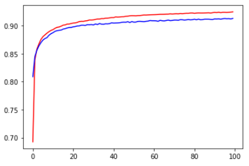
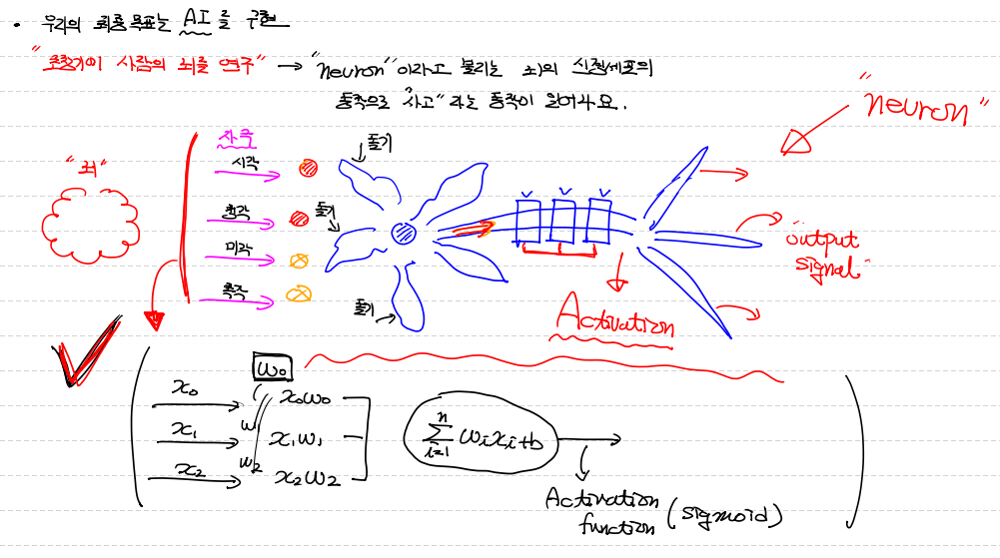
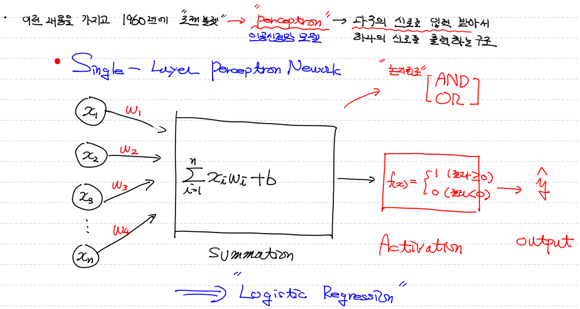
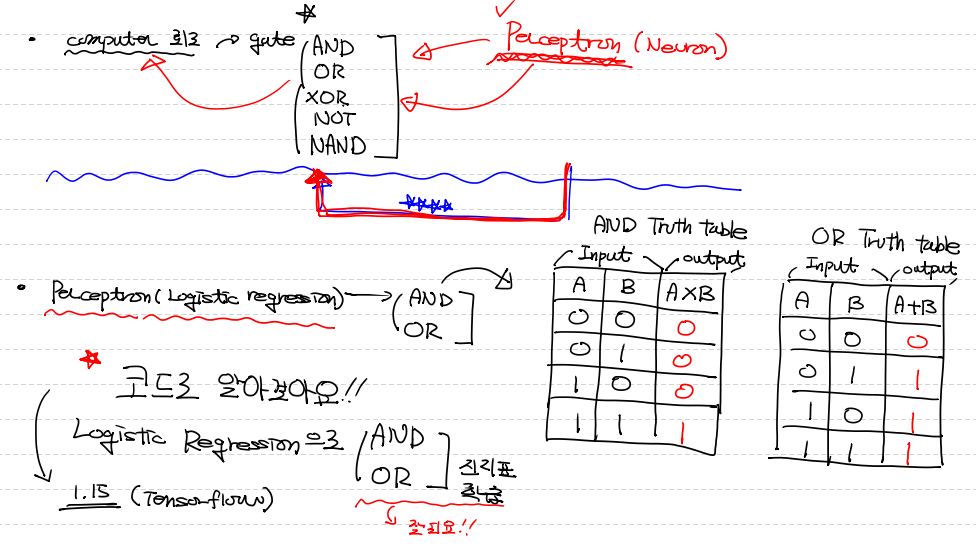
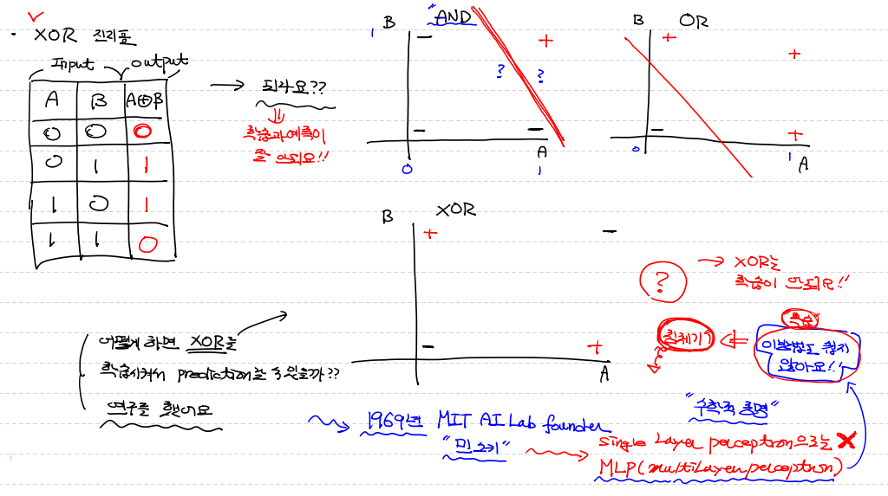

## Multinomial Classification 구현

> - MNIST를 sklearn과 Tnesorflow 2.x버전으로 구현!


#### `Data 처리`

```python
import numpy as np
import pandas as pd
from sklearn.preprocessing import MinMaxScaler
from sklearn.linear_model import LogisticRegression
from sklearn.model_selection import train_test_split
from sklearn.metrics import classification_report 
from scipy import stats
import warnings
warnings.filterwarnings(action='ignore')

# Raw Data
df = pd.read_csv('../kaggle_data/digit/train.csv')

# 이미지 data에 결측치와 이상치 없어요

# 독립변수, 종속변수 split
x_data = df.drop('label', axis=1, inplace=False)
t_data = df['label'] # sklearn에서는 one-hot 처리 필요없어서 안함.

# 정규화 (Normalization)
scaler = MinMaxScaler()
scaler.fit(x_data) # fit은 2차원 nd.array 형태로 data를 받는데, DataFrame 줘도 알아서 array 뽑아서 처리한다.
norm_x_data = scaler.transform(x_data)

# Data Split
x_data_train, x_data_test, t_data_train, t_data_test = \
train_test_split(norm_x_data, t_data, test_size=0.3, random_state=0)
```


#### `sklearn 구현`

```python
# Logistic Regression은 solver를 지정해야 한다.
# solver의 default값은 `LBFGS` !!
# ==> 특징 : 작은 data에 최적화 돼 있는 logistic regression을 만들어준다.
# ==> 그러다보니 data양이 많아지면 performance가 좋지 않다.

# 일반적으로 데이터량이 많은 경우는 `sag(Stochastic Average Gradient Descent)`를 이용할건데
# sag의 확장판이 있다. ==> `saga`

sk_model = LogisticRegression(solver='saga') # 데이터 양이 많을 때 saga 사용
sk_model.fit(x_data_train, t_data_train)
sk_result = sk_model.predict(x_data_test)
print('skelarn result : ', sk_result)
print(classification_report(t_data_test, sk_result))

'''
skelarn result :  [3 6 9 ... 1 6 5]
              precision    recall  f1-score   support

           0       0.96      0.96      0.96      1242
           1       0.95      0.97      0.96      1429
           2       0.92      0.90      0.91      1276
           3       0.91      0.90      0.90      1298
           4       0.92      0.92      0.92      1236
           5       0.88      0.88      0.88      1119
           6       0.93      0.95      0.94      1243
           7       0.94      0.93      0.94      1334
           8       0.89      0.88      0.88      1204
           9       0.89      0.89      0.89      1219

    accuracy                           0.92     12600
   macro avg       0.92      0.92      0.92     12600
weighted avg       0.92      0.92      0.92     12600
'''
```


#### `Tensorflow 2.x`

```python
from tensorflow.keras.models import Sequential
from tensorflow.keras.layers import Flatten, Dense
from tensorflow.keras.optimizers import SGD

# Data는 위에서 전처리한 data 그대로 사용

# model 생성
keras_model = Sequential()

# input layer 구성
keras_model.add(Flatten(input_shape=(x_data_train.shape[1],)))

# output layer 구성
keras_model.add(Dense(10, activation='softmax'))

# compile ==> 학습할 때, 사용할 알고리즘, loss함수, metric 방식 정해주는 과정
keras_model.compile(optimizer=SGD(learning_rate=1e-1),
                    loss='sparse_categorical_crossentropy', # 지금 mulitnomial classification 하고 있다는 사실 잊지마
                    metrics=['sparse_categorical_accuracy'])
                    # t_data가 ont_hot 처리 안했을 경우 :  loss에 'sparse_categorical_crossentropy'
                    # one_hot 처리 했을 경우 : loss에 'categorical_accuracy'
        
history = keras_model.fit(x_data_train,
                          t_data_train,
                          epochs=100,
                          verbose=0,
                          batch_size=512,
                          validation_split=0.2)

print(keras_model.evaluate(x_data_test, t_data_test))
'''
394/394 [==============================] - 0s 353us/step - loss: 0.2956 - sparse_categorical_accuracy: 0.9181
[0.29556259512901306, 0.9180952310562134]
'''

# 학습이 제대로 되고 있는지, epoch이 어느정도 돌면, overfitting인지, underfitting인지 판별할 수 있도록 그래프 그려보자
# keras로 fit 한 history 객체 내에 history라는 속성이 있다!

# keras로 fit 한 history 객체 내에 `history`라는 속성이 있다!
print(type(history.history)) # <class 'dict'>
print(history.history.keys()) 
# ==> dict_keys(['loss', 'sparse_categorical_accuracy', 'val_loss', 'val_sparse_categorical_accuracy'])

plt.plot(history.history['sparse_categorical_accuracy'], c='r') 
# ==> epoch 당 training data로 구한 accuracy

plt.plot(history.history['val_sparse_categorical_accuracy'], c='b')
# ==> epoch 당 validation data로 구한 accuracy

plt.show()
```



> - 파란 실선이 validation data로 구한 accuracy인데 특정 epoch 이후에 점점 간격이 벌어지고 있다.
> - 이는 `overfitting(과대적합)`이 발생하고 있다는 의미다.


---


## Neural Network(신경망)

> - 우리의 최종 목표는 AI 구현
> - 초창기에 사람의 뇌를 연구하기 시작
> - `뉴런`이라고 불리는 뇌의 신경세포의 동작으로 `사고`라는 동작 발생
> - 자극으로 들어온 정보 (input data) ==> activation ==> output




## Perceptron

> - `로젠 블렛` ==> Perceptron(인공신경망 모델) 개발
> - **`Perceptron`** : `다수`의 신호를 입력받아서 `하나`의 신호로 출력하는 구조
> - 즉, Logistic Regression과 동일




- 여러개의 Perceptrone을 만들 수 있다면 사람처럼 생각할 수 있을 것이다.

- 컴퓨터 회로의 기본 단위는 gate(AND , OR, XOR, NOT, NAND)
- Perceptron(Neuron)을 활용하여 gate를 만들 수 있다면, 사람의 생각을 프로그래밍적으로 표현할 수 있지 않을까? 




## Perceptron(logistic regression)으로 `AND`, `OR` gate 구현

> - Logistic Regression(Perceptron)
> - AND, OR, XOR Gate를 학습시켜서 Prediction할 수 있는가?
> - `Tensorflow 1.15`로 구현해서 알아보아요
> - 진리표를 학습하고 예측을 정확하게 하는지?


#### `AND gate`

```python
import numpy as np
import tensorflow as tf
from sklearn.metrics import classification_report

# Training Data Set
x_data = np.array([[0,0],
                   [0,1],
                   [1,0],
                   [1,1]], dtype=np.float32)

# AND t_data
t_data = np.array([[0], [0], [0], [1]], dtype= np.float32)

# placeholder
X = tf.placeholder(shape=[None,2], dtype=tf.float32)
T = tf.placeholder(shape=[None,1], dtype=tf.float32)

# Weight & bias
W = tf.Variable(tf.random.normal([2,1]))
b = tf.Variable(tf.random.normal([1]))

#Hypopthesis
logit = tf.matmul(X,W) + b
H = tf.sigmoid(logit)

# loss
loss = tf.reduce_mean(tf.nn.sigmoid_cross_entropy_with_logits(logits=logit, labels=T))

# Train
train = tf.train.GradientDescentOptimizer(learning_rate=1e-2).minimize(loss)

# Session
sess = tf.Session()
sess.run(tf.global_variables_initializer())

for step in range(30000):
    _, loss_val = sess.run([train, loss], feed_dict={X:x_data, T:t_data})
    
    if step % 3000 == 0 :
        print('loss : {}'.format(loss_val))
        
'''
loss : 1.2018113136291504
loss : 0.3156261146068573
loss : 0.20953704416751862
loss : 0.1580822765827179
loss : 0.12684693932533264
loss : 0.10574143379926682
loss : 0.09051717817783356
loss : 0.07902683317661285
loss : 0.07005726546049118
loss : 0.0628688856959343
'''

##################################################################################
# AND gate Accuracy

accuracy = tf.cast(H >= 0.5, dtype=tf.float32)
result = sess.run(accuracy, feed_dict={X:x_data})
print(classification_report(t_data.ravel(), result.ravel()))
'''
              precision    recall  f1-score   support

         0.0       1.00      1.00      1.00         3
         1.0       1.00      1.00      1.00         1

    accuracy                           1.00         4
   macro avg       1.00      1.00      1.00         4
weighted avg       1.00      1.00      1.00         4
'''
```


#### `OR gate`

```python
import numpy as np
import tensorflow as tf
from sklearn.metrics import classification_report

# Training Data Set
x_data = np.array([[0,0],
                   [0,1],
                   [1,0],
                   [1,1]], dtype=np.float32)

# AND t_data
t_data = np.array([[0], [1], [1], [1]], dtype= np.float32)

# placeholder
X = tf.placeholder(shape=[None,2], dtype=tf.float32)
T = tf.placeholder(shape=[None,1], dtype=tf.float32)

# Weight & bias
W = tf.Variable(tf.random.normal([2,1]))
b = tf.Variable(tf.random.normal([1]))

#Hypopthesis
logit = tf.matmul(X,W) + b
H = tf.sigmoid(logit)

# loss
loss = tf.reduce_mean(tf.nn.sigmoid_cross_entropy_with_logits(logits=logit, labels=T))

# Train
train = tf.train.GradientDescentOptimizer(learning_rate=1e-2).minimize(loss)

# Session
sess = tf.Session()
sess.run(tf.global_variables_initializer())

for step in range(30000):
    _, loss_val = sess.run([train, loss], feed_dict={X:x_data, T:t_data})
    
    if step % 3000 == 0 :
        print('loss : {}'.format(loss_val))
        
'''
loss : 1.5702145099639893
loss : 0.28208327293395996
loss : 0.15903609991073608
loss : 0.10953246802091599
loss : 0.08294643461704254
loss : 0.0664457306265831
loss : 0.05526366084814072
loss : 0.04721571132540703
loss : 0.04116227105259895
loss : 0.03645264357328415
'''
##################################################################################
# OR gate Accuracy

accuracy = tf.cast(H >= 0.5, dtype=tf.float32)
result = sess.run(accuracy, feed_dict={X:x_data})
print(classification_report(t_data.ravel(), result.ravel()))
'''
              precision    recall  f1-score   support

         0.0       1.00      1.00      1.00         1
         1.0       1.00      1.00      1.00         3

    accuracy                           1.00         4
   macro avg       1.00      1.00      1.00         4
weighted avg       1.00      1.00      1.00         4
'''
```


### `※ AND, OR gate 모두 이상 없이 학습, 예측 가능 But XOR gate는?`


#### `XOR gate`

```python
import numpy as np
import tensorflow as tf
from sklearn.metrics import classification_report

# Training Data Set
x_data = np.array([[0,0],
                   [0,1],
                   [1,0],
                   [1,1]], dtype=np.float32)

# AND t_data
t_data = np.array([[0], [1], [1], [0]], dtype= np.float32)

# placeholder
X = tf.placeholder(shape=[None,2], dtype=tf.float32)
T = tf.placeholder(shape=[None,1], dtype=tf.float32)

# Weight & bias
W = tf.Variable(tf.random.normal([2,1]))
b = tf.Variable(tf.random.normal([1]))

#Hypopthesis
logit = tf.matmul(X,W) + b
H = tf.sigmoid(logit)

# loss
loss = tf.reduce_mean(tf.nn.sigmoid_cross_entropy_with_logits(logits=logit, labels=T))

# Train
train = tf.train.GradientDescentOptimizer(learning_rate=1e-2).minimize(loss)

# Session
sess = tf.Session()
sess.run(tf.global_variables_initializer())

for step in range(30000):
    _, loss_val = sess.run([train, loss], feed_dict={X:x_data, T:t_data})
    
    if step % 3000 == 0 :
        print('loss : {}'.format(loss_val))
      
'''
loss : 0.7289729714393616
loss : 0.6932833790779114
loss : 0.6931535005569458
loss : 0.6931476593017578
loss : 0.6931472420692444
loss : 0.6931471824645996
loss : 0.6931471824645996
loss : 0.6931471824645996
loss : 0.6931471824645996
loss : 0.6931471824645996
'''
##################################################################################
# XOR gate Accuracy

accuracy = tf.cast(H >= 0.5, dtype=tf.float32)
result = sess.run(accuracy, feed_dict={X:x_data})
print(classification_report(t_data.ravel(), result.ravel()))
'''
              precision    recall  f1-score   support

         0.0       1.00      0.50      0.67         2
         1.0       0.67      1.00      0.80         2

    accuracy                           0.75         4
   macro avg       0.83      0.75      0.73         4
weighted avg       0.83      0.75      0.73         4
'''

```

#### `정확한 결과를 도출할 수 없다.`


## Perceptrons 저널

> - 1969년 MIT AI Lab founder **`'민스키'`** 교수
> - ==> single layer perceptron으로는 XOR gata 구현 해결할 수 없다.
> - ==> `MLP(Multi Layer Perceptron)`로는 가능하다고 수학적으로 증명!
> - ==> 하지만 MLP 방법도 학습이 굉장히 힘들어서 이 방법도 어려움 (학습이 어렵다는 의미)
> - ==> 1차 침체기 

