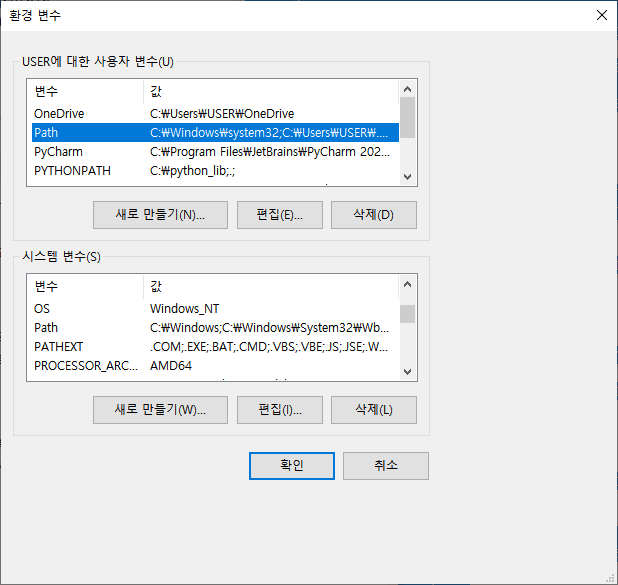
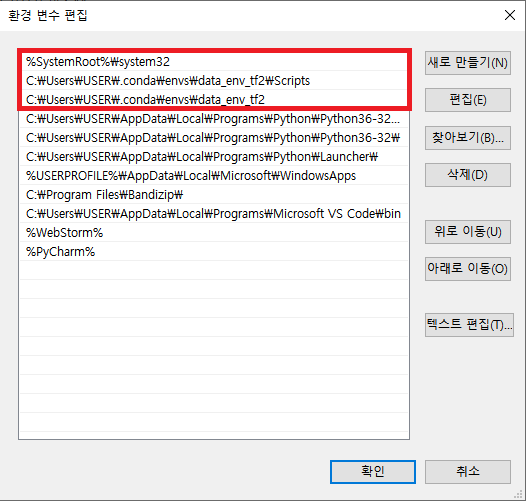
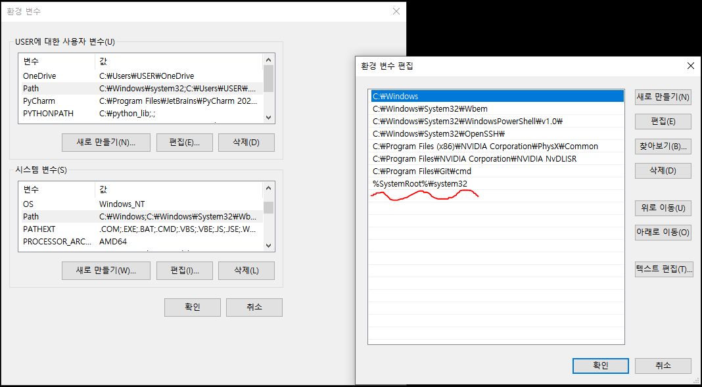
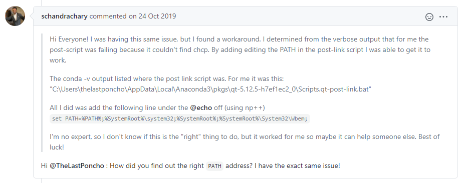
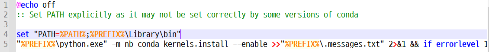
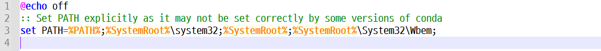

## Anaconda 새로운 환경 변수 jupyter notebook 설치 오류

<상황>

```bash
(data_env_tf2) C:\Users\USER>conda install nb_conda
Collecting package metadata (current_repodata.json): done

# 여기서부터 문제...
Solving environment: failed with initial frozen solve. Retrying with flexible solve.
Solving environment: failed with repodata from current_repodata.json, will retry with next repodata source.

Collecting package metadata (repodata.json): done
Solving environment: |

Warning: 2 possible package resolutions (only showing differing packages):
  - defaults/noarch::parso-0.8.1-pyhd3eb1b0_0, defaults/win-64::jedi-0.17.0-py37_0
  - defaults/noarch::parso-0.7.0-py_0, defaults/win-64::jedi-0.17.2-py37haa95532done

#....... (중간 설치할 package 내용 생략)


Executing transaction: | Enabling nb_conda_kernels...
CONDA_PREFIX: C:\Users\USER\.conda\envs\data_env_tf2
Status: enabled

| Config option `kernel_spec_manager_class` not recognized by `EnableNBExtensionApp`.
Enabling notebook extension nb_conda/main...
      - Validating: ok
Enabling tree extension nb_conda/tree...
      - Validating: ok
Config option `kernel_spec_manager_class` not recognized by `EnableServerExtensionApp`.
Enabling: nb_conda
- Writing config: C:\Users\USER\.conda\envs\data_env_tf2\etc\jupyter
    - Validating...
      nb_conda 2.2.1 ok

done

# (아직도 무슨 에러 인지 모르겠음...)
ERROR conda.core.link:_execute(698): An error occurred while installing package 'defaults::nb_conda_kernels-2.3.1-py37haa95532_0'.
Rolling back transaction: done

# (이걸 해결한거 같긴 한데...)
LinkError: post-link script failed for package defaults::nb_conda_kernels-2.3.1-py37haa95532_0
location of failed script: C:\Users\USER\.conda\envs\data_env_tf2\Scripts\.nb_conda_kernels-post-link.bat
==> script messages <==
Enabling nb_conda_kernels...
CONDA_PREFIX: C:\Users\USER\.conda\envs\data_env_tf2
Status: enabled

==> script output <==
stdout:
stderr: 'chcp'��(��) ���� �Ǵ� �ܺ� ����, ������ �� �ִ� ���α׷�, �Ǵ�
��ġ ������ �ƴմϴ�.
'chcp'��(��) ���� �Ǵ� �ܺ� ����, ������ �� �ִ� ���α׷�, �Ǵ�
��ġ ������ �ƴմϴ�.
'chcp'��(��) ���� �Ǵ� �ܺ� ����, ������ �� �ִ� ���α׷�, �Ǵ�
��ġ ������ �ƴմϴ�.

return code: 1

()
```


## 해결방법

### 1 환경변수 setting

#### <사용자 변수 Path>





> **`%SystemRoot%system32`** ==> 환경변수에 추가하면 문제 해결된다는 내용 많이 봤음
> (출처:https://github.com/ContinuumIO/anaconda-issues/issues/10949)

> 그리고 내가 사용하는 새로운 가상환경`(data_env_tf2)`도 올려놨는데... 사실 저건 의미 없어보임

> 혹시 몰라서 아래 `시스템 변수`에도 추가해놨음




## 2. `.nb_conda_kernels-post-link.bat` 파일 수정

> - 디렉토리 : `C:\Users\USER\.conda\pkgs\nb_conda_kernels-2.3.1-py37h03978a9_0\Scripts`

> 위 에러 내용 중 다음과 같은 error 문구가 있음 ==> `.nb_conda_kernels-post-link.bat` 이 파일에 집중함
> **`LinkError: post-link script failed for package defaults::nb_conda_kernels-2.3.1-py37haa95532_0
> location of failed script: C:\Users\USER\.conda\envs\data_env_tf2\Scripts\.nb_conda_kernels-post-link.bat`**



(출처: https://github.com/ContinuumIO/anaconda-issues/issues/10949)

> 위에 아저씨가 엄청난 확신과 기쁨으로 해결 방법을 highlight 해놓음
>
> 그런데 `.nb_conda_kernels-post-link.bat` 이 파일 안에 들어가보니깐 저게 그대로 있었음


(기존 내용)




(변경)




> 추론으로는 경로를 바꿔준거 같은데... 확실히 error 내용에 `PREFIX` & `nb_conda_kernels` 이런 글이 많이 있었던거 보면 뭔가 문제가 여기 있었을 듯...


```bash
# 혹시 모르니깐 원본 text 보존
set "PATH=%PATH%;%PREFIX%\Library\bin"
"%PREFIX%\python.exe" -m nb_conda_kernels.install --enable >>"%PREFIX%\.messages.txt" 2>&1 && if errorlevel 1 exit 1

# 이건 변경한 text
set PATH=%PATH%;%SystemRoot%\system32;%SystemRoot%;%SystemRoot%\System32\Wbem;
```


## 문제 해결 피드백

> - 많은 것을 배운 듯 하지만... 여전히 시스템 내부에서 일어나는 문제는 해결하기에 급급하고 중간 내용과 과정을 이해못하는 게 답답하다.
> - 긴 시간을 들여 결국 해결해서 기쁘지만 여전히 찝찝함은 남아 있다.

