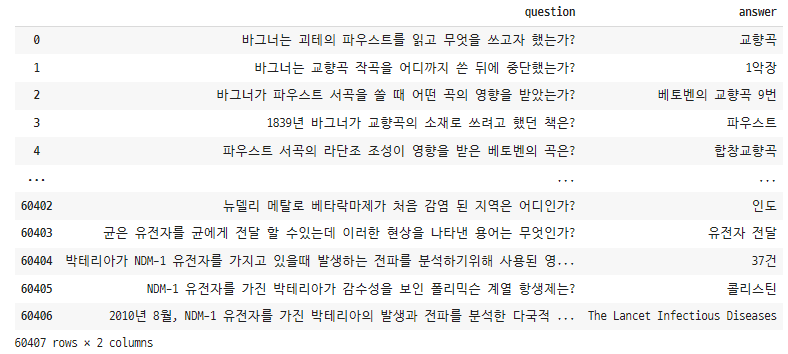
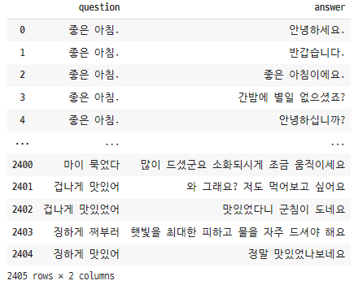
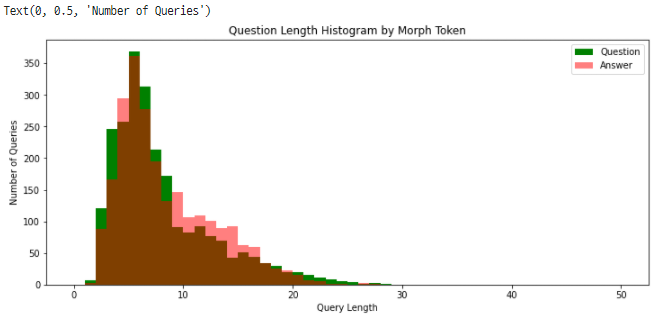
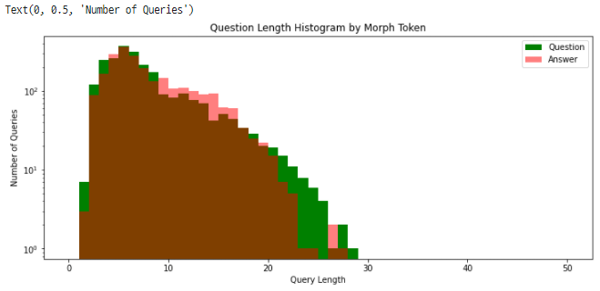
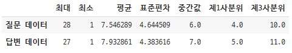
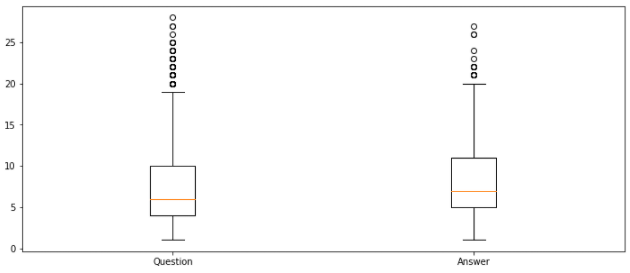
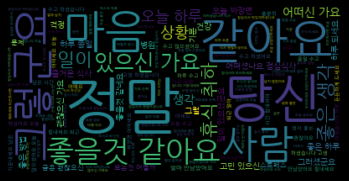
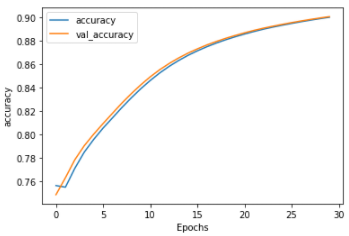
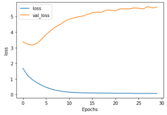
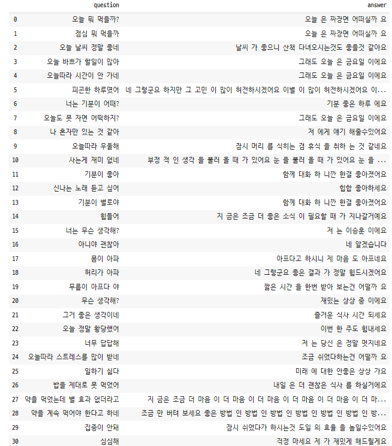

# Sequence 2 Sequence 모델


## 데이터

> - KorQuAD_v1.0
>   - Training 질의응답쌍 60,407개
>   - Test 질의 응답쌍 5,774개
> - 어르신 대화 데이터
>   - AI_hub 일상 대화 데이터 + 웰니스 건강 대화 데이터

---


> - KorQuAD_v1.0 데이터

```python
import json
import pandas as pd

# 데이터 불러오기
with open('/content/drive/MyDrive/Colab Notebooks/TF-IDF_Test/KorQuAD_v1.0_train.json', 'r', encoding='utf8') as f :
    contents = f.read() # string type
    json_data = json.loads(contents)

# 질문, 응답 쌍 데이터프레임 만들기
question = []
answer = []
for i in range(1420):
    first =  len(json_data['data'][i]['paragraphs'])
    for j in range(first):
        second = len(json_data['data'][i]['paragraphs'][j]['qas'])
        for k in range(second):
            q = json_data['data'][i]['paragraphs'][j]['qas'][k]['question']
            a = json_data['data'][i]['paragraphs'][j]['qas'][k]['answers'][0]['text']
            question.append(q)
            answer.append(a)
            
df = pd.DataFrame({
    'question' : question,
    'answer' : answer
})

df      
```




> - 어르신 대화 데이터

```python
chat_data = pd.read_csv('/content/drive/MyDrive/Colab Notebooks/TF-IDF_Test/new_chat_data.csv', encoding='utf8')
chat_data
```




> - KorQuAD_v1.0 데이터 + 어르신 대화 데이터

```python
new_data = pd.concat([df, chat_data], ignore_index=True)
new_data
```


---


## EDA

> - 어르신 대화 데이터만 사용

```python
# 전체 문장 분석
okt = Okt()

question_sentence = list(chat_data['question'])
answer_sentence = list(chat_data['answer'])

question_morph_tokenized_sentence = [okt.morphs(s.replace(' ', '')) for s in question_sentence ]
question_len_by_morphs = [len(t) for t in question_morph_tokenized_sentence]

answer_morph_tokenized_sentence = [okt.morphs(s.replace(' ', '')) for s in answer_sentence ]
answer_len_by_morphs = [len(t) for t in answer_morph_tokenized_sentence]

# 형태소로 나눈 문장 길이 히스토그램
plt.figure(figsize=(12,5))
plt.hist(question_len_by_morphs, bins=50, range=[0,50], color='g', label='Question')
plt.hist(answer_len_by_morphs, bins=50, range=[0,50], color='r', alpha=0.5, label='Answer')
plt.legend()
plt.title('Question Length Histogram by Morph Token')
plt.xlabel('Query Length')
plt.ylabel('Number of Queries')
```



```python
# yscale 적용
plt.figure(figsize=(12,5))
plt.hist(question_len_by_morphs, bins=50, range=[0,50], color='g', label='Question')
plt.hist(answer_len_by_morphs, bins=50, range=[0,50], color='r', alpha=0.5, label='Answer')
plt.legend()
plt.yscale('log', nonposy='clip')
plt.title('Question Length Histogram by Morph Token')
plt.xlabel('Query Length')
plt.ylabel('Number of Queries')
```



```python
# 데이터 통계값 정리
qa_df = pd.DataFrame()
qa_df['최대'] = [max(question_len_by_morphs), max(answer_len_by_morphs)]
qa_df['최소'] = [min(question_len_by_morphs), min(answer_len_by_morphs)]
qa_df['평균'] = [sum(question_len_by_morphs)/len(question_len_by_morphs), 
                 sum(answer_len_by_morphs)/len(answer_len_by_morphs)]
qa_df['표준편차'] = [np.std(question_len_by_morphs), np.std(answer_len_by_morphs)]
qa_df['중간값'] = [np.median(question_len_by_morphs), np.median(answer_len_by_morphs)]
qa_df['제1사분위'] = [np.percentile(question_len_by_morphs,25), np.percentile(answer_len_by_morphs,25)]
qa_df['제3사분위'] = [np.percentile(question_len_by_morphs,75), np.percentile(answer_len_by_morphs,75)]
qa_df.index = ['질문 데이터', '답변 데이터']
qa_df
```



```python
# 박스플롯 확인
plt.figure(figsize=(12,5))
plt.boxplot([question_len_by_morphs, answer_len_by_morphs],
            labels=['Question', 'Answer'])
plt.show()
```



```python
# 자주 사용한 단어를 구분하기 위해 품사별로 분류
# 명사 형용사 동사만 사용

question_token_sentence = []
answer_token_sentence = []

for s in question_sentence:
    for token, tag in okt.pos(s.replace(' ','')):
        if tag == 'Noun' or tag == 'Verb' or tag == 'Adjective':
            question_token_sentence.append(token)

for s in answer_sentence:
    for token, tag in okt.pos(s.replace(' ','')):
        if tag == 'Noun' or tag == 'Verb' or tag == 'Adjective':
            answer_token_sentence.append(token)

question_token_sentence = ' '.join(question_token_sentence)
answer_token_sentence = ' '.join(answer_token_sentence)
```

```python
# 질문 문장 워드 클라우드
q_wordcloud = WordCloud(font_path='/content/drive/MyDrive/Colab Notebooks/TF-IDF_Test/NanumGothic.ttf').generate(question_token_sentence)
plt.imshow(q_wordcloud, interpolation='bilinear')
plt.axis('off')
plt.show()
```


```python
# 답변 문장 워드 클라우드
a_wordcloud = WordCloud(font_path='/content/drive/MyDrive/Colab Notebooks/TF-IDF_Test/NanumGothic.ttf').generate(answer_token_sentence)
plt.imshow(a_wordcloud, interpolation='bilinear')
plt.axis('off')
plt.show()
```




---


## 데이터 전처리

```python
# 라이브러리
import os
import re
import json
import numpy as np
import pandas as pd
from tqdm import tqdm
from konlpy.tag import Okt

# 설정
FILTERS = "([~.,!?\"';:)(])"
PAD = '<PAD>'   # ==> 어떤 의미도 없는 패딩 토큰
STD = '<SOS>'   # ==> 시작 토큰을 의미
END = '<END>'   # ==> 종료 토큰을 의미
UNK = '<UNK>'   # ==> 사전에 없는 단어 의미

PAD_INDEX = 0
STD_INDEX = 1
END_INDEX = 2
UNK_INDEX = 3

MARKER =[PAD, STD, END, UNK]
CHANGE_FILTER =re.compile(FILTERS)

MAX_SEQUENCE =20  # 우리 모델에서 사용할 문장 최대 길이
```


> - 데이터 불러오기

```python
def load_data(path):
    data_df = pd.read_csv(path, header=0)
    question, answer = list(data_df['question']), list(data_df['answer'])
    return question, answer
```


> - 단어 전처리

```python
def data_tokenizer(data):
    words = []
    for s in data :
        sentence = re.sub(CHANGE_FILTER, "", s)
        for word in sentence.split():
            words.append(word)
    return [word for word in words if word]
```


> - 한글 텍스트 형태소 단위 토크나이징

```python
def prepro_morphlized(data):
    morph_analyzer = Okt()
    result_data = []
    for seq in tqdm(data):
        morphlized_seq = " ".join(morph_analyzer.morphs(seq.replace(' ', '')), stem=True)
        result_data.append(morphlized_seq)

    return result_data
```


> - 단어 사전 만들기

```python
def load_vocab(path, vocab_path, tokenize_as_morph=False):
    vocab_list = []
	
    # 단어 사전 저장할 폴더 없을 경우
    if not os.path.exists(vocab_path):
        if (os.path.exists(path)):
            data_df = pd.read_csv(path, encoding='utf-8')
            question, answer = list(data_df['question']), list(data_df['answer'])

            if tokenize_as_morph :
                question = prepro_morphlized(question)
                answer = prepro_morphlized(answer)

            data = []
            data.extend(question)
            data.extend(answer)

            words = data_tokenizer(data)
            words = list(set(words))
            words[:0] = MARKER

        with open(vocab_path, 'w', encoding='utf-8') as vocab_file:
            for word in words:
                vocab_file.write(word + '\n')

    with open(vocab_path, 'r', encoding='utf-8') as vocab_file:
        for line in vocab_file:
            vocab_list.append(line.strip())  # ==> strip() : 양쪽 공백 모두 삭제

    word2idx, idx2word = make_vocab(vocab_list)

    return word2idx, idx2word, len(word2idx)

def make_vocab(vocab_list):
    # key : 단어 , value : 인덱스 ==> 딕셔너리 만든다
    word2idx = {word:idx for idx, word in enumerate(vocab_list)}

    # key : 인덱스 , value : 단어 ==> 딕셔너리 만든다
    idx2word = {idx:word for idx, word in enumerate(vocab_list)}

    return word2idx, idx2word
```


## 인코더, 디코더

> - 인코딩 함수

```python
def enc_processing(value, dictionary, tokenize_as_morph=False):
    seq_input_idx = []
    seq_len = []

    if tokenize_as_morph:
        value = prepro_morphlized(value)

    for seq in value:
        seq = re.sub(CHANGE_FILTER, "", seq)
        seq_idx = []

        for word in seq.split():
            if dictionary.get(word) is not None:
                seq_idx.extend([dictionary[word]])
            else:
                seq_idx.extend([dictionary[UNK]])

        if len(seq_idx) > MAX_SEQUENCE:
            seq_idx = seq_idx[:MAX_SEQUENCE]

        seq_len.append(len(seq_idx))
        seq_idx += (MAX_SEQUENCE - len(seq_idx)) * [dictionary[PAD]]

        seq_input_idx.append(seq_idx)

    return np.asarray(seq_input_idx), seq_len
```


> - 디코딩 입력값 함수

```python
def dec_output_processing(value, dictionary, tokenize_as_morph=False):
    seq_output_idx = []
    seq_len = []

    if tokenize_as_morph:
        value = prepro_morphlized(value)

    for seq in value:
        seq = re.sub(CHANGE_FILTER, "", seq)
        seq_idx = [dictionary[STD]] + [dictionary[word] for word in seq.split()]

        if len(seq_idx) > MAX_SEQUENCE:
            seq_idx = seq_idx[:MAX_SEQUENCE]
        seq_len.append(len(seq_idx))
        seq_idx += (MAX_SEQUENCE - len(seq_idx)) * [dictionary[PAD]]

        seq_output_idx.append(seq_idx)

    return np.asarray(seq_output_idx), seq_len
```


> - 디코딩 타킷값 함수

```python
def dec_target_processing(value, dictionary, tokenize_as_morph=False):
    seq_target_idx = []

    if tokenize_as_morph:
        value = prepro_morphlized(value)

    for seq in value:
        seq = re.sub(CHANGE_FILTER, "", seq)
        seq_idx = [dictionary[word] for word in seq.split()]

        if len(seq_idx) >= MAX_SEQUENCE:
            seq_idx = seq_idx[:MAX_SEQUENCE-1] + [dictionary[END]]
        else:
            seq_idx += [dictionary[END]]
        
        seq_idx += (MAX_SEQUENCE - len(seq_idx)) * [dictionary[PAD]]
        seq_target_idx.append(seq_idx)

    return np.asarray(seq_target_idx)
```


## 인덱스 데이터 및 단어사전 세팅

> - 모델에 넣을 인덱스 DATA 구성

```python
PATH = '/content/drive/MyDrive/Colab Notebooks/TF-IDF_Test/data_in/Total_chat_data.csv'
VOCAB_PATH = '/content/drive/MyDrive/Colab Notebooks/TF-IDF_Test/data_in/vocabulary.txt'

input, output = load_data(PATH)
char2idx, idx2char, vocab_size = load_vocab(PATH, VOCAB_PATH, tokenize_as_morph=True)

index_inputs, input_seq_len = enc_processing(input, char2idx, tokenize_as_morph=True)
index_outputs, output_seq_len = dec_output_processing(output, char2idx, tokenize_as_morph=True)
index_targets = dec_target_processing(output, char2idx, tokenize_as_morph=True)
```


> - 모델 학습과 추론에 사용하기 위한 단어사전 세팅

```python
data_configs = {}

data_configs['char2idx'] = char2idx
data_configs['idx2char'] = idx2char
data_configs['vocab_size'] = vocab_size
data_configs['pad_symbol'] = PAD
data_configs['std_symbol'] = STD
data_configs['end_symbol'] = END
data_configs['unk_symbol'] = UNK

# 딕셔너리 객체 numpy와 json 형식으로 저장
DATA_IN_PATH = '/content/drive/MyDrive/Colab Notebooks/TF-IDF_Test/data_in/'
TRAIN_INPUTS = 'train_inputs.npy'
TRAIN_OUTPUTS = 'train_outputs.npy'
TRAIN_TARGESTS = 'train_targets.npy'
DATA_CONFIGS = 'data_configs.json'

np.save(open(DATA_IN_PATH + TRAIN_INPUTS, 'wb'), index_inputs)
np.save(open(DATA_IN_PATH + TRAIN_OUTPUTS, 'wb'), index_outputs)
np.save(open(DATA_IN_PATH + TRAIN_TARGESTS, 'wb'), index_targets)

json.dump(data_configs, open(DATA_IN_PATH + DATA_CONFIGS, 'w'))
```


> - 모델 학습 결과 그래프 시각화 함수

```python
def plot_graphs(history, string):
    plt.plot(history.history[string])
    plt.plot(history.history['val_' + string], '')
    plt.xlabel('Epochs')
    plt.ylabel(string)
    plt.legend([string, 'val_' + string])
    plt.show()
```


## 모델 구현

> - 설정

```python
# 학습 데이터 경로
DATA_IN_PATH = '/content/drive/MyDrive/Colab Notebooks/TF-IDF_Test/data_in/'
DATA_OUT_PATH = '/content/drive/MyDrive/Colab Notebooks/TF-IDF_Test/data_out/'
TRAIN_INPUTS = 'train_inputs.npy'
TRAIN_OUTPUTS = 'train_outputs.npy'
TRAIN_TARGESTS = 'train_targets.npy'
DATA_CONFIGS = 'data_configs.json'

# 랜덤 씨드값
SEED_NUM = 1234
tf.random.set_seed(SEED_NUM)

# 미리 전처리된 데이터 & 설정값 불러오기
index_inputs = np.load(open(DATA_IN_PATH + TRAIN_INPUTS, 'rb'))
index_outputs = np.load(open(DATA_IN_PATH + TRAIN_OUTPUTS, 'rb'))
index_targets = np.load(open(DATA_IN_PATH + TRAIN_TARGESTS, 'rb'))
prepro_configs = json.load(open(DATA_IN_PATH + DATA_CONFIGS, 'r'))

# 모델 구성에 필요한 파라미터
MODEL_NAME = 'seq2seq_kor'
BATCH_SIZE = 2
MAX_SEQUENCE = 20
EPOCHS = 30
UNITS = 1024            # ==> 재귀신경망의 결과 차원 
EMBEDDING_DIM = 256     # ==> 임베딩 차원
VALIDATION_SPLIT = 0.1

char2idx = prepro_configs['char2idx']
idx2char = prepro_configs['idx2char']
std_index = prepro_configs['std_symbol']
end_index = prepro_configs['end_symbol']
vocab_size = prepro_configs['vocab_size']
```


> - seq2seq 모델 + GRU 모델

```python
class Encoder(tf.keras.layers.Layer):
    def __init__(self, vocab_size, embedding_dim, enc_units, batch_size):
        super(Encoder, self).__init__()
        self.batch_size = batch_size
        self.enc_units = enc_units
        self.vocab_size = vocab_size
        self.embedding_dim = embedding_dim

        self.embedding = tf.keras.layers.Embedding(self.vocab_size, self.embedding_dim)
        self.gru = tf.keras.layers.GRU(self.enc_units,
                                        return_sequences = True,   # ==> 각각 시퀀스마다 출력을 반환할지 여부
                                        return_state=True,      # ==> 마지막 상태 값의 반환 여부
                                        recurrent_initializer='glorot_uniform')
        
    def call(self, x, hidden):
        x = self.embedding(x)
        output, state = self.gru(x, initial_state= hidden)
        return output, state

    def initialize_hidden_state(self, inp):
        return tf.zeros((tf.shape(inp)[0], self.enc_units))

# 어텐션 추가
class Attention(tf.keras.layers.Layer):
    def __init__(self, units):
        super(Attention, self).__init__()
        self.W1 = tf.keras.layers.Dense(units)
        self.W2 = tf.keras.layers.Dense(units)
        self.V = tf.keras.layers.Dense(1)

    def call(self, query, values):
        # query : 인코더 재귀 순환망의 은닉층의 상태 값
        # values : 인코더 재귀 순환망의 결과값

        # query를 W2에 행렬곱 할 수 있는 형태로 만든다
        hidden_axis = tf.expand_dims(query, 1)

        # W1 과 W2의 결과값 요소를 각각 더하고 하이퍼볼릭 탄젠츠 활성함수 통과한 값을 V에 행렬곱하면 1차원 백터값 나온다.
        score = self.V(tf.nn.tanh(self.W1(values) + self.W2(hidden_axis)))

        # 모델 훈련 중 W1, W2, V 가중치들은 학습된다
        # 소프트맥스 함수를 통과시켜 어텐션 가중치 얻는다.
        # attention_weights 값은 모델이 중요하다고 판단하는 값은 1에 가까워지고, 영향도가 떨어질수록 0에 가까워진다.
        attention_weights = tf.nn.softmax(score, axis=1)

        # attention_weights 값을 순환신경망 결과값(values)에 행력 곱 하면 1에 가까운 값에 위치한 value는 커지고, 0에 가까위 value는 작아진다.
        context_vector = attention_weights * values

        # 결론적으로 인코더 순환 신경망의 결과값을 어텐션 방법을 적용해 가중치 계한한 후
        # 가중티가 적용된 새로운 인코더 순환 신경망의 결과값을 만들어내서 디코더에 전달한다.
        context_vector = tf.reduce_sum(context_vector, axis=1)

        return context_vector, attention_weights

# 디코더 클래스
class Decoder(tf.keras.layers.Layer):
    def __init__(self, vocab_size, embedding_dim, dec_units, batch_size):
        super(Decoder, self).__init__()

        self.batch_size = batch_size
        self.dec_units = dec_units
        self.vocab_size =vocab_size
        self.embedding_dim = embedding_dim

        self.embedding = tf.keras.layers.Embedding(self.vocab_size, self.embedding_dim)
        self.gru = tf.keras.layers.GRU(self.dec_units,
                                        return_sequences=True,   # ==> 각각 시퀀스마다 출력을 반환할지 여부
                                        return_state=True,      # ==> 마지막 상태 값의 반환 여부
                                        recurrent_initializer='glorot_uniform')
        
        # 출력값이 사전 크기인 완전 연결 fc 만들기
        self.fc = tf.keras.layers.Dense(self.vocab_size)

        self.attention = Attention(self.dec_units)

    def call(self, x, hidden, enc_output):
        context_vector, attention_weights = self.attention(hidden, enc_output)

        # 임베딩 백터
        x = self.embedding(x)

        # 문맥 백터와 임베딩 백터를 결합
        x = tf.concat([tf.expand_dims(context_vector, 1), x], axis=-1)
        print(x)
        
        # 디코더 순환신경망 통과해서 결과값 얻음
        output, state = self.gru(x)

        output = tf.reshape(output, (-1, output.shape[2]))

        x = self.fc(output)

        return x, state, attention_weights

# 위에 각 클래스를 이어주는 메인 클래스
class seq2seq(tf.keras.Model):
    def __init__(self, vocab_size, embedding_dim, enc_units, dec_units, batch_size, end_token_idx=2):
        super(seq2seq, self).__init__()
        self.end_token_idx = end_token_idx
        self.encoder = Encoder(vocab_size, embedding_dim, enc_units, batch_size)
        self.decoder = Decoder(vocab_size, embedding_dim, dec_units, batch_size)

    def call(self, x):
        inp, target = x

        enc_hidden = self.encoder.initialize_hidden_state(inp)
        enc_output, enc_hidden = self.encoder(inp, enc_hidden)

        dec_hidden = enc_hidden

        predict_tokens = []
        for t in range(0, target.shape[1]):
            dec_input = tf.dtypes.cast(tf.expand_dims(target[:,t], 1), tf.float32)
            predictions, dec_hidden, _ = self.decoder(dec_input, dec_hidden, enc_output)
            predict_tokens.append(tf.dtypes.cast(predictions, tf.float32))

        # predict_tokens ==> 시퀀스마다 나온 결과값이 들어가 있어서 손실 계산, 또는 정확도 계산하는 용도

        return tf.stack(predict_tokens, axis=1)

    def inference(self, x):
        inp = x

        enc_hidden = self.encoder.initialize_hidden_state(inp)
        enc_output, enc_hidden = self.encoder(inp, enc_hidden)

        dec_hidden = enc_hidden

        dec_input = tf.expand_dims([char2idx[std_index]], 1)

        predict_tokens = []

        for t in range(0, MAX_SEQUENCE):
            predictions, dec_hidden, _ = self.decoder(dec_input, dec_hidden, enc_output)
            predict_token = tf.argmax(predictions[0])

            # <END> 토큰 만나면 반복문 멈춘다
            if predict_token == self.end_token_idx:
                break

            predict_tokens.append(predict_token)
            dec_input = tf.dtypes.cast(tf.expand_dims([predict_token], 0), tf.float32)

        return tf.stack(predict_tokens, axis=0).numpy()
```


> - 모델 정의

```python
# 학습 설정 값 및 함수
optimizer = tf.keras.optimizers.Adam()

# 크로스엔트로피 손실 값 측정
loss_object = tf.keras.losses.SparseCategoricalCrossentropy(from_logits=True, reduction='none')

train_accuracy = tf.keras.metrics.SparseCategoricalAccuracy(name='accuracy')

# 인자로 정답과 예측한 값을 받아서 두 개의 값을 비교해서 손실 계산
# real값 중 0인 값 <PAD>는 손실 계산에서 빼기 위한 함수
def loss(real, pred):
    mask = tf.math.logical_not(tf.math.equal(real,0))
    loss_ = loss_object(real, pred)
    mask = tf.cast(mask, dtype=loss_.dtype)
    loss_ *= mask
    return tf.reduce_mean(loss_)

def accuracy(real, pred):
    mask = tf.math.logical_not(tf.math.equal(real,0))
    mask = tf.expand_dims(tf.cast(mask, dtype=pred.dtype), axis=-1)
    pred *= mask
    acc = train_accuracy(real, pred)

    return tf.reduce_mean(acc)

model = seq2seq(vocab_size, EMBEDDING_DIM, UNITS, UNITS, BATCH_SIZE, char2idx[end_index])
model.compile(loss=loss, optimizer=tf.keras.optimizers.Adam(1e-3), metrics=[accuracy])

PATH = DATA_OUT_PATH + MODEL_NAME
if not(os.path.isdir(PATH)):
    os.makedirs(os.path.join(PATH))

checkpoint_path = DATA_OUT_PATH + MODEL_NAME + '/weights.h5'

cp_callback = ModelCheckpoint(
    checkpoint_path, 
    monitor='val_accuracy', 
    verbose=1, 
    save_best_only=True, 
    save_weights_only=True
)

earlystop_callback = EarlyStopping(monitor='val_accuracy',
                                   min_delta=0.001,
                                   patience=10)
history = model.fit([index_inputs, index_outputs],
                    index_targets,
                    batch_size=BATCH_SIZE, 
                    epochs=EPOCHS,
                    validation_split = VALIDATION_SPLIT,
                    callbacks=[earlystop_callback, cp_callback])
```


## 학습 결과

> - Accuracy 그래프

```python
plot_graphs(history, 'accuracy')
```



> - Loss 그래프

```python
plot_graphs(history, 'loss')
```



> - Test

```python
new_q = ['오늘 뭐 먹을까?', '점심 뭐 먹을까', '오늘 날씨 정말 좋네', '오늘 바쁘가 할일이 많아', '오늘따라 시간이 안 가네', '피곤한 하루였어', '너는 기분이 어때?', '오늘도 못 자면 어떡하지?', '나 혼자만 있는 것 같아', '오늘따라 우울해', '사는게 재미 없네', '기분이 좋아', '신나는 노래 듣고 싶어', '기분이 별로야', '힘들어', '너는 무슨 생각해?', '아니야 괜찮아', '몸이 아파', '허리가 아파', '무릎이 아프다 야', '무슨 생각해?', '그거 좋은 생각이네', '오늘 정말 황당했어', '너무 답답해', '오늘따라 스트레스를 많이 받네', '일하기 싫다', '밥을 제대로 못 먹었어', '약을 먹었는데 별 효과 없더라고', '약을 계속 먹어야 한다고 하네', '집중이 안돼', '심심해', '요즘 잠이 안와']

qq = []
aa = []

for i in new_q :
    query = i
    test_index_inputs, _ = enc_processing([query], char2idx, tokenize_as_morph=True)    
    predict_tokens = model.inference(test_index_inputs)
    anwser = ' '.join([idx2char[str(t)] for t in predict_tokens])
    qq.append(query)
    aa.append(anwser)

seq2_result = pd.DataFrame({
    'question':qq,
    'answer': aa
})

seq2_result
```


