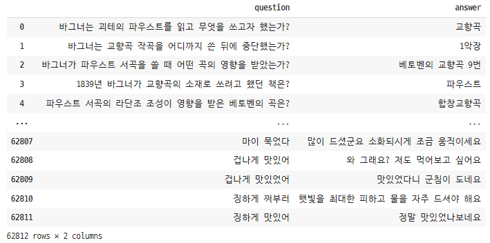

# Sequence 2 Sequence 모델


## 데이터

> - KorQuAD_v1.0
>   - Training 질의응답쌍 60,407개
>   - Test 질의 응답쌍 5,774개
> - 어르신 대화 데이터
>   - AI_hub 일상 대화 데이터 + 웰니스 건강 대화 데이터


### 데이터 전처리

> - KorQuAD_v1.0 데이터

```python
import json
import pandas as pd

# 데이터 불러오기
with open('/content/drive/MyDrive/Colab Notebooks/TF-IDF_Test/KorQuAD_v1.0_train.json', 'r', encoding='utf8') as f :
    contents = f.read() # string type
    json_data = json.loads(contents)

# 질문, 응답 쌍 데이터프레임 만들기
question = []
answer = []
for i in range(1420):
    first =  len(json_data['data'][i]['paragraphs'])
    for j in range(first):
        second = len(json_data['data'][i]['paragraphs'][j]['qas'])
        for k in range(second):
            q = json_data['data'][i]['paragraphs'][j]['qas'][k]['question']
            a = json_data['data'][i]['paragraphs'][j]['qas'][k]['answers'][0]['text']
            question.append(q)
            answer.append(a)
            
df = pd.DataFrame({
    'question' : question,
    'answer' : answer
})

df      
```


> - 어르신 대화 데이터

```python
chat_data = pd.read_csv('/content/drive/MyDrive/Colab Notebooks/TF-IDF_Test/new_chat_data.csv', encoding='utf8')
chat_data
```


> - KorQuAD_v1.0 데이터 + 어르신 대화 데이터

```python
new_data = pd.concat([df, chat_data], ignore_index=True)
new_data
```



