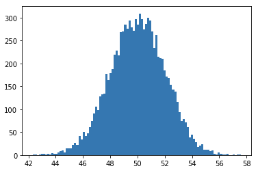
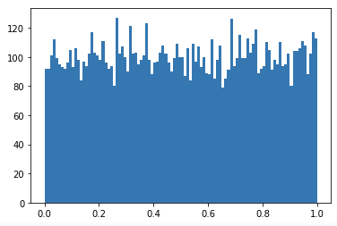
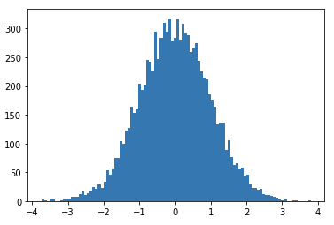
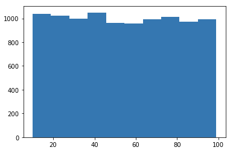
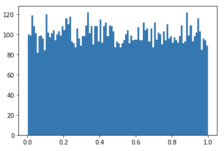

# 인터페이스 개발 #9 (2021.01.08)


## Category

* Numpy 생성

* Numpy 관련 method

* len() vs .size

* Numpy .shape

* astype()

* ndarray의 다양한 생성 함수
  `np.zeros` / `np.ones` / `np.empty` / `np.full` / `np.arange`

* random 기반 ndarray 생성

  np.random.normal()

  np.random.rand()

  np.random.randn()

  np.random.randint()

  np.random.random()

  np.random.seed()

  np.random.shuffle()

* ndarray의 형태(shape) 제어

  - reshape & resize

---


## Numpy

>* Numeric Python : 수치연산을 위한 파이썬 모델
>* 행렬 연산을 기본으로 하는 라이브러리
>* numpy module은  vector나 matrix 연산에 있어서 상당한 편리성 제공
>* numpy module은 우리에게 기본적인 자료구조 제공
>* ndarray(n-dimensional array) == n차원의 배열


### Step.1 Module 다운

1) anaconda prompt 실행

2) 가상환경 전환 ==> conda activate data_env

3) numpy 설치 ==> conda install numpy


## numpy 생성

```python
# python 의 list
a = [1,2,3,4] # literal(프로그램적 기호를 이용해서 표현)
b = list()    # list라는 class를 이용해서 생성

import numpy as np
b = np.array([1,2,3,4,5])
print(b) # ==> [1 2 3 4 5]
print(type(b)) # ==> <class 'numpy.ndarray'>

# ndarray 안 data type이 무엇인지
print(b.dtype) # ==> int32 : 32비트 정수형 자료 가지고 있다
print(type(b[0])) # ==> <class 'numpy.int32'>
```


### 리스트와 가장큰 차이점!

### ==> ndarray는 모든 원소가 같은 데이터 type을 가져야 한다.


---


### 다차원 ndarray

```python
# ==> python list는 차원 개념이 아니다!

my_array = np.array([[1,2,3], [4,5,6]])
print(my_array)
'''
출력해보면 행과 열로 구성된
[[1 2 3]
 [4 5 6]]
'''
```


### numpy array에서 인덱스 하는 방법

```python
print(my_array[1,1]) # ==> 2행 2열 ==> 5
```


### ndarray 데이터 타입 지정해서 만들기

> dtype = np.float64

```python
# 실수형 ndarray 만들기
my_array = np.array(([[1,2,3], [4,5,6]]), dtype = np.float64)
print(my_array)
'''
[[1. 2. 3.]
 [4. 5. 6.]]
'''
```


### ndarray 대표 속성 표현

> * ndim, shape

```python
# 1차원
my_list = [1,2,3,4]
arr = np.array(my_list)
print(arr.dim) # 1차원
print(arr.shape) # (4,)

# .dim ==> 차원의 수를 나타냄
# .shape ==> 각 차원과 요소의 개수를 tuple로 표현


# 2차원

my_list = [[1,2,3], [4,5,6]]
arr = np.array(my_list)
print(arr.ndim) # ==> 2차원
print(arr.shape) # ==> (2,3) == (차원의 수, 각 차원의 요소 개수)
'''
[[1. 2. 3.]
 [4. 5. 6.]]
'''


# 3차원
my_list = [[[1,2,3],[4,5,6]],[[7,8,9],[10,11,12]]]
arr = np.array(my_list)
print(arr)
'''
[[[ 1  2  3]
  [ 4  5  6]]

 [[ 7  8  9]
  [10 11 12]]]
'''
print(arr.ndim) # ==> 3
print(arr.shape) # ==> (2,2,3) ==> 2면 2행 3열
```


### len() 과 size의 차이

> * len()은 리스트 안의 , 구분 구성 숫자를 알려주고
> * .size는 ndarray 구성 안 개별 요소가 총 몇개인지 알려준다 

```python
import numpy as np

my_list = [1,2,3,4]
arr = np.array(my_list)
print('shape : {}'.format(arr.shape)) # ==> shape : (4,)
print('크기(len) : {}'.format(len(arr))) # ==> numpy array의 크기 ==> 4
print('크기(size) : {}'.format(arr.size)) # ==> len과 값이 같게 나온다. ==> 4

# But len 과 size는 2차원에서 다르게 나온다.
my_list = [[1,2,3],[4,5,6]]
arr = np.array(my_list)
print('shape : {}'.format(arr.shape)) # (2,3)

print('크기(len) : {}'.format(len(arr))) # 2
# 차원에 상관 없이 리스트 안에 요소가 몇개? ==> [[],[]] 2개

print('크기(size) : {}'.format(arr.size)) # 6
# ndarray 안 요소가 총 몇개 인지

```


### shape의 다른 기능

> * ndarray의 구성을 알수도 있지만
> * 구성 형태를 바꿀 수도 있다.
> * 하지만, reshape를 더 많이 쓴다! 

```python
import numpy as np

my_list = [1,2,3,4]
arr = np.array(my_list)
print(arr.shape) # ==> numpy array의 구성 알려줘 ==> (4,)

arr.shape = (2,2) 
# print 하면 그 구성을 알 수 있지만
# 변수로 주고 행과 열을 주면
# 입력대로 바꿔준다.
print(arr)
'''
[[1 2]
 [3 4]]
'''

# 3차원으로 바꾸기

arr,shape = (4,1,1)
print(arr)
'''
[[[1]]

 [[2]]

 [[3]]

 [[4]]]
'''
```


### astype()으로 정수형 자료를 실수형 자료로 바꿔보자

> * numpy가 가지고 있는 method
>
> * ndarray의 data type을 변경
>
> * 내가 원하는 data type으로 바꿀 수 있다.
>
>   ==> int32 자료에서 float64 배열로
>
>   ==> 객체.astype(np.float64)

```python
import numpy as np

arr = np.array([1.2, 2.3, 3.5, 5.4, 4.1, 5.7])
print(arr.dtype)  # ==> float64

arr = arr.astype(np.int32)
print(arr.dtype) # ==> int32
print(arr) # 정수로 바꿀 때 소수점 이하는 버린다.
# ==> [1 2 3 5 4 5]
```


## ndarray의 다양한 생성 함수

> 1. np.zeros
> 2. np.ones
> 3. np.empty
> 4. np.full
> 5. np.arange


#### 1) np.zeros

> 내가 원하는 형태의 배열로 만들고 요소를 0으로 채워라

```python
import numpy as np

arr =np.zeros((3,4))
# 3행 4열짜리 ndarray
# 기본 data type은 float64

print(arr)
'''
[[0. 0. 0. 0.]
 [0. 0. 0. 0.]
 [0. 0. 0. 0.]]
'''

# data type 설정할 수 있다.
arr = np.zeros((3,4), dtype = np.int32)
print(arr)
'''
[[0 0 0 0]
 [0 0 0 0]
 [0 0 0 0]]
'''
```


#### 2) np.ones

> ndarray를 1로 채워서 만들기

```python
arr = np.ones((2,2), dtype = np.int32)
print(arr)
'''
[[1 1]
 [1 1]]
'''
```


#### 3) np.empty

> empty를 사용하는 이유
>
> 빠르게 공간만 만들고싶을 때
>
> 쓰레기 값을 아무렇게나 넣어서 빠르게 만들 수 있다.

```python
arr = np.empty((2,2))
print(arr)
'''
[[1.  2. ]
 [3.  4.5]]
'''
```


#### 4) np.full

> 내가 원하는 값을 주면서 ndarray 만들기

```python
arr = np.full((2,2), 7, dtype=np.float64)
print(arr)
'''
[[7. 7.]
 [7. 7.]]
'''
```


#### 5) np.arange

> ndarray 만드는 또 다른 방법
>
> range가 list 만들어 주는 것과 같다.

```python
arr = np.arange(0,11,2)
# 0부터 10까지 2씩 건너뀌어서 ndarray 생성
print(arr)
# ==> [ 0  2  4  6  8 10]

# # arange는 기본 1차원 형식으로만 만들 수 있다
# 그래서 기본 만들고 원하는 shape로 reshape 줘야 한다.
print(arr.reshape(2,3)) # reshape는 view만 생성!
'''
[[ 0  2  4]
 [ 6  8 10]]
'''
```


## random 기반 ndarray 생성

> random 값을 생성
>
> 간단한 그래프 모듈 이용하여 데이터 분포 볼 수 있다.
>
> matplotlib 모듈 사용한다.


#### 1) np.random.normal()

> * `정규분포`에서 `실수`형태 난수를 추출
> * numpy가 가지고 있는 random 클래스에서 normal 메쏘드 사용

```python
import numpy as np
import matplotlib.pyplot as plt
# matplotlib 모듈 안에 있는 pyplot 클래스 이용

my_mean = 50 # 평균값
my_std = 2   # 표준편차

# 1차원 형태로 평균 50, 표준편차 2의 정규분포에 속한 난수를 추출한다
arr = np.random.normal(my_mean, my_std, (1000,)) 
# (평균, 표준편차, 요소개수 몇개 줄건지)
print(arr)
# ==> [48.79017376 52.94437454 46.62254331 ... 50.45626116 50.34343596 48.44195045]

# 위 수치를 히스토그램으로 그려보기
plt.hist(arr, bins=100)
# bins = 최대값과 최소값 사이를 100 영역으로 쪼갠다.
plt.show # ==> 그래프 출력하는 명령어

```




#### 2) np.random.rand()

> * 0 이상 1 미만의 `실수`를 난수로 추출
>
> * `균등분포`로 난수 추출
>
> * np.random.rand(d0, d1, d2, d3, ...)
>
>   ==> d0 = 1차원 요소 개수
>
>   ==> d1 = 2차원 요소 개수

```python
import numpy as np
import matplotlib.pyplot as plt

arr = np.random.rand(10000)
print(arr)
# ==> [0.44379309 0.58837856 0.91234821 ... 0.54859848 0.58756234 0.78262278]
# ==> 0과 1사이 난수 10000개 1차원 ndarray로 생성 

arr1 = np.random.rand(10,10)
print(arr1)
# ==> 10행 10열짜리 2차원 ndarray 생성

plt.hist(arr, bins=100)
plt.show
```




#### 3) np.random.randn()

> * `표준 정규분포`에서 `실수` 형태로 난수 추출
> * 표준 정규분포(평균=0, 표준편차 =1)

```python
arr = np.random.randn(10000) # ==> 10000 : 난수 10,000개 생성
print(arr)
'''
[ 1.43029222 -0.13987281 -1.48331412 ... -0.24107083  0.13395994
 -1.74265075]
'''

plt.hist(arr, bins=100)
plt.show
```




#### 4) np.random.randint()

> * 균등분포로 `정수` 표본을 추출
> * np.random.randint(low, high, shape)

```python
arr = np.random.randint(10,100,(100,))
# ==> 10부터 99 수 중에서 매번 정수를 난수로 100개 뽑아 1차원 ndarray 만들어줘
print(arr)
# ==> [28 31 29 ... 74 47 56]
# ==> 난수여서 출력할 때마다 다른 값이 나온다.

plt.hist(arr, bins =10)
plt.show
```




#### 5) np.random.random()

> * 0 이상 1미만의 `실수`를 난수로 추출
>
> * np.random.rand()와 똑같은 것을 추출
> * 사용 방식은 조금 다르다
> * np.random.random((10000,))  ==> shape를 준다!

```python
arr = np.random.random((10000,))
print(arr)
# [0.63932662 0.52270155 0.56998666 ... 0.67892132 0.5877172  0.37877959]

plt.hist(arr, bins = 100)
plt.show
```




#### 6) np.random.seed()

> * random은 실행할 때마다 새로운 난수를 추출한다.
>
> * 실행할 때마다 같은 난수가 추출되도록 설정 할 수 있다.
>
>   (== 난수의 재현)
>
> * np.random.seed() ==> seed값 설정

```python
import numpy as np

np.random.seed(1)
# ==> seed값을 고정시켜 주면, 이 seed를 이용해서 난수 추출
# randint 다시 실현해서 seed 1에서 계속 가져와서 같은 난수

arr = np.random.randint(0,100,(10,))
print(arr)
# ==> [44 47 64 67 67  9 83 21 36 87]
```


#### 7) np.random.shuffle()

> * 이미 만들어진 ndarray 데이터 순서를 random하게 바꾸고 싶을때
> * shuffle을 사용한다.

```python
arr = np.arange(10)
print(arr) # ==> [0 1 2 3 4 5 6 7 8 9]
np.random.shuffle(arr)
print(arr)
# ==> [4 9 6 2 1 8 5 7 0 3] / 마구 섞임
```


## ndarray의 형태(shape) 제어


### 1) reshape()

> * 새로운 ndarray를 만들지 않는다.
> * 변수를 새로 줘서 만들었는데, 그게 새로 만들어진게 아니다.
> * veiw 로 만든거다. 그냥 보여주기용.
> * 메모리 아끼기 위해서 새로운 메모리 저장 공간을 만들지 않는다.
> * -1 을 통해 계산 없이 ndarray 만들기 쉽다.

```python
arr = np.arange(12)
print(arr) # ==> [ 0  1  2  3  4  5  6  7  8  9 10 11]

# reshape
arr1 = arr.reshape(3,4) # ==> 3행 4열 2차원 ndarray
print(arr1)
'''
[[ 0  1  2  3]
 [ 4  5  6  7]
 [ 8  9 10 11]]
'''

#index
arr1[0,2] =200 # ==>  2 가 200으로 바뀐다.
print(arr1)
'''
[[  0   1 200   3]
 [  4   5   6   7]
 [  8   9  10  11]]
'''

print(arr) # ==> 그럼 arr1 변수를 바꿨으니깐 arr은 그대로 원본 가지고 있을거라고 생각하지만
# ==> [  0   1 200   3   4   5   6   7   8   9  10  11] 출력해보니 바꼈다.
# ==> 우리는 arr1[0,2]를 바꾼건데... 이 말은 arr1은 arr 원본의 veiw일뿐이다.
```


* #### reshape()에서 -1 사용

  ```python
  arr = np.arange(12)
  print(arr) # ==> [ 0  1  2  3  4  5  6  7  8  9 10 11]
  
  arr1 = arr.reshape(3,-1) # ==> 3행 4열
  # ==> '-1'의 의미는 남은 것을 자동으로 배열하겠다는 의미
  # ==> 3행으로 맞춰서 만들고 열은 행 맞춘거와 data 고려해서 자동으로 구성
  
  arr1 = arr.reshape(-1,3) # ==> 4행 3열
  # 반대로 열을 3열로 맞추고, 행을 자동 구성
  
  arr1 = arr.reshape(2,3,-1) # ==> 2면 3행 2열 
  # 3차원~ 2면, 3행을 기준으로 열은 자동 구성
  [[[0 1]
    [2 3]
    [4 5]]
      
  [[6 7]
   [8 9]
   [10 11]]]
  ```


* #### copy()

  > * ndarray를 복사해서 새로운 ndarray로 만들어라
  > * 즉, view에서 탈출
  > * 아래 arr1은 arr의 view가 아니라 새로운 ndarray를 만듦

  ```python
  arr = np.arange(12)
  arr1 = arr.reshape(3,4).copy()
  arr1[1,2] = 200
  
  print(arr1) # 여기서만 요소 바뀜.
  print(arr)  # 그대로 원본 보존
  ```


* #### ravel()

  > * 어떤 차원의 배열이든 무조건 1차원으로 바꾼다.
  >
  > * 이것도 copy된게 아니라 view가 return 된다!

  ```python
  arr = np.array([[1,2,3], [4,5,6]]) # (2,3) ndarray
  print(arr)
  '''
  [[1 2 3]
   [4 5 6]]
  '''
  
  arr1 = arr.ravel()  # View 라는 것은 잊지 말자
  print(arr1)
  # ==> [1 2 3 4 5 6]
  ```


### 2) resize() 

> * reshap + copy 의 결합과 같다
> * ndarray의 형태를 변경할 수 있다.
> * 결과를 return하지 않고 원본을 바꾼다.
> * 새로운 view를 생성하지 않는다.
> * arr.resize(1,6) ==> 원본이 바뀜
> * 바꾸고 새로운 변수로 만드는 
>       ==> arr1 = np.resize(arr, (1, 6))
> * reshape()와 다르게 형태가 안맞아도 바꿀 수 있다.
>       ==> 나머지 추가 요소는 0으로 채워짐
>       ==> 새로 만드는 개념이라서

```python
arr = np.array([[1,2,3],[4,5,6]])
arr1 = arr.resize(1,6)
print(arr1)
# ==> 기대값 : [[1 2 3 4 5 6]]
# ==> 실제값 : None  / 왜냐면 arr.resize()는 arr을 바꾸는거라서 return 값이 없어

arr1 = np.resize(arr, (1,6))  # 얘는 return 값이 있겠지
# ==> numpy가 가지고 있는 resize 이용할거야!
# ==> 위 arr.resize랑 다르다.
print(arr1) # ==> [1 2 3 4 5 6]]

arr.resize(3,4)
print(arr)
'''
[[1 2 3 4]
 [5 6 0 0]
 [0 0 0 0]]
'''
# ==> 추가로 생성된 요소는 0 으로 채워진다.

# 위와 차이점이 느껴지는가 / np method로 줬을 때는 추가 요소에 arr 안에 있는 값을 circle 시킨다.
arr2 = np.resize(arr, (3,4)) # ==> 추가
print(arr2) # ==> np.resize()는 요소가 circle이 발생!
'''
[[1 2 3 4 5]
 [6 1 2 3 4]
 [5 6 1 2 3]]
'''

# 버리는 것도 가능하다!
arr3 = np.resize(arr, (2,2)) # ==> 버림
print(arr3)
'''
[[1 2]
 [3 4]]
'''
```


