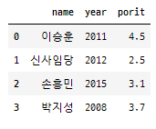
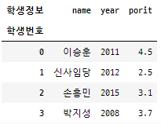
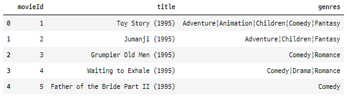

# Pandas DataBase #11 (2021.01.13)


## Category

* Pandas의 자료구조
* Series
* Series index
* Series `Boolean indexing` & `Fancy indexing`
* Series DB 만들기
* dict를 이용해 Series 만들기
* DataFrame이란?
* Data 표현 방식 (`CSV`, `XML`, `JSON`)
* CSV 파일을 이용해서 DataFrame 만들기
* MySQL 활용 DataBase 설정 기본 단계


---


### Pandas의 자료구조

>* Numpy를 기본으로 그 위에 `Series`와 `DataFrame`이라는 자료구조를 정의해서 사용
>* `Series` : 동일한 데이터 타입의 복수개의 성분으로 구성 (`ndarray`와 비슷하다)
>* `DataFram`e : Table 형식으로 데이터를 저장하는 자료구조
>* Pandas를 사용하기 위해서도 설치해야 한다! 모듈 설치!
>  ==> conda install pandas (안되면 pip로)
>  ==> pip install pandas


### Series

> * 항상 `1차원`!
> * ndarray의 알파 더한 거지만. 정확히 말하자면, ndarray의 `vector`만을 수용한다.
> * `같은 데이터 타입`이 들어온다. (ex. 문자열이면 문자열 / 정수면 정수 / 실수면 실수)

```python
import numpy as np
import pandas as pd

# ndarray(dtype : np.float64) 생성
arr = np.array([1,2,3,4,5], dtype = np.float64)
print(arr) # ==> [1. 2. 3. 4. 5.]

arr1 = np.array([1, 3.14, True, 'Hello']) 
# 이렇게 다른 데이터 type이 입력되면 자동으로 dtype이 <U32 로 설정
# 그리고 전체 모두 문자열로 바뀜
print(arr1) # ==> ['1' '3.14' 'True' 'Hello']
print(arr1.dtype) # ==> <U32

arr1 = np.array([1, 3.14, True, 'Hello'], dtype = np.object)
print(arr1) # ==> [1 3.14 True 'Hello']
print(arr1.dtype) # ==> object  / 각자가 객체 형태로 들어와 있음
```


### Series 생성

```python
import numpy as np
import pandas as pd

s = pd.Series([1,2,3,4,5,6], dtype = np.float64)  # ==> pandas의 series를 만듦 
print(s)  # ==> ndarray의 vector 즉, 1차원이다!
'''
0    1.0
1    2.0
2    3.0
3    4.0
4    5.0
5    6.0
dtype: float64
'''
print('Series의 값만 가져오고 싶어요 : {}'.format(s.values)) # series의 값들을 ndarray로 바꿔서
# ==> Series의 값만 가져오고 싶어요 : [1. 2. 3. 4. 5. 6.]

print('Series의 index만 가져오고 싶어요 : {}'.format(s.index))
# ==> Series의 index만 가져오고 싶어요 : RangeIndex(start=0, stop=6, step=1)
# ==> RangeIndex 라는 class type의 객체를 return해줌. (python의 range와 비슷하다고 생각하면 됨)

```


### Series index 관련 내용

> * 기본 index 외 나만의 index 만들 수 있다.
> * index를 기준으로 정렬 가능하다
> * values를 중심으로 정렬 가능하다.

```python
import numpy as np
import pandas as pd

# Series index 직접 지정
s = pd.Series([1,5,8,10],
             dtype=np.int32,
             index=['a','b','c','d']) # ==> 문자열로 index 지정
print(s)
'''
a     1
b     5
c     8
d    10
dtype: int32
'''

# 5라는 값을 출력하려면 어떻게 해야 하나요?
print(s['b']) # ==> 5
print(s[1]) # ==> 숫자 index도 가능하다. / index가 변경되도 숫자 index 기본으로 가능!

# 인덱스을 기준으로 내림차순 정렬 방법
s = pd.Series([11,21,33,True,'55'], dtype=np.object, index=['a','c','e','g','h'])
print(s.sort_index(ascending=False))
'''
h      55
g    True
e      33
c      21
a      11
dtype: object
'''

# 값(vlaues)을 기준을 오름차순 정렬방법
s1 = pd.Series([2,1,9,7,3,5], dtype = np.int32 , 
               index = ['audi','honda','ford','huyndai','porche','benz'])
print(s1.sort_values(ascending = True))
'''
honda      1
audi       2
porche     3
benz       5
huyndai    7
ford       9
dtype: int32
'''
```


### Series index 같은 것으로 지정할 경우

> * 같은 index끼리 묶어서 series 형태로 return!

```python
import numpy as np
import pandas as pd

s = pd.Series([1,5,8,10],
             dtype=np.int32,
             index=['a','b','a','d'])
            # ==> index가 같아도 될까??
print(s)
'''
a     1
b     5
a     8
d    10
dtype: int32
'''
print(s['a']) # ==> 값을 다 같이 묶어서 Series로 return해주네...
'''
a    1
a    8
dtype: int32
'''
print(type(s['a']))  # ==> <class 'pandas.core.series.Series'>
```


### 지정한 index로 slicing할 때!

> * slicing은 `원본과 똑같은` data type으로 출력
> * Series에서 slicing했기 때문에 `Series` 형식으로
> * 지정한 index로 slicing할 때 ==> 끝에 준 index가 포함되서 슬라이싱 된다.
>   (기존 slicing은 끝 값이 exclusive)

```python
# 지정한 index로 slicing할 때!

s = pd.Series([1,5,8,10],
             dtype=np.int32,
             index=['a','b','c','d'])

print(s[0:3]) # slicing은 원본과 똑같은 data type으로 출력
              # Series에서 slicing했기 때문에 Series 형식으로
'''
a    1
b    5
c    8
dtype: int32
'''

print(s['a':'d']) # ==> 지정한 index로 slicing할 때!
                  # ==> 끝에 준 index가 포함되서 슬라이싱 된다.
'''
a     1
b     5
c     8
d    10
dtype: int32
'''
```


### Series의 `Boolean indexing` & `Fancy indexing`

> * ndarray와 똑같다

```python
import pandas as pd

s = pd.Series([1,5,8,10],
             dtype=np.int32,
             index=['a','b','c','d'])

print(s[[1,3]]) # Fancy indexing 가능
'''
b     5
d    10
dtype: int32
'''

print(s[['d','a']])
'''
d    10
a     1
dtype: int32
'''

print(s[s%2==0]) # boolean indexing 가능
'''
c     8
d    10
dtype: int32
'''

print(s.sum()) # 집계함수 사용 가능
```


### DB 만들기

> * `A 공장`의 2020-01-01부터 10일간 생산량을 Series로 저장
> * 생산량은 평균이 50이고, 표준편차가 5인 정규분포에서 랜덤하게 생성(정수)
> * 형식 : 2020-01-01 52
>          2020-01-02 49
>          2020-01-03 55

---

> * `B 공장`의 2020-01-01부터 10일간 생산량을 Series로 저장
> * 생산량은 평균이 70이고, 표준편차가 8인 정규분포에서 랜덤하게 생성(정수)

---

> * 날짜별로 모든(A공장, B공장)의 생산량의 합계를 구하세요.


```python
import numpy as np
import pandas as pd
from datetime import datetime, timedelta  
# ==> datetime 이라는 패키지에서 datetime, timedelta 라는 모듈 사용
# ==> 날짜를 편하게 구하기 위해서!
# ==> 외부 module 이라서 conda든 pip든 install datetime 해야함!

np.random.seed(1)
start_day = datetime(2020,1,1)
print(start_day) # ==>  2020-01-01 00:00:00

'''
# 날짜연산은 일반적으로 함수를 이용하여 연, 월, 주, 일 단위로 증감 가능
* 일 단위 증감 : timedelta 모듈
* 연, 월 단위 증감 :
* 주 단위 증감 :
'''
factory_A = pd.Series([int(x) for x in np.random.normal(50,5,(10,))],
                     index = [ start_day + timedelta(days= i) for i in range(10)]) 
print(factory_A)
'''
2020-01-01    58
2020-01-02    46
2020-01-03    47
2020-01-04    44
2020-01-05    54
2020-01-06    38
2020-01-07    58
2020-01-08    46
2020-01-09    51
2020-01-10    48
dtype: int64
'''

factory_B = pd.Series([int(x) for x in np.random.normal(50,5,(10,))],
                     index = [ start_day + timedelta(days= i) for i in range(10)]) 
print(factory_B)
'''
2020-01-01    57
2020-01-02    39
2020-01-03    48
2020-01-04    48
2020-01-05    55
2020-01-06    44
2020-01-07    49
2020-01-08    45
2020-01-09    50
2020-01-10    52
dtype: int64
'''

# Series의 사칙연산은  같은 index 끼리 이뤄진다.
print(factory_A + factory_B)
'''
2020-01-01    115
2020-01-02     85
2020-01-03     95
2020-01-04     92
2020-01-05    109
2020-01-06     82
2020-01-07    107
2020-01-08     91
2020-01-09    101
2020-01-10    100
dtype: int64
'''

# Index가 겹치지 않는 경우는?
factory_A = pd.Series([int(x) for x in np.random.normal(50,5,(10,))],
                     index = [ start_day + timedelta(days= i) for i in range(10)]) 

factory_B = pd.Series([int(x) for x in np.random.normal(50,5,(10,))],
                     index = [ datetime(2020,1,5) + timedelta(days= i) for i in range(10)]) 

print(factory_A + factory_B)
'''
2020-01-01      NaN
2020-01-02      NaN
2020-01-03      NaN
2020-01-04      NaN
2020-01-05    100.0
2020-01-06     94.0
2020-01-07     95.0
2020-01-08     90.0
2020-01-09     94.0
2020-01-10    101.0
2020-01-11      NaN
2020-01-12      NaN
2020-01-13      NaN
2020-01-14      NaN
dtype: float64
'''
# ==> NaN  ==> Not a Number 숫자가 아니다

```


### dict를 이용해 Series 만들기

> * pd.Series객체.name  ==> Series에 이름 부여
> * Series객체.index ==> Series index 불러오기 or 수정 가능
> * Series객체.index.name ==> Series index에 이름 부여 

```python
import pandas as pd

my_dict = {'서울':1000 , '인천':2000, '수원':3000}
s = pd.Series(my_dict)
print(s)
'''
서울    1000
인천    2000
수원    3000
dtype: int64
'''

# Series에 이름을 줄 수 있다.
s.name = '지역별 가격 데이터'
print(s) # ==> Name: 지역별 가격 데이터, dtype: int64

print(s.index)
# ==> Index(['서울', '인천', '수원'], dtype='object')  
# ==> 이건 Index라는 객체, class를 의미!! list는 아니다! 
# ==> But! list와 유사하게 사용할 수 있다.


# ==> index를 바꿀 수도 있다. list 형태로 가능!
s.index = ['Seoul', 'Inchon', 'Suwon']


# index에도 Title을 붙여줄 수 있다.
s.index.name = 'Region'

print(s)
'''
Region
Seoul     1000
Inchon    2000
Suwon     3000
Name: 지역별 가격 데이터, dtype: int64
'''
```


### DataFrame

> * dict를 이용해서 dataframe을 생성
> * df = pd.DataFrame(my_dict)

```python
import numpy as np
import pandas as pd

my_dict = {'name':['이승훈', '신사임당', '손흥민', '박지성'],
           'year':[2011, 2012, 2015, 2008],
           'porit':[4.5, 2.5, 3.1, 3.7]}

# Series 만들기
s = pd.Series(my_dict)
print(s)
'''
name        [이승훈, 신사임당, 손흥민, 박지성]
year     [2011, 2012, 2015, 2008]
porit        [4.5, 2.5, 3.1, 3.7]
dtype: object
'''

# DataFrame 이럴 때 필요
df = pd.DataFrame(my_dict)
print(df)
'''
   name  year  porit
0   이승훈  2011    4.5
1  신사임당  2012    2.5
2   손흥민  2015    3.1
3   박지성  2008    3.7
'''
# ==> print는 삐뚤삐뚤 보기 불편 so, display 사용

display(df)

```



* dataframe 정보 확인

  ```python
  print(df.shape) # ==> (4, 3)
  print(df.size)  # ==> 12 (이 dataframe의 값이 몇개가 들어 있어??)
  print(df.ndim)  # ==> 2 (무조건 2차원이다. dataframe은!)
  print(df.index) # ==> RangeIndex(start=0, stop=4, step=1)
  print(df.columns) # ==> 현재 data의 column 명을 ... 
                    # ==> Index(['name', 'year', 'porit'], dtype='object')
  print(df.values) # ==> 값들만 2차원 ndarray로 출력해준다.
  '''
  [['이승훈' 2011 4.5]
   ['신사임당' 2012 2.5]
   ['손흥민' 2015 3.1]
   ['박지성' 2008 3.7]]
  '''
  
  df.index.name = '학생번호'
  df.columns.name = '학생정보'
  display(df)
  ```

  

---


## Data 표현 방식

>* CSV
>* XML
>* JSON


### 1. CSV (Comma Seperated Values)

​	ex. 홍길동, 20, 서울, 김길동, 30, 인천 ...

* 장점 : 많은 데이터를 표현하기에 적합하다
  	   ==> 데이터 사이즈를 작게할 수 있다.
* 단점 : 데이터의 구성을 알기 어렵다. ==> 구조적 데이터 표현이 힘들다.
         사용이 힘들다. / 데이터 처리를 위해서 따로 프로그램 만들어야 한다.
         데이터가 변경됐을때, 프로그램도 같이 변경돼야 한다.
         ==> 유지보수의 어려움이 있다.
* 특징 : 데이터의 크기가 무지막지하고 데이터의 형태가 잘 변하지 않는 경우
         CSV 형태가 가장 알맞은 형태다.


### 2. XML (eXtended Markup Language)

```xml
ex. <person><name>'홍길동'</name><age>20</age><address>서울</adress></person>
    <person><name>'신사임당'</name><age>58</age><address>광주</adress></person>
    <person><name>'셜록'</name><age>30</age><address>인천</adress></person>
```
* 장점 : data의 구성을 알기 쉽다.
         사용하기 쉽다.
         프로그램적 유지 보수가 쉽다.
* 단점 : 부가적인 데이터가 많아서, 용량도 커지고...


### 3. JSON (JavaScript Object Notation)

​	==> 자바스크립트 객체 표현 방식을 이용해서 `데이터 표현`하는 방식

* `주의!` JSON은 데이터 표현 방식!! ==> 특정 프로그래밍 언어와는 상관 X
   ex. { key : value } ==> { name : '홍길동', age : 20, address : '서울'}
* 장점 : 데이터의 구성을 알기 쉬워요. 사용하기 편해요
         프로그램적 유지보수가 쉬워요. xml보다 용량이 작아요
* 단점 : CSV에 비해 부가적인 데이터는 많은 편이다.


---


### CSV 파일을 이용해서 DataFrame 만들기

```python
import numpy as np
import pandas as pd

df = pd.read_csv('./movies.csv')
display(df.head()) # ==> 상위 5개만 출력
print(df.shape) # ==> 총 몇 개 data인지 알고 싶을때 / (9742, 3)
                # 총 9,742개의 영화가 있다.
```



---


## DataBase 설정

### MySQL 이용

1) MySQL 설치
    ==> 설치버전을 이용 X // 단독 실행 파일을 이용해서 사용 O
    ==> (Stand alon 방식) ==> 명령어로 DataBase 열고 닫고...
    ==> MySQL 5.6버전 Down
    ==> 폴더 바탕화면에 압축풀기
    ==> cmd 명령어 실행 후 ==> cd C:\Users\USER\Desktop\mysql-5.6.50-winx64\bin 엔터

2) MySQL 실행
    ==> cmd창에서 ==> mysqld 입력 후 엔터 (<==mysql DBMS 기동시키는 명령어)

3) MySQL 종료 방법
    ==> 새로운 cmd 창 열기
    ==> cmd 명령어 실행 후 ==> cd C:\Users\USER\Desktop\mysql-5.6.50-winx64\bin 엔터
    ==> mysqladmin -u root shutdown 엔터
    

* DataBase는 `사용자 계정 ID/PW` 있어야 사용할 수 있다.

4) 새로운 사용자 계정 생성
    step1 - mysql console에 입장 (관리자 권한으로 mysql system에 접근)
            ==> mysql -u root

​    step2 - mysql> (<==프롬프트 등장) 
​            이 프롬프트 뒤에 입력 
​            ==> create user 아이디 identified by "패스워드"; 

​    step3 - 외부접속을 위해 다음 명령어 한 번 더 실행!
​            ==> create user 아이디@localhost identified by "패스워드";

​    step4 - 데이터가 저장될 DataBase를 생성해야 한다.
  		  우리가 사용하는 mysql은 DBMS(Data Base Management System)이다!
  		  ==> 즉, 여러개의 DataBase를 관리하는 프로그램!

​    step5 - 데이터베이스 저장한 공간 만들자
​            ==> 입력  create database library;

​    step6 - 새로운 사용자에게 새로 만든 데이터베이스 사용할 수 있도록 권한 부여
​            ==> grant all privileges on library.* to sh0316;
   			 grant all privileges on library.* to sh0316@localhost; 
  			  (local에서 사용할 수 있도록!)

​    step7 - 권한 설정에 대한 refresh를 시켜줘요! (권한을 적용하라는 의미)
​            ==> flush privileges;

  ​	** 여기 까지 기본 설정 완료 *********

​	step8 - console에서 나오고 (exit;)
 		   ==> 나온 후 도스창에서 제공된 script file 이용해서 data 적재!
​			==> mysql -u sh0316 -p library <_BookTableDump.sql
​			==> 패스워드 입력 


## DBMS에 대한 요약 그림


여기서 data는 user ID