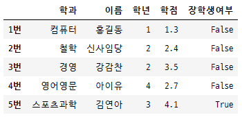

# Pandas DataBase #13 (2021.01.15)


## Category

[TOC]


---


## Open API ==> DataFrame 생성

* Open API 란? ==>  공개적으로 누구나 사용할 수 있는 웹 프로그램
* 영화진흥위원회에서 제공하는 일일 박스오피스 순위 관련 Open API 이용
* 요청변수
  * key , targetDt
  * 요청url
* Get 방식 호출
  * ==> Query String을 이용해서 호출
  * ==> Query String은 요청인자를 전달하기 위한 특별한 형식
  * ==> 입력방식 : ? + 'key=키값' + & +'targetDt=형식에 맞게'
  * ==> ?key=666cbf6f3*********d1b7f3166&targetDt=20210113
  * ==> 요청 url + GET방식 호출명령어 (그냥 바로 붙이면 돼)

```python
import numpy as np
import pandas as pd
import json
import urllib # ==> python에서 url 웹에서 구현하듯 구현하게 해주는 module

open_api = 'http://www.kobis.or.kr/kobisopenapi/webservice/rest/boxoffice/searchDailyBoxOfficeList.json'
query_string = '?key=d666cbf6f3b***e48517a6***7f3166&targetDt=20210114'
open_api_url = open_api + query_string
print(open_api_url)
```


## Python에서 URL 호출 (request)

* url을 이용해서 호출하는 행위를 ==> `request` 라고 함.

  ==> request의 결과를 웹서버에서 우리에게 전달하는 행위 = `response`

  ==> 즉, resoponse `객체`를 얻음 ==> 우리가 원하는 `json` 포함 돼 있음

  ==> `결과 객체` 안에 들어 있는 `json`을 얻어올 수 있다.

```python
page_object= urllib.request.urlopen(open_api_url) # ==> url을 열어주세요.
print(type(page_object)) # ==> <class 'http.client.HTTPResponse'>
```


* json 데이터를 load 해서 python data(`dict`)로 바꿔주기

```python
json_page = json.loads(page_object.read())
print(json_page) # ==> 한글처리까지 잘 돼 있는, dict
print(type(json_page)) # ==> <class 'dict'>
```


## <Open API url => JSON type => JSON.loads() => dict => DataFrame >

```python
# Python dict ==> DataFrame

my_dict = dict()
rank_list = list()
title_list = list()
sales_list = list()

for tmp_dict in json_page["boxOfficeResult"]["dailyBoxOfficeList"]:
    rank_list.append(tmp_dict['rank'])
    title_list.append(tmp_dict['movieNm'])
    sales_list.append(tmp_dict['salesAmt'])

my_dict['순위'] = rank_list
my_dict['제목'] = title_list
my_dict['당일매출액'] = sales_list

df = pd.DataFrame(my_dict)
display(df)
```


---


## Pandas 자료구조 DataFrame 만드는 방법

1. `dict`를 이용해서 `직접` 데이터 입력해서 만드는 방법
2. `CSV` 파일을 이용해서 DataFrame을 만드는 방법
3. Database(`MySQL`)에 있는 데이터를 이용해서 DataFrame을 만드는 방법 
4. `Open API`를 이용해서 DataFrame을 만드는 방법


---


## DateFrame 칼럼(Column) 특성

* 칼럼(기본 key값) `순서`를 지정해줄 수 있다.

```python
import numpy as np
import pandas as pd

data = {'이름':['홍길동', '신사임당', '강감찬', '아이유','김연아'],
        '학과':['컴퓨터', '철학', '경영', '영어영문','스포츠과학'],
        '학년':[1,2,2,4,3],
        '학점':[1.3,2.4,3.5,2.7,4.1]}

df = pd.DataFrame(data,
                  columns = ['학과','이름','학년','학점'])
display(df)
```


* 칼럼명(key)을 기존과 다르게 주면, 값이 없게 표현된다.

```python
df = pd.DataFrame(data,
                  columns = ['학과','이름','학년','평점'])
display(df)
```


* 칼럼을 새로 `추가`하면 새로운 칼럼 만들어진다.

```python
df = pd.DataFrame(data,
                  columns = ['학과','이름','학년','평점', '장학금'],
                  index = ['1번','2번','3번','4번','5번'])
display(df)
```


* 새로운 칼럼과 `내용` 추가

```python
data['장학금'] = ['O','N','N','N','O']
df = pd.DataFrame(data,
                  columns = ['학과','이름','학년','평점', '장학금'],
                  index = ['1번','2번','3번','4번','5번'])
display(df)
```


* DataFrame에서 원하는 column만 불러오고 싶을 때

```python
import numpy as np
import pandas as pd
import warnings
warnings.filterwarnings(action='ignore')

data = {'이름':['홍길동', '신사임당', '강감찬', '아이유','김연아'],
        '학과':['컴퓨터', '철학', '경영', '영어영문','스포츠과학'],
        '학년':[1,2,2,4,3],
        '학점':[1.3,2.4,3.5,2.7,4.1]}
df = pd.DataFrame(data,
                  columns = ['학과','이름','학년','학점'],
                  index = ['1번','2번','3번','4번','5번'])

print(df['이름'])
'''
1번     홍길동
2번    신사임당
3번     강감찬
4번     아이유
5번     김연아
Name: 이름, dtype: object
# ==> Series로 출력
'''
stu_name = df['이름'] # ==> Series! 하지만 결국 이건 View 다!
stu_name['3번'] = '이승훈'
#==> 출력하면 warning이 나오는데 ... 원본 데이터 수정하니깐 주의해라는 의미

###############################################################
# wanrning을 끄고 싶을때!
# import warnings 내장 module 이용해주고
warnings.filterwarnings(action='ignore') # ==> warning을 무시하는 것
###############################################################

print()
print(stu_name)
'''
1번     홍길동
2번    신사임당
3번     이승훈  # ==> `강감찬`에서 `이승훈`으로 바뀜
4번     아이유
5번     김연아
Name: 이름, dtype: object
'''

display(df) # ==> 원본을 출력해보면 수정된게 보인다. view라서...
```


* view가 안되고 새로운 `copy`를 만들고 싶다면

```python
name = df['이름'].copy()
name['3번'] = '김은희'
display(name) # ==> name이라는 새로운 Series는 '김은희'로 잘 바꼈지만
'''
1번     홍길동
2번    신사임당
3번     김은희
4번     아이유
5번     김연아
Name: 이름, dtype: object
'''

display(df)  # ==> 원본은 그대로 보존 돼 있어
```


* column을 `2개 이상` 내가 원하는것으로 가져오려면 (`column`은 `fancy indexing` 가능)

```python
# '이름'과 '학점' column을 가져올꺼에요
# ==> fancy indexing
display(df[['이름','학점']]) 
# ==> fancy indexing은 slicing이랑 비슷해서, 원본 data type을 그대로 계승!
```


* column 값들 제어

```python
import numpy as np
import pandas as pd
import warnings
warnings.filterwarnings(action='ignore')

data = {'이름':['홍길동', '신사임당', '강감찬', '아이유','김연아'],
        '학과':['컴퓨터', '철학', '경영', '영어영문','스포츠과학'],
        '학년':[1,2,2,4,3],
        '학점':[1.3,2.4,3.5,2.7,4.1]}
df = pd.DataFrame(data,
                  columns = ['학과','이름','학년','학점','등급'],
                  index = ['1번','2번','3번','4번','5번'])

# broadcasting ==> 1~5번 모든 행렬에 'A' 값이 채워짐
df['등급'] = 'A' 
display(df)
```


* 결치값으로 줄 때는  ==> np.nan 줘야한다.

```python
df['등급'] = ['A', 'B','C','D',np.nan]
display(df)
```


* DataFrame 'Column' 추가 방식

```python
import numpy as np
import pandas as pd
import warnings
warnings.filterwarnings(action='ignore')

data = {'이름':['홍길동', '신사임당', '강감찬', '아이유','김연아'],
        '학과':['컴퓨터', '철학', '경영', '영어영문','스포츠과학'],
        '학년':[1,2,2,4,3],
        '학점':[1.3,2.4,3.5,2.7,4.1]}
df = pd.DataFrame(data,
                  columns = ['학과','이름','학년','학점'],
                  index = ['1번','2번','3번','4번','5번'])

# DataFrame에 Column 추가 - numpy array 방식으로
df['등급'] = np.arange(1,10,2) # ==> 5개의 값을 부여
display(df)

# DataFrame에 Column 추가 - Series 방식으로
df['나이'] = pd.Series([15,20,25,30,35])
display(df)
# ==> index가 안 맞으면, 값이 안 넣어진다. 그냥 NaN으로...

# ==> Series는  index가 맞아야 한다!!
df['나이'] = pd.Series([15,20,25,30,35],
                       index = ['1번','2번','3번','4번','5번'])
display(df)

# ==> Series는 index 기반으로 data 추가 수정 관리하기 때문에 아래 가능
df['나이'] = pd.Series([20,30,31],
                       index = ['1번','3번','5번'])
display(df)
# ==> NaN은 값이 없는 결치 인데... 연산이 안되는데... 실수로 간주가 된다!
# ==> 그래서 NaN이 한 칼럼 안에, 즉, 한 Series 안에 있으면 모든 data type이 실수로..
```


* DataFrame Column `boolean mask`

```python
import numpy as np
import pandas as pd
import warnings
warnings.filterwarnings(action='ignore')

data = {'이름':['홍길동', '신사임당', '강감찬', '아이유','김연아'],
        '학과':['컴퓨터', '철학', '경영', '영어영문','스포츠과학'],
        '학년':[1,2,2,4,3],
        '학점':[1.3,2.4,3.5,2.7,4.1]}
df = pd.DataFrame(data,
                  columns = ['학과','이름','학년','학점'],
                  index = ['1번','2번','3번','4번','5번'])

display(df['학점']>4.0) # ==> Series 형식으로
                        #==> broadcasting 되서 boolean mask 형태 만들어 진다.
                        # ==> boolean mask 가져올 때, index 지정한거 자동으로 매칭
'''
1번    False
2번    False
3번    False
4번    False
5번     True
Name: 학점, dtype: bool
'''
        

df['장학생여부'] = df['학점']>4.0 
display(df)
```




* DataFrame에서 내가 원하는 column을 삭제하는 방법

```python
# .drop() 을 통해서 ==> column(열)을 지울 수 있고, record(행)도 지울 수 있다.
#  DataFrame안 데이터를 삭제하는 경우

#  ==> 원본 삭제하는 경우 : inplace =True
#  ==> 원본은 보존하고 삭제처리된 복사본 생성하는 경우 : inplace =False

df.drop('학년', axis = 1, inplace=False)
display(df) # ==> 원본은 그대로

new = df.drop('1번', axis = 0, inplace=False) # ==> 행이 삭제
display(new) # ==> 복사본 출력

df.drop('학년', axis = 1, inplace=True)
display(df) # ==> 원본 변경
```


## DateFrame 행(record) 특성


* `기본 index` 숫자로 record indexing

  > `slicing`만 된다!! / indexing 과 fancy indexing이 안된다.

```python
# record는 숫자로 단일 indexing이 안된다.
# print(df[1]) # ==> err 

# slicing은 된다...
# column은 반대로 slicing은 안되고, 단일 indexing이랑 fancy indexing 가능
display(df[1:3]) # ==> view 형식인거 잊지 말자
display(df[1:]) # 1행부터 끝까지

# display(df[[1,3]]) 
# err==> record에 대한 fancy indexing 안된다! (column에서는 됐는데...)
```


* `내가 지정한 index`를 활용해서 record indexing

  > ==> 숫자 index 사용하는거랑 똑같다.

```python
# print(df['1번']) # <== 이것도 안된다! column에 관한 거였으니깐(단일 indexing)
display(df['2번':'5번']) # ==> slicing을 이용해서 record slice 가능하다.
display(df['3번':])
display(df['1번':'1번'])

#display(df['2번':-1]) # err ==> 숫자 index와 지정 index를 혼용해서 사용 불가
#display(df[['1번','2번']]) # err ==> 당연 fancy indexing도 안된다!
```


* DataFrame 단일 indexing 가능한 방법 있다!!

  > ==> DataFrame.`loc[]`
  >
  > ==> .loc[] 를 이용하면 숫자 index를 쓸 수 `없다`.
  >
  > ==> column은 적용 X (일반적으로 단일 indexing 하면 됨)

```python
import numpy as np
import pandas as pd
import warnings
warnings.filterwarnings(action='ignore')

data = {'이름':['홍길동', '신사임당', '강감찬', '아이유','김연아'],
        '학과':['컴퓨터', '철학', '경영', '영어영문','스포츠과학'],
        '학년':[1,2,2,4,3],
        '학점':[1.3,2.4,3.5,2.7,4.1]}
df = pd.DataFrame(data,
                  columns = ['학과','이름','학년','학점'],
                  index = ['1번','2번','3번','4번','5번'])

display(df.loc['1번']) # ==> Series type으로
                       # ==> column이 index로 오네. (즉, JSON형식으로 Key값)
                       # ==> 내용들이 value로 위치
'''
학과    컴퓨터
이름    홍길동
학년      1
학점    1.3
Name: 1번, dtype: object
'''

display(df.loc['2번':'3번'])
# ==> 얘는 그래도 DataFrame 으로 return

# .loc[] 이용하면 fancy indexing 되네
display(df.loc[['1번','4번']])
```


* record index에서 `숫자 index` 사용하고 싶을 때!

  > ==> .iloc[] 사용!

```python
import numpy as np
import pandas as pd
import warnings
warnings.filterwarnings(action='ignore')

data = {'이름':['홍길동', '신사임당', '강감찬', '아이유','김연아'],
        '학과':['컴퓨터', '철학', '경영', '영어영문','스포츠과학'],
        '학년':[1,2,2,4,3],
        '학점':[1.3,2.4,3.5,2.7,4.1]}
df = pd.DataFrame(data,
                  columns = ['학과','이름','학년','학점'],
                  index = ['1번','2번','3번','4번','5번'])

display(df.iloc[1])
'''
학과      철학
이름    신사임당
학년       2
학점     2.4
Name: 2번, dtype: object
'''
display(df.iloc[0:2])
# ==> DataFrame으로 return

display(df.iloc[[0,4,2]])
# ==> fancy indexing 가능
# ==> 첫째 행과 마지막 행, 3번째 행 return
```


* 특정 행(record)과 특정 열(column) 가져 오고 싶을 때

```python
import numpy as np
import pandas as pd
import warnings
warnings.filterwarnings(action='ignore')

data = {'이름':['홍길동', '신사임당', '강감찬', '아이유','김연아'],
        '학과':['컴퓨터', '철학', '경영', '영어영문','스포츠과학'],
        '학년':[1,2,2,4,3],
        '학점':[1.3,2.4,3.5,2.7,4.1]}
df = pd.DataFrame(data,
                  columns = ['학과','이름','학년','학점'],
                  index = ['1번','2번','3번','4번','5번'])
display(df)
display(df.loc['1번':'3번'])  # ==> 원하는 행 모두 다 데리고 온다.

display(df.loc['1번':'3번','이름']) # ==> 1번에서 3번 행의 이름 column만
'''
1번     홍길동
2번    신사임당
3번     강감찬
Name: 이름, dtype: object
'''
# ==> Series로 return. ==> column 하나니깐


display(df.loc['1번':'3번','이름':'학년']) # df.loc[행,열] 
# ==> column은 단독적으로 slicing을 지원하지 않는다.
# ==> But!! .loc[] 에서는 column에서 slicing 가능하다.

display(df.loc['1번':'3번',['이름','학점']])
# ==> fancy indexing도 가능
```


* **<Boolean indexing>**

  > ==> boolean indexing은 column과는 상관이 없다. `row indexing` 할 때만 가능
  >
  > ==> column boolean mask 만드는 건 됐는데...

```python
import numpy as np
import pandas as pd
import warnings
warnings.filterwarnings(action='ignore')

data = {'이름':['홍길동', '신사임당', '강감찬', '아이유','김연아'],
        '학과':['컴퓨터', '철학', '경영', '영어영문','스포츠과학'],
        '학년':[1,2,2,4,3],
        '학점':[1.3,2.4,3.5,2.7,4.1]}
df = pd.DataFrame(data,
                  columns = ['학과','이름','학년','학점'],
                  index = ['1번','2번','3번','4번','5번'])
display(df)

# 학점이 4.0을 초과하는 학생의 이름과 학점을 DataFrame으로 출력!

# df['학점'] > 4.0 # ==> boolean mask
# ==> 이 mask를 각 행의 학점에 boolean mask 적용해서 True만 return

display(df.loc[df['학점']>4.0,['이름','학점']])
# ==> .loc[] 행 부분에 boolean mask 주고, 열에 fancy indexing
```


* loc[] 이용하여 record 추가!

```python
import numpy as np
import pandas as pd
import warnings
warnings.filterwarnings(action='ignore')

data = {'이름':['이지은', '박동훈', '홍길동', '강감찬','오혜영'],
        '학과':['컴퓨터', '기계', '철학', '컴퓨터','철학'],
        '학년':[1,2,2,4,3],
        '학점':[1.5, 2.0, 3.1, 1.1, 2.7]}
df = pd.DataFrame(data,
                  columns = ['학과','이름','학점','학년'],
                  index = ['1번','2번','3번','4번','5번'])


# loc를 이용한 row 추가
df.loc['6번',:] = ['국어국문', '김길동', 3.7, 3]
display(df)
# ==> '6번' 행을 명시 하고 ':' 모든 column을 다 사용 함
# ==> 그리고 그 안에 내용을 ['국어국문', '김길동', 3, 3.7] 입력

df.loc['6번','이름':'학년'] = ['이승훈', 4.5, 4]
display(df)
```


* record 삭제!!

  > .drop(index명, axis=0, inplace=True) # ==> 원본수정

```python
import numpy as np
import pandas as pd
import warnings
warnings.filterwarnings(action='ignore')

data = {'이름':['이지은', '박동훈', '홍길동', '강감찬','오혜영'],
        '학과':['컴퓨터', '기계', '철학', '컴퓨터','철학'],
        '학년':[1,2,2,4,3],
        '학점':[1.5, 2.0, 3.1, 1.1, 2.7]}
df = pd.DataFrame(data,
                  columns = ['학과','이름','학점','학년'],
                  index = ['1번','2번','3번','4번','5번'])

df.drop('2번', axis=0, inplace = True) # ==> axis를 명시하지 않으면 
                                       # ==> default는 axis = 0
                                       # ==> inplace = False 가 default
display(df) # ==> inplace = True 는 view를 생성 == 즉, 원본 변동

##############################################

# Fancy indexing을 drop 삭제할 행에 사용할 수 있다.
df.drop(['1번','3번'],axis=0, inplace=True)
display(df)

##############################################

# slicing은 drop()에서 삭제할 행에 사용할 수 없다!!
# df.drop('4번':'5번', axis=0, inplace =True) ==> Error
# display(df) # ==> Error
```


### 문제

Q1. 이름이 박동훈인 사람을 찾아 이름과 학점을 DataFrame으로 출력

Q2. 학점이 (1.5 , 2.5)인 사람 찾아 학과, 이름, 학점 DataFrame으로 출력
    ==> (1.5 , 2.5) : 1.5 초과 2.5 미만

Q3. 학점이 3.0을 초과하는 사람을 찾아 등급을 'A'로 설정

```python
import numpy as np
import pandas as pd
import warnings
warnings.filterwarnings(action='ignore')

data = {'이름':['이지은', '박동훈', '홍길동', '강감찬','오혜영'],
        '학과':['컴퓨터', '기계', '철학', '컴퓨터','철학'],
        '학년':[1,2,2,4,3],
        '학점':[1.5, 2.0, 3.1, 1.1, 2.7]}
df = pd.DataFrame(data,
                  columns = ['학과','이름','학점','학년','등급'],
                  index = ['1번','2번','3번','4번','5번'])

#Q1.
display(df.loc[df['이름']=='박동훈',['이름','학점']])

#Q2.
display(df.loc[(df['학점']>1.5) & (df['학점']<2.5),['학과','이름','학점']])
# ==> [ > , ==, < , & ] 논리연산자에는 순서가 있다!! 조심!!

#Q3.
df.loc[df['학점']>3.0, '등급'] = 'A' # <== 이건 view 다!
display(df) # ==> 원본에서 바꼈다.

```


* DataFrame을 numpy로 전환하는 방법

```python
display(df.to_numpy())
'''
array([['컴퓨터', '홍길동', 1, 1.3, 'A'],
       ['철학', '신사임당', 2, 2.4, 'B'],
       ['경영', '강감찬', 2, 3.5, 'C'],
       ['영어영문', '아이유', 4, 2.7, 'D'],
       ['스포츠과학', '김연아', 3, 4.1, nan]], dtype=object)
'''

print(df.to_numpy())
'''
array([['컴퓨터', '홍길동', 1, 1.3, 'A'],
       ['철학', '신사임당', 2, 2.4, 'B'],
       ['경영', '강감찬', 2, 3.5, 'C'],
       ['영어영문', '아이유', 4, 2.7, 'D'],
       ['스포츠과학', '김연아', 3, 4.1, nan]], dtype=object)
'''

# ==> 와우... column명과 index명이 다 없어지고, 
#     record 값끼리 묶여서 한 list로 만들어지네...
```

