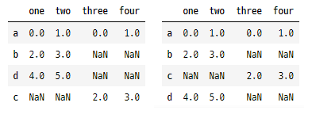

# Pandas DataBase #14 (2021.01.18)


## Category

[TOC]

---


## <편차, 분산, 표준편차>

​	<`편차`>

* `평균`으로 구하기 어려울 때 사용한다.
* 즉, 데이터 수치가 `극단적`으로 차이 날 때 사용
* 확률변수 X와 평균값의 차이 ==> `편차(deviation)` (양극화 판단 가능)
* 편차의 합은 0이기 때문에 편차의 평균 구할 수 없다.
* 데이터의 흩어진 정도만 구하기 적합하다.
* But! 데이터의 흩어진 정도를 수치로 구하기 어렵다

​	<`분산`(variable)>

* 그래서 결국, 분산을 이용한다.

* 분산 : 편차의 제곱의 평균

  <`표준편차`>

* 분산의 제곱근

* DataFrame에서 numpy array에서 사용하는 함수와 모두 동일하다.

* .sum() / .mean() / .var() / .std()


## <공분산(covariance)>

* 2개의 확률 변수에 대한 관계를 보여준다.

  ==> ex) `삼성전자`가 오를 확률과 `코스피`가 오를 확률 의 관계

  ==> 계산 : 두 확률 변수 편차를 곱한 후 평균

  

```python
import numpy as np
import pandas as pd
import pandas_datareader.data as pdr
# ==> Yahoo나 MS에서 제공하는 금융data 이용할 때 사용하는 module 
# ==> 외부 module임 ==> 설치해야 한다!

from datetime import datetime
# ==> 날짜가 필요해서


start = datetime(2019,1,1) # ==> 2019-01-01 날짜 객체 생성
end = datetime(2019,12,31) # ==> 2019-12-31 날짜 객체 생성

# Yahoo에서 제공하는 KOSPI 지수 불러오기
# ==> pdr.DataReader('종목코드', '어디서 받을래?', '시작날짜', '끝날')

# Yahoo 에서 제공하는 KOSPI 지수
df_KOSPI = pdr.DataReader('^KS11', 'yahoo', start, end)
display(df_KOSPI)
display(df_KOSPI['Close'].values) 
# ==> 'Close' 라는 column을 기준으로 값들을 출력
# ==> numpy array type으로 출력

# Yahoo 에서 제공하는 삼성전자 주가 지수
df_Samsung = pdr.DataReader('005930.KS','yahoo', start,end)
display(df_Samsung)
display(df_Samsung['Close'].values) # ==> numpy array

# Numpy 제공하는 함수를 이용해서 공분산 계산
# np.cov
print(np.cov(df_KOSPI['Close'].values, df_Samsung['Close'].values))
'''
[[6.28958682e+03 9.46863621e+04]
 [9.46863621e+04 1.41592089e+07]]
(e+03 == 10**3)

(0,0) : KOSPI와 KOSPI 공분산 (KOSPI & KOSPI)
(0,1) : KOSPI와 삼성전자 공분산 (KOSPI & SAMSUNG)
(1,0) : 삼성전자와 KOSPI 공분산 (SAMSUNG & KOSPI)
(1,1) : 삼성전자와 삼성전자 공분산 (SAMSUN & SAMSUNG)

공분산을 통해 두 변수가 양(+)의 상관관계냐 음(-)의 상관관계냐

공분산의 큰 단점 : 두 확률변수 간 서로 얼마나 영향 미치는 지 알 수 없다.
                   경향만 보여줄 수 있다.
'''
```


## <상관관계(correlation)>

> * 두 대상이 서로 연관성이 있다고 추측되는 관계
>
>   ex) '성적과 자존감' / '온라인 게임 & 폭력성'
>
> * -1 과 1 사이의 실수로 주어짐 (피어슨 상관계수)
>
> * 하나의 변수가 변할 때 , 다른 변수가 변화하는 정도
>
> * 양수값이 나오면 정적 상관관계, 음수가 나오면 부적 상관관계
>
> * 0에 가까울수록 관련성이 적어진다.
>
> * 절대값이 1에 가까울수록 관련성이 높다

`주의`

==> `인과관계`를 설명할 수 없다.

==> 두 변수가 관계가 많다, 적다를 표현하는 것이지... `원인`과 `결과`의 관계는 아니다!

```python
import numpy as np
import pandas as pd
import pandas_datareader.data as pdr
from datetime import datetime

start = datetime(2018,1,1) # ==> 2018-01-01 날짜 객체 생성
end = datetime(2018,12,31) # ==> 2018-12-31 날짜 객체 생성

df_KOSPI = pdr.DataReader('^KS11', 'yahoo', start, end)
df_Samsung = pdr.DataReader('005930.KS','yahoo', start,end)
df_PUSAN = pdr.DataReader('011390.KS','yahoo',start,end) # 남북경협주
df_LIG = pdr.DataReader('079550.KS','yahoo',start,end) # 방산주

my_dict = {
    'KOSPI' : df_KOSPI['Close'],
    'Samsung' : df_Samsung['Close'],
    'Pusan' : df_PUSAN['Close'],
    'LIG' : df_LIG['Close']
}

df = pd.DataFrame(my_dict)
display(df)

# DataFrame에 공분산 구하는 method
df.corr(method ='pearson')

```


## <집계함수, 수학함수 사용시 - skipna>


* skipna를 주기 전 (기본값 ==> skipna = True)

```python
import numpy as np
import pandas as pd

data = [[2, np.nan],
        [7,-3],
        [np.nan,np.nan],
        [1,-2]]

df = pd.DataFrame(data,
                  columns = ['one', 'two'],
                  index = ['a','b','c','d'])

##############################################

display(df.sum()) # ==> axis를 생략하면 기본이 axis = 0
                  # ==> skipna = True (default)
'''
one    10.0
two    -5.0
dtype: float64
'''

display(df.sum(axis=1))
'''
a    2.0
b    4.0
c    0.0
d   -1.0
dtype: float64
'''

display(df['two'].sum()) # ==> -5.0
display(df.loc['b'].sum()) # ==> 4.0

```


* 'skipna=False' 할 경우

```python
################################################

print(df.mean(axis=0, skipna=False))
'''
one   NaN
two   NaN
dtype: float64
'''


print(df.mean(axis=1, skipna=False))
'''
a    NaN
b    2.0
c    NaN
d   -0.5
dtype: float64
'''
```


## <NaN 처리 방법>

> * 데이터 속에서 NaN이 상대적으로 적을 때는 지우는 게 유용
> * But 일반적으로 NaN 지우면 데이터가 많이 줄어서 여러 문제 발생 가능성
> * 다른 나머지 값들의 평균값으로 대체 하는 게 무난함, 하지만 case by case

```python
import numpy as np
import pandas as pd

data = [[2, np.nan],
        [7,-3],
        [np.nan,np.nan],
        [1,-2]]

df = pd.DataFrame(data,
                  columns = ['one', 'two'],
                  index = ['a','b','c','d'])

#############################################

df['one'] = df['one'].fillna(value=df['one'].min())

df['two'] = df['two'].fillna(value=df['two'].max())
```


## <DataFrame 정렬>

> * numpy는 행 단위로 정렬하지 않는다.
> * DataFrame은 record 단위로 `가능`하다!
> * <np.random.permutation()> ==> ndarray 값 순서를 섞고, 원본은 건드리지 않고, 복사본 return
> * pandas.DataFrame.reindex(index= , columns= )
> * pandas.Dataframe.sort_index()


```python
import numpy as np
import pandas as pd

np.random.seed(1)
df = pd.DataFrame(np.random.randint(0,10,(6,4)))
df.columns = ['A', 'B', 'C', 'D']

#pandas에서 날짜 출력해주는 method 있다
df.index = pd.date_range('20200101', periods=6)
display(df)

# np.random.shuffle(df.index) 
# ==> error 난다
# ==> shuffle의 특징은 원본을 바꾼다.
# ==> 'Index does not support mutable operations'
# ==> 하지만 index는 mutable 즉, 변하는 속성을 지원하지 않는다.


new_index = np.random.permutation(df.index) 
# ==> 원본은 변경하지 않고
# ==> 순서가 바뀐 복사본을 리턴한다.


# index를 바꾼다! (DataFrame.reindex())
df2 = df.reindex(index=new_index, columns=['B','A','D','C']) 
# ==> 원본은 안바뀐다!! 그래서 새로운 변수 df2 대입

display(df2)
# ==> index 순서가 바꼈고, column 순서까지 바꼈다.

```


* index를 정렬

```python
###############################################

# 정렬은 기본적으로 axis를 기준으로 정렬
# index로 정렬!
# pandas.Dataframe.sort_index()

# ==> 행방향(세로)을 기준으로 오름차순!
# ==> record의 index가 정렬(날짜)
df2 = df2.sort_index(axis=0, ascending=True) 
display(df2)

 # ==> 열방향(가로)를 기준으로 오름차순
 # ==> column의 index가 정렬(A,B,C,D)
df3 = df2.sort_index(axis=1, ascending=True)
display(df3)

```


* value를 정렬 <.sort_values(by= [column명])>

```python
###############################################

# 특정 column의 `값`을 정렬!

display(df2.sort_values(by=['B','A'])) 
# ==> B column을 우선 기준으로 값을 정렬하고
# ==> B column의 값이 동률이면, 다음'A' column 값을 기준으로 정렬한다.
```


## <기타 함수 - .unique() / .value_counts / .isin() >

* `.unique()`

```python
import numpy as np
import pandas as pd

np.random.seed(1)
df = pd.DataFrame(np.random.randint(0,10,(6,4)))
df.columns = ['A', 'B', 'C', 'D']
df.index = pd.date_range('20200101',periods = 6)
display(df)

df['E'] = ['AA','BB','CC','CC','AA','CC']
display(df)

# .unique()
# ==> 중복된 값을 제거!

print(df['E'].unique()) 
# ==> ndarray로 등장...
# ==> ['AA' 'BB' 'CC']
```


* `.value_counts`

```python
import numpy as np
import pandas as pd

np.random.seed(1)
df = pd.DataFrame(np.random.randint(0,10,(6,4)))
df.columns = ['A', 'B', 'C', 'D']
df.index = pd.date_range('20200101',periods = 6)
display(df)

# .value_counts()
# ==> 값들 중에서 특정 값이 몇번 나오는가

print(df['E'].value_counts()) 
# ==> 이건 또 Series로...
'''
CC    3
AA    2
BB    1
Name: E, dtype: int64
'''
```


* `.isin()`

```python
import numpy as np
import pandas as pd

np.random.seed(1)
df = pd.DataFrame(np.random.randint(0,10,(6,4)))
df.columns = ['A', 'B', 'C', 'D']
df.index = pd.date_range('20200101',periods = 6)
display(df)

# .isin()
# ==> 안에 있는 값이 있니?? 판단 (boolean)

print(df['E'].isin(['AA','BB']))
'''
2020-01-01     True
2020-01-02     True
2020-01-03    False
2020-01-04    False
2020-01-05     True
2020-01-06    False
Freq: D, Name: E, dtype: bool
'''
# ==> 'E' column 값들 하나하나 가져와서 isin() 안에 있는 값(['AA', 'BB'])에 있니??
```


## <DataFrame 끼리 결합 / 연결>

> * merge() ==> < pandas.merge(df1, df2, on='기준', how = 'inner' or 'outer')
> * concatenation()


### 1) merge()

* inner

```python
import numpy as np
import pandas as pd

data1 = {
    '학번' : [1,2,3,4],
    '이름' : ['홍길동', '신사임당', '아이유', '김현아'],
    '학년' : [2, 4, 1, 3]
}

data2 = {
    '학번' : [1,2,4,5],
    '학과' : ['컴퓨터', '철학', '심리', '영어영문'],
    '학점' : [3.5, 2.7, 4.0, 4.3]
}

df1 = pd.DataFrame(data1)
df2 = pd.DataFrame(data2)

df3 = pd.merge(df1, df2, on='학번', how = 'inner')
# ==> 결합할 수 있는 것만 결합해서 출력!
# ==> 매치할 기준에서 동일값이 없는 data는 자동으로 버린다. (== inner)
# 'how==inner'는 Default 값
# ==> 이런 작업은 Database의 Table에서 수행하는 operation == inner join
display(df3)
```


* outer

```python
df3 = pd.merge(df1, df2, on='학번', how = 'outer')
# ==>  how = 'outer' 
# ==> 'full outer'(full을 생략하고 있다.) 모든 DataFrame 다 가져와!
# ==> df끼리 매치되는 기준이 없어도 즉, 여기서는 '학번'이 같지 않는 것도 다 가져온다.
display(df3)
```


* left / right

```python
df4 = pd.merge(df1, df2, on='학번', how = 'left')
# ==> how = 'left'
# ==> 왼쪽 DataFrame(df1)만 남는거 붙여와
display(df4)


df5 = pd.merge(df1, df2, on='학번', how = 'right')
# ==> how = 'right'
# ==> 오른족 DataFrame(df2)만 남는거 붙여와
display(df5)
```


* 각 DataFrame끼리 column명이 다를 경우

  > left_on / right_on

```python
data1 = {
    '학번' : [1,2,3,4],
    '이름' : ['홍길동', '신사임당', '아이유', '김현아'],
    '학년' : [2, 4, 1, 3]
}

data2 = {
    '학생학번' : [1,2,4,5],
    '학과' : ['컴퓨터', '철학', '심리', '영어영문'],
    '학점' : [3.5, 2.7, 4.0, 4.3]
}

df1 = pd.DataFrame(data1)
df2 = pd.DataFrame(data2)

display(pd.merge(df1, df2, left_on='학번', right_on='학생학번', how='inner'))
# ==> 'on'의 기준을 각 data별 column 명으로 제시해준다.
# ==> left_on = df1 / right_on = df2
# ==> 결과 값은 각각 column명으로 따로 나온다.
```


* column명과 index 번호끼리 묶을 경우

```python
import numpy as np
import pandas as pd

data1 = {
    '학번' : [1,2,3,4],
    '이름' : ['홍길동', '신사임당', '아이유', '김현아'],
    '학년' : [2, 4, 1, 3]
}

data2 = {
    '학과' : ['컴퓨터', '철학', '심리', '영어영문'],
    '학점' : [3.5, 2.7, 4.0, 4.3]
}

df1 = pd.DataFrame(data1)
df2 = pd.DataFrame(data2,
                   index = [1,2,4,5]) # ==> 학번이 index로 사용된 경우

display(df1)
display(df2) # ==> 학번이 column에 없고, index로 들어가 있음

result = pd.merge(df1, df2, 
                  left_on = '학번',
                  right_index = True,
                  how = 'inner')
# right_index라는 요소를 줘서
# ==> 왼쪽 '학번'과 매치해서 merge 해줌
display(result)
# ==> 출력을 보니깐 새로 당겨온 index가 새로 부여되는 게 아니라
# ==> 앞쪽 DataFrame(df1)의 index를 그대로 가져오네

######################################################

# display(result.loc[2]) # ==> error ==> index에 2가 없잖여
display(result.loc[3])

display(result.iloc[2]) # ==> 얘는 되겠지, 왜냐면 숫자 index!!
```


* index 명으로 merge 하기

```python
import numpy as np
import pandas as pd

data1 = {
    '이름' : ['홍길동', '신사임당', '아이유', '김현아'],
    '학년' : [2, 4, 1, 3]
}

data2 = {
    '학과' : ['컴퓨터', '철학', '심리', '영어영문'],
    '학점' : [3.5, 2.7, 4.0, 4.3]
}

# 둘다 학번이 index로 사용된 경우
df1 = pd.DataFrame(data1,
                   index = [1,2,3,4])
df2 = pd.DataFrame(data2,
                   index = [1,2,4,5]) 

display(df1)
display(df2)

result = pd.merge(df1, df2, 
                  left_index = True,
                  right_index = True,
                  how = 'inner')
display(result)
```


### 2) concatenation()

> * concat()


* 열방향으로 연결(axis=1)

```python
import numpy as np
import pandas as pd

df1 = pd.DataFrame(np.arange(6).reshape(3,2),
                   index = ['a', 'b', 'd'],
                   columns = ['one', 'two'])

df2 = pd.DataFrame(np.arange(4).reshape(2,2),
                   index = ['a', 'c'],
                   columns = ['three', 'four'])


result = pd.concat([df1,df2], 
                   axis=1)
# ==> 얘는 결합(merge)하는게 아니라!
# ==> 연결할거야!!
# ==> 개수 제한 없이 연결 가능, merge는 2개만 가능!
display(result)


# sort 값을 주면 index가 정렬되서 출력
new_result = pd.concat([df1,df2], 
                       axis=1,
                       sort=True) # ==> index가 정렬된다.
display(new_result)
```




* 행방향으로 연결(axis=0)

```python
import numpy as np
import pandas as pd

df1 = pd.DataFrame(np.arange(6).reshape(3,2),
                   index = ['a', 'b', 'd'],
                   columns = ['one', 'two'])

df2 = pd.DataFrame(np.arange(4).reshape(2,2),
                   index = ['a', 'c'],
                   columns = ['three', 'four'])

result = pd.concat([df1,df2], 
                   axis=0)
display(result) 
# ==> 그냥 가져다 붙는다.
# Series는 index가 똑같아도 새로 생성한다.
```


* ignore_index = True

  > index명을 싹 지우고, 번호로 초기화!

```python
result = pd.concat([df1,df2], 
                   axis=0,
                   ignore_index = True)
display(result) # ==> index가 지저분할 때 그냥 다 지워버려!
                # ==> ignore!
```

