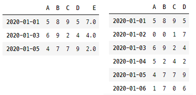
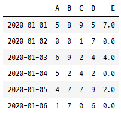
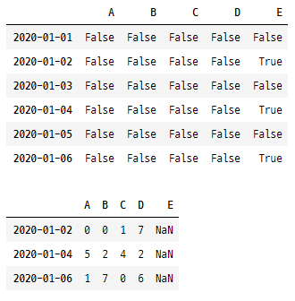
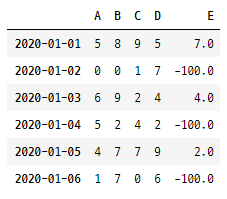
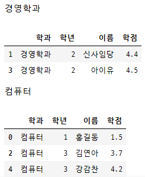

# Pandas DataBase #15 (2021.01.19)


<Index>

[TOC]

---


## <df.dropna(how='', inplace=False)>

> * NaN은 데이터분석이나 머신러인, 딥러닝 전에 반드시 처리해야하는 값!!
> * 그런데 NaN 지우다가 전체 행을 지우게 되서, 유의미한 데이터도 잃어버릴 수 있다.

```python
import numpy as np
import pandas as pd

np.random.seed(1)
arr = np.random.randint(0,10,(6,4))
df = pd.DataFrame(arr)
df.columns = ['A','B', 'C','D']
df.index = pd.date_range('20200101','20200106')
# df.index = pd.date_range('20200101', periods=6)
# 다양하게 가능

# column명 & 값 추가 
df['E'] = [7, np.nan, 4, np.nan, 2, np.nan]
display(df)
```


* df.dropna(how='') 

  > * [how = 'any'] ==> NaN이 하나라도 해당 행에 존재하면 행을 싹 삭제...
  > * [how = 'all'] ==> NaN이 모든 값에 있을 때, 해당 행,열을 싹 삭제...

```python
new_df1 = df.dropna(how='any', axis=0)
new_df2 = df.dropna(how='any', axis=1)
display(new_df1)
display(new_df2)
```




## <df.fillna(value=)>

* NaN값 원하는 값으로 채우기


```python
import numpy as np
import pandas as pd

np.random.seed(1)
arr = np.random.randint(0,10,(6,4))
df = pd.DataFrame(arr)

df.columns = ['A','B', 'C','D']
df.index = pd.date_range('20200101','20200106')

df['E'] = [7, np.nan, 4, np.nan, 2, np.nan]

new_df = df.fillna(value=0)
display(new_df)
```




## <df.isnull()_모든 값들이 NaN인지 판별>

> * DataFrame 안에 있는 data 모든 것에 대해 null(NaN)이니? 판단.
>* 각 값들이 NaN인지 아닌지 boolean mask로 출력

```python
import numpy as np
import pandas as pd

np.random.seed(1)
arr = np.random.randint(0,10,(6,4))
df = pd.DataFrame(arr)

df.columns = ['A','B', 'C','D']
df.index = pd.date_range('20200101','20200106')

df['E'] = [7, np.nan, 4, np.nan, 2, np.nan]

nan_df = df.isnull()
display(nan_df)

# E column의 값이 NaN인 행들을 찾아서 해당행의 모든 column값을 출력

display(df[nan_df['E']])
display(df.loc[df.isnull()['E'], :])
```




## <중복행 처리 () _ df.duplicated()>

* df.duplicated()

```python
import numpy as np
import pandas as pd

my_dict = {
    'k1' : ['one']*3 + ['two']*4,
    'k2' : [1,1,2,3,3,4,4]
}

df = pd.DataFrame(my_dict)
display(df)

# df.duplicated() ==> 중복되어 있니?
display(df.duplicated()) # => 행 전체가 중복이냐? 
                         # ==> boolean mask로 출력
display(df.loc[df.duplicated(),:]) # ==> 중복된 행만 추출

# 중복된거 찾아서 지워주고, 나머지만 출력해주세요.
display(df.drop_duplicates())
```


* df.drop_duplicates()

  > * record별 중복 처리

```python
'''
record별 중복 처리
df.drop_duplicates()
'''

import numpy as np
import pandas as pd

my_dict = {
    'k1' : ['one']*3 + ['two']*4,
    'k2' : [1,1,2,3,3,4,4]
}

df = pd.DataFrame(my_dict)
df['k3'] = np.arange(7)
display(df)
display(df.drop_duplicates(['k1'], inplace = False)) 
# ==> k1에서 중복된 data record 지워

display(df.drop_duplicates(['k1','k2']))
# 'k1'과 'k2' 둘다 중복되는 행 지워
```


## <df.replace()>

> * 내가 지정한 값을 내가 원하는 값으로 바꿔주기

```python
import numpy as np
import pandas as pd

np.random.seed(1)
arr = np.random.randint(0,10,(6,4))
df = pd.DataFrame(arr)

df.columns = ['A','B', 'C','D']
df.index = pd.date_range('20200101','20200106')

df['E'] = [7, np.nan, 4, np.nan, 2, np.nan]

display(df.replace(np.nan, -100))
# ==> NaN 값을 찾아서 -100으로 바꿔주세요.
```




# <Series, DataFrame Grouping>


## <1단계 Grouping>

> * numpy는 행 단위로 정렬하지 않는다.
> * DataFrame은 record 단위로 `가능`하다!
> * <np.random.permutation()> ==> ndarray 값 순서를 섞고, 원본은 건드리지 않고, 복사본 return
> * pandas.DataFrame.reindex(index= , columns= )
> * pandas.Dataframe.sort_index()


```python
import numpy as np
import pandas as pd

my_dict = {
    '학과' : ['컴퓨터', '경영학과', '컴퓨터', '경영학과', '컴퓨터'],
    '학년' : [1,2,3,2,3],
    '이름' : ['홍길동', '신사임당', '김연아', '아이유', '강감찬'],
    '학점' : [1.5, 4.4, 3.7, 4.5, 4.2]
}
df = pd.DataFrame(my_dict)
display(df)

# '학과'를 기준으로 '학점'을 grouping
score = df['학점'].groupby(df['학과'])
display(score) 
# ==> <pandas.core.groupby.generic.SeriesGroupBy object at 0x00000255D82BD1C8>
# ==> 객체에 대한 메모리 주소만 나온다.

# 그룹 안 데이터 확인하고 싶을 때!
# ==> get_group() 사용!

# '컴퓨터'를 기준으로 group한 경우
display(score.get_group('컴퓨터'))
'''
0    1.5
2    3.7
4    4.2
Name: 학점, dtype: float64
'''

# '경영학과'를 기준으로 group한 경우
display(score.get_group('경영학과'))
'''
1    4.4
3    4.5
Name: 학점, dtype: float64
'''
```


* 각 조건대로 grouping 된 개수 출력

```python
print(score.size())
'''
학과
경영학과    2
컴퓨터     3
Name: 학점, dtype: int64
```


* 각 그룹의 평균을 구하라!

```python
print(score.mean())
'''
학과
경영학과    4.450000
컴퓨터     3.133333
Name: 학점, dtype: float64
```


* '이름'과 '학점'을 grouping

```python
new_score = df[['이름','학점']].groupby(df['학과'])
print(new_score.get_group('경영학과'))
'''
     이름   학점
1  신사임당  4.4
3   아이유   4.5
'''

print(new_score.mean('컴퓨터'))
'''
학과            
경영학과  4.450000
컴퓨터   3.133333
'''
# 이름은 숫자가 아니어서 평균값 구할 수 없다.
```


## <2단계 grouping >

* `.unique()`

```python
'''
2단계 grouping
'''

import numpy as np
import pandas as pd

my_dict = {
    '학과' : ['컴퓨터', '경영학과', '컴퓨터', '경영학과', '컴퓨터'],
    '학년' : [1,2,3,2,3],
    '이름' : ['홍길동', '신사임당', '김연아', '아이유', '강감찬'],
    '학점' : [1.5, 4.4, 3.7, 4.5, 4.2]
}
df = pd.DataFrame(my_dict)
display(df)

# '학과'를 기준으로 grouping 해주고, grouping 된 상황에서 '학년'으로 또 grouping
score = df['학점'].groupby([df['학과'],df['학년']])
display(score.get_group(('컴퓨터',3)))
'''
2    3.7
4    4.2
Name: 학점, dtype: float64
'''

print(score.mean())
'''
학과    학년
경영학과  2     4.45
컴퓨터    1     1.50
          3     3.95
Name: 학점, dtype: float64
'''
print(score.mean().unstack()) 
# 최하위 index를 column으로 변경
'''
학년      1     2     3
학과                   
경영학과  NaN  4.45   NaN
컴퓨터   1.5   NaN  3.95
'''
```


* DataFrame 전체를 Grouping

```python
import numpy as np
import pandas as pd

my_dict = {
    '학과' : ['컴퓨터', '경영학과', '컴퓨터', '경영학과', '컴퓨터'],
    '학년' : [1,2,3,2,3],
    '이름' : ['홍길동', '신사임당', '김연아', '아이유', '강감찬'],
    '학점' : [1.5, 4.4, 3.7, 4.5, 4.2]
}
df = pd.DataFrame(my_dict)
display(df)

# DataFrame 자체를 grouping!
score = df.groupby(df['학과'])

print(type(score)) 
# ==> <class 'pandas.core.groupby.generic.DataFrameGroupBy'>
# ==> DataFrameGroupBy 

print(score.get_group('경영학과'))
'''
	  학과  학년    이름   학점
1  경영학과   2   신사임당  4.4
3  경영학과   2     아이유  4.5
'''

print(score.size())
'''
학과
경영학과    2
컴퓨터     3
dtype: int64
'''
```


## Q.학과별 평균 학점과 각 학과에 몇명이 있는지

```python
import numpy as np
import pandas as pd

my_dict = {
    '학과' : ['컴퓨터', '경영학과', '컴퓨터', '경영학과', '컴퓨터'],
    '학년' : [1,2,3,2,3],
    '이름' : ['홍길동', '신사임당', '김연아', '아이유', '강감찬'],
    '학점' : [1.5, 4.4, 3.7, 4.5, 4.2]
}
df = pd.DataFrame(my_dict)
display(df)

score = df['학점'].groupby(df['학과'])
print(score.get_group('경영학과'))
'''
1    4.4
3    4.5
Name: 학점, dtype: float64
'''

print(score.mean())
'''
학과
경영학과    4.450000
컴퓨터     3.133333
Name: 학점, dtype: float64
'''
print(df.groupby(df['학과'])['학점'].mean())
'''
학과
경영학과    4.450000
컴퓨터     3.133333
Name: 학점, dtype: float64
'''

# 각 학과에 몇명이 있는지
print(df.groupby(df['학과'])['이름'].count())
'''
학과
경영학과    2
컴퓨터     3
Name: 이름, dtype: int64
'''
```


## <grouping을 반복하고 싶을 때>

```python
import numpy as np
import pandas as pd

my_dict = {
    '학과' : ['컴퓨터', '경영학과', '컴퓨터', '경영학과', '컴퓨터'],
    '학년' : [1,2,3,2,3],
    '이름' : ['홍길동', '신사임당', '김연아', '아이유', '강감찬'],
    '학점' : [1.5, 4.4, 3.7, 4.5, 4.2]
}
df = pd.DataFrame(my_dict)
display(df)

# 여기서 dept는 '학과' , group = '학과'로 묶인 dataFrame
# 첫번째, 경영학과 / 경영학과의 DataFrame data
# 두번째, 컴퓨터 / 컴퓨터 학과의  DataFrame data
for dept, group in df.groupby(df['학과']):
    print(dept)
    display(group)
```

