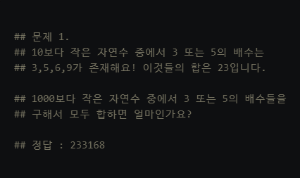
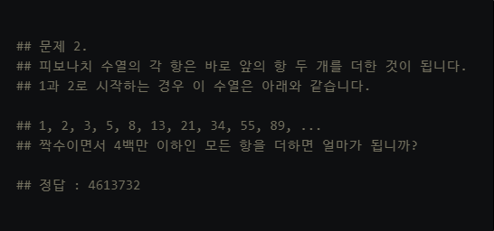
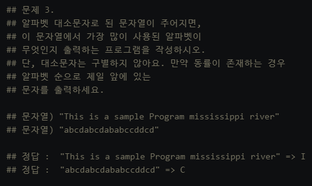
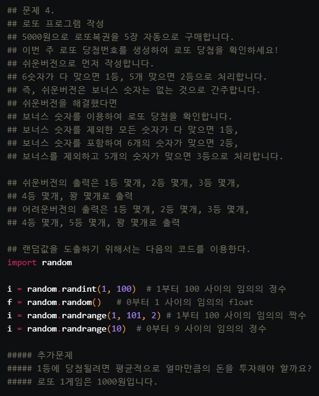
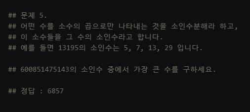
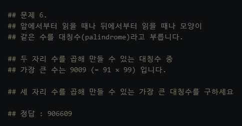
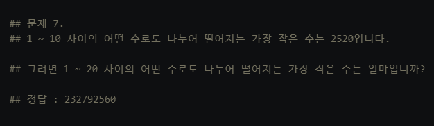
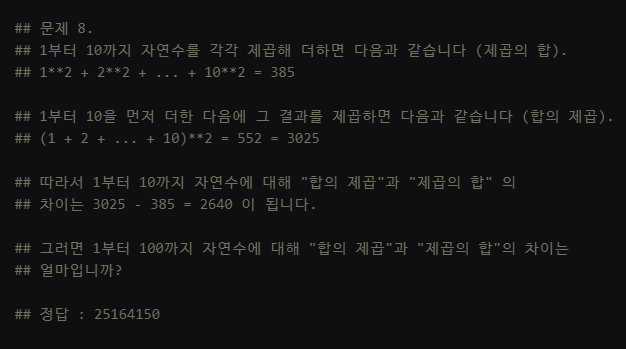
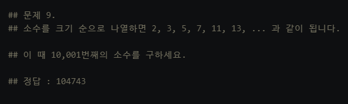
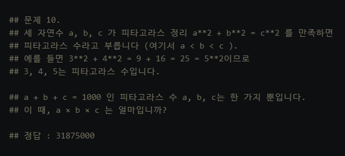

# 연습문제.01


## Q1



* 정답 코드

  ```python
  all = 0
  
  for i in range(1,1000):
      if i%3==0 or i%5==0:
          all += i
  print('정답 :', all)
  ```

  


## Q2



* 정답 코드

  ```python
  n = 0
  n1 = 1
  n2 = 2
  total = 2
  
  while n <= 4000000:
      n = n1 + n2
      if n%2==0:
          total += n
          n1 = n2
          n2 = n
      else :
          n1 = n2
          n2 = n
  print('정답 :', total)    
  
  ```


## Q3



* 정답 코드

  ```python
  # 문제가 있다..
  # 만약 동률이 존재한다면 ==> 알파벳 순으로 제일 앞에 있는 문자를 출력
  
  t1 = 'This is a sample Program mississippi river'
  t2 = 'abcdabcdababccddcd'
  
  def text_judge(text):
    long = 0
    text = text.upper()
    for i in text :
      if text.count(i) <= long:
        pass
      else :
        long = text.count(i)
        result = i
    return result
  
  print('정답 : "{}" =>'.format(t1), text_judge(t1))
  print('정답 : "{}" =>'.format(t2), text_judge(t2))
  ```


## Q4



* 정답코드

  ```python
  # 쉬운 버전
  
  import random as rd
  
  lotto = [2, 13, 16, 19, 32, 33]
  my_num = []
  n = []
  
  for i in range(5):
    l = []
    for _ in range(6):
      l.append(rd.randint(1,46))
    my_num.append(l)
    m =0
    for j in range(5) :  
      if my_num[i][j] in lotto :
        m += 1
    if m >= 6 :
      n.append('1등')
    elif m >= 5:
      n.append('2등')
    elif m >= 4:
      n.append('3등')
    elif m >= 3:
      n.append('4등')
    elif m >= 2:
      n.append('5등')
    else :
      n.append('꽝')
  
  for i in range(1,6):
    if i <= 4 :
      grade = n.count('{}등'.format(i))
      print('{}등 {}개'.format(i, grade))
    else :
      grade = n.count('꽝')
      print('꽝 {}개'.format(grade))
  ```

  ```python
  # 어려운 버전
  
  import random as rd
  
  lotto = [2, 13, 16, 19, 32, 33]
  my_num = []
  n = []
  
  for i in range(5):
    l = []
    while len(l) != 7:            # l 안에 원소 개수가 6개 아니면 계속 해. --> 6개면 멈춰 
      new_num = rd.randint(1,46)
      if new_num not in l:        # 중복을 제거하기 위해 생성한 숫자가 l 안에 있는지 검사
        l.append(new_num)         # l 안에 똑같은 게 없으면 추가해버려
    my_num.append(l)
    m =0
    for j in range(6) :  
      if my_num[i][j] in lotto :
        m += 1
    if m >= 6 :
      n.append('1등')
    elif m >= 5 and my_num[i][6] in lotto :
      n.append('2등')
    elif m >= 5:
      n.append('3등')
    elif m >= 4:
      n.append('4등')
    elif m >= 3:
      n.append('5등')
    else :
      n.append('꽝')
  
  print('로또번호를 5회 생성합니다.')
  print('당신의 번호는 다음과 같습니다.')
  print('(맨 마지막 번호는 보너스 번호입니다.)')
  print('='*20)
  for x in my_num :
    print(x)
  print('='*20)
  print('결과는?')
  
  for i in range(1,7):
    if i <= 5 :
      grade = n.count('{}등'.format(i))
      print('{}등 {}개'.format(i, grade))
    else :
      grade = n.count('꽝')
      print('꽝 {}개'.format(grade))
  ```

  

## Q5



* 정답 코드

  ```python
  # 문제는 소수 구하는 데이터가 너무 많아서 시간이 너무 오래 걸림...
  # 어떤 수의 소인수를 구하는 함수를 만드는 게 가장 현실적임
  
  
  num = int(input('가장 큰 소인수 구할 숫자를 입력해주세요 : '))
  sosu_list=[2]
  m = 3
  while m < num:    
    for i in range(2,m):
      if m % i != 0 and i == m-1 :
        sosu_list.append(m)
        m += 1
      elif m % i == 0 :
        m += 1
    result = 0
    
    for i in sosu_list:
      if num % i == 0 :
        result = i
  
  
  print('정답 :',result)  
  ```


## Q6



* 정답 코드

  ```python
  m =1
  for i in range(100,1000):
      for r in range(100,1000):
          n = str(i * r)
          if n == n[::-1] and int(n) > m:
              m = int(n)
  print('정답 :',m)
  ```

  

## Q7



* 정답 코드

  ```python
  # 진짜 쉽게 풀 수 있는 최대공배수 함수 이용
  # math에 있는 함수는 매개변수 2개로 정해져 있구나...
```
  
  ```python
  # 나만의 알고리즘 짜기
  
  ```
  
  

## Q8



* 정답 코드

  ```python
  a = 0
  for i in range(1,101):
      a += i    
  total = a**2
  
  jcob = 0
  for i in range(1,101):
      c = i**2
      jcob += c
  
  print('정답 :', total - jcob)
  ```

  

## Q9



* 정답 코드

  ```python
  
  ```


## Q10



* 정답 코드

  ```python
  
  ```

  

