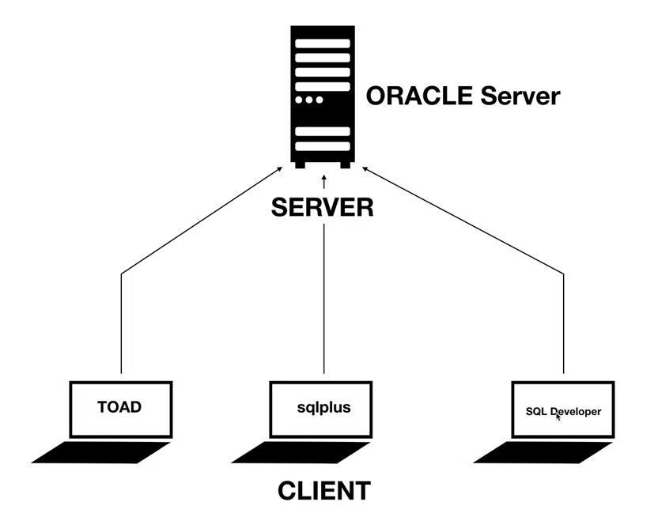
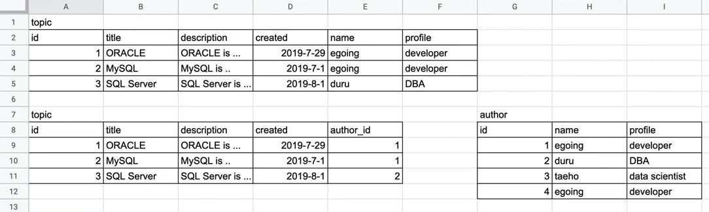
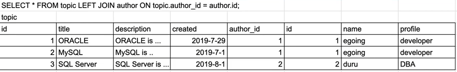

# Oracle DBMS 입문


> - 강의 : 생활코딩 (https://youtube.com/playlist?list=PLuHgQVnccGMB5q5uJIDhLlcC2V6tyXhY6)


### 키워드

> - 관계형 데이터베이스 (RDBMS)
> - 2차원 데이터 (x,y 평면좌표 / 행열 표)
> - CRUD (생성, 읽기, 수정, 삭제)
> - 스키마 : 서로 연관된 표(table)들을 그룹핑하는 상위 디렉토리
>   - 본질적 정의 : 스키마에 속하는 표(table)들을 정의하는 정보
> - 사용자 : 사용자를 만들면 스키마가 생성되고, 사용자가 스키마를 관리할 수 있다.


### Oracle 사용자 & 스키마 생성

> - Oracle 설치
> - sqlplus 실행

```sql
user-name : sys AS SYSDBA  # (== 관리자 권한으로 실행)
SQL>> CREATE USER sherlocky IDENTIFIED BY 111111;
```


### Oracle 사용자 권한 부여

```sql
SQL>> GRANT DBA TO sherlocky;  # (== DBA 즉, 모든 권한)
```


### 직접 만든 사용자로 테이블 만들기

> - `topic` 이라는 `table` 만들기

```sql
user-name : sherlocky
password : 111111

CREATE TABLE topic (
	id NUMBER NOT NULL,
    title VARCHAR2(50) NOT NULL,
    description VARCHAR2(2000) NOT NULL,
    created DATE NOT NULL
);
```


### 테이블 목록 조회

```sql
SELECT table_name FROM all_tables WHERE OWNER = 'SHERLOCKY'
```


### 데이터 행 추가

```sql
INSERT INTO topic
	(id, title, description, created)
	VALUES
	(1, 'Oracle', 'Oracle is not easy', SYSDATE);
	
# 데이터 베이스 Table 에서 데이터 CRUD 하면 꼭 commit 해야한다
commit;
```


### 데이터 행 읽기

```sql
# 모든 컬럼과 모든 행을 가져 오기
SELECT * FROM topic;

# 특정 컬럼만 불러오기
SELECT id, title, created FROM topic;

# id가 1번인 행만을 보고 싶다
SELECT * FROM topic WHERE id = 1;

# id가 1이상인 특정 컬럼만 가져오기
SELECT id, created FROM topic WHERE id > 1;
```


### 데이터 정렬하기

```sql
# id를 기준으로 내림차순 정렬
SELECT * FROM topic ORDER BY id DESC;

# id를 기준으로 오름차순 정렬
SELECT * FROM topic ORDER BY id ASC;

# title 기준으로 오름차순 정렬
SELECT * FROM topic ORDER BY title ASC;
```


### 페이지 기법

```sql
# 1번째 행부터 데이터 가져오기 (0번째 제외)
SELECT * FROM topic OFFSET 1 ROWS;

# 2번째 행부터 데이터 가져오기 (0~1번째 제외)
SELECT * FROM topic OFFSET 2 ROWS;

# FETCH == 몇개 가져올 것인가
SELECT * FROM topic
		OFFSET 0 ROWS
		FETCH NEXT 2 ROWS ONLY;
```


### 데이터 수정

> - update와 delete 할 때 where라는 조건문이 없으면 심각하게 고민해봐야 함!

```sql
UPDATE topic
		SET
			title = 'MSSQL',
			description = 'MSSQL is ...'
		WHERE 
			id = 3;
			
commit;
```


### 데이터 행 삭제

```sql
DELETE FROM topic WHERE id =3;

commit;
```


### 테이블 삭제

```sql
DROP TABLE topic;
```


### Primary Key

> - 고유 식별자 설정
> - 기본키 설정돼 있는 컬럼을 조건으로 데이터 가져오는 것과 그렇지 않은 것의 속도 차이는 어마어마하다
> - 경제성 측면에서 primary key 사용 추천!

```sql
# table 생성할 때
# CONSTRAINT(제약 걸어준다) + 프라이머리 키 이름 + PRIMARY KRY(기본키 설정할 컬럼명)
CREATE TABLE posting (
		id NUMBER NOT NULL,
    	title VARCHAR2(50) NOT NULL,
    	description VARCHAR2(2000) NOT NULL,
    	created DATE NOT NULL,
    	CONSTRAINT PK_POSTING PRIMARY KRY(id)
)
```


### Sequence

> - 기본키를 자동으로 다음 숫자로 배정

```sql
# 시퀀스 만들기
CREATE SEQUENCE SEQ_POSTING;

# 데이터 추가 ( ==> id가 기본키라서 자동으로 다음 숫자를 부여해줘)
INSERT INTO topic
	(id, title, description, created)
	VALUES
	(SEQ_POSTING.NEXTVAL, 'Oracle', 'Oracle is not easy', SYSDATE);
	
commit;

# 현재 시퀀스 숫자 알고 싶을 때는
SELECT SEQ_POSTING.CURRVAL FROM topic (or DUAL)
```


### 서버와 클라이언트

> - HOST : 인터넷에 연결 돼 있는 컴퓨터를 부르는 호칭
> - CLIENT : 정보를 요청한다
> - SERVER : 정보를 응답한다. 서비스를 제공하는 자
> - 다양한 오라클 데이터베이스 클라이언트  - TOAD, SQL Developer, sqlplus




### 테이블 분해하기

> - 내용이 중복되는 값들을 테이블 분해로 수정하는 게 편해질 수 있다.
> - 거대한 표를 성격에 따라 쪼개서 연동시킬 수 있다.
> - 이게 관계형 데이터베이스의 특징




### 테이블 조립하기 (JOIN)

> - 테이블을 분해해서 많은 문제를 해결 했지만 보기가 불편하다
> - 그럼 조회할 때 분리돼 있는 정보들을 합쳐서 볼 수 있으면 좋겠다

```sql
SELECT * FROM topic LEFT JOIN author ON topic.author_id = author.id;
# 전체 칼럼은 topic 테이블에서 가져와
# 그러데 가져올 왼쪽 테이블을 기준(LEFT)으로 옆에 JOIN해서 가져 왔으면 좋겠어
# 어떤 기준이냐면(ON) topic 테이블의 author_id 값이랑 autho 테이블의 id 값이 같은 행을 붙여줘
```




### 분해 실습

```sql
CREATE TABLE author (
	id NUMBER NOT NULL,
    name VARCHAR2(20) NOT NULL,
    profile VARCHAR2(50),
    CONSTRAINT PK_AUTHOR PRIMARY KEY(id)
);

CREATE SEQUENCE SEQ_AUTHOR;

INSERT INTO author (id, name, profile) VALUES (SEQ_AUTHOR.nextval, 'egoing', 'developer')
INSERT INTO author (id, name, profile) VALUES (SEQ_AUTHOR.nextval, 'sherlocky', 'detector')
INSERT INTO author (id, name, profile) VALUES (SEQ_AUTHOR.nextval, 'euni', 'wife')

# 새로운 컬럼(필드) 추가
ALTER TABLE topic ADD (AUTHOR_ID NUMBER);

# topic table 값 수정하기
UPDATE topic SET AUTHOR_ID = 1 WHERE id=1;
UPDATE topic SET AUTHOR_ID = 1 WHERE id=2;
UPDATE topic SET AUTHOR_ID = 2 WHERE id=3;
```


