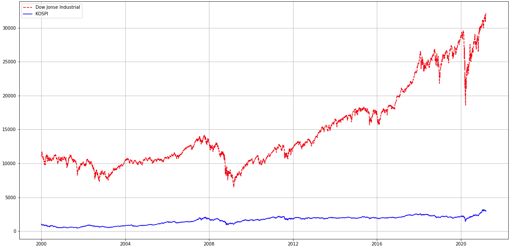
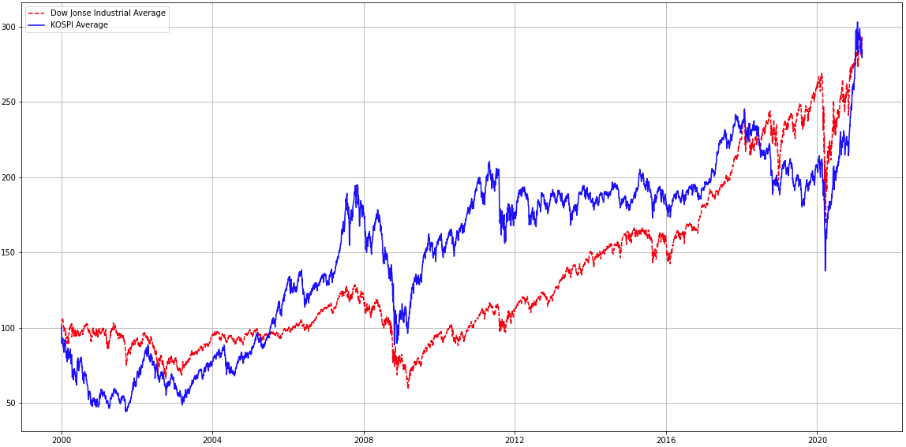
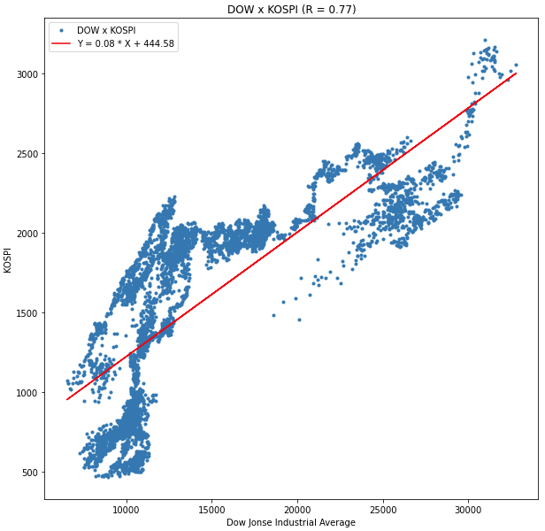
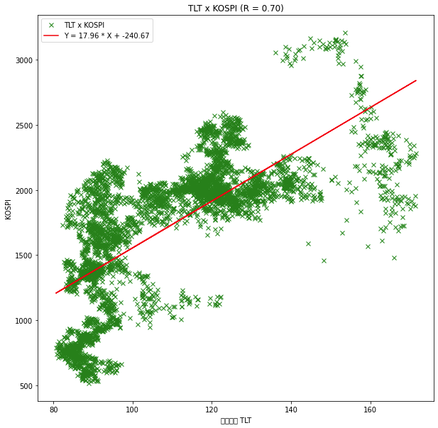
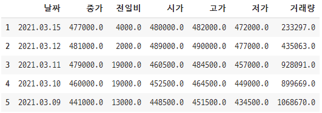
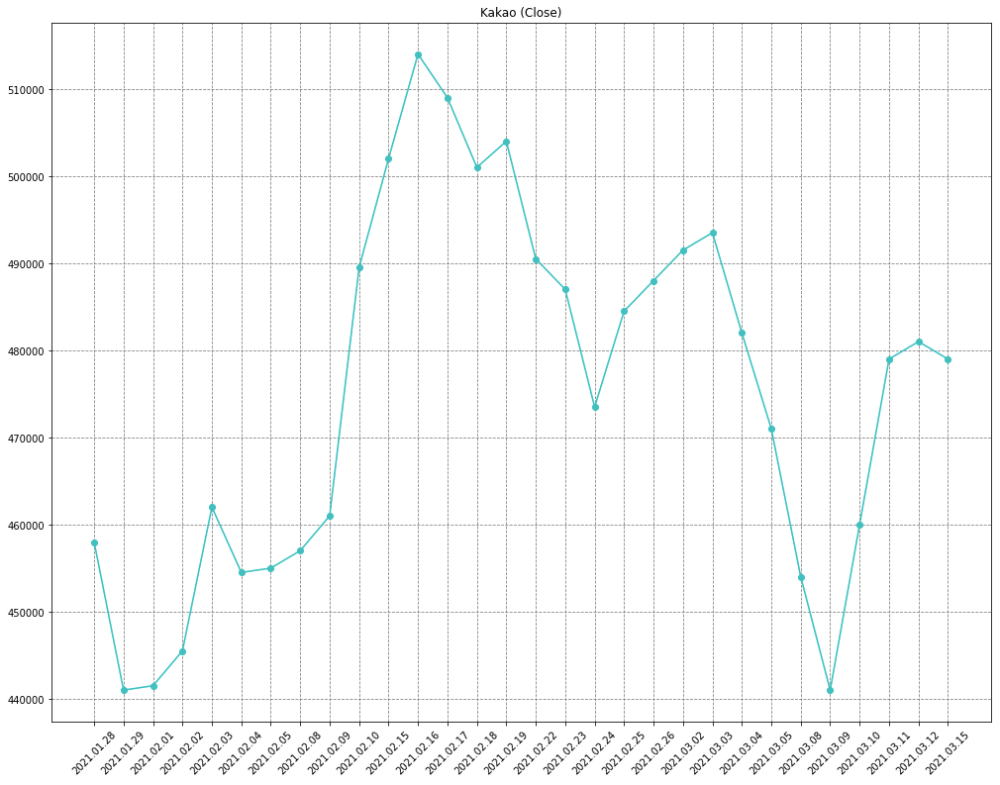
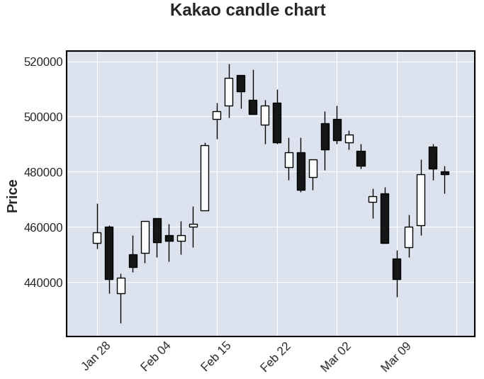
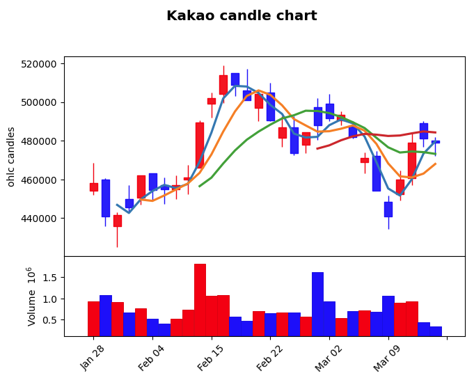

# 증권 데이터 분석


## KOSPI & 다우존스 지수 비교

> - 라이브러리

```python
import matplotlib.pyplot as plt
from pandas_datareader import data as pdr
from scipy import stats
import yfinance as yf
```


> - 그래프 비교

```python
yf.pdr_override()

dow = pdr.get_data_yahoo('^DJI', '2000-01-04')
kospi = pdr.get_data_yahoo('^KS11', '2000-01-04')

plt.figure(figsize=(20,10))
plt.plot(dow.index, dow.Close, 'r--', label='Dow Jonse Industrial')
plt.plot(kospi.index, kospi.Close, 'b', label='KOSPI')
plt.grid(True)
plt.legend(loc='best')
plt.show()
```




> - 정규화

```python
# 현재 종가를 특정 시점의 종가로 나누어 변동률

d = (dow['Close'] / dow.Close.loc['2000-01-04']) * 100
k = (kospi.Close / kospi.Close.loc['2000-01-04']) * 100

plt.figure(figsize=(20,10))
plt.plot(d.index, d, 'r--', label='Dow Jonse Industrial Average')
plt.plot(k.index, k, 'b', label='KOSPI Average')
plt.grid(True)
plt.legend(loc='best')
plt.show()
```




---


## 상관계수

> - 독립변수와 종속변수 사이의 상관관계 정도를 나타내는 수치
> - 상관관계 r 은 가장 강한 양의 상관관계로 1을 나타내고
> - 가장 강한 음의 상관관계로 -1을 나타낸다.
> - 상관관계가 없을 때 r = 0 이며 **`-1 <= r <= 1`** 임을 알수 있다. 

> - `KOSPI`와 `DOW 지수`의 상관관계 구하기

```python
yf.pdr_override()

kospi = pdr.get_data_yahoo('^KS11', '2000-01-04')
dow = pdr.get_data_yahoo('^DJI', '2000-01-04')

df = pd.DataFrame({
    'X':dow['Close'],
    'Y':kospi['Close']
})

df.fillna(method='ffill', inplace=True)

# DataFrame으로 각 칼럼 간의 상관계수 구하기
print(df.corr())
'''
          X         Y
X  1.000000  0.771556
Y  0.771556  1.000000
'''

# 시리즈로 상관계수 구하기
print(df['X'].corr(df['Y'])) # ==> 0.7715555303494357
```


## 결정계수

> - 관측한 데이터에서 `추정한 회귀선`이 실제로 데이터를 어느 정도 설명하는지 나타내는 계수
> - 두 변수의 상관관계 정도를 나타내는 `상관계수를 제곱`한 값

```python
# 결정계수 r_value 구하기
r_value = (df['X'].corr(df['Y']))**2  
print(r_value) # ==> 0.5952979364127989
```


## KOSPI & DOW 지수 산점도, 선형회귀 그래프 비교

```python
# DOW 지수 & KOSPI 지수 - linear regression model
regr = stats.linregress(df.X, df.Y)
regr_line = 'Y = {:.2f} * X + {:.2f}'.format(regr.slope, regr.intercept)  # 범례 표시할 문자

plt.figure(figsize=(10,10))
plt.plot(df.X, df.Y, '.')
plt.plot(df.X, (regr.slope * df.X) + regr.intercept, 'r')
plt.legend(['DOW x KOSPI', regr_line])
plt.title(f'DOW x KOSPI (R = {regr.rvalue:.2f})')
plt.xlabel('Dow Jonse Industrial Average')
plt.ylabel('KOSPI')
plt.show()
```




## KOSPI & 미국 국채(TLT) 산점도, 선형회귀 그래프 비교

```python
yf.pdr_override()

kospi = pdr.get_data_yahoo('^KS11', '2002-07-30')
TLT = pdr.get_data_yahoo('TLT', '2002-07-30')

df = pd.DataFrame({
    'KOSPI' : kospi.Close,
    'TLT' : TLT.Close
})
df.fillna(method='ffill', inplace=True)
display(df)

regr = stats.linregress(df['TLT'], df['KOSPI'])
regr_line = f'Y = {regr.slope:.2f} * X + {regr.intercept:.2f}'

plt.figure(figsize=(10,10))
plt.plot(df.TLT, df.KOSPI, 'x', color='green') # ==> 이렇게도 산점도 나타낼 수 있다.
plt.plot(df.TLT, (regr.slope * df.TLT) + regr.intercept, 'r')
plt.legend(['TLT x KOSPI', regr_line])
plt.title(f'TLT x KOSPI (R = {regr.rvalue:.2f})')
plt.xlabel('미국국채 TLT')
plt.ylabel('KOSPI')
plt.show()
```




## 웹 스크래핑 (크롤링)

> - 라이브러리

```python
from bs4 import BeautifulSoup as bs
from urllib.request import urlopen
import requests
import pandas as pd
import mplfinance as mpf
import matplotlib.pyplot as plt
```


> - 카카오 주가 일별 시세 가져오기

```python
url = 'https://finance.naver.com/item/sise_day.nhn?code=035720&page=1'
req = requests.get(url, headers={'User-agent': 'Mozilla/5.0'})

# 뷰티풀 수프 생성자의 첫 번째 인자로 HTML/XML 페이지의 파일 경로나 url을 넘겨준다.
# 뷰티풀 수프 생성자의 두 번째 인자로 웹 페이지를 파싱할 방식 넘겨준다. (우리가 쓸 파싱 방식 : 'lxml')
html = bs(req.text, 'lxml')

# find 함수를 통해 class 속성이 'pgRR'인인 'td' tag 찾으면
# 값을 bs4.element.Tag 타입으로 반환한다.
pgrr = html.find('td', class_='pgRR')
print(pgrr.a['href']) # ==> /item/sise_day.nhn?code=035720&page=524
page_num = pgrr.a['href'].split('=')[-1]

# 카카오 일별 시세 url
sise_url = 'https://finance.naver.com/item/sise_day.nhn?code=035720'

# 첫 페이지부터 최종 페이지까지 시세 가져오기
df = pd.DataFrame()
for page in range(1, int(page_num)+1):
    page_url = '{}&page={}'.format(sise_url, page)

    html = requests.get(page_url, headers={'User-agent': 'Mozilla/5.0'})
    
    # read_html() 함수로 읽은 한 페이지 분량의 데이터프레임을 df 객체에 추가 한다.
    df =df.append(pd.read_html(html.text, header=0)[0])
    
df = df.dropna()
display(df.head())    
```




> - 종가 차트 그리기

```python
df = df.iloc[0:30]
df = df.sort_values(by='날짜')
plt.figure(figsize=(17,13))
plt.title('Kakao (Close)')
plt.xticks(rotation=45) 
plt.plot(df['날짜'], df['종가'], 'co-')
plt.grid(c='gray', linestyle='--')
plt.show()
```




> - 캔들 차트 그리기

```python
df = df.rename(columns={'날짜':'Date', '시가':'Open', '고가':'High', '저가':'Low', '종가':'Close', '거래량':'Volume'})
df = df.sort_values(by='Date') # 날짜 오름차순 정렬
df.index = pd.to_datetime(df.Date) # Date 칼럼을 DatetimeIndex형으로 변경한 후 인덱스 설정
df = df[['Open', 'High', 'Low', 'Close', 'Volume']]
mpf.plot(df, title='Kakao candle chart', type='candle')
```




> - 캔들차트, 이평선, 거래량 그래프

```python
kwargs = dict(title='Kakao candle chart', type='candle', mav=(3,5,10,20,60), volume=True, ylabel='ohlc candles')

# 마켓 색상 스타일 지정하는 필수 객체 / inherit : 상승, 하락 관련 색상은 앞에 설정한 색을 따른다.
mc = mpf.make_marketcolors(up='r', down='b', inherit=True) 

s = mpf.make_mpf_style(marketcolors=mc) # 마켓 색상을 인수로 넘겨줘서 스타일 객체 생성
mpf.plot(df, **kwargs, style=s)
```



