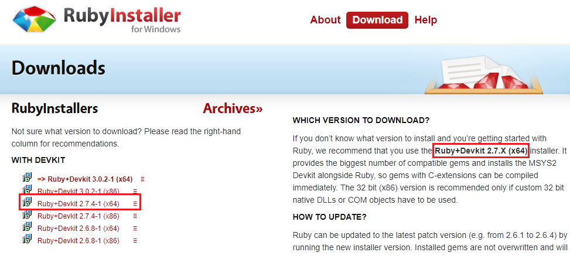
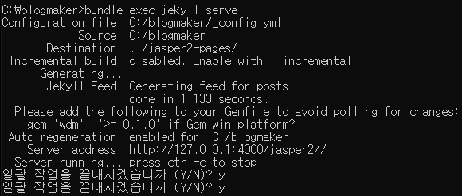
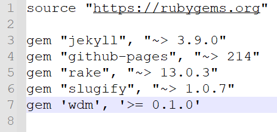

# Jekyll 기반 Github Page 생성


#### ▶ Jekyll == 블로그 생성기, 블로그 Template을 활용할 수 있는 `사이트 생성기`


## 환경설정

> - Jekyll Themes 에서 내가 원하는 블로그 테마를 선정할건데 `Jasper2`를 사용할 예정
> - `Jasper2` 테마는 Ghost라는 유명한 publishing platform의 Jekyll 버전 (Jasper2는 `Mit Licence`)
> - Jekyll을 이용하기 위해서 `Ruby`라는 언어가 필요한데, Ruby는 한글과 특수문자 사용에서 문제가 있다 그래서 내 PC의 계정 ID가 `영문`이어야 한다!


### 1. Ruby 설치

---

> - 추천하는 버전 설치
> - default 값으로 설치하고, 맨 마지막 새로운 무언가 설치하기 위한 체크박스 나올 때, 체크하고 Finish
> - 그럼 Dos 창이 나오면서 1~3번 선택하라고 하면 `1번` 누르고 다 설치 되면 `enter`




### 2. Ruby Bundler 설치

---

> - 이 bundler가 있어야 Jekyll을 실행할 수 있다
> - 다시말해 Jekyll을 실행시켜주는 프로그램
> - 윈도우 기본 cmd 창에서 `gem install bundler` 입력

```cmd
gem install bundler
```


### 3. Blog Template 설치

> - google chrome에서 `jasper2 jekyll` 검색
> - `http://jekyllthemes.org/themes/jasper2/` 이 사이트 접속
> - `Download` → 압축파일 하나 다운 받는다
> - `C:/blogmaker` 폴더를 만들어서 여기에 위에서 받은 압축파일을 풀어서 붙여놓는다.


### 4. gem 설치

> - 새로운 Dos창 활성(cmd)
> - `cd C:\blogmaker` 입력 후
> - `bundle install` 입력


### 5. 블로그 실행

> - bundle install 하면서 Jekyll도 다운되고
> - 일단 내장 웹서버를 활용해서 블로그를 compile 해본다
> - cmd에서 블로그 폴더에 위치해 놓고 아래 명령어 입력

```cmd
bundle exec jekyll serve
```



> - 위 그림과 같이 서버가 실행되는데
> - `Please add the following ...` 이 부분을 해결해줘야 하낟
> - `ctrl + c` 버튼을 2번 누르고 `y`를 2번 enter 해서 서버를 끝낸다
> - 그리고 `gem 'wdm', '>= 0.1.0'` 이 부분만 복사한다
> - `blogmaker` 폴더로 가서 `Gemfile`이란 파일을 notepad++  같은 프로그램으로 editing 하게끔 연다
> - 맨 밑에 줄에 복사한 내용 붙여준다.



> - 다시 cmd 창에서 `bundle exec jekyll serve` 입력하면
> - `bundle install`을 다시 요구한다. 그럼 다시 입력해서 간단히 설치해주고 다시 위 명령어 입력하면 잘 실행된다.
> - 튿별히 `Destination: ../jasper2-pages` 이 부분을 주의해서 볼 필요가 있다.
> - 내 pc에서 `C:` 폴더로 가면 `jasper2-pages` 폴더가 있는데 있 폴더 안에 들어 있는 파일이 위에서 Jekyll로 compile한 블로그를 나타내는 파일들이다
> - 인터넷 브라우저 창에 `http://127.0.0.1:4000/jasper2/` 입력하면 순정 상태의 블로그 화면이 나온다


