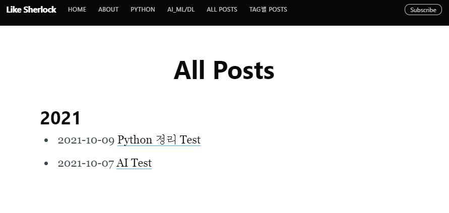
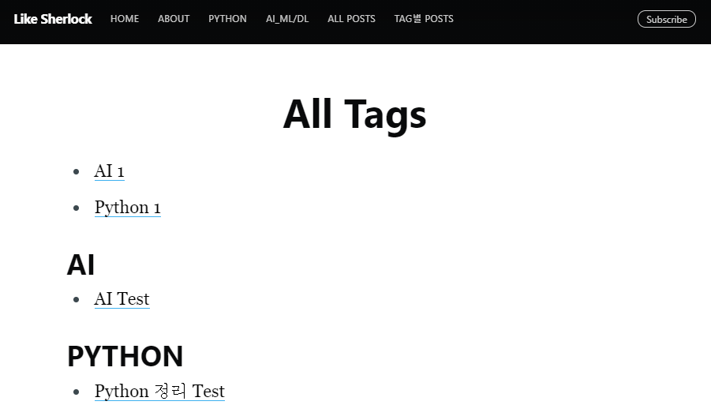

## 블로그 디자인 변경

> - `_layouts\post.html` 파일 ==> 블로그 포스팅 올라갈 때 디자인 전체 담당하는 파일
> - 포스팅한 게시물을 열었을 때, 맨 위에 배경 이미지가 처음부터 보이는 것을 바꾸는 방법

```html
<!-- page.cover 주석 처리 == 게시물 안에서 배경화면 없애기
        
        <figure class="post-full-image" style="background-image: url({{ site.baseurl }}{{ page.cover }})">
        </figure>
        
        -->
```


> - 구독 칸 없애기
> - 똑같이 `_layouts\post.html` 파일에서 수정

```html
<!-- Email subscribe form at the bottom of the page 
            
                <section class="subscribe-form">
                    <h3 class="subscribe-form-title">Subscribe to {{ site.title }}</h3>
                    <p>Get the latest posts delivered right to your inbox</p>
                    
                </section>
            
            -->
```


## Archive 설정

> - `C:\blogmaker`폴더에 `archive.md` 와 `author_archive.md` 파일 생성
> - archive 파일을 통해 포스팅한 시간 순서대로 보여줄 때 사용한다.


- `C:\blogmaker\archive.md`

```md
---
layout: page
current: archive
title: All Posts
navigation: true
logo: 
class: page-template
subclass: 'post page'
---

<div class="well article">

    
        <h2>{{ post.date | date: '%Y' }}</h2>
        <ul>
    
        {{ post.date | date: '%Y' }}
        {{ post.next.date | date: '%Y' }}
        
            </ul>
            <h3>{{ post.date | date: '%Y' }}</h3>
            <ul>
        
    
    <li><span class="post-date">
        
        {{ post.date | date: '%Y-%m-%d' }} </span><a href=".{{ post.url }}" target="_blank">{{ post.title }}</a></li>

</ul>
</div>
```




- `C:\blogmaker\author_archive.md`

```md
---
layout: page
current: archive
title: All Tags
navigation: true
logo:
class: page-template
subclass: 'post page'
---

<div id="post-index" class="well article">
{{ tag | first }},


<ul class="entry-meta inline-list">
  
    {{ tags_list[item] | strip_newlines }}
  	<li><a href="#{{ this_word }}" class="tag"><span class="term alltags">{{ this_word }}</span> <span class="count alltags">{{ site.tags[this_word].size }}</span></a></li>
  
</ul>


{{ tags_list[item] | strip_newlines }}
<article>
<h2 id="{{ this_word }}" class="tag-heading">{{ this_word | upcase }}</h2>
<ul>

<!-- <li class="entry-title"><a href="{{ site.url }}{{ post.url }}" target="_blank" title="{{ post.title }}">{{ post.title }}</a></li> -->
<li class="entry-title"><a href="{{ post.url }}" target="_blank" title="{{ post.title }}">{{ post.title }}</a></li>

</ul>
</article><!-- /.hentry -->

</div>
```



