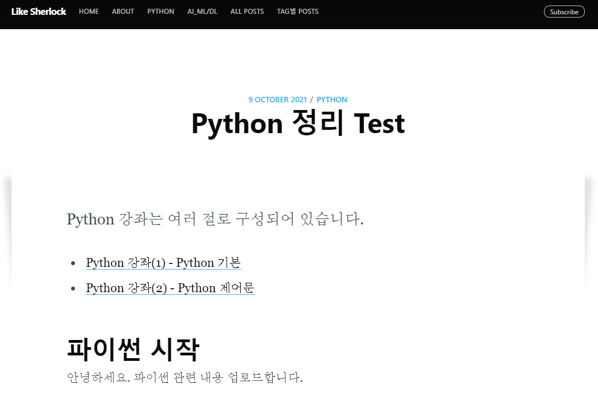

## 포스팅 목차 설정

> - Jasper2에서 따로 목차 기능을 제공하는건 아니고, CSS 처리하고 목차에 대한 html을 파일 생성한 후 post에 끼워 넣는 방식
> - `_includes` 폴더 아래에 `python-table-of-contents.html` 파일을 만들어 준다.
> - 그 후 아래 내용을 넣어준다.
> - 우리가 목차로 만들 post들은 `2021-10-09-python_basic.md` 이렇게 만들어서 `_posts`폴더 안에 넣어놨다. 여기서 이 글을 목차에 넣으려면 아래 `li` tag에서 `href='./python_basic'` 타이틀만 넣어주면 된다.

`C:\blogmaker\_includes\python-table-of-contents.html`

```html
<span class="table-of-contents-list">Python 강좌는 여러 절로 구성되어 있습니다. </span>
<ul class="table-of-contents-list">
    <li><a href="./python_basic">Python 강좌(1) - Python 기본</a></li>
    <li><a href="./python-control-statement">Python 강좌(2) - Python 제어문</a></li>
</ul>
```

---

> - CSS 설정이 필요하다.
> - 우리 블로그 전체에 대한 스타일도 수정해줄 예정이다.
> - `assets\css\custom.css` 파일 만들기
> - 아래 내용 붙어넣기

`C:\blogmaker\assets\css\custom.css`

```css
/* Search 결과화면을 위한 CSS 설정 시작 */
ul.mylist li, ol.mylist li {
    padding: 5px 0px 5px 5px;
    margin-bottom: 5px;
    border-bottom: 1px solid #efefef;
    font-size: 12px;
}

ul.mylist li:last-child,
ol.mylist li:last-child {
    border-bottom: 0px;
}

ul.mylist li,
ol.mylist li {
    -webkit-transition: background-color 0.3s linear;
    -moz-transition: background-color 0.3s linear;
    -ms-transition: background-color 0.3s linear;
    -o-transition: background-color 0.3s linear;
    transition: background-color 0.3s linear;
}

ul.mylist li:hover,
ol.mylist li:hover {
    background-color: #f6f0b6;
}
/* Search 결과화면을 위한 CSS 설정 끝 */

/* 링크뒤쪽에 FontAwesome표현을 위한 custom CSS */
.post-full-content a[target="_blank"]::after {
    content: '\f08e';
    display: inline-block;
    margin: 0 2px 0 4px;
    line-height: 1;
    font-family: "FontAwesome";
    font-size: 2rem;
    font-weight: normal;
    font-style: normal;
}


/* 강좌 table of contents(목차)를 위한 custom css*/
span.table-of-contents-list {
    margin: 0px;
    padding: 0px;
    max-width: 250px;
    width: 100%;
    border-bottom: 1px solid #efefef;
    font-size: 18px;
    font-weight: bold;
    color: #ce180b;
    font-family: Georgia, 'Nanum Gothic', serif !important;
}

ul.table-of-contents-list, ol.table-of-contents-list {
    list-style: none;
    margin: 0px;
    padding: 0px;
    max-width: 250px;
    width: 100%;
    font-family: Georgia, 'Nanum Gothic', serif !important;
}

ul.table-of-contents-list li, ol.table-of-contents-list li {
    padding: 0px 0px 5px 5px;
    margin-bottom: 5px;
    font-size: 15px;
}

ul.table-of-contents-list li a, ol.table-of-contents-list li a {
    text-decoration: none;
    color: color(var(--midgrey) l(-25%));
    font-weight: bold;
}

ul.table-of-contents-list li a:hover, ol.table-of-contents-list li a:hover {
    color: #c2255c;
    text-decoration: none;
    font-weight: bold;
}


ul.table-of-contents-list li:last-child,
ol.table-of-contents-list li:last-child {
    border-bottom: 0px;
}

ul.table-of-contents-list li:before,
ol.table-of-contents-list li:before {
    content: '\f14d';
    display: inline-block;
    margin: 0 2px 0 4px;
    line-height: 1;
    font-family: "FontAwesome";
    font-size: 2rem;
    font-weight: normal;
    font-style: normal;
    vertical-align: middle;
    padding: 5px 5px 6px 0px;
}


/* 가로방향의 리스트를 위한 custom css*/
ul.font-awesome-list, ol.font-awesome-list {
    list-style: none;
    margin: 0px;
    padding: 0px;

    max-width: 250px;
    width: 100%;
}

ul.font-awesome-list li, ol.font-awesome-list li {
    padding: 5px 0px 5px 5px;
    margin-bottom: 5px;
    border-bottom: 1px solid #efefef;
    font-size: 18px;
}

ul.font-awesome-list li span.icon-name,
ol.font-awesome-list li span.icon-name {
    padding: 0px 10px;
}

ul.font-awesome-list li span.icon-value,
ol.font-awesome-list li span.icon-value {
    padding: 0px 10px;
    color: #c2255c;
    font-size: 15px;
}


ul.font-awesome-list li,
ol.font-awesome-list li {
    -webkit-transition: background-color 0.3s linear;
    -moz-transition: background-color 0.3s linear;
    -ms-transition: background-color 0.3s linear;
    -o-transition: background-color 0.3s linear;
    transition: background-color 0.3s linear;
}

ul.font-awesome-list li:hover,
ol.font-awesome-list li:hover {
    background-color: #f6f6f6;
}

/* tl; dr 이미지를 위한 custom style. 각 글의 첫 이미지로 등장 - 사용하지 않음 */
.myTLDRStyle {
    display: inline !important;
    margin-bottom: -0.5em !important;
    width: 100px;
}

/* 각 포스트의 시작 Introduction을 위한 fontAwesome */
strong.post_introduction:before {
    content: '\f086';
    display: inline-block;
    margin: 0 2px 0 4px;
    line-height: 1;
    font-family: "FontAwesome";
    font-size: 3rem;
    font-weight: normal;
    font-style: normal;
    vertical-align: middle;
    padding: 0px 5px 6px 0px;
    color: teal;
}

/* 포스트의  subtitle을 위한 fontAwesome */
strong.subtitle_fontAwesome:before {
    content: '\f0a4';
    display: inline-block;
    margin: 0 2px 0 4px;
    line-height: 1;
    font-family: "FontAwesome";
    font-size: 5rem;
    font-weight: normal;
    font-style: normal;
    vertical-align: middle;
    padding: 0px 5px 6px 0px;
    color: teal;
}

/* 포스트의  subtitle안에 단락제목을 위한 fontAwesome */
strong.subtitle2_fontAwesome:before {
    content: '\f13a';
    display: inline-block;
    margin: 0 2px 0 4px;
    line-height: 1;
    font-family: "FontAwesome";
    font-size: 3rem;
    font-weight: normal;
    font-style: normal;
    vertical-align: middle;
    padding: 0px 5px 6px 0px;
    color: #f92672;
}


/* 강좌 최 하단 Reference를 위한 custom css*/
span.lecture-reference {
    margin: 0px;
    padding: 0px;
    max-width: 250px;
    width: 100%;
    border-bottom: 0px solid #efefef;
    font-size: 18px;
    font-weight: bold;
    color: #0e16ce
}

/* All Tags 화면을 위한 폰트 크기 설정 custom css */
.alltags {
    font-size: 18px;
    font-weight: bold;
    color: #ce112a
}


ul.lecture-reference {
    list-style: none;
    margin: 0px;
    padding: 0px;

    max-width: 250px;
    width: 100%;
}

ul.lecture-reference li {
    padding: 0px 0px 5px 5px;
    margin-bottom: 5px;
    font-size: 15px;
    font-weight: bold;
}

ul.lecture-reference li a {
    text-decoration: none;
    color: color(var(--midgrey) l(-25%));
}

ul.lecture-reference li a:hover {
    color: #c2255c;
    text-decoration: none;
    font-weight: bold;
}


ul.lecture-reference li:last-child {
    border-bottom: 0px;
}

ul.lecture-reference li:before {
    content: '\f02b';
    display: inline-block;
    margin: 0 2px 0 4px;
    line-height: 1;
    font-family: "FontAwesome";
    font-size: 2rem;
    font-weight: normal;
    font-style: normal;
    vertical-align: middle;
    padding: 5px 5px 6px 0px;
}

/* 이미지 출처를 표현하기 위한 custom class */
.img-reference {
    font-size: 1.5rem !important;
    text-align: center;
    font-weight: bold;
    margin-top: -40px;
    margin-bottom: 30px;
}

/* 메뉴 표현을 위한 CSS */

/*
   DL Menu In/Out
   ========================================================================== */
@-webkit-keyframes MenuAnimOut {
    100% {
        -webkit-transform: translateZ(300px);
        opacity: 0; } }
@-moz-keyframes MenuAnimOut {
    100% {
        -moz-transform: translateZ(300px);
        opacity: 0; } }
@keyframes MenuAnimOut {
    100% {
        transform: translateZ(300px);
        opacity: 0; } }
@-webkit-keyframes MenuAnimIn {
    0% {
        -webkit-transform: translateZ(300px);
        opacity: 0; }
    100% {
        -webkit-transform: translateZ(0px);
        opacity: 1; } }
@-moz-keyframes MenuAnimIn {
    0% {
        -moz-transform: translateZ(300px);
        opacity: 0; }
    100% {
        -moz-transform: translateZ(0px);
        opacity: 1; } }
@keyframes MenuAnimIn {
    0% {
        transform: translateZ(300px);
        opacity: 0; }
    100% {
        transform: translateZ(0px);
        opacity: 1; } }
@-webkit-keyframes SubMenuAnimIn {
    0% {
        -webkit-transform: translateZ(-300px);
        opacity: 0; }
    100% {
        -webkit-transform: translateZ(0px);
        opacity: 1; } }
@-moz-keyframes SubMenuAnimIn {
    0% {
        -moz-transform: translateZ(-300px);
        opacity: 0; }
    100% {
        -moz-transform: translateZ(0px);
        opacity: 1; } }
@keyframes SubMenuAnimIn {
    0% {
        transform: translateZ(-300px);
        opacity: 0; }
    100% {
        transform: translateZ(0px);
        opacity: 1; } }
@-webkit-keyframes SubMenuAnimOut {
    0% {
        -webkit-transform: translateZ(0px);
        opacity: 1; }
    100% {
        -webkit-transform: translateZ(-300px);
        opacity: 0; } }
@-moz-keyframes SubMenuAnimOut {
    0% {
        -moz-transform: translateZ(0px);
        opacity: 1; }
    100% {
        -moz-transform: translateZ(-300px);
        opacity: 0; } }
@keyframes SubMenuAnimOut {
    0% {
        transform: translateZ(0px);
        opacity: 1; }
    100% {
        transform: translateZ(-300px);
        opacity: 0; } }


.dl-menuwrapper {
    position: absolute;
    top: 0;
    left: 0;
    z-index: 1000;
    -webkit-perspective: 1000px;
    -moz-perspective: 1000px;
    perspective: 1000px;
    -webkit-perspective-origin: 50% 200%;
    -moz-perspective-origin: 50% 200%;
    perspective-origin: 50% 200%;
    /* Hide the inner submenus */ }
@media only screen and (min-width: 48em) {
    .dl-menuwrapper {
        position: fixed;
        max-width: 175px;
        top: 25px;
        left: 25px; } }
.dl-menuwrapper.dl-menuopen {
    width: 100%;
    height: 100%; }
.dl-menuwrapper button {
    top: 0;
    left: 0;
    background: #222222;
    border: none;
    width: 48px;
    height: 45px;
    text-indent: -900em;
    overflow: hidden;
    position: relative;
    cursor: pointer;
    outline: none;
    border-radius: 0 0 3px 0;
    opacity: 0.6;
    box-shadow: 0 12px 24px rgba(0, 0, 0, 0.4);
    transition: 0.4s ease-in-out; }
.dl-menuwrapper button:hover {
    opacity: 1; }
@media only screen and (min-width: 48em) {
    .dl-menuwrapper button {
        border-radius: 3px; } }
.dl-menuwrapper button:hover,
.dl-menuwrapper button.dl-active,
.dl-menuwrapper ul {
    background: #aaa; }
.dl-menuwrapper button:after {
    content: '';
    position: absolute;
    width: 68%;
    height: 5px;
    background: #fff;
    top: 10px;
    left: 16%;
    box-shadow: 0 10px 0 #fff,  0 20px 0 #fff; }
.dl-menuwrapper ul {
    padding: 0;
    list-style: none;
    -webkit-transform-style: preserve-3d;
    -moz-transform-style: preserve-3d;
    transform-style: preserve-3d; }
.dl-menuwrapper li {
    position: relative; }
.dl-menuwrapper li h4 {
    margin: 0;
    padding: 15px 20px 0;
    color: rgba(255, 255, 255, 0.9); }
.dl-menuwrapper li p {
    margin: 0;
    padding: 15px 20px;
    font-size: 14px;
    font-size: 0.875rem;
    color: rgba(255, 255, 255, 0.8);
    font-weight: 300; }
.dl-menuwrapper li p a {
    display: inline;
    padding: 0;
    font-size: 14px;
    /*font-size: 0.875rem;*/
}
.dl-menuwrapper li a {
    display: block;
    position: relative;
    padding: 15px 20px;
    font-size: 14px;
    /*font-size: 0.875rem;*/
    line-height: 20px;
    font-weight: 400;
    color: #fff;
    outline: none; }
.dl-menuwrapper li.dl-back > a {
    padding-left: 30px;
    background: rgba(0, 0, 0, 0.0); }
.dl-menuwrapper li.dl-back:after,
.dl-menuwrapper li > a:not(:only-child):after {
    position: absolute;
    top: 0;
    line-height: 50px;
    font-family: "fontawesome";
    color: #fff;
    speak: none;
    -webkit-font-smoothing: antialiased;
    content: "\f105"; }
.dl-menuwrapper li.dl-back:after {
    left: 10px;
    color: rgba(212, 204, 198, 0.5);
    -webkit-transform: rotate(180deg);
    -moz-transform: rotate(180deg);
    transform: rotate(180deg); }
.dl-menuwrapper li > a:after {
    right: 10px;
    color: rgba(0, 0, 0, 0.15); }
.dl-menuwrapper .dl-menu {
    margin: 5px 0 0 0;
    position: relative;
    width: 100%;
    max-height: 90%;
    overflow-y: auto;
    overflow-x: hidden;
    opacity: 0;
    pointer-events: none;
    box-shadow: 0 12px 24px rgba(0, 0, 0, 0.4);
    -webkit-transform: translateY(10px);
    -moz-transform: translateY(10px);
    transform: translateY(10px);
    -webkit-backface-visibility: hidden;
    -moz-backface-visibility: hidden;
    backface-visibility: hidden;
    z-index: inherit; }
@media only screen and (min-width: 48em) {
    .dl-menuwrapper .dl-menu {
        border-radius: 3px; } }
.dl-menuwrapper .dl-menu.dl-menu-toggle {
    -webkit-transition: all 0.3s ease;
    -moz-transition: all 0.3s ease;
    transition: all 0.3s ease; }
.dl-menuwrapper .dl-menu.dl-menuopen {
    opacity: 1;
    pointer-events: auto;
    background-color: #062c33;
    -webkit-transform: translateY(0px);
    -moz-transform: translateY(0px);
    transform: translateY(0px); }
.dl-menuwrapper .dl-submenu {
    border-radius: 3px;
    box-shadow: 0 12px 24px rgba(0, 0, 0, 0.0); }
.dl-menuwrapper .dl-submenu .btn, .dl-menuwrapper .dl-submenu .read-more-header a, .read-more-header .dl-menuwrapper .dl-submenu a, .dl-menuwrapper .dl-submenu #goog-wm-sb {
    margin-bottom: 0; }
.dl-menuwrapper li .dl-submenu {
    display: none; }

/*
When a submenu is opened, we will hide all li siblings.
For that we give a class to the parent menu called "dl-subview".
We also hide the submenu link.
The opened submenu will get the class "dl-subviewopen".
All this is done for any sub-level being entered.
*/
.dl-menu.dl-subview li,
.dl-menu.dl-subview li.dl-subviewopen > a,
.dl-menu.dl-subview li.dl-subview > a {
    display: none;
    background-color: #062c33;}

.dl-menu.dl-subview li.dl-subview,
.dl-menu.dl-subview li.dl-subview .dl-submenu,
.dl-menu.dl-subview li.dl-subviewopen,
.dl-menu.dl-subview li.dl-subviewopen > .dl-submenu,
.dl-menu.dl-subview li.dl-subviewopen > .dl-submenu > li {
    display: block;
    background-color: #062c33;}

/* Animation classes for moving out and in */
.dl-menu.dl-animate-out {
    -webkit-animation: MenuAnimOut 0.4s ease;
    -moz-animation: MenuAnimOut 0.4s ease;
    animation: MenuAnimOut 0.4s ease; }

.dl-menu.dl-animate-in {
    -webkit-animation: MenuAnimIn 0.4s ease;
    -moz-animation: MenuAnimIn 0.4s ease;
    animation: MenuAnimIn 0.4s ease; }

.dl-menuwrapper > .dl-submenu.dl-animate-in {
    -webkit-animation: SubMenuAnimIn 0.4s ease;
    -moz-animation: SubMenuAnimIn 0.4s ease;
    animation: SubMenuAnimIn 0.4s ease; }

.dl-menuwrapper > .dl-submenu.dl-animate-out {
    -webkit-animation: SubMenuAnimOut 0.4s ease;
    -moz-animation: SubMenuAnimOut 0.4s ease;
    animation: SubMenuAnimOut 0.4s ease; }

/* No Touch Fallback */
.no-touch .dl-menuwrapper li a:hover {
    background: rgba(255, 248, 213, 0.1); }

/* No JS Fallback */
.no-js .dl-trigger {
    display: none; }
.no-js .dl-menuwrapper {
    position: initial; }
@media only screen and (min-width: 48em) {
    .no-js .dl-menuwrapper {
        position: absolute; } }
.no-js .dl-menuwrapper .dl-menu {
    position: relative;
    opacity: 1;
    pointer-events: auto;
    -webkit-transform: none;
    -moz-transform: none;
    transform: none; }
.no-js .dl-menuwrapper li .dl-submenu {
    display: block; }
.no-js .dl-menuwrapper li.dl-back {
    display: none; }
.no-js .dl-menuwrapper li > a:not(:only-child) {
    background: rgba(0, 0, 0, 0.1); }
.no-js .dl-menuwrapper li > a:not(:only-child):after {
    content: ''; }
.no-js .dl-menu {
    max-height: 100%; }
.no-js .dl-menu li {
    display: block; }

.dl-menuwrapper button:hover,
.dl-menuwrapper button.dl-active,
.dl-menuwrapper ul {
    background: #222222; }

.dl-menu li {
    display: none; }

.dl-menuopen li {
    display: block; }


/* Tags Archive 화면을 위한 CSS 처리 */

.entry-meta {
    font-size: 12px;
    font-size: 0.75rem;
    text-transform: uppercase;
    color: rgba(187, 187, 187, 0.8); }
.entry-meta a {
    color: rgba(187, 187, 187, 0.8); }
.entry-meta .vcard:before {
    content: " by "; }
.entry-meta .tag {
    display: inline-block;
    margin: 4px;
    color: #fff;
    border-radius: 3px;
    background-color: rgba(162, 162, 162, 0.8); }
.entry-meta .tag span {
    float: left;
    padding: 2px 6px;
    color: black;
    font-family: inherit;
    background-color: aliceblue;
}
.entry-meta .tag .count {
    background-color: rgba(136, 136, 136, 0.8);
    border-radius: 0 3px 3px 0; }
.entry-meta .tag:hover {
    background-color: rgba(136, 136, 136, 0.8); }
.entry-meta .entry-reading-time {
    float: right; }

.inline-list {
    list-style: none;
    margin-left: 0;
    padding-left: 0; }
.inline-list li {
    list-style-type: none;
    display: inline; }

#post-index.feature .header-title {
    height: 400px; }
#post-index .entry-image {
    min-height: 400px; }
#post-index .entry-image img {
    min-height: 400px; }

#post-index #main {
    margin: 40px 2px 20px 2px; }
@media only screen and (min-width: 48em) {
    #post-index #main {
        margin-left: 20px;
        margin-right: 20px; } }
@media only screen and (min-width: 62.5em) {
    #post-index #main {
        max-width: 800px;
        margin-top: 50px;
        margin-left: auto;
        margin-right: auto; } }
#post-index article {
    background-color: #fff;
    box-shadow: 0 0 0 0, 0 6px 12px rgba(34, 34, 34, 0.1);
    border-radius: 3px;
    margin-bottom: 20px;
    padding: 25px 15px; }
@media only screen and (min-width: 48em) {
    #post-index article {
        padding: 30px; } }
@media only screen and (min-width: 62.5em) {
    #post-index article {
        margin-bottom: 30px;
        padding: 50px 80px; } }

.entry-title {
    font-size: large;
}
```

---

> - 위 css파일을 그대로 쓰면 용량도 많고, 불러오기 할 때 시간과 비용이 많이 들어간다.
> - css파일을 `minified` 적용해야 한다. `Gulp` 를 통해 진행할 예정
> - `Gulp` 설치를 위해서 `Node.js` 설치 후 `NPM`을 이용하여 `Gulp` 모듈을 설치
> - `Node.js` 버전이 12면 compile 오류가 나서, 11로 낮추면 가능하다.


### Node.js 설치

> - 구글에서 `node.js` 검색해서 다운로드
> - 홈페이지 들어가서 `이전 릴리스` 를 통해 11버전 설치
> - `node-v11.15.0-x64.msi ` 설치 


### Gulp 설치

> - Jekyll 소스 폴더(`C:\blogmaker`)에서 `gulpfile` 을 수정
> - `Gulp`를 이용하기 위한 설정 파일이라고 보면 된다.
> - 기존 내용 다 지우고 아래 내용 복붙
> - 저장하고 web storm을 `껐다 다시 켜야 한다.`
> - 왜냐면 node.js 설치하면서 환경변수 설정이 달라졌고, 이를 인식하기 위해서 필요하다.

`C:\blogmaker\gulpfile.js`

```js
var gulp = require('gulp');

// gulp plugins and utils
var gutil = require('gulp-util');
var postcss = require('gulp-postcss');
var sourcemaps = require('gulp-sourcemaps');
var imagemin = require('gulp-imagemin');

// postcss plugins
var autoprefixer = require('autoprefixer');
var colorFunction = require('postcss-color-function');
var cssnano = require('cssnano');
var customProperties = require('postcss-custom-properties');
var easyimport = require('postcss-easy-import');

gulp.task('images', function() {
    return gulp.src('assets/images/*')
        .pipe(imagemin())
        .pipe(gulp.dest('assets/built/images/'))
});

gulp.task('css', function () {
    var processors = [
        easyimport,
        customProperties,
        colorFunction(),
        autoprefixer({browsers: ['last 2 versions']}),
        cssnano()
    ];

    return gulp.src('assets/css/*.css')
        .pipe(sourcemaps.init())
        .pipe(postcss(processors))
        .pipe(sourcemaps.write('.'))
        .pipe(gulp.dest('assets/built/'))
});
```

---

> - 그리고 `package.json` 파일을 아래 내용으로 바꿔준다.
> - `npm install` 로 `gulp` 실행할 때 오류 발생을 피하기 위해서 바꿔준다.

`C:\blogmaker\package.json`

```json
{
    "name": "blog",
    "description": "",
    "version": "1.0.0",
    "engines": {
        "ghost": ">=1.2.0"
    },
    "license": "MIT",
    "devDependencies": {
        "autoprefixer": "^7.2.6",
        "cssnano": "^3.10.0",
        "graceful-fs": "^4.1.11",
        "gulp": "^3.9.1",
        "gulp-imagemin": "^4.1.0",
        "gulp-postcss": "^7.0.1",
        "gulp-sourcemaps": "^2.6.5",
        "gulp-util": "^3.0.8",
        "minimatch": "^3.0.4",
        "postcss-color-function": "^4.0.1",
        "postcss-custom-properties": "^6.3.1",
        "postcss-easy-import": "^3.0.0"
    },
    "config": {
        "posts_per_page": 25
    }
}
```

> - 웹스톰의 터미널 창에서 `npm install` 입력하면
> - `node_modules`라는 새로운 폴더가 생긴다.
> - 다 설치된 후, 터미널 창에 `gulp css` 입력하면
> - `custom.css`에서 `minified`된 파일로 전환한다.
> - 전환된 파일은 `C:\blogmaker\assets\built` 하단에 `custom.css`파일로 생성된다.


### 목차 html을 포스팅에 포함시키기

> - 우리 포스팅 글 처음 시작에
> - `` 우리가 목차로 설정한 `python-table-of-contents.html`을 포함시킨다.

---

`C:\blogmaker\_posts\python\2021-10-09-python_basic.md`

```md
---
layout: post
current: post
cover: assets/built/images/python.jpg
navigation: True
title: Python 정리 Test
date: 2021-10-09 13:19:00 +0900
tags: [Python]
class: post-template
subclass: 'post tag-python'
author: sherlocky
---



# 파이썬 시작

안녕하세요.
파이썬 관련 내용 업로드합니다.

```


