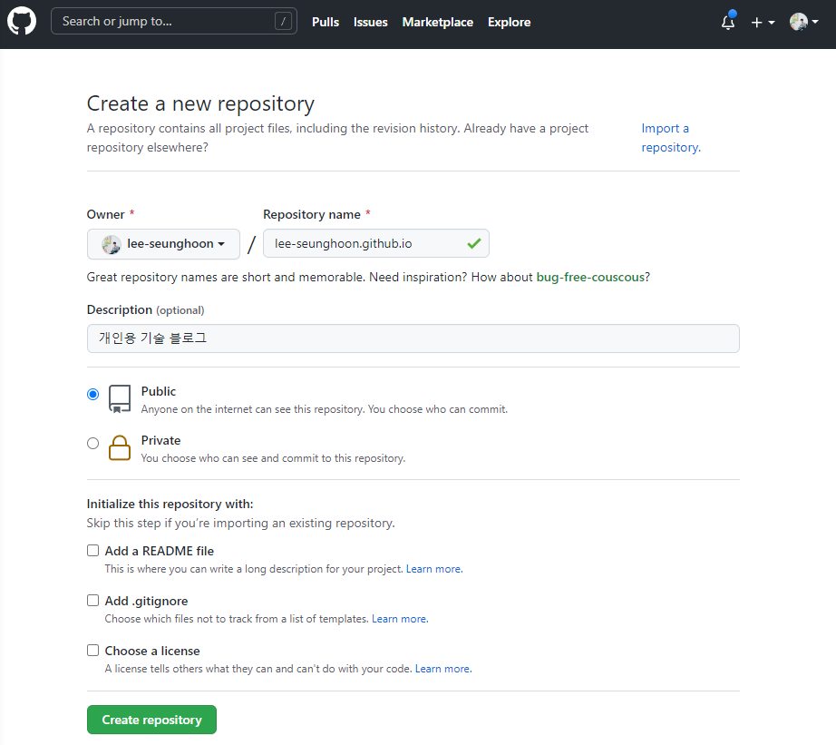
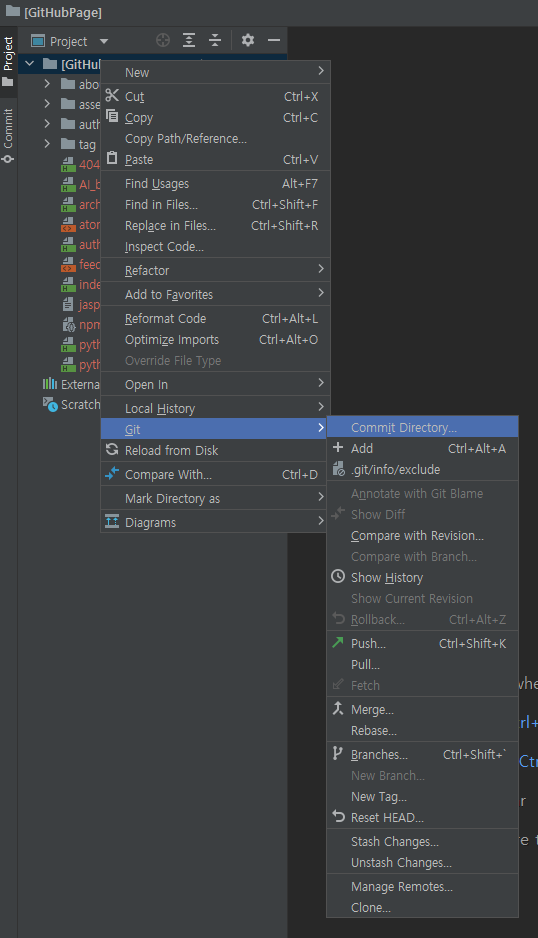
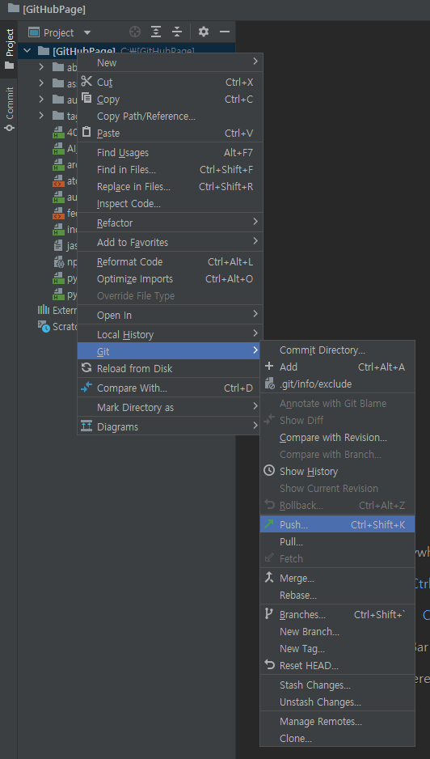
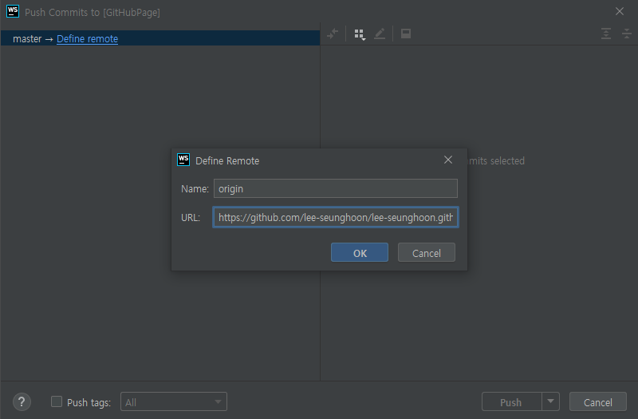

## Publishing

> - Github 계정이 필요하다.
> - ID가 없다면 회원가입 해야한다.
> - 로그인 후 첫 화면에서 `Create repository`를 클릭한다.
> - Repository name을 나의 github user name을 활용해서 `username.github.io` 라고 입력한다.

---

> - `Git`을 설치 한다. ==> google에서 git 검색 (https://git-scm.com/) ==> 다운로드
> - `git bash`를 활용한다.
> - `git config --global user.name "Seunghoon Lee"` 입력
> - `git config --global `
> - 우리의 Jekyll blog를 `compile`하면,  우리가 지정한 경로에 `[GitHubPage]` 폴더가 생긴다.
>   (현재 우리는 `C:\[GitHubPage]` 이 경로에 생기도록 했다.)
> - WebStorm 터미널 창에서 `bundle exec jekyll serve`를 통해 `compile`한 후 `[GitHubPage]` 폴더를 새로 연다(open).
> - `Local Git repository`를 만든다.  ==> 메뉴바 중 `VCS` ==> `Create Git Repository` 클릭 ==> 기존 폴더인 `[GitHubPage]` 선택 후 만들기
> - 왼쪽 메뉴 바에서 `[GitHubPage]` 우클릭 ==> `Git` ==>  `Commit Directory`

> - commit message에 입력하고 파일 전체 체크한 후 `commit`
> - 그 후 `push`

> - 그 후 우리의 원격 저장소(`username.github.io`)에 Push

