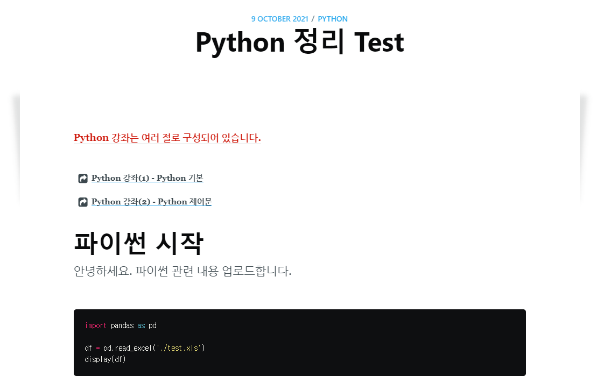

## Syntax Highlight 설정

> - 코드에 대한 하이라이트 기능을 위한 설정
> - `rouge`라는 것으로 가능한데, `rouse` 란, `pure-ruby syntax hughlighter`이다.
> - 블로그 설정 파일인 `_config.yml` 파일을 수정해준다.


`C:\blogmaker\_config.yml`

```yaml
# highlighter란 코드에 대해 색을 입히는 기능
# text highlightert로 rouse를 이용
# 2016. 2월 이후 syntax highlighter는 rouse만 지원
highlighter: rouge
```


> - 그 다음 설치를 하는데 터미널 창에서 `gem install rouge` 입력
> - `rouge` 는 특정 style을 가진 css 파일을 생성하기 위한 `command-line tool`을 가지고 있다
> - `rougeify` 명령을 통해 우리가 원하는 스타일의 css 파일을 생성할 수 있다.
> - 터미널에 `rougify help style` 입력  ==> `available theme` 즉, 이용가능한 테마들을 확인할 수 있다.
> - 원하는 테마를 선택한 후 다음 명령어 입력해서 css 파일을 만든다.
> - `rougify style monokai.sublime > assets/css/syntax.css`
> - css 파일을 만들었으니 이 css가 우리 블로그에서 적용되도록 `html` 파일에서 선언을 해줘야 한다.
> - 전체 블로그 포스팅과 관련된 html 파일은 `_layouts/default.html` 파일이다. 이곳에서 위 css 파일을 사용한다고 추가해줘야 한다.

`C:\blogmaker\_layouts\default.html`

```html
 <!-- custom.css 추가 -->
    <link rel="stylesheet" type="text/css" href="{{ site.baseurl }}assets/built/custom.css" />

    <!--  Font Awesome CDN  -->
    <link rel="stylesheet" href="https://maxcdn.bootstrapcdn.com/font-awesome/4.7.0/css/font-awesome.min.css">

    <!--  Web font 추가  -->
    <link rel="stylesheet" href="https://fonts.googleapis.com/earlyaccess/nanumgothic.css">

    <!--  rouge를 이용한 syntax highlight 추가  -->
    <link rel="stylesheet" type="text/css" href="{{ site.baseurl }}assets/built/syntax.css" />
```


> - 새로운 css 파일이 생겼으니 ==> (터미널에서)`gulp css` 를 통해 minified task 작업 
> - 그럼, `assets/built` 폴더 안에 `syntax.css` 가 minified 형태로 만들어져 있는 것을 확인할 수 있다.


> - 우리 포스팅에서 코드 highlight 적용된거 사용하는 방법

`C:\blogmaker\_posts\python\2021-10-09-python_basic.md`

```md
---
layout: post
current: post
cover: assets/built/images/python.jpg
navigation: True
title: Python 정리 Test
date: 2021-10-09 13:19:00 +0900
tags: [python]
class: post-template
subclass: 'post tag-python'
author: sherlocky
---



# 파이썬 시작

안녕하세요.
파이썬 관련 내용 업로드합니다.

# 코드는 이런 식으로 사용하면 됨
~~~python

import pandas as pd

df = pd.read_excel('./test.xls')
display(df)

~~~

```




