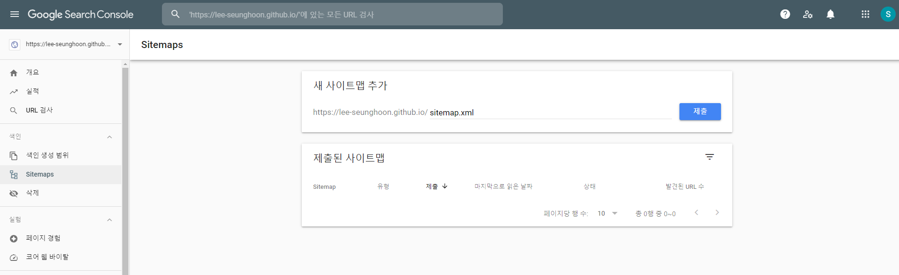

## Google Search Console

> - 우리 블로그를 검색 포털에 노출시키기 위한 세팅
> - Google 검색엔진에 우리 블로그를 노출시키기
> - `Google Search Console`에 나의 GitHub Page domain을 등록시키고
> - `sitemap.xml`을 생성해서 `Google Search Console`에 제출
> - `sitemap.xml`을 등록해 주면 Google 검색 크롤러가 주기적으로 크롤링하면 인덱싱하여 나의 블로그를 노출 시킴


#### 1. `C:/bloagmaker/robots.txt` 파일 생성

> - 이 파일에 아래 내용 복붙
> - `Sitemap` 의 url 부분 github page 주소를 자신의 블로그 주소로 변경

`C:/bloagmaker/robots.txt`

```txt
User-agent: *
Allow: /

Sitemap: https://lee-seunghoon.github.io/sitemap.xml
```

> - 지금 위에서는 우리 블로그의 모든 폴더를 다 크롤링하고 있는데
> - 특정 폴더는 허용하고 싶지 않다면 아래와 같이 `Disallow`로 설정

```txt
User-agent: *
Allow: /
Disallow: /privatData/

Sitemap: https://lee-seunghoon.github.io/sitemap.xml
```

> - `robots.txt`에 대한 자세한 설명을 원하면 [이곳](https://developers.google.com/search/docs/advanced/robots/create-robots-txt?hl=ko&ref_topic=6061961&visit_id=637699678420522913-1383622641&rd=1)에서 볼 수 있다.


#### 2. `C:/bloagmaker/sitemap.xml` 파일 생성

> - `sitemap.xml` 파일 또한 root 폴더 하단에 만든다
> - 그리고 아래 내용 복붙해준다.

`C:/bloagmaker/sitemap.xml`

```html
---
layout: null
---

<?xml version="1.0" encoding="UTF-8"?>
<urlset xmlns:xsi="http://www.w3.org/2001/XMLSchema-instance"
        xsi:schemaLocation="http://www.sitemaps.org/schemas/sitemap/0.9 http://www.sitemaps.org/schemas/sitemap/0.9/sitemap.xsd"
        xmlns="http://www.sitemaps.org/schemas/sitemap/0.9">
    
    <url>
        <loc>{{ site.url }}{{ post.url }}.html</loc>
        
        <lastmod>{{ post.date | date_to_xmlschema }}</lastmod>
        
        <lastmod>{{ post.lastmod | date_to_xmlschema }}</lastmod>
        

        
        <changefreq>weekly</changefreq>
        
        <changefreq>{{ post.sitemap.changefreq }}</changefreq>
        

        
        <priority>0.5</priority>
        
        <priority>{{ post.sitemap.priority }}</priority>
        

    </url>
    
</urlset>
```


#### 3. `Google Search Console` 등록

> - 구글 서치 콘솔 [링크](https://webcache.googleusercontent.com/search?q=cache:fBoxFNDL1WgJ:https://search.google.com/search-console%3Fhl%3Dko+&cd=1&hl=ko&ct=clnk&gl=kr)로 들어와서 내 url 등록
> - 왼쪽 메뉴 바에서 sitemap 클릭 한 후 `https://lee-seunghoon.github.io/sitemap.xml` 등록
> - 등록 확인 후 몇 일 후에 브라우저 링크에 `site:lee-seunghoon.github.io` 입력해서 내 블로그를 잘 크롤링 하고 있는지 확인


