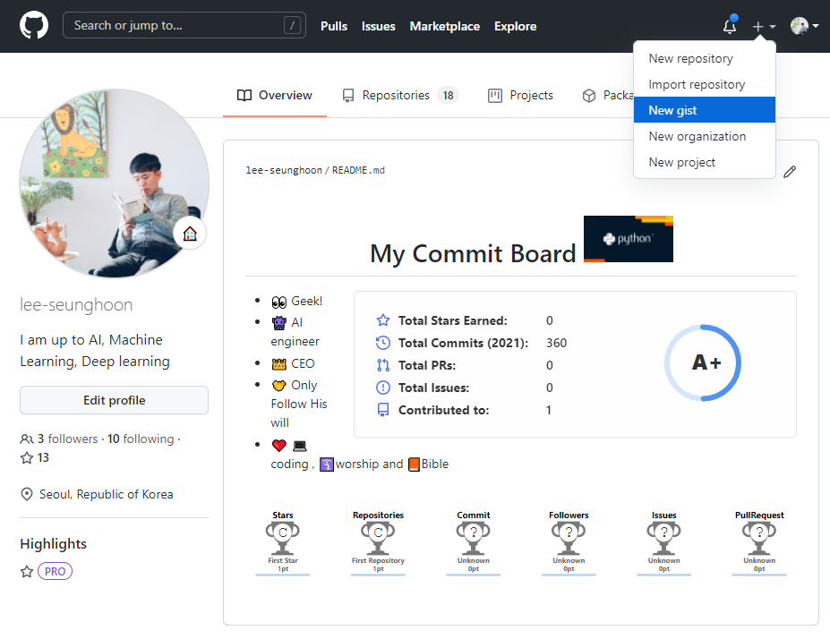
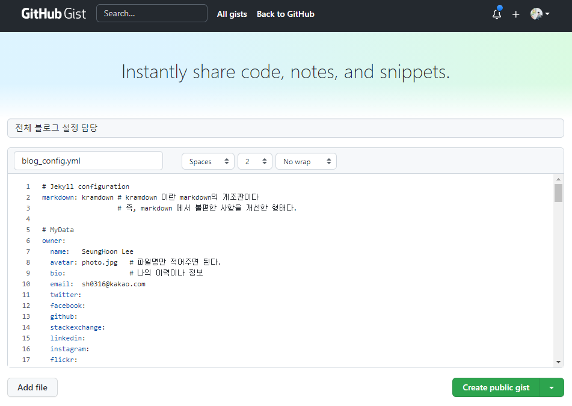
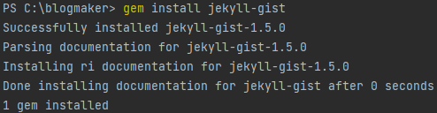
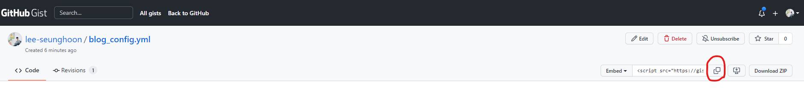
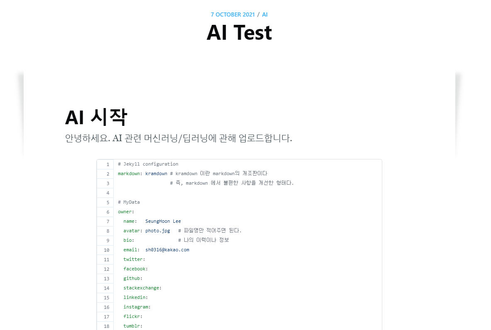

## GitHub Gist란

> - `Code Snippet`(단위 코드 조각)을 관리하고 공유하도록 도와주는 서비스
> - 즉, 각 포스팅에 전체 코드를 공유하는 경우가 있는데 이런 전체 코드는 다양한 포스팅에서 동일하게 사용될 때가 많다.
> - 코드 안에 내용이 수정될 경우 각각 포스팅에서 수동으로 하나씩 수정해야 하는데
> - `Gist`를 사용하면 이런 번거로움을 해결할 수 있다.
> - 자세한 내용은 [얼큰우동TV의 블로그](https://moon9342.github.io/github-gist.html)를 통해 확인할 수 있다.


#### 1. GitHub 로그린 후 New Gist 선택

---




#### 2. Code Snippet 창에 내용 입력

---

> - 다 입력 후 `Create public gist` 클릭
> - gist 생성




#### 3. gem install jekyll-gist 설치

---

> - 우리 블로그 터미널 창에서 `gem install jekyll-gist` 명령어를 이용해 gist 설치




#### 4. gist를 사용할 수 있도록 `_config.yml` 파일에 입력해줘야 한다.

---

> - 아래와 같이 `jekyll-gist` 들어가 있도록 수정

```yaml
# gems and other configs
# plugins_dir: [_plugins]
plugins: [jekyll-paginate, jekyll-feed, jekyll-gist]
```


#### 5. Code를 삽입할 포스팅 md 파일에서 내용 입력해준다.

---

> - 예시로 `2021-10-08-AI_basic.md` 파일에 적용해본다.
> - 아래 이미지에서 보이는 gist 화면에서 embed 쪽 코드를 복사 클릭해서 파일 안에 붙여 넣을건데



> - 복사하면 `<script src="https://gist.github.com/lee-seunghoon/67c45abe22208a98e6dbe996f94112c9.js"></script>` 이런 자바스크립트 코드가 복사됐을 텐데 여기서 `lee-seunghoon/67c45abe22208a98e6dbe996f94112c9` 이 부분만 사용할 것이다.
> - `` 이 코드를 우리 포스팅에 붙여 넣으면 된다.
> - 결과를 확인해보면 아래 이미지처럼 잘 생성된 것을 확인할 수 있다. 근데 안 예쁘다.(테마 수정 필요, 나중에 테마 수정하는 방법 알게 되면 업데이트 필요) 




#### 6. SSL 오류 날 경우

> - [얼큰우동TV 블로그](https://moon9342.github.io/jekyll-gist) 글 아랫 부분에 나와 있는 방법과 [유튜브 강의](https://www.youtube.com/watch?v=WGaKC0hif7k&list=PL7nkwz9MkASx1wxXK51n7KtwQyXgoNL70&index=12) 12:49 부분부터 확인하면 해결할 수 있다.
